# 你今天看了多少广告？

> 原文：<https://pub.towardsai.net/how-many-ads-have-you-watched-today-70d42062109f?source=collection_archive---------4----------------------->

## [数据科学](https://towardsai.net/p/category/data-science)在 R

## ads 数据的完整时间序列分析


图片作者[作者](https://dwiuzila.medium.com/)

```
**Table of Contents**· [Library](#4cf3)
· [Dataset](#87d7)
· [Data Cleaning](#49a0)
· [Decomposition](#38bd)
· [Metrics and Validation](#31b3)
· [Modeling](#ec7b)
  ∘ [Holt-Winters Exponential](#b2b4)
  ∘ [SARIMA](#9aaa)
  ∘ [Auto ARIMA](#0f8b)
· [Assumptions](#3a4d)
  ∘ [No-autocorrelated residuals](#cb02)
  ∘ [Normally distributed residuals](#8a5c)
· [Conclusion](#8b69)
```

H 你有没有看过一个游戏内广告拼命收集硬币和钻石，或者复活到一个关卡再来一次？如果是这样，你并不孤单。有些广告是可以的，我的意思是，他们需要推广他们的产品，并在这样做的时候抓住它，但其他人只是直截了当地讨厌。如果你看了足够多的 YouTube，你知道我在说什么。

事实证明，人们更倾向于在一天中的特定时段观看手机游戏广告。在本文中，我们将尝试预测这种行为。具体来说，我们将从手机游戏数据中调查每小时观看的广告，并尝试预测未来 24 小时将有多少广告被观看。

# 图书馆

在本文中，我们将使用 R。首先，导入必要的库。

```
library(dplyr)          # data wrangling
library(lubridate)      # date functions
library(xts)            # time series object
library(padr)           # padding time series
library(forecast)       # forecasting time series
library(tseries)        # where is pewdiepie
library(ggplot2)        # graphing
```

# 资料组

我们来读一下数据集。该数据集可在 [Kaggle](https://www.kaggle.com/kashnitsky/mlcourse) 上获得。

```
ads <- read.csv('ads.csv')
head(ads)#>                  Time    Ads
#> 1 2017-09-13T00:00:00  80115
#> 2 2017-09-13T01:00:00  79885
#> 3 2017-09-13T02:00:00  89325
#> 4 2017-09-13T03:00:00 101930
#> 5 2017-09-13T04:00:00 121630
#> 6 2017-09-13T05:00:00 116475range(ads$Time)#> [1] "2017-09-13T00:00:00" "2017-09-21T23:00:00"range(ads$Ads)#> [1]  70335 169900
```

我们有一个从**2017–09–13 00:00:00**到**2017–09–21 23:00:00**的一个小时的时间序列数据，显示一款手机游戏观看了多少个广告，从 7 万到 17 万左右不等。

# 数据清理

先来一个定义。

> 时间序列是按时间顺序索引(或列出或绘制)的一系列数据点。因此，数据由相对确定的时间戳组织，与随机采样数据相比，可能包含我们可以提取的附加信息。

首先，我们可以将`Time`特性从字符转换为时间格式，填充以使时间段均匀，然后检查缺失的值。

```
ads <- ads %>% 
  mutate(Time = ymd_hms(Time)) %>% 
  arrange(Time) %>% 
  pad()

ads %>% is.na() %>% colSums()#> Time  Ads 
#>    0    0
```

太好了！不存在缺失值。

现在，我们需要从数据中创建一个时序对象。因为我们的数据是以小时为间隔的，所以我们可以使用`xts()`函数来实现。按`time_index`排序数据，这只是一个小时的索引，如`Time`原始数据中的特征。此外，我们需要将频率设置为 24，因为在每 24 个时间戳中，数据具有周期性。

```
time_index <- seq(
  from = as.POSIXct("2017-09-13 00:00:00"), 
  to = as.POSIXct("2017-09-21 23:00:00"), 
  by = "hour"
)

ads_xts <- xts(ads$Ads, order.by = time_index, frequency = 24)
ads_xts %>% autoplot() + ggtitle("Ads Watched per Hour")
```

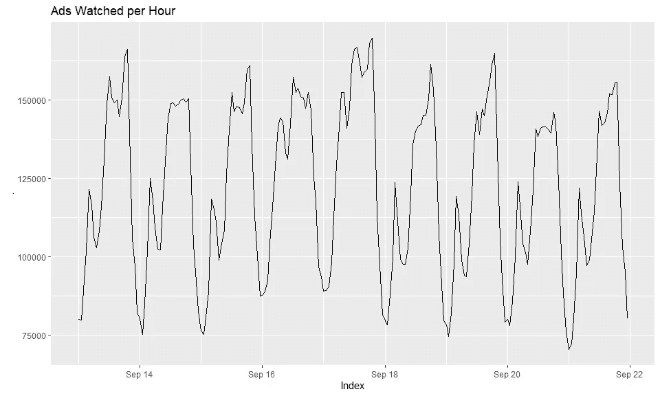

图片作者[作者](https://dwiuzila.medium.com/)

由于源自`xts()` [的时间序列对象不容易分解](https://github.com/joshuaulrich/xts/issues/177)，从现在开始我们将使用`ts()`函数将其转换为另一个时间序列对象。因此，我们可以应用许多内置函数(如`decompose()`)，尽管作为一个缺点，时间索引的每小时间隔将被忽略。如果有更简单的解决方案，直接使用源自`xts()`的时间序列，作者将不胜感激。请在下面的回复部分告诉我！

```
ads_ts <- ts(ads_xts, frequency = 24)
```

# 分解

一个时间序列基本上是由三个基本时间序列组成的*:*

1.  趋势:数据的总体方向，是持平、上升还是下降。如果趋势仍然有波动，这意味着数据中有某种模式没有被分解。
2.  季节性:在固定时间戳内出现的周期性模式。
3.  余数:未计入趋势和季节的任何模式。

我们这里所说的*合成*只是这三种分解的加法或乘法。加法型时间序列始终具有相对恒定的方差，而乘法型时间序列则具有方差增大或减小的趋势。作为例证，请看下图。

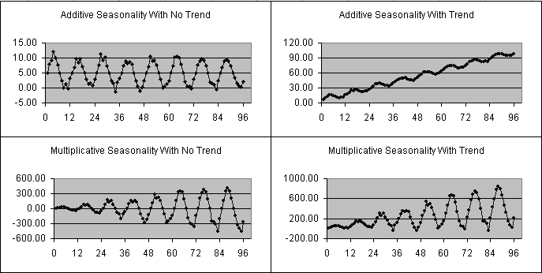

图片由[甲骨文水晶球预测用户](https://www.crystalballservices.com/Portals/0/CB_Material/CrystalBallUserGuides/en/Predictor%20Users%20Guide/frameset.htm?ch03s04s01.html)

乘法时间序列可以进行对数变换，以创建加法时间序列。显然，我们的数据已经是一个附加的时间序列。让我们观察它的分解。

```
dim(ads_ts) <- NULL
ads_ts %>% decompose() %>% autoplot()
```

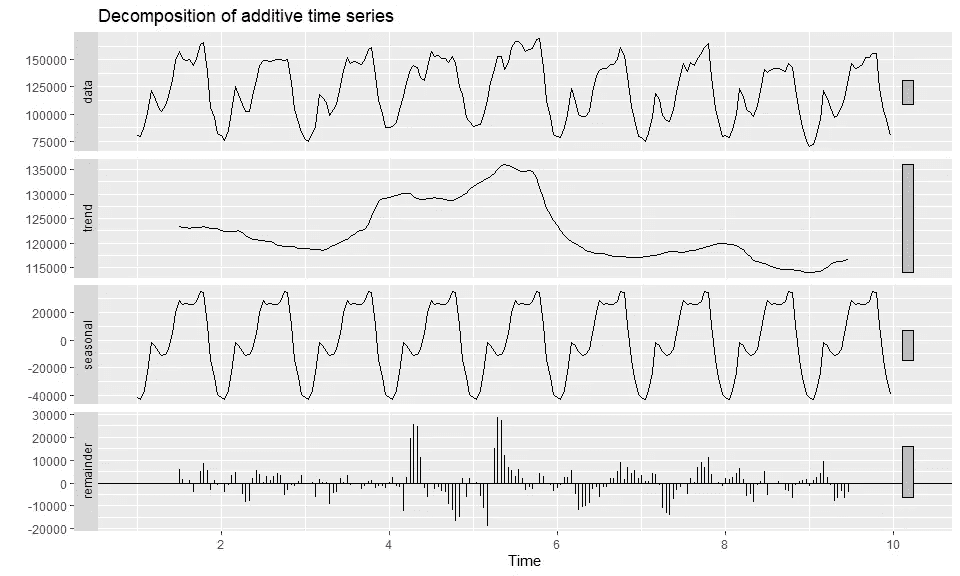

图片作者[作者](https://dwiuzila.medium.com/)

很明显，我们有一个相当平坦的趋势(没有趋势)。然而，在 2017 年 9 月 16 日至 17 日，趋势曲线有一个轻微的凸起。这是因为这两天是周末，人们似乎在周末玩更多的手机游戏，因此观看更多的广告。请注意，由于在计算趋势曲线时使用了中心移动平均线，我们在趋势曲线的开始和结束时各丢失了半天的信息。

同样清楚的是，我们有 24 小时的季节性。让我们放大一点。

```
window(
  x = ads_xts, 
  start = as.POSIXct("2017-09-13 00:00:00"), 
  end = as.POSIXct("2017-09-13 23:00:00")
) %>% autoplot() + ggtitle("Ads Watched per Hour on 13 September 2017")
```

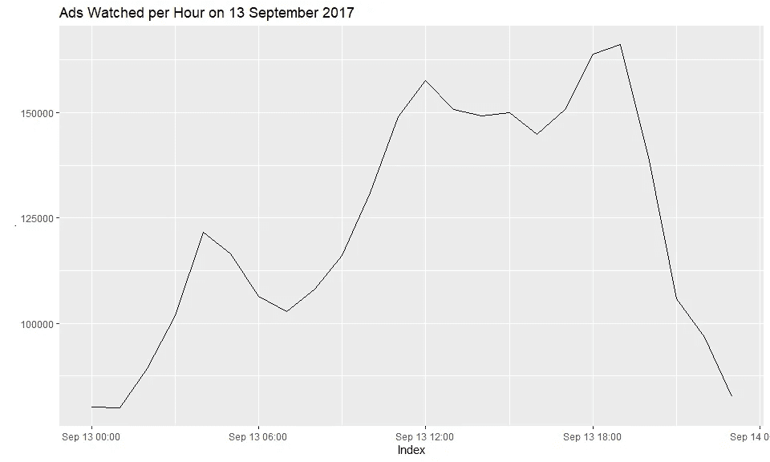

图片作者[作者](https://dwiuzila.medium.com/)

上图是我们 2017 年 9 月 13 日全天的时间序列数据(用于分析目的的代表性数据)。夜间观看的广告数量约为 80k。这个数字不断增加，并在 04:00 左右达到峰值 120k。也许一些早上的游戏玩家来到他们的手机前，想看一些游戏中的事件？然后，这个数字在早上的例行活动中下降，并在中午 12:00 左右增加到第二个峰值 160k。在此之后，似乎有些人结束了一天的工作并继续玩，而其他人则回到工作中，直到 16:00 才稍有减少。该数字再次增加，在 18:00-19:00(下班后)达到第三个也是最后一个峰值 160，000-170，000，然后在晚上回落到大约 80，000。

最后，除了 2017 年 9 月 16 日至 17 日的一些峰值外，我们其余的数据都很小(这很好)。同样，这可能来自于周末的不规律。

# 度量和验证

我们将使用 MAPE(平均绝对百分比误差)作为我们的衡量标准，因为它不依赖于数据的大小，只依赖于原始数据的百分比，这便于比较不同模型的性能。此外，我们将照常将数据分为`train`和`test`进行模型验证。测试数据将是我们需要预测的最后 24 小时，正如问题陈述询问我们的那样。

```
test_num <- 24
test <- tail(ads_ts, test_num)
train <- head(ads_ts, length(ads_ts)-length(test))
```

# 建模

我们有几个简单的模型可供选择，以及它们适用于哪些时间序列数据:

1.  简单移动平均线(SMA) →无趋势和季节性
2.  指数平滑法

*   简单指数平滑(SES) →无趋势和季节性
*   双指数平滑(霍尔特指数平滑)→趋势无季节性
*   三重指数平滑(霍尔特-温特斯)→趋势和季节性

3.自回归综合移动平均线(ARIMA) →无季节性趋势

4.季节性 ARIMA (SARIMA) →符合潮流和季节性

由于我们有季节性数据，我们将使用霍尔特-温特斯和萨里玛。

## 霍尔特-温特斯指数

首先，建立模型。霍尔特-温特斯模型自动给我们这个问题的平滑参数 *α* = 0.92、 *β* = 0、 *γ* = 1。我们可以手动调整这些参数，但现在，我们将坚持什么给定的。

```
hw_model <- HoltWinters(x = train)
hw_model#> Holt-Winters exponential smoothing with trend and additive seasonal component.
#> 
#> Call:
#> HoltWinters(x = train)
#> 
#> Smoothing parameters:
#>  alpha: 0.9177049
#>  beta : 0
#>  gamma: 1
#> 
#> Coefficients:
#>            [,1]
#> a   116134.6370
#> b     -112.5410
#> s1  -42551.9149
#> s2  -46114.6303
#> s3  -38622.4558
#> s4  -23062.7216
#> s5     766.4552
#> s6   -2643.0073
#> s7  -10590.9356
#> s8  -16361.4525
#> s9  -18599.8027
#> s10  -9730.1904
#> s11   6773.7268
#> s12  23255.7037
#> s13  32034.0766
#> s14  29038.2208
#> s15  27572.8383
#> s16  26323.7715
#> s17  24075.6307
#> s18  26062.1503
#> s19  36996.4620
#> s20  39800.2418
#> s21  16732.8980
#> s22 -12780.5149
#> s23 -27289.9691
#> s24 -40084.6370
```

现在，预测时间…

```
hw_forecast <- forecast(hw_model, h = test_num)
hw_forecast#>          Point Forecast     Lo 80     Hi 80     Lo 95     Hi 95
#> 9.000000       73470.18  64566.94  82373.42  59853.85  87086.51
#> 9.041667       69794.92  57710.82  81879.03  51313.88  88275.97
#> 9.083333       77174.56  62587.46  91761.66  54865.52  99483.60
#> 9.125000       92621.75  75902.26 109341.24  67051.50 118192.00
#> 9.166667      116338.39  97729.27 134947.50  87878.20 144798.57
#> 9.208333      112816.38  92492.58 133140.19  81733.81 143898.96
#> 9.250000      104755.91  82851.24 126660.59  71255.60 138256.23
#> 9.291667       98872.86  75493.96 122251.75  63117.92 134627.79
#> 9.333333       96521.97  71756.45 121287.48  58646.38 134397.55
#> 9.375000      105279.04  79200.53 131357.54  65395.40 145162.67
#> 9.416667      121670.41  94341.92 148998.90  79875.09 163465.73
#> 9.458333      138039.85 109516.10 166563.60  94416.54 181663.16
#> 9.500000      146705.68 117034.78 176376.58 101327.96 192083.40
#> 9.541667      143597.28 112821.97 174372.60  96530.50 190664.06
#> 9.583333      142019.36 110177.91 173860.81  93322.07 190716.65
#> 9.625000      140657.75 107784.73 173530.78  90382.80 190932.70
#> 9.666667      138297.07 104423.87 172170.27  86492.48 190101.66
#> 9.708333      140171.05 105326.37 175015.72  86880.72 193461.38
#> 9.750000      150992.82 115203.03 186782.61  96257.06 205728.58
#> 9.791667      153684.06 116973.47 190394.64  97540.06 209828.05
#> 9.833333      130504.17  92895.33 168113.01  72986.41 188021.93
#> 9.875000      100878.22  62392.08 139364.36  42018.75 159737.69
#> 9.916667       86256.22  46912.35 125600.10  26084.96 146427.49
#> 9.958333       73349.02  33165.70 113532.33  11893.94 134804.09
```

…和情节。

```
train %>% 
  autoplot(series = "train") +
  autolayer(test, series = "test") +
  autolayer(hw_model$fitted[,1], series = "fitted") +
  autolayer(hw_forecast$mean, series = "forecast") + 
  ggtitle("Holt-Winters Prediction")
```

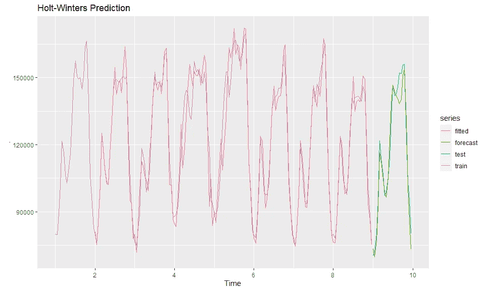

图片作者[作者](https://dwiuzila.medium.com/)

```
hw_mape <- cbind(
  'train_mape' = accuracy(hw_model$fitted[,1], train)[, 'MAPE'],
  'test_mape' = accuracy(hw_forecast$mean, test)[, 'MAPE']
)

hw_mape <- as.data.frame(hw_mape)
rownames(hw_mape) <- c('Holt-Winters')
hw_mape#>              train_mape test_mape
#> Holt-Winters   3.800135  3.691772
```

从上面的图和 MAPE 分数，我们实际上从霍尔特-温特斯模型得到了不错的结果，除了一些午餐后的工作时间。但是我们不能真的责怪这个模型，因为数据显示在这几个小时内模式不规则。

## 萨里玛

使用 SARIMA 带来了一个复杂性:我们必须确定许多参数，并基于所选择的参数构建模型，假设数据是静态的。为了断言这个平稳假设，我们可以使用所谓的增广 Dickey-Fuller 假设检验(或简称为 ADF 检验)。

*   H₀:数据不是静止的
*   H₁:数据是稳定的

祝 p 值< alpha (0.05) so that H₀ is rejected and the data is stationary.

```
adf.test(train)#> 
#>  Augmented Dickey-Fuller Test
#> 
#> data:  train
#> Dickey-Fuller = -4.9338, Lag order = 5, p-value = 0.01
#> alternative hypothesis: stationarytrain %>% 
  tsdisplay()
```

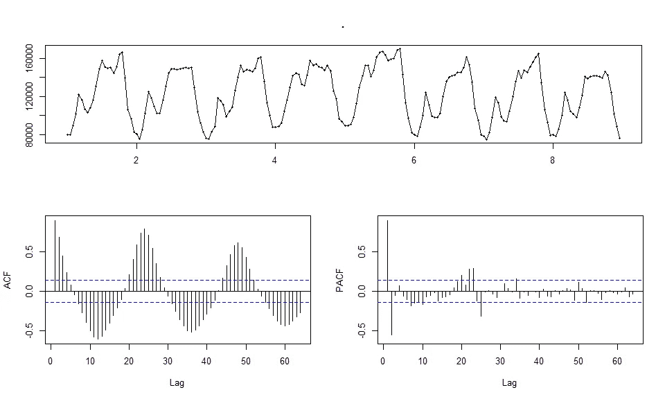

Image by [作者](https://dwiuzila.medium.com/)

根据上面的 ADF 测试，数据已经是稳定的。这并不奇怪，因为数据不会随着时间的推移而改变其统计属性，即均值和方差。我们可以在图上看到这一点:没有明显的趋势(所以平均值是恒定的),方差非常稳定。唯一剩下的是季节性，这是我们在建模之前必须处理的。为了做到这一点，让我们采取季节差异，这意味着一个简单的减法序列本身与滞后等于季节周期。

```
train %>% 
  diff(lag = 24) %>%
  adf.test()#> 
#>  Augmented Dickey-Fuller Test
#> 
#> data:  .
#> Dickey-Fuller = -2.4897, Lag order = 5, p-value = 0.3719
#> alternative hypothesis: stationarytrain %>% 
  diff(lag = 24) %>%
  tsdisplay()
```

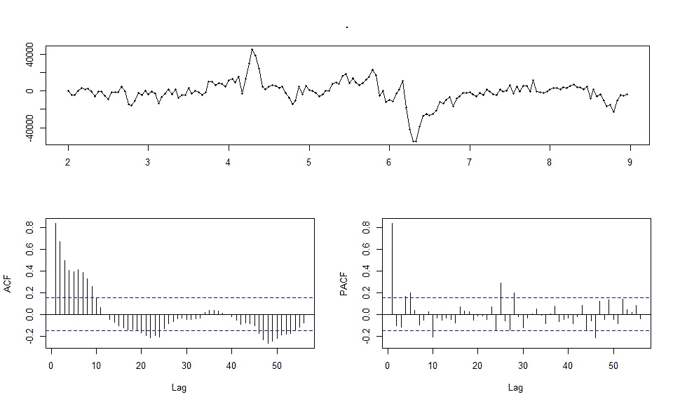

图片由[作者](https://dwiuzila.medium.com/)

随着季节性的消失，数据变得非平稳(p 值> 0.05)。此外，ACF 图仍然显示了许多明显的滞后。为了解决这个问题，我们将取第一个差值，用滞后 1 减去序列本身。

```
train %>% 
  diff(lag = 24) %>%
  diff() %>%
  adf.test()#> 
#>  Augmented Dickey-Fuller Test
#> 
#> data:  .
#> Dickey-Fuller = -6.4821, Lag order = 5, p-value = 0.01
#> alternative hypothesis: stationarytrain %>% 
  diff(lag = 24) %>%
  diff() %>%
  tsdisplay()
```

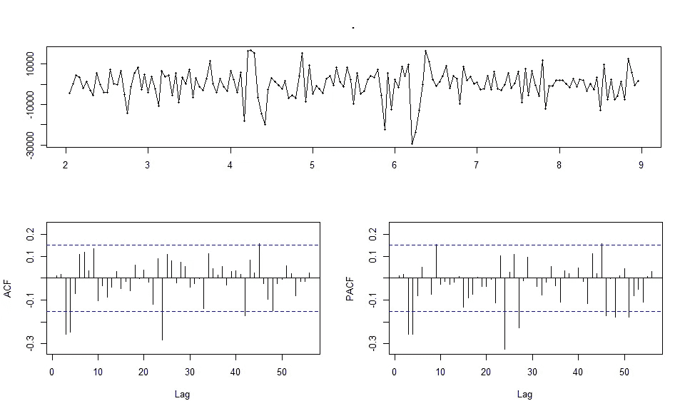

图片作者[作者](https://dwiuzila.medium.com/)

现在我们开始工作了！我们来确定参数。

1.  既然我们是做季节差一次，先差一次，那么 *d* = 1， *D* = 1。
2.  从 PACF 和 ACF 图中，我们看到滞后 3 和 4 是显著的，因此 *p* = 3 或 4， *q* = 3 或 4。
3.  从 PACF 图来看，滞后 24 和 48 是显著的，所以 *P* = 1 或 2。
4.  从 ACF 图来看，滞后 24 很重要，但滞后 48 不重要，因此 *Q* = 0 或 1。

总而言之，

> p = 3 或 4
> 
> d = 1
> 
> q = 3 或 4
> 
> P = 1 或 2
> 
> D = 1
> 
> Q = 0 或 1

基于这些参数，我们将制作如下 4 个 SARIMA 模型。

```
sarima1_model <- Arima(y = train, order = c(4,1,4), seasonal = c(2,1,1))
sarima2_model <- Arima(y = train, order = c(4,1,4), seasonal = c(1,1,1))
sarima3_model <- Arima(y = train, order = c(3,1,3), seasonal = c(1,1,1))
sarima4_model <- Arima(y = train, order = c(3,1,3), seasonal = c(1,1,0))
```

看一看每个模型的 AIC。请记住，AIC 是信息损失的一个衡量标准，这使得`sarima3_model`成为目前最好的衡量标准。然而，较低的 AIC 并不意味着模型在数据集`test`上表现更好。

```
sarima1_model$aic#> [1] 3383.505sarima2_model$aic#> [1] 3382.48sarima3_model$aic#> [1] 3379.964sarima4_model$aic#> [1] 3410.026
```

和以前一样，预测时间…

```
sarima1_forecast <- forecast(sarima1_model, h = test_num)
sarima2_forecast <- forecast(sarima2_model, h = test_num)
sarima3_forecast <- forecast(sarima3_model, h = test_num)
sarima4_forecast <- forecast(sarima4_model, h = test_num)
```

…和情节。

```
train %>% 
  autoplot(series = "train") +
  autolayer(test, series = "test") +
  autolayer(sarima1_model$fitted, series = "fitted") +
  autolayer(sarima1_forecast$mean, series = "forecast") +
  ggtitle("ARIMA(4,1,4)(2,1,1)[24] Prediction")
```

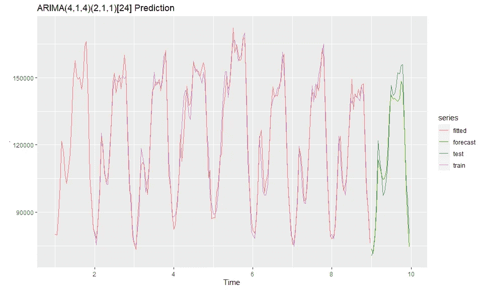

图片由[作者](https://dwiuzila.medium.com/)

```
train %>% 
  autoplot(series = "train") +
  autolayer(test, series = "test") +
  autolayer(sarima2_model$fitted, series = "fitted") +
  autolayer(sarima2_forecast$mean, series = "forecast") +
  ggtitle("ARIMA(4,1,4)(1,1,1)[24] Prediction")
```

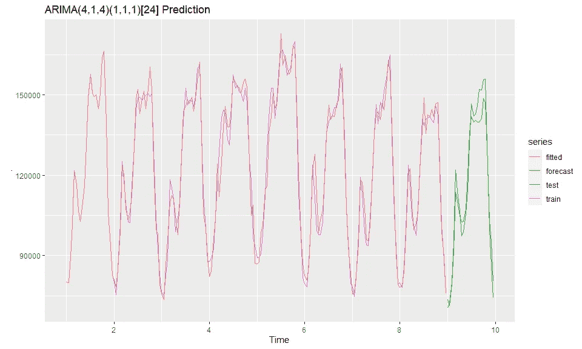

图片作者[作者](https://dwiuzila.medium.com/)

```
train %>% 
  autoplot(series = "train") +
  autolayer(test, series = "test") +
  autolayer(sarima3_model$fitted, series = "fitted") +
  autolayer(sarima3_forecast$mean, series = "forecast") +
  ggtitle("ARIMA(3,1,3)(1,1,1)[24] Prediction")
```


图片由[作者](https://dwiuzila.medium.com/)

```
train %>% 
  autoplot(series = "train") +
  autolayer(test, series = "test") +
  autolayer(sarima4_model$fitted, series = "fitted") +
  autolayer(sarima4_forecast$mean, series = "forecast") +
  ggtitle("ARIMA(3,1,3)(1,1,0)[24] Prediction")
```

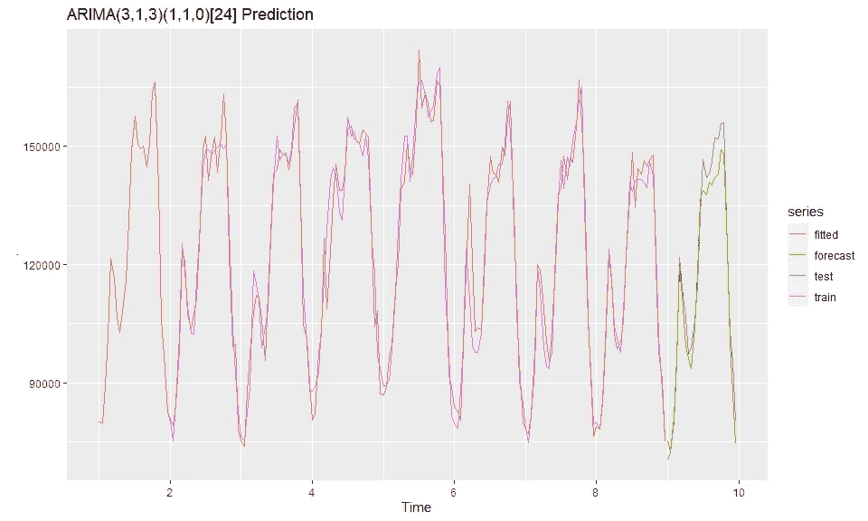

图片由[作者](https://dwiuzila.medium.com/)

这四种型号之间只有细微的差别。就像 Holt-Winters 一样，这些模型很难预测午餐后的工作时间，甚至无法预测 12:00 的第二个高峰。我们还可以看到`sarima4_model`在预测早晨时间方面是最好的。

```
train_mape <- rbind(
  'ARIMA(4,1,4)(2,1,1)[24]' = accuracy(sarima1_model)[, 'MAPE'],
  'ARIMA(4,1,4)(1,1,1)[24]' = accuracy(sarima2_model)[, 'MAPE'],
  'ARIMA(3,1,3)(1,1,1)[24]' = accuracy(sarima3_model)[, 'MAPE'],
  'ARIMA(3,1,3)(1,1,0)[24]' = accuracy(sarima4_model)[, 'MAPE']
)

test_mape <- rbind(
  accuracy(sarima1_forecast$mean, test)[, 'MAPE'],
  accuracy(sarima2_forecast$mean, test)[, 'MAPE'],
  accuracy(sarima3_forecast$mean, test)[, 'MAPE'],
  accuracy(sarima4_forecast$mean, test)[, 'MAPE']
)

sarima_mape <- cbind(train_mape, test_mape)
sarima_mape <- as.data.frame(sarima_mape)
colnames(sarima_mape) <- c('train_mape', 'test_mape')
result <- rbind(hw_mape, sarima_mape)
result#>                         train_mape test_mape
#> Holt-Winters              3.800135  3.691772
#> ARIMA(4,1,4)(2,1,1)[24]   2.628641  4.185137
#> ARIMA(4,1,4)(1,1,1)[24]   2.680071  4.013859
#> ARIMA(3,1,3)(1,1,1)[24]   2.711371  3.995025
#> ARIMA(3,1,3)(1,1,0)[24]   3.341027  3.758555
```

SARIMA 的前三个模型在某种程度上表明过度拟合。另一方面，最后一个模型在`train`数据集上肯定比霍尔特-温特斯好，但在`test`数据集上比霍尔特-温特斯稍差。

## ARIMA 汽车

我们实际上可以自动搜索萨里玛模型的参数。然而，结果并不总是比手动调谐更好，这里有一些运气参与。让我们开始吧。

```
auto_arima_model <- auto.arima(train)
auto_arima_model#> Series: train 
#> ARIMA(3,0,3)(1,1,0)[24] 
#> 
#> Coefficients:
#>          ar1      ar2     ar3      ma1     ma2      ma3     sar1
#>       1.5185  -1.0912  0.4706  -0.5546  0.6366  -0.3294  -0.3786
#> s.e.  0.2028   0.2050  0.1065   0.2012  0.1330   0.1084   0.0756
#> 
#> sigma^2 estimated as 38627419:  log likelihood=-1705.08
#> AIC=3426.17   AICc=3427.07   BIC=3451.16
```

我们得到了`ARIMA(3,0,3)(1,1,0)[24]`模型，它非常接近我们之前最好的 SARIMA 模型，唯一的差异是 *d* 参数。这个新模型没有像早期过程建议的那样考虑 1 个滞后的差异。AIC 也是迄今为止遇到的所有模型中最差的。然而，让我们继续下去，看看会发生什么。

```
auto_arima_forecast <- forecast(auto_arima_model, h = test_num)train %>% 
  autoplot(series = "train") +
  autolayer(test, series = "test") +
  autolayer(auto_arima_model$fitted, series = "fitted") +
  autolayer(auto_arima_forecast$mean, series = "forecast") + 
  ggtitle("Auto ARIMA Prediction")
```


图片作者[作者](https://dwiuzila.medium.com/)

```
auto_arima_mape <- cbind(
  'train_mape' = accuracy(auto_arima_model)[, 'MAPE'],
  'test_mape' = accuracy(auto_arima_forecast$mean, test)[, 'MAPE']
)

auto_arima_mape <- as.data.frame(auto_arima_mape)
rownames(auto_arima_mape) <- c('Auto ARIMA')
result <- rbind(result, auto_arima_mape)
result#>                         train_mape test_mape
#> Holt-Winters              3.800135  3.691772
#> ARIMA(4,1,4)(2,1,1)[24]   2.628641  4.185137
#> ARIMA(4,1,4)(1,1,1)[24]   2.680071  4.013859
#> ARIMA(3,1,3)(1,1,1)[24]   2.711371  3.995025
#> ARIMA(3,1,3)(1,1,0)[24]   3.341027  3.758555
#> Auto ARIMA                3.332454  2.890477
```

我们找到冠军了！不仅在`train`数据集上表现良好，而且自动 ARIMA 在`test`数据集上表现也非常好。这是迄今为止我们创造的最好的模型。

# 假设

我们将只测试最佳模型(自动 ARIMA)的假设。对时间序列数据的假设进行测试，以确定从建模中获得的残差是否足以解释趋势和季节性成分已经获取了尽可能多的信息。最佳模型是没有自相关残差且残差呈正态分布的模型。

## 非自相关残差

如果残差是自相关的，那么仍然会留下一些信息，这些信息应该用于进一步改进模型。为了看到这一点，我们可以绘制 ACF 和 PACF 残差图，看看是否仍然有明显的滞后。

```
auto_arima_model$residuals %>% 
  tsdisplay()
```


图片由[作者](https://dwiuzila.medium.com/)

正如我们所看到的，ACF 和 PACF 图中没有明显的滞后。等等，实际上有一些:ACF 图中的滞后 42 和 PACF 图中的滞后 27。然而，这些滞后离现在太远，因此它们的意义可以忽略不计。

如果很难从图中检验这个假设，有一个更客观的方法:Box-Ljung 检验。

*   H0:残差没有自相关
*   H1:残差具有自相关性

我们希望 p 值>α(0.05)，以便 H0 不会被拒绝，并且残差没有自相关。

```
Box.test(auto_arima_model$residuals, type = "Ljung-Box")#> 
#>  Box-Ljung test
#> 
#> data:  auto_arima_model$residuals
#> X-squared = 0.044539, df = 1, p-value = 0.8329
```

如我们所见，p 值> 0.05，这证实了之前从 ACF 和 PACF 图观察到的结果。

## 正态分布残差

为了验证这一点，我们可以从残差直方图中观察。它们正态分布在零附近吗？

```
hist(auto_arima_model$residuals)
```

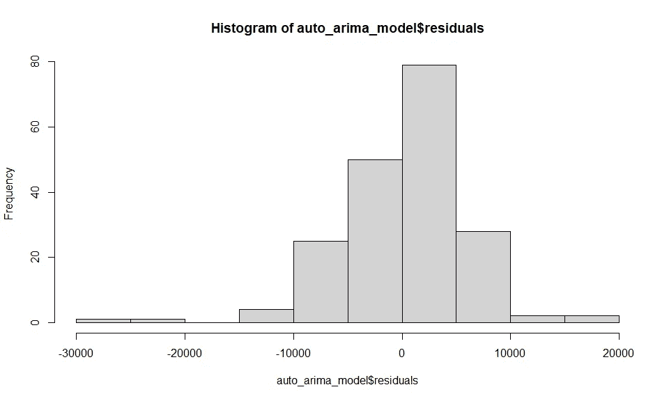

图片由[作者](https://dwiuzila.medium.com/)

如果很难说，夏皮罗-维尔克测试永远是我们的朋友。

*   H0:残差呈正态分布
*   H1:残差不是正态分布的

我们希望 p 值>α(0.05)，这样 H0 不会被拒绝，并且残差是正态分布的。

```
shapiro.test(auto_arima_model$residuals)#> 
#>  Shapiro-Wilk normality test
#> 
#> data:  auto_arima_model$residuals
#> W = 0.94388, p-value = 0.0000008032
```

因为 p 值低于 alpha (0.05)，所以拒绝 H0。因此，残差不是正态分布的。

# 结论

```
result#>                         train_mape test_mape
#> Holt-Winters              3.800135  3.691772
#> ARIMA(4,1,4)(2,1,1)[24]   2.628641  4.185137
#> ARIMA(4,1,4)(1,1,1)[24]   2.680071  4.013859
#> ARIMA(3,1,3)(1,1,1)[24]   2.711371  3.995025
#> ARIMA(3,1,3)(1,1,0)[24]   3.341027  3.758555
#> Auto ARIMA                3.332454  2.890477
```

我们已经在每小时的移动游戏广告数据集上实现了时间序列预测。由于数据集具有季节性，我们使用 Holt-Winters 和 SARIMA 模型。我们看到，参数为`ARIMA(3,0,3)(1,1,0)[24]`的自动 ARIMA 是最好的模型，在训练数据集上有 3.33%的 MAPE，在测试数据集上有 2.89%的 MAPE。然而，该模型违反了时间序列数据的正态分布残差假设。

嗨！感谢到达终点。这是我的“R 中的数据科学”系列的第五篇文章。请为你好奇的头脑找到其他的:


[艾伯斯·乌兹拉](https://dwiuzila.medium.com/?source=post_page-----70d42062109f--------------------------------)

## R 中的数据科学

[View list](https://dwiuzila.medium.com/list/data-science-in-r-0a8179814b50?source=post_page-----70d42062109f--------------------------------)7 stories

*如果想支持我写作，可以考虑* [***成为中等会员***](https://dwiuzila.medium.com/membership) *。每月只需 5 美元，你就可以阅读 Medium 上的所有报道。你的会员费直接支持我和你看的其他作家。*

[](https://dwiuzila.medium.com/membership)