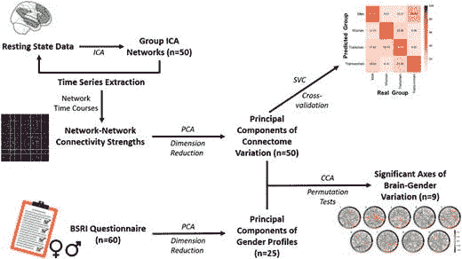
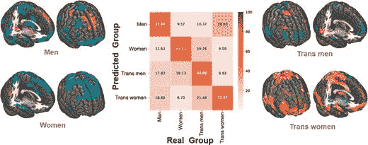
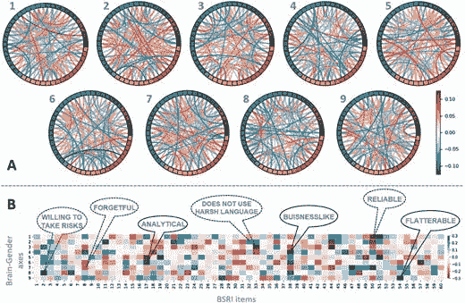

# 我们大脑中有多少不同的性别亚型？根据这项人工智能研究，至少有 9 个。

> 原文：<https://pub.towardsai.net/how-many-different-gender-subtypes-do-we-have-in-our-brains-b22a38900f39?source=collection_archive---------1----------------------->

莎伦·麦卡琴在 [Unsplash](https://unsplash.com?utm_source=medium&utm_medium=referral) 上的照片

## 麦吉尔大学医学院的研究人员使用机器学习算法、fMRI 和行为数据研究了性别身份，发现了至少九种性别表达。

人类创造的用于解释和研究我们大脑的术语可能与这些结构在自然界中的表现方式不一致。

例如，在许多人类社会中，当婴儿出生时，出生证明上的“男性”或“女性”框会被勾选。

然而，现实可能没那么黑白分明。事实上，假设只有两种性/性别类别之间的二分法差异可能与我们试图切割自然关节的努力相冲突。

在这篇文章中，我将解释一篇名为“**预测模式分类可以从行为和大脑成像中区分性别身份亚型”的论文，该论文由**麦吉尔大学**的研究人员撰写，他们在那里使用机器学习算法、fMRI 和行为数据来研究性别身份，以发现我们大脑中至少九种不同的性别表达。**

这项研究及其具体的发现对全球走向更大的公平、多样性和包容性有着深远的影响，因为它表明男性和女性这两种现有的性别身份类别不足以映射到实际的现代性别身份类别。

通过从生物学的角度提高认识，研究可以帮助建立一个社会，在这个社会中，认同男性或女性的个人感到被包容，而不是被歧视。

# 超越男性和女性

经典的统计方法经常对他们期望在数据中看到的参与者的类型做出假设，例如老年人对年轻人或内向者；这种方法通常对最初决定将人们分成不灵活的组至关重要。

在这项研究中，研究人员没有对大脑性别群体做出任何假设，包括男性、女性和介于两者之间的个体。

相反，他们使用不可知论的数据驱动方法，直接从脑成像和心理评估项目中得出大脑性别组。

目的是证明广泛可用的脑成像方法可以提供证据，反驳性别在大脑中如何表现的严格二元观点。

分析工作流程概述。来源: [**预测模式分类可以从行为和脑成像上区分性别身份亚型**](https://academic.oup.com/cercor/article/30/5/2755/5669983)

# 数据驱动的方法

为了进行他们的研究，研究人员收集了一个独一无二的不同性别身份人群的数据集。他们没有像通常所做的那样在男性和女性群体中研究性别行为，而是获得了一个大样本，其中包括从男性到女性的性别转换以及从女性到男性的性别转换。

研究人员与**亚琛工业大学精神病学、心理治疗和心身医学系**的专家密切合作，设法测量了这四个群体的大脑连接指纹，然后将它们与性别刻板行为特征的综合特征相关联。

研究人员使用机器学习算法来提供证据，证明性/性别在人脑中不是一个二元实体。

他们可以证明，使用无偏见的模式学习方法，至少可以确定大脑性别差异的九个方面。根据大脑性别差异的具体分布，个人可以被分配到九个“表情”或坐标系轴中的一个。

该研究小组致力于系统神经科学和裁剪机器学习算法的交叉领域，以回答大型神经科学数据集的问题，为神经科学和人工智能领域做出了重要贡献。

在亚琛工业大学医院的精神病学、心理治疗和心身科，研究人员使用 3 特斯拉西门子 Trio MR 扫描仪(西门子医疗系统，德国埃尔兰根)覆盖了每个参与者的整个大脑。

参与者被要求在扫描仪中放松，保持眼睛睁开，并避免在休息状态下睡着，我们在扫描后的采访中证实了这一点。

在标准预处理之后，对来自所有 92 名参与者的静息状态扫描进行 **ICA 和时间序列提取**以获得时空相干网络。

每个后续网络生成的时间序列用于计算网络间的功能连接强度。

研究人员通过 PCA 对连接性指数进行**维度缩减。同样的降维程序被分别应用于行为数据。**

他们以这种方式获得了功能连接的 50 个主成分和行为数据的 25 个主成分。一方面，将必要的功能耦合分量输入到最大间隔线性支持向量分类器中，从而在交叉验证之后，在将来评估的个体中产生预测准确度的期望值。

在一项独立的研究中，行为数据和功能连接组件都被输入到**典型相关分析(CCA)** 中。

该研究使用排列迭代获得了跨个体的大脑网络动力学和行为性别倾向之间随机关联的零分布。

研究人员在 100 个随机但组平衡的数据分割中使用交叉验证，以获得对未来脑成像数据预期性能的无偏估计，其中 95%的数据用于模型训练，5%用于预测性能的模型评估。

分析策略揭示了男性对跨性别男性对女性对跨性别女性的潜在神经信号如何在单一受试者预测中相互权衡。

它特别使研究人员能够基于一对其余方案创建预测模型，在该方案中，每个性别亚型根据其余三个性别亚型进行分类。因此，该团队可以量化有多少元素被错误地识别为男性、女性或其他群体。

大脑连接可以区分男性、女性、跨性别男性和跨性别女性。每一幅大脑渲染图都描绘了与其余三种亚型相比，局部灰质模式如何有助于预测特定的亚型(例如，人类)。中间的混淆矩阵显示了子群预测的可变性，以及每个子群在预测其他子群时的错误程度。SVM 算法仅仅基于内在的功能活动就成功地区分了所有四个性别组。被认定为跨性别者的参与者没有被归类为男性或女性。因此，这两个性别群体在大脑生物学中被独特地定义，而不是仅仅代表男性或女性大脑活动特征的变体。单元格内的所有百分比表示将特定组成员正确分类为该组，或者错误分类为其他三个组之一。横轴显示参与者的实际性别身份，纵轴显示 SVM 算法预测的性别身份。整个大脑中的区别性分类器权重被呈现在每个组的 MNI-152 模板上。从红色到黄色的颜色表明 SVM 算法可以最好地检测性别身份的大脑区域。蓝绿色代表大脑区域，SVM 分类器从这些区域中获得对自我报告性别的信心。男性参与者的外侧运动前区和额上区具有较高的预测强度，而女性参与者的外侧运动前区和额上突出区具有较低的预测强度。跨性别女性的歧视区域包括大部分的颞叶、顶叶、枕叶、额叶和皮质下中线区域。另一方面，跨性别者的大脑信号仅限于颞后回、运动前皮质和额中回的几个部位。来源: [**预测模式分类可以从行为和脑成像上区分性别身份亚型**](https://academic.oup.com/cercor/article/30/5/2755/5669983)

# 一种用于大脑性别亚型识别的机器学习方法

这项研究想看看是否有可能提取性别差异背后的连续的大脑行为联系。他们从所谓的**BSRI-贝姆性别角色调查**中获得了关于性别认同和性别角色的详细信息。

BSRI 是为数不多的以经验为基础的调查人们如何认同性别的问卷之一，它旨在促进对心理雌雄同体概念的研究。 **BSRI** 向参与者展示了 60 种不同的性格特征，他们使用 7 分的李克特量表对自己进行评分，范围从 1(从不或很少真实)到 7(总是或几乎总是真实)(总是或几乎总是真实)。

在这 60 种特质中，20 种是典型的男性特质(例如，强势和强势)，20 种是典型的女性特质(例如，深情和同情)，还有 20 种被描述为中性的“填充特质”。

研究中使用了德国版的 **BSRI** ，它在 580 名德国男性和女性的人口样本中显示出良好的有效性和可靠性。

BSRI 的典型男性特征和典型女性特征分别代表了男性和女性在文化上想要的特征。与此同时，10 个性别中立的项目被概念化为对两性都是可取的(例如，适应性强和真诚)。另外 10 个是男女都不喜欢的(例如，低效、嫉妒)。

研究人员使用**中位数分裂评分**程序，试图根据 BSRI 捕捉到的行为特征进行性别分配。每个参与者的每个 BSRI 项目的原始分数被用于论文中报道的典型相关分析(CCA)。

研究人员寻找主导耦合机制——人口变异的“模式”——提供了对功能网络内的功能变异如何解释所有 92 名参与者中个体性别特征行为差异的见解。

根据这篇论文，**静息态 fMRI** 数据相对于**基于任务的 fMRI** 数据的一个显著优势是，它不受可能混淆性别相关结果的任务约束的影响。

研究人员感兴趣的是，机器学习算法在多大程度上预测了这两个跨性别群体，以寻求超越常见性别二分法的性别身份亚型的神经生物学表现。

他们成功地将跨性别男性和跨性别女性识别为神经生物学上不同的表型，证实了他们的中间性别大脑类型假说。

变性男性和变性女性的分类准确率分别为 49%和 52%，而随机猜测的概率分别为 25%。换句话说，变性人并没有被系统地错误分类为男性或女性。

大脑衍生的性别特征显示，正如支持向量分类器所确定的那样，这四组中的每一组都与不同的、不重叠的区别性大脑区域模式相关联。这些区域表示大脑中算法能够最好地对各种群体进行分类的区域。

在共同国家评估的背景下，将两个变量集(BSRI 和静息态功能磁共振成像)结合起来，可以产生自我评估问卷和神经生物学数据的创新性和原创性结合，以证明跨四个参与者组的连续脑-性别轴的可行性。

从数据分析的角度来看，CCA 似乎是询问两个高维变量集之间的多变量对应关系的自然选择。在 SVM 分析中使用的相同的连接组信息被用于 CCA。

第一个变量集对应于特定主题的网络间通信度量，而第二个变量集是从网络间耦合强度构建的，PCA 降低了该耦合强度以避免过拟合。

寻找使功能网络连通性的线性组合和性别方面的线性组合之间的对称关系最大化的规范向量也是 CCA 的一部分。

因此，多变量模式学习技术揭示了一系列功能连接模式，其中每一种模式都确定了两种投影，这两种投影在我们四个性别组的大规模网络耦合集和行为趋势集之间产生了最大的线性共现。

使用先前研究中使用的排列程序对每个估计的脑性别模式进行统计显著性测试，并使用最小建模假设对 CCA 分析产生的典型变异之间实现的相关性导出零分布。

在 1000 次排列迭代后，**网络间连接矩阵**保持不变，对应于 0.001 的最佳可能显著性阈值，而 BSRI 调查问卷项目受到参与者随机洗牌。

这项研究的分布反映了大脑网络动力学和个人行为性别倾向之间随机关联的无效假设。

在每次迭代中，记录网络侧和行为侧的扰动规范向量之间的**皮尔逊相关系数**，以获得检验统计量的零分布，并且从超过零 CCA 模型的相关数 r 计算 P 值。

基于对**内在功能连接**的大脑扫描，机器学习算法可以在所有 92 名参与者中准确区分 23 名男性、23 名女性、23 名跨性别男性和 23 名跨性别女性。

作为第一步，研究小组通过将他们的模式分类结果与 BSRI 的结果进行比较，评估了他们基于大脑的方法对男性和女性参与者进行分类的效用。

他们仅使用 BSRI 数据，就能分别以 26%和 43%的准确率对男性和女性参与者进行分类。他们基于算法的分类依赖于静息大脑的内在连接，对男性(52%)和女性(63%)参与者都产生了较高的准确性。

值得注意的是，假设有四组，正确分类的概率是 25%。这种分类性能可以作为他们自动性别检测的有效性检查，证明他们可以根据静息状态 fMRI 扫描准确地对生物性别进行分类。

因此，来自大脑的性别特征使得分类性能超过了广泛使用的性别身份行为问卷的规范水平。

# 确定大脑中 9 组性别维度。

分析的下一步是使用 CCA 来确定所有 92 名参与者的 BSRI 中功能连接和一组性别特异性行为特征之间的多变量关系。

CCA 将 PCA 的概念扩展到两个数据矩阵，研究人员寻求两个变量集的两个一维投影，使这两个变量之间的相关性最大化。

目标是直接从数据中提取性别和跨性别的大脑亚型，使研究人员能够描绘出一个人基于大脑的性别连续体，而不管身体性别特征如何。

在对所有估计的 CCA 模式进行显式多重比较后，**非参数假设检验**程序产生了 9 个高度显著的 CCA 模式。

九个规范维度中的每一个都代表了一种独特的模式，这种模式将一组加权的 BSRI 反应与一组加权的功能联系起来。

因此，研究人员可以指定九个典型维度，或大脑性别轴，这些维度对异性恋和变性人之间的差异很敏感，而无需使用特定参与者特定群体的信息。

在下图中，你可以看到这九个大脑性别轴如何与静息状态功能连接模式和 BSRI 反应模式相关联。

九个大脑-性别轴代表在 92 个参与者中的每一个中表达的连续程度，就其与 BSRI 性别典型特征问卷的 60 个项目的关系而言，其超越了九个先验性别组。蓝色(红色)表示特定项目与某个大脑性别轴的正(负)关联。来源: [**预测模式分类可以从行为和脑成像上区分性别身份亚型**](https://academic.oup.com/cercor/article/30/5/2755/5669983)

# 这项研究的下一步是什么？

这些发现最重要的一个方面是，样本中的四个性别组可能都有不同的不重叠的大脑连接模式，将他们与其他三个组区分开来。

根据这篇论文，男性和女性的额上回和运动前区有很大程度上不同的模式:在我们的数据集中，这些区域对于正确区分男性参与者而不是女性参与者具有很高的预测性。位于下顶叶的区域最有可能是女性。

颞回后部、运动前皮质和额中回附近的一些区域与成功预测跨文化交际有关。另一方面，跨性别女性最好用包括颞区、顶区、枕区和前区的广泛模式来识别。

这项研究的发现代表着向汇集更丰富的多模态数据集迈出了早期和重要的一步，以利用人工智能识别普通人群中性别差异的更多方面。

鉴于此，从数据分析的角度来看，研究人员为此类研究收集的数据越多，他们就越有可能发现更多的性/性别维度。

将社会相关行为变异映射到大脑变异这样的崇高问题可能会从多种角度得到解决，包括遗传学、基因组学、干预反应(如暂时性脑损伤)、免疫标记等。

# 结论

这项研究及其发现对全球走向更大的公平、多样性和包容性有着深远的影响。

这表明，现有的男女两种性别身份类别不足以映射到实际的现代性别身份类别。

性别认同是人类社会中个人职业和个人生活道路的最重要决定因素之一，性别差异在收入水平、领导力、参与、健康和学术地位方面影响着现代社会。

不遵守社会既定的性别规范可能会导致耻辱、社会排斥和歧视性做法，所有这些都会损害身心健康。

许多以前关于跨性别者大脑相关的研究忽略了多维性别结构的可能性，强化了性别身份的性别二态性观点。

这是令人担忧的，因为性别不一致的流行率急剧上升，以及由此给受影响的个人和我们的医疗保健系统带来的社会、心理和经济成本。

这是人工智能如何帮助建立一个社会的另一个例子，在这个社会中，通过提高生物意识，识别男性或女性的个人感到被包容而不是被歧视..

# 你可能想读的其他文章。

*   [**这 9 篇研究论文正在改变我今年对人工智能的看法**](https://medium.com/illumination/these-9-research-papers-are-changing-how-i-see-artificial-intelligence-this-year-cd8ba548f785) **。**
*   [**你学习 AI、机器学习、数据科学最印象深刻的 Youtube 频道**](https://medium.com/p/486c1b41b92a) **。**
*   [**这些是 Youtube 上一些最好的频道，你可以在那里免费学习 PowerBI 和数据分析**](https://medium.com/p/8f8eb434b48d) **。**
*   [**人工智能能否成为数学家发现的新助推器？**](https://medium.com/tech-cult-heartbeat/can-artificial-intelligence-be-a-new-booster-for-mathematicians-discoveries-7369a8c43a36)
*   [**什么是 MIT MicroMasters 计划**](https://medium.com/p/ed090ed55288) **？**
*   [**5 家利用人工智能进行招聘变革的公司**](https://medium.com/p/9a70986c7a7e) **。**
*   [**你必读的 5 本关于 AI 的惊艳书籍**](https://medium.com/p/4db9646e0807) **。**
*   [**最好的 MIT 在线资源，供你免费学习 AI 和机器学习**](https://medium.com/p/d3ba1e50f436) **。**

# 链接、资源和参考资料

*   **预测模式分类可以从行为和脑成像中区分性别身份亚型**——[https://academic.oup.com/cercor/article/30/5/2755/5669983](https://academic.oup.com/cercor/article/30/5/2755/5669983)
*   大脑中存在多少种性别亚型？——神经科学新闻。[https://neurosciencenews.com/machine-learning-gender-15717/](https://neurosciencenews.com/machine-learning-gender-15717/)
*   2021 年——从老年痴呆症中觉醒。https://www.awakeningfromalzheimers.com/2021/
*   大脑中存在多少种性别亚型？—频道。[https://www . mcgill . ca/channels/channels/news/how-many-gender-subtype-exist-brain-320430](https://www.mcgill.ca/channels/channels/news/how-many-gender-subtypes-exist-brain-320430)
*   [**麦吉尔大学**](https://www.linkedin.com/feed/#) **。**
*   [**亚琛工业大学精神病学、心理治疗和心身医学系**](https://www.ukaachen.de/kliniken-institute/klinik-fuer-psychiatrie-psychosomatik-und-psychotherapie-des-kindes-und-jugendalters/)
*   [**ICA 和时间序列提取**](https://ideas.repec.org/p/cte/wsrepe/ws111611.html)
*   [**平均分**](https://journals.sagepub.com/doi/pdf/10.5127/jep.008310) **。**
*   [**PCA 降维**](https://towardsdatascience.com/principal-component-analysis-for-dimensionality-reduction-115a3d157bad)
*   [**典型相关分析**](https://towardsdatascience.com/canonical-correlation-analysis-b1a38847219d)
*   [**BSRI —贝姆性别角色量表**](https://en.wikipedia.org/wiki/Bem_Sex-Role_Inventory)
*   [**静息态 fMRI**](https://www.ncbi.nlm.nih.gov/pmc/articles/PMC4035703/#:~:text=Resting%2Dstate%20fMRI%20measures%20spontaneous,synchronous%20BOLD%20fluctuations%20at%20rest.)
*   [**基于任务的 fMRI**](https://www.ncbi.nlm.nih.gov/pmc/articles/PMC4559495/#:~:text=As%20task%2Dbased%20fMRI%20is,such%20differences%20could%20inspire%20better)
*   [**网间连接矩阵**](https://www.researchgate.net/figure/Matrix-of-between-network-functional-connectivity_tbl3_320404643)
*   [**皮尔逊相关系数**](https://www.scribbr.com/statistics/pearson-correlation-coefficient/#:~:text=The%20Pearson%20correlation%20coefficient%20(r,the%20relationship%20between%20two%20variables.&text=When%20one%20variable%20changes%2C%20the,changes%20in%20the%20same%20direction.)
*   [**内在功能连接**](https://pubmed.ncbi.nlm.nih.gov/23799476/#:~:text=Intrinsic%20functional%20connectivity%20magnetic%20resonance,known%20features%20of%20anatomical%20organization.)
*   [**非参数假设检验**](https://www.analyticsvidhya.com/blog/2021/06/hypothesis-testing-parametric-and-non-parametric-tests-in-statistics/)

# 你愿意支持我吗？

*为了获得无限的故事，你也可以考虑* [*注册*](https://medium.com/@jairribeiro/membership) *成为一个中等会员，只需 5 美元。此外，如果您使用我的链接注册* *，我会收到一点佣金(无需额外费用)。*

 [## 通过我的推荐链接加入媒体- Jair Ribeiro

### 阅读我分享的每一个故事(以及媒体上成千上万的其他作者)。你的会员费直接支持其他…

medium.com](https://medium.com/@jairribeiro/membership)