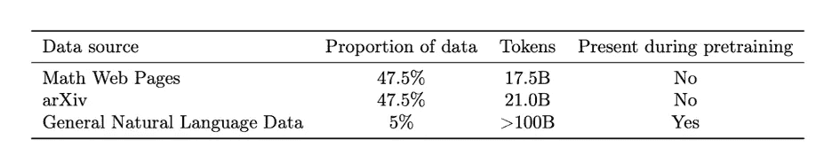
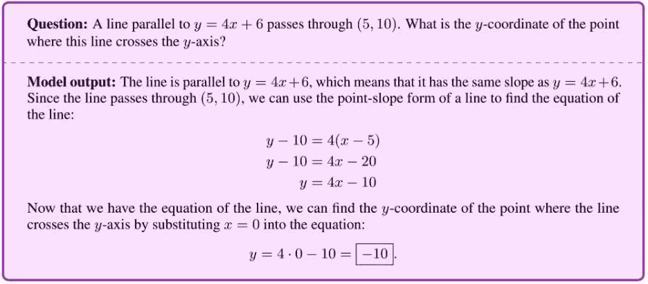
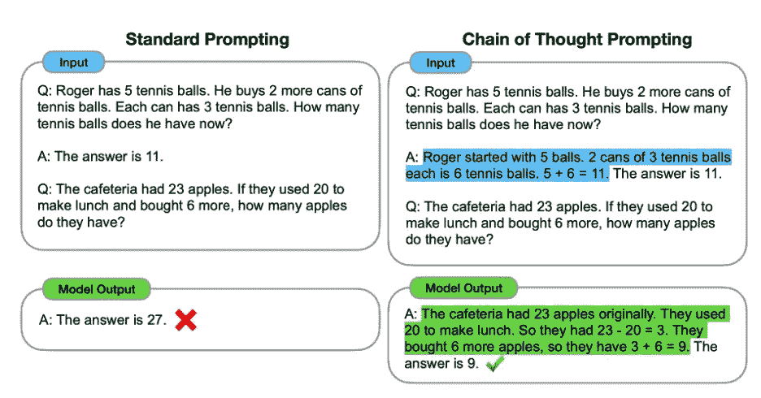

# 一个新的 NLP 模型 Minerva 如何比 GPT-3 表现得更好

> 原文：<https://pub.towardsai.net/how-minerva-a-new-nlp-model-performs-better-than-gpt-3-f7713458b59b?source=collection_archive---------0----------------------->

## 自然语言处理的进步正在解决数学和许多其他定量推理问题。

来自 Pexels 的 Max Fischer

Minerva 是谷歌研究的自然语言处理模型，它对数学用例进行分析，以得出答案。谷歌表示，“定量推理”是语言模型中的一个领域，人工智能的能力已经显示出“低于人类水平的表现”[1]，这为开发 Minerva 奠定了背后的动机。该模型使用 200 个本科水平的问题进行分析，这些问题涉及物理、化学、经济学、生物学和其他“需要定量推理”的科学[2]；人们“发现这个模型可以正确地回答其中近三分之一的问题[2]。

本视频提供了用于训练 Minerva [2]的数据源信息。

关于 Minerva 的 6 个见解:

1.它基于 PaLM，Google 的 Pathways 语言模型，该模型基于 5400 亿个参数[1]。

2.它首先接受一般语言数据的训练，然后接受“技术内容”的训练[2]。

3.该模型实现了最先进的性能结果[2]。

4.数学和科学问题可以用“逐步”推理的方法来解决。

5.在如何训练模型时使用了推理技术；例如，它在来自 arXiv 服务器和网页的 118GB 科学论文数据集上进行训练，“包含使用 LaTeX、MathJax 或其他数学排版格式的数学表达式”[1]。

6.为了测试 Minerva，该团队从各种课程中收集了本科阶段的 STEM 问题。这些问题有可自动验证的解决方案，收集自包括固态化学、信息和熵、微分方程和狭义相对论在内的课程。总共编制了 191 个数字问题和 81 个符号问题[2]。

下面是问题提示可能的样子:

一个问题和密涅瓦输出:【https://bit.ly/3ypRb8O】T2

Minerva 整合了“最近的提示和评估技术，以更好地解决数学问题”[1]。这方面的两个例子包括“思路链或便签簿”[1]提示。语言模型可以通过“思维链”进行推理，根据文本的上下文进行推理。例如，如果语言模型看到文本“约翰比玛丽高”，它可以推断“约翰比玛丽高”是真的。

视觉 2 [4]。

该输出(视觉 2)显示了思维链推理与标准是如何被提示的，以及思维链提示是如何被处理的[4]。

“思维链”是一种语言学方法，它允许语言模型通过连接相关的思想或观点来进行推理[4]。此外，如果语言模型阅读句子“约翰比比尔高”。比尔比鲍勃高”，它可以推断出“约翰比鲍勃高。”这是一个举一反三的例子。

语言模型执行推理的另一种方式是通过识别模式。也就是说，如果一个语言模型要读取像“1，2，4，8，16，32”这样的数字列表，它可以识别出这些数字每次都加倍，并推断出序列中的下一个数字输出将是“64”最后，语言模型还可以通过将多个来源的信息拼凑在一起来进行推理。

举个例子，如果一个语言模型要读两句话，“天空的颜色是蓝色。蓝色是一种冷色调的颜色”，这可以推断出“天空的颜色是冷色调的”这是一种演绎推理的方式。

思维链模型假设认知是一个连续的过程，一个想法以线性方式引导下一个想法[5]。这个模型是基于这样一个前提:大脑就像一条链条，每一个环节都代表一个思想。链条中的第一环通常是最突出和最有影响力的，因为它为随后的其他想法定下了基调。链条中各环节的强度会有所不同，但一般来说，联系越强，思想就越有可能朝着同一个方向发展。对各种认知过程的研究有证据支持思维链模型，包括记忆提取、决策和解决问题。当人们被要求记住一个项目列表时，他们更有可能回忆起与列表中第一个项目相似的项目。

# Meier，Cheney 和 Seyfarth (1990)提出的思维链处理模型表明，当动物面临问题时，它会首先在记忆中搜索潜在的解决方案。例如:

1.如果没有找到解决方案，动物会通过修改现有的解决方案来产生新的解决方案。

2.这个过程的最后一步是评估新的解决方案，看它是否成功。如果新的解决方案不成功，动物将回到起点，重新开始。

3.这个循环一直持续到找到一个成功的解决方案。

这个模型已经得到了动物和人类研究的支持。例如，对老鼠的研究表明，当它们面临一个新问题时，它们会首先在记忆中寻找潜在的解决方案。如果没有找到解决方案，他们将通过修改现有的解决方案来生成新的解决方案。这个过程的最后一步是评估新的解决方案，看它是否成功。如果新的解决方案不成功，老鼠将回到起点，重新开始。这个循环一直持续到找到一个成功的解决方案(Meier，Cheney 和 Seyfarth，1990)。

# 人类思维处理链的例子在日常生活中随处可见。例如:

1.当有人试图记起他们把钥匙放在哪里时，他们会首先在记忆中寻找可能的解决方案。

2.如果没有找到解决方案，他们将通过修改现有的解决方案来生成新的解决方案。

3.这个过程的最后一步是评估新的解决方案，看它是否成功。

4.如果新的解决方案不成功，这个人就会回到起点，重新开始。

5.这个循环一直持续到找到一个成功的解决方案。

思维链处理模型是理解动物和人类如何解决问题的有用工具。它可以帮助解释为什么有些人比其他人更擅长解决问题，它还可以帮助确定提高解决问题技能的潜在策略。

# 草稿栏提示

语言模型可用于通过基于前面的单词预测序列中的下一个单词来生成类似于给定提示的文本。这种模型可用于创建类似于提示的文本段落或基于提示生成问题。例如，如果提示是“快速的棕色狐狸跳过了懒惰的狗”，语言模型可能会预测下一个单词为“and”，“then”，“or”如果提示是“你今天好吗？”语言模型可能会将下一个单词预测为“我”、“我”或“很好”

如果您有任何编辑/修改建议或关于进一步扩展此主题的建议，请考虑与我分享您的想法。

# 另外，请考虑订阅我的每周简讯:

 [## 周日报告#1

### 设计思维与 AI 的共生关系设计思维能向 AI 揭示什么，AI 又能如何拥抱…

pventures.substack.com](https://pventures.substack.com/) 

来源:

[1]:[https://ai . Google blog . com/2022/06/Minerva-solving-quantitative-reasoning . html](https://ai.googleblog.com/2022/06/minerva-solving-quantitative-reasoning.html)

[2]:密涅瓦研究论文:【https://arxiv.org/abs/2206.14858 

[3]:谷歌的思维链解释:[https://ai . Google blog . com/2022/05/language-models-perform-reasoning-via . html](https://ai.googleblog.com/2022/05/language-models-perform-reasoning-via.html)

[4]:思想链研究:[https://arxiv.org/abs/2201.11903](https://arxiv.org/abs/2201.11903)

[5]:迈耶，R. D .、切尼，D. L .、塞法思，R. M. (1990)。动物会记住过去并计划未来吗？行为和脑科学，13(1)，1-16。