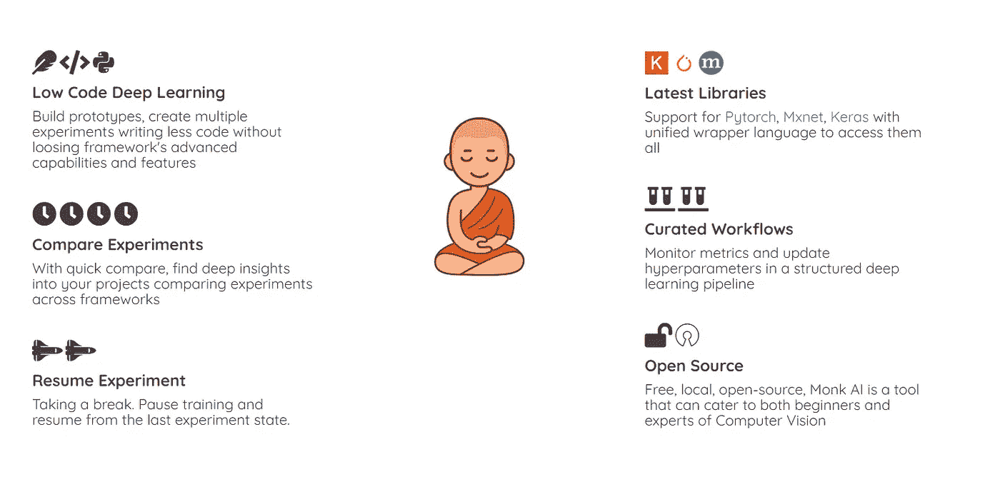
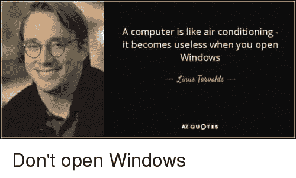
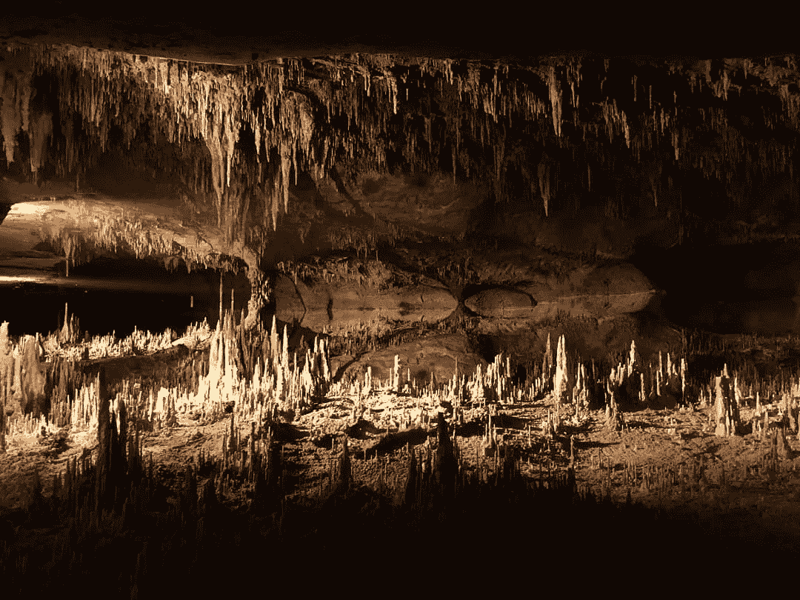

# 我是如何获得第一份数据科学实习的

> 原文：<https://pub.towardsai.net/how-monk-helped-me-in-getting-my-first-data-science-internship-e297d189b3a?source=collection_archive---------0----------------------->

参考:[https://monkai-42.firebaseapp.com/](https://monkai-42.firebaseapp.com/)

我只是个学习新手。本人 2019 从尼特那格浦尔毕业，6.4 CGPA。我没有找到校园实习的工作。

> *但是大问题！！*

**一个未被录用的人如何得到一个校外实习生？**

我加入了大规模开放在线课程(mooc)，完成 mooc 后，我开始申请实习。我有一种感觉，至少看到我的大学名字(NIT Nagpur)，我至少会得到一个面试的电话。两个月申请了 200 个实习生。我没有接到任何一家公司的电话。

我开始意识到像这样的项目

1.  推特情感分析
2.  虹膜数据集分类
3.  自行车共享需求
4.  住房贷款预测
5.  巨大的倒退

不会帮我找到实习机会。它们只是一个起点。与此同时，我对计算机视觉产生了兴趣。但是我不知道从哪里开始。

我找到了 [Monk_Object_Detection](https://github.com/Tessellate-Imaging/Monk_Object_Detection) ，Monk 是一个低代码深度学习工具，是计算机视觉的统一包装器。我开始尝试回购中提供的例子。例子非常简单，像我这样对物体检测有基本了解的人可以很容易地开始。

我喜欢和尚的特点:

📌它的框架独立，我们不需要学习像 Tensorflow，Pytorch，Mxnet 这样的多个框架。

📌它拥有最先进的(SOTA)型号，如 SSD、YoloV3、Faster-RCNN、Efficient-Det、RFBNet、CornerNet-Lite。

我开始对自己有了信心。我又开始申请实习，现在只和计算机视觉有关。我接到了 Flutura 的第一个电话。我在第一次面试中就被选中了。

> ***去哪里申请实习？***

1.  Internshala
2.  商务化人际关系网
3.  雇佣者
4.  天使列表

> ***如何准备面试？***

1.熟悉 Linux。

2.除了深度学习，你还应该熟悉 Rest Apis 的制作。

我想这将让你对如何应对数据科学实习生面试有所了解。记住，这是一条艰难的道路。

> *计算机视觉爱好者进行物体检测的一些有用链接:*

1.  [和尚](https://github.com/Tessellate-Imaging/Monk_Object_Detection)
2.  [VGG16](https://towardsdatascience.com/step-by-step-vgg16-implementation-in-keras-for-beginners-a833c686ae6c)
3.  [ResNet](https://medium.com/@14prakash/understanding-and-implementing-architectures-of-resnet-and-resnext-for-state-of-the-art-image-cf51669e1624)
4.  [YOLO](https://towardsdatascience.com/step-by-step-vgg16-implementation-in-keras-for-beginners-a833c686ae6c)
5.  [固态硬盘](https://medium.com/@jonathan_hui/ssd-object-detection-single-shot-multibox-detector-for-real-time-processing-9bd8deac0e06)
6.  [利用深度学习进行物体检测的论文列表](https://github.com/hoya012/deep_learning_object_detection)
7.  [物体检测系列](https://medium.com/@jonathan_hui/object-detection-series-24d03a12f904)

感谢[阿布舍克](https://www.linkedin.com/in/abhishek-kumar-annamraju/)和[阿卡什](https://www.linkedin.com/in/akashdeepsingh01/)。

照片由 [Srilekha](https://www.instagram.com/_fernwehd_._/?hl=en) 拍摄