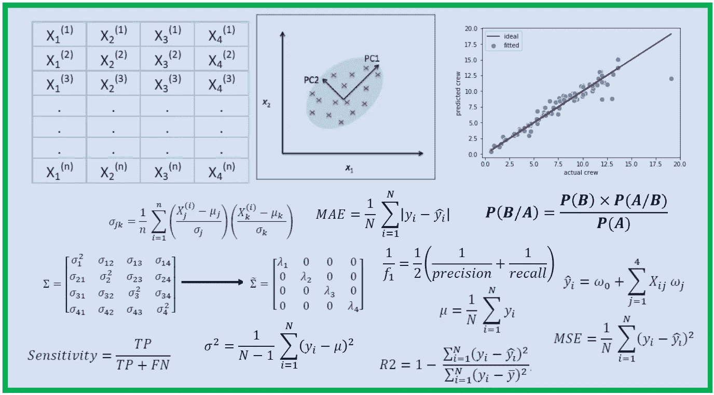

# 数据科学需要多少数学？

> 原文：<https://pub.towardsai.net/how-much-math-do-i-need-in-data-science-d05d83f8cb19?source=collection_archive---------0----------------------->

Benjamin O. Tayo 的图片

## [数据科学](https://towardsai.net/p/category/data-science)，[数学](https://towardsai.net/p/category/mathematics)

## 数学技能在数据科学和机器学习中至关重要

# 一.导言

如果您是数据科学的追求者，您无疑会有以下问题:

***很少或没有数学背景的我能成为一名数据科学家吗？***

***数据科学中哪些必备的数学技能很重要？***

有许多优秀的软件包可用于构建预测模型或生成数据可视化。一些最常见的描述性和预测性分析包包括:

*   Ggplot2
*   Matplotlib
*   海生的
*   sci kit-学习
*   脱字号
*   张量流
*   PyTorch
*   克拉斯

多亏了这些软件包，任何人都可以构建模型或制作数据可视化。但是，非常扎实的数学背景知识对于微调您的模型以产生具有最佳性能的可靠模型是必不可少的。构建模型是一回事，解释模型并得出可用于数据驱动决策的有意义的结论是另一回事。重要的是，在使用这些软件包之前，您必须了解每个软件包的数学基础，这样您就不会将这些软件包简单地用作黑盒工具。

# **二。案例研究:构建多元回归模型**

让我们假设我们将要建立一个多元回归模型。在此之前，我们需要问自己以下问题:

*我的数据集有多大？*

*我的特征变量和目标变量是什么？*

*什么预测因子特征与目标变量最相关？*

什么特征是重要的？

我应该缩放我的特征吗？

如何将我的数据集划分为训练集和测试集？

*什么是主成分分析(PCA)？*

我应该使用 PCA 来删除多余的特征吗？

如何评估我的模型？我应该用 R2 分数，MSE，还是 MAE？

*如何提高模型的预测能力？*

我应该使用正则化回归模型吗？

*什么是回归系数？*

*什么是拦截？*

*应该使用 KNeighbors 回归或支持向量回归等非参数回归模型吗？*

*我的模型中有哪些超参数，如何对它们进行微调以获得具有最佳性能的模型？*

没有扎实的数学背景，你就无法解决上面提出的问题。底线是，在数据科学和机器学习中，数学技能和编程技能一样重要。因此，作为一名数据科学的有志之士，投入时间学习数据科学和机器学习的理论和数学基础是至关重要的。你建立可应用于现实世界问题的可靠而有效的模型的能力取决于你的数学技能有多好。要了解数学技能如何应用于构建机器学习回归模型，请参见本文:[机器学习过程教程。](https://medium.com/swlh/machine-learning-process-tutorial-222327f53efb)

现在让我们来讨论数据科学和机器学习中需要的一些基本数学技能。

# 三。数据科学和机器学习的基本数学技能

## 1.统计和概率

统计和概率用于特征的可视化、数据预处理、特征转换、数据插补、降维、特征工程、模型评估等。

下面是你需要熟悉的题目: ***、均值、中位数、众数、标准差/方差、相关系数和协方差矩阵、概率分布(二项式、泊松、正态)、p 值、贝叶斯定理(精度、召回率、阳性预测值、阴性预测值、混淆矩阵、ROC 曲线)、中心极限定理、R2 得分、均方误差(MSE)、A/B 检验、蒙特卡罗模拟***

## 2.多元微积分

大多数机器学习模型是用具有几个特征或预测器的数据集构建的。因此，熟悉多变量微积分对于建立机器学习模型极其重要。

下面是你需要熟悉的题目: ***几个变量的函数；导数和梯度；阶跃函数、Sigmoid 函数、Logit 函数、ReLU(整流线性单位)函数；成本函数；功能绘图；函数的最小值和最大值***

## 3.线性代数

线性代数是机器学习中最重要的数学技能。数据集被表示为矩阵。线性代数用于数据预处理、数据转换、降维以及模型评估。

下面是你需要熟悉的话题: ***向量；向量的范数；矩阵；矩阵转置；矩阵的逆矩阵；矩阵的行列式；矩阵的迹；点积；特征值；特征向量***

## 4.优化方法

大多数机器学习算法通过最小化目标函数来执行预测建模，从而学习为了获得预测标签而必须应用于测试数据的权重。

下面是你需要熟悉的题目: ***代价函数/目标函数；似然函数；误差函数；梯度下降算法及其变种(如随机梯度下降算法)***

# 四。总结和结论

总之，我们已经讨论了数据科学和机器学习中需要的基本数学和理论技能。有几个免费的在线课程将教你在数据科学和机器学习中需要的必要的数学技能。作为数据科学的追求者，记住数据科学的理论基础对于构建高效可靠的模型至关重要，这一点很重要。因此，你应该投入足够的时间来研究每种机器学习算法背后的数学理论。

# 动词 （verb 的缩写）参考

[绝对初学者的线性回归基础。](https://medium.com/towards-artificial-intelligence/linear-regression-basics-for-absolute-beginners-68ed9ff980ae)

[用 R 代码实现的主成分分析的数学。](https://medium.com/towards-artificial-intelligence/mathematics-of-principal-component-analysis-with-r-code-implementation-595a340908fa)

[机器学习流程教程。](https://medium.com/swlh/machine-learning-process-tutorial-222327f53efb)