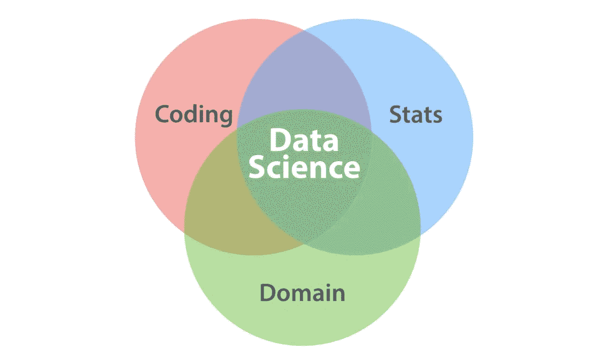

# 我的本科生团队如何赢得研究生和博士生的数据科学竞赛

> 原文：<https://pub.towardsai.net/how-my-team-of-undergrads-won-a-data-science-competition-for-graduate-and-ph-d-students-eb17f34a78dc?source=collection_archive---------0----------------------->

## [数据科学](https://towardsai.net/p/category/data-science)，[教育](https://towardsai.net/p/category/education)

我认为有一些数据科学成功的秘密是我在参加德克萨斯 A&M 数据科学研究所竞赛时发现的。我将概述我的经历，并解释这些成功的关键是如何帮助我的本科生团队击败几个硕士和博士生团队的。

# 竞争结构

团队分发了来自[洛杉机自行车分享会](https://bikeshare.metro.net/about/data/)的数据。它详细描述了洛杉矶自行车站之间的所有行程，给出了它们的地理位置(开始和停止)，日期和时间，以及用户的支付计划(每年用户/每月用户/仅一次行程)。我们被要求在比赛开始后一个月提交一份 20 页的报告。将从提交的报告中选出七组提交给学术和行业评委，由他们选出获胜者。

## 挑战陈述

“核心问题是，从 2016 年地铁自行车共享计划开始到今天，洛杉矶自行车通勤发生了什么变化？特别是，参赛者被要求考虑典型一天的收入和出行是如何随着地点和时间而变化的。这三个地区的机票和护照数量都在增加吗？单程通勤者的里程增加了吗，是如何增加的？出行次数在增加吗？团队项目将根据他们的分析元素进行评估，包括使用的方法、深度和正确性，以及创造力和演示技巧。”

## 我的团队

*   约西亚·柯德(计算机科学/数学)
*   Chinmay Phulse(计算机科学)
*   Sheelabhadra De y(计算机科学)
*   me (统计学/经济学)

# 其他团队交付了什么

这些陈述在其他团队中很常见:

*   他们给了一份报告，而且只是一份报告。
*   该报告的主要焦点是基于过去自行车使用情况的自行车使用预测模型。
*   他们没有使用外部数据。
*   在他们的发言中，他们主要谈到了数据清理、模型的选择和超参数的优化。

# 我的团队交付了什么

我们交了一个 pdf(因为我们被要求)，但是那个 pdf 链接到一个交互式的网络应用程序，它给出了关于我们开发的所有模型的信息和可视化。我们的报告关注四件事:

1.  自行车使用量预测模型。与其他团体不同，我们的团体认识到洛杉矶自行车共享是新的，并将增加许多站点。如果站点数量突然增加，这将极大地影响使用率，并阻止过去的数据预测未来的增长。当其他组只使用自回归模型时，我们的模型考虑了将来开放的站点数量。
2.  我们模拟了一天结束时到达每个停靠站的自行车数量。在此基础上，我们讨论了如何改变支付结构，以激励用户从高密度站点骑自行车到低密度站点。
3.  我们浏览了 LA Bike Share 的网站，寻找关于在哪里建立新站点的有用建议。由此，我们创建了一个建议密度图和用户所写内容的文字云。这揭示了受欢迎的地点和地点类型。
4.  我们创造了一种算法，可以根据新站的位置来预测它的成功。这是建立在社会经济数据、附近车站的成功、步行性和到洛杉矶地铁的距离的基础上的。

我认为数据科学家经常忘记数据科学的要点——从数据中创造价值——相反，他们过于关注过程。我们不仅提供了许多模型，还讨论了这些模型如何影响基础业务，以及由于这些模型可以/应该采取哪些措施。这是雇佣数据科学家的人真正想听到的。

你可能见过下面的维恩图的一些版本。我绝不是说我是一只拥有不可思议能力的独角兽，但我确实认为，作为一个整体，我们的团队处于所有三个领域的交汇点？由于专注于机器学习而缺乏用例，许多团队发现自己处于编码-统计的交叉点。据我所知，其他团队拥有比我们更复杂的模型，但当它提出用例并交付在实践中可行的结果时，我们大放异彩。我假设有许多小组很好地适应了编码领域和统计领域的交叉，但是他们很可能在不了解其他领域中使用的工具的情况下努力将一份报告放在一起。当您从事数据科学工作时，请确保您在这些圈子中都有一个组成部分，以最大限度地提高您的工作的影响力和采用率。

[数据科学维恩图](http://drewconway.com/zia/2013/3/26/the-data-science-venn-diagram)

最后，我要说我们的项目看起来更有趣。不管一个人是小学还是博士，当一个人面前有一个互动地图时，他们就玩这个地图。不是每个人都能理解你的模型背后的数学原理。即使他们理解，(并关心)他们通常没有时间去真正挖掘模型的“为什么”。每个人都认为，确实关心业务用例。制作一个引人注目的交互式可视化可以让人们接受你的数据科学工作。我已经说过很多次了:“在数据科学中，人们有时不是根据你工作的复杂程度来评判你，而是根据你向*介绍的人对*的理解程度来评判你。”