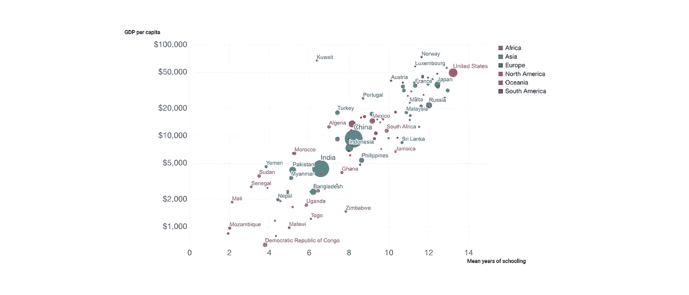
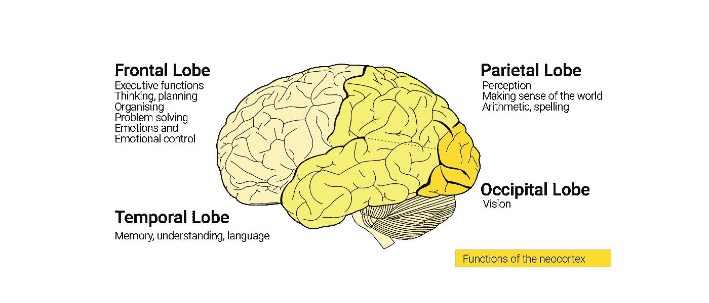
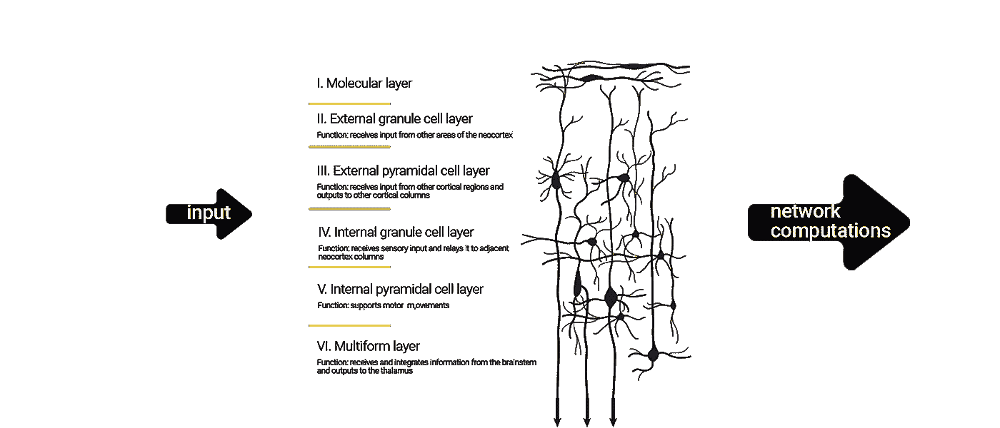
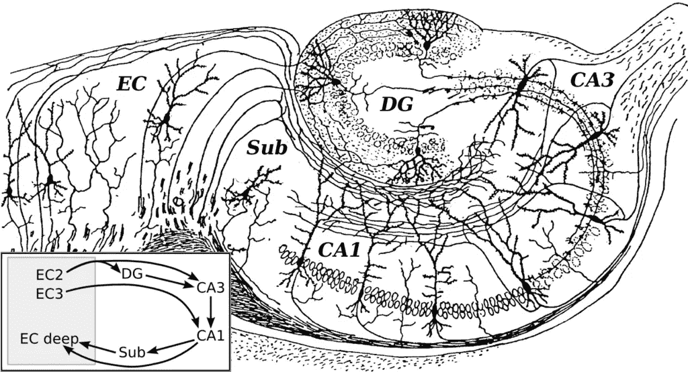
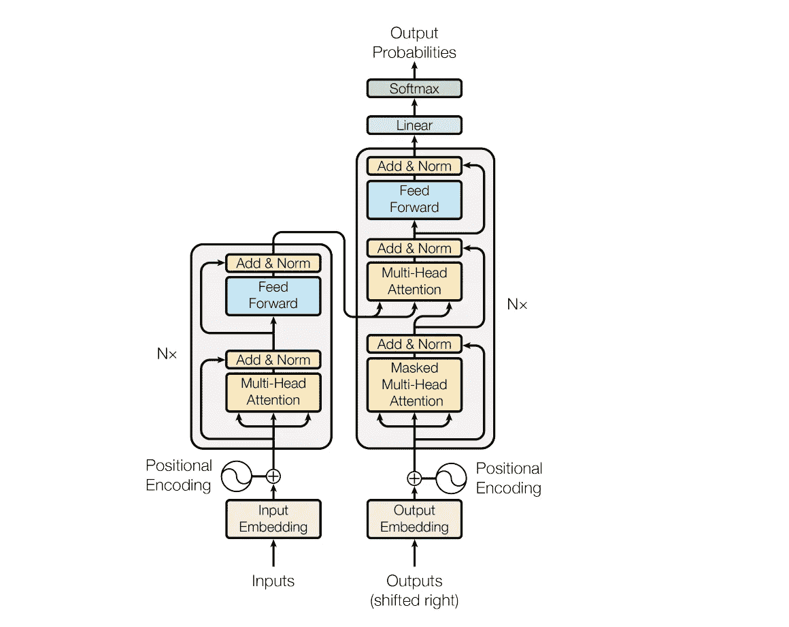

# 神经科学如何启发人工智能

> 原文：<https://pub.towardsai.net/how-neuroscience-inspires-ai-bb445685047a?source=collection_archive---------1----------------------->

## [人工智能](https://towardsai.net/p/category/artificial-intelligence)，[神经科学](https://towardsai.net/p/category/neuroscience)

## 我们能在不窥视人类智能以获取灵感的情况下发明人工智能吗？

智力是成功和繁荣的决定性因素。孩子们上学很少是出于强烈的愿望，而是因为他们的父母知道教育是通向未来的通行证。经济[产出](https://ourworldindata.org/grapher/correlation-between-mean-years-of-schooling-and-gdp-per-capita)说明了一切:我们在学校花多少时间和人均国内生产总值之间有很强的相关性。通过教育，我们收获了一个更具创新和生产力的社会。

2010 年平均受教育年限与人均国内生产总值的相关性。来源:[数据中的我们的世界](https://ourworldindata.org/grapher/correlation-between-mean-years-of-schooling-and-gdp-per-capita)

每个人都继承了一些智力。但是如果没有投资策略，智慧就不会带来红利。从沃伦·巴菲特到雷伊·达里奥，金融大师们会告诉你投资的秘诀是多样化。作为一种文明，我们牢记这条建议，并将其提升到一个全新的高度:我们通过发明能够辅助、增强或自动化的人工智能来实现多样化。

## 一个起点

我们能在不窥视人类智能以获取灵感的情况下发明人工智能吗？人工智能科学家将人类大脑作为初始蓝图，并不是因为缺乏尝试。大脑是一个惊人的装置，能够进行计算、预测、存储等等。正如老话所说，模仿是最真诚的奉承。

大脑是复杂的机器。复杂的神经元网络增强了我们驾驭动态环境和记忆信息的能力。神经元网络就像一群喋喋不休的人群——它们不断通过电信号“发射”新闻和指令。如果你想下载神经元更新，你会如何询问聊天？新手可以尝试在大脑中插入一根电线来捕捉单个神经元的电信号。但是单个神经元的孤立电读数就相当于感觉到了低音，并认为你正在体验一首完整的歌曲。将大脑作为神经元的集合体来研究不会解决智力的问题，因为从整体来看，神经元不再是独立的实体。

最近在研究大脑的计算技术上的突破使我们能够更全面地观察大脑中的神经连接。这种大脑回路的虚拟映射帮助我们想象设计一般智能需要什么。我们已经可以指出掌握人工智能未来关键的两个大脑区域:新大脑皮层和海马体。

## 新大脑皮层:预测、推理和行为

与数字计算机类似，大脑使用神经元交换的电信号来处理信息。神经计算的速度比眨眼还快(这是双关语)，因此我们可以在快速变化的世界中快速做出反应。这些逻辑计算发生在大脑的外层——大脑皮层。大脑皮层是我们有意识的思想和行动的家园。在人脑中，新皮层是大脑皮层的最大部分，其余部分由同种异体皮层构成。大脑皮层执行主要功能，如接收听觉、视觉和身体感觉的输入。

大脑皮层是一个多功能的计算装置。新大脑皮层的不同部分专门负责特定的认知功能。尽管新皮层区域有明显的专业化，但它们都是相互联系的，并且高度依赖于彼此。

作为认知的中心，大脑皮层由六层组成，各层神经元专门处理不同类型的信息。大脑皮层中的神经元将编码为信号的信息作为输入。这些输入信号激活了整个神经元网络。一旦神经元网络处理了输入，它就返回原始输入的转换版本，该版本可以被相邻的神经元网络识别和使用。网络计算的输出可以包含激活信号、抑制信号，或者仅仅是为由不同的神经元网络处理而编码的信息。

大脑皮层的层次及其各自的功能

## 海马:记忆中枢

大脑处理数据，但它也在我们学习和与周围世界互动时积累信息。记忆让我们的大脑构建一个世界模型，这影响了快速的毫秒级处理。记忆可以持续很长时间，因为神经元处理信息的速度可以快至几毫秒，慢至数年。

海马体通过将信息从短期记忆整合到长期记忆来帮助新记忆的形成。它是空间记忆的基础，使导航成为可能。作为万金油，海马体也支持与学习和情绪相关的计算。海马包含两个主要的互锁部分:T2 海马体(CA1-4 区)和 T4 齿状回。请继续阅读，一窥这些区域在更大的计算机器中扮演的关键角色。

海马体的基本回路，由著名的 19 世纪西班牙神经科学家圣地亚哥·拉蒙 y [圣地亚哥·拉蒙 y 卡哈尔](https://en.wikipedia.org/wiki/Santiago_Ram%C3%B3n_y_Cajal)绘制。DG: [齿状回](https://en.wikipedia.org/wiki/Dentate_gyrus)。Sub: [下托](https://en.wikipedia.org/wiki/Subiculum)。欧共体:[内嗅皮层](https://en.wikipedia.org/wiki/Entorhinal_cortex)

## 神经元:名人堂

科学家无法精确计算大脑中神经元的数量——想象一下试图计算圣诞树上闪烁的灯的数量。基于用于估计银河系恒星数量的技术，我们估计人类大脑由惊人的 860 亿个神经元组成。大量的神经元挤在相对较小的表面上。现在，还记得你大脑上的“皱纹”吗？有许多折叠增加了大脑的表面积，同时保持体积相对一致。大脑褶皱允许更多的神经元进入同一个空间。

神经元分为多种类型，大约 1000 个大脑区域中的每一个区域都聚集着十几个或更多的神经元。在[神经元名人堂](https://neuroelectro.org/neuron/clustering/)中，有几个神经元(细胞)拥有超级巨星的地位:

*   Martinotti 细胞位于新大脑皮层中，在那里它们充当安全装置。随着神经元之间不断的大脑对话，你可能想知道大脑是如何避免陷入混乱状态的。马蒂诺蒂细胞是答案的一部分。当 Martinotti 细胞接收到高于特定电频率的信号时，它会通过发回抑制信号来回应，从而调节周围细胞的活动。我喜欢把 Martinotti cells 想象成向大脑传授最新呼吸技巧的瑜伽教练。
*   **新大脑皮层锥体细胞层 5–6**是新大脑皮层中研究最广泛的神经元之一，也是兴奋性神经元信息处理的基准。这种神经元类型是[的热门话题](https://www.ncbi.nlm.nih.gov/pmc/articles/PMC4481152/)，因为它在认知中扮演着关键角色。具体来说，它整合了新皮层所有神经元层的输入，是将信息传递到皮层以下大脑区域的主要看门人。
*   **CA1 锥体细胞**位于海马体中，在信息的[并行处理](https://www.nature.com/articles/s41593-018-0118-0)、自传记忆、精神时间旅行和[自主意识](https://www.pnas.org/content/108/42/17562)中起着关键作用。我将专注于 CA1 细胞发挥的最后一个功能，因为它驱动着人类大脑的一个迷人特性。自主意识是一种在精神上将自己置身于过去、未来或假设情境中，并在这种抽象环境中审视自己思想的能力。没有自主意识，我们就不能进行抽象推理。
*   **CA3 锥体细胞**是海马体的一部分，负责记忆的编码、储存和检索。CA3 神经元实现了具有过量存储空间的最佳填充系统。
*   **齿状回颗粒细胞**是海马的基础细胞。他们[使用分类和模式识别技术预处理](https://www.frontiersin.org/research-topics/737/structure-function-and-plasticity-of-hippocampal-dentate-gyrus-microcircuits)输入的信息。齿状回区分新旧记忆，并为 CA3 海马区的有效存储准备内容。

## 人工智能 vs 生物学

在他们对人工智能的探索中，研究人员从构建活体大脑中发现的神经网络的极简再现开始。这些*人工*神经网络(ann)在 20 世纪 40 年代成为学术头条，但起步缓慢，主要是由于计算能力的限制。然而，人工神经网络在 2010 年代出现了复兴，当时图形处理单元(GPU)与中央处理单元(CPU)一起加速了通用科学计算。GPU 制造了实用的新人工神经网络学习技术，如深度学习。

GTP-3 是深度学习应用于语言理解的一个令人兴奋的例子。不像以前的语言理解模型只关注于*从语言中识别*信息，GTP-3 也可以*生成*信息。本质上是一个人工智能神童，GTP-3 在新闻中引起了激烈的争议，因为它可以生成读起来很好的文本，你会认为是人类写的。

启发了 GTP-3 的深度学习系统的样本架构。来源:[谷歌 AI](https://arxiv.org/pdf/1706.03762.pdf)

根据像 GTP-3 这样的人工神经网络的架构来判断，你会认为科学家正在朝着正确的方向迈出正确的步伐。GTP-3 信息电路看起来错综复杂，有不同的输入门和多种数据转换协议。然而，与大脑的复杂程度相比，GTP-3 信息回路的复杂性就相形见绌了。

现在是人工智能科学家和工程师采取综合方法进行实践的时候了。脑科学家也好，AI 科学家也好，目标都是一样的:多元智能。