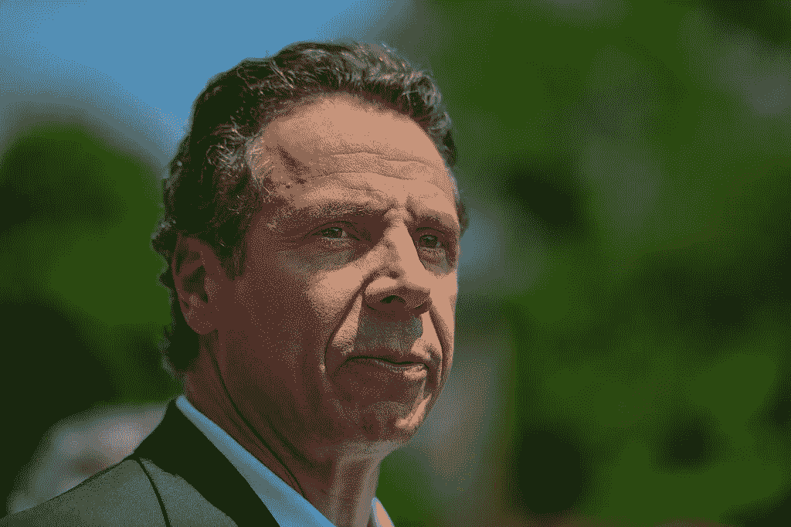

# 纽约人如何免费获得 4000 门 Coursera 课程

> 原文：<https://pub.towardsai.net/how-new-yorkers-can-get-4-000-coursera-courses-for-free-3b36c057aea8?source=collection_archive---------3----------------------->

## [教育](https://towardsai.net/p/category/education)，[新闻](https://towardsai.net/p/category/news)，[舆论](https://towardsai.net/p/category/opinion)

## 以及为什么值得。

[戴安娜 _ 罗宾逊](https://www.flickr.com/photos/62501682@N00)的《安德鲁·科莫州长》在 [CC BY-NC-ND 2.0](https://creativecommons.org/licenses/by-nc-nd/2.0/?ref=ccsearch&atype=rich) 下获得许可

[**350 万**](https://www.labor.ny.gov/stats/nyc/) 截至 2020 年 10 月纽约人失业，工作年龄人口中勉强有一半就业。

这些工作中的许多，尤其是在零售业，**不会再回来了，而高工资的工作岗位却在 [**一路下滑**](https://www.axios.com/the-high-wage-jobs-arent-coming-back-4293356c-849c-4870-ad3a-3e49755bfdc1.html) 。随着就业市场比历史上几乎任何时候都更加艰难，求职者需要提高技能才有机会。**

**在一家 AutoML 创业公司工作， [**很明显。我对提供的各种人工智能和分析课程特别感兴趣，但几乎每个领域都有机会。**](http://obviously.ai)**

# **纽约劳工部和 Coursera 伙伴关系**

**纽约州州长安德鲁·科莫(Andrew Cuomo)最近宣布了一个新的在线培训平台，让失业和未充分就业的纽约人免费学习新技能。通过 Coursera 的合作，提供了近 4000 个在线项目。**

> **“对新冠肺炎的战争正在多条战线上展开，尽管我们正在尽一切努力保护纽约人的健康，但我们也必须采取必要措施重建强大的经济”——州长科莫**

**就业不足简单来说就是你在一份大材小用的工作中工作。预计这种合作关系将为纽约人节省数百万美元。失业和未充分就业的纽约人可以在这里申请**。****

# ****Coursera 劳动力恢复计划****

****这种伙伴关系是 Coursera 劳动力恢复计划中的众多伙伴关系之一，该计划已帮助 70 个国家的 330 多个政府机构为员工提供相关的工作技能培训。****

****自启动以来，已有 100 多万名员工注册了 700 多万门课程。这一举措是模仿一个成功的项目，该项目于 3 月份启动，为近 4000 所关闭校园的大学提供免费课程。****

# ****为什么值得****

****围绕在线证书是否值得，存在着巨大的争论。事实上，一些雇主和大学并不太在乎一张证书——但他们在乎你将学到的基本技能。****

****此外， [**雇主调查**](https://www.statista.com/statistics/1126694/us-certification-it-importance/) 显示，几乎所有的雇主都至少在某种程度上重视 IT 认证。****

****此外，许多人会说，无论如何，你可以在 YouTube 或维基百科上学习几乎任何 Coursera 技能，这在一定程度上是正确的，但几乎没有组织或结构来让你跟踪这些替代品。****

****Coursera 是从常春藤大学到 IBM 和谷歌等科技巨头学习技能的绝佳途径。****

# ****证书不是一切****

****也就是说，证书并不是一切——它们不能提供任何就业保证，也不足以让你的申请脱颖而出。****

## ****建立投资组合****

****你能做的就是运用你所学的技能，围绕这些技能建立一个文件夹，让你的个人资料脱颖而出。投资组合是证明你价值的任何东西。****

****例如，如果你在找营销工作，你可以在媒体和其他出版物上写文章。如果你正在寻找编程工作，你可以建立你的 GitHub 档案。如果你正在寻找网站开发工作，你可能会建立自己的 WebFlow 和 Dribbble 配置文件。****

****作为一名营销人员，我的投资组合很简单。大部分都在我的 LinkedIn 简历里:****

*   ****200+发表文章从福布斯到雅虎到黑客正午****
*   ****仅在 LinkedIn 上就有超过 500 万的浏览量，包括有 12，000 条评论的帖子****
*   ****22 次演讲活动，包括财富 50 强主题演讲****
*   ****媒体上人工智能领域的顶级作家，16000 名追随者****
*   ****被提名为年度黑客正午贡献者****
*   ****浏览量超过 30 万的数据科学文章****
*   ****KDnuggets 上转发次数最多、最受欢迎和观看次数最多的内容****

****与此同时，我在个人资料中展示了许多证书、推荐信和技能，同时积极参与我的社交网络。****

# ****摘要****

****简而言之，这是一个千载难逢的机会，数以百万计的纽约人应该好好利用，记住光有证书是不能让你找到工作的。****