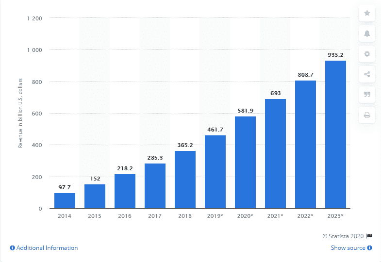
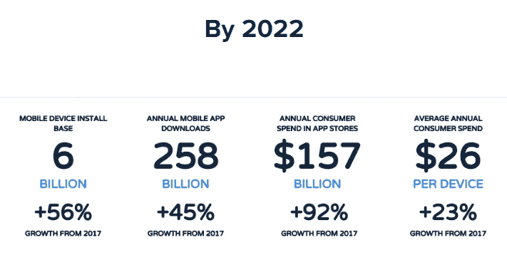
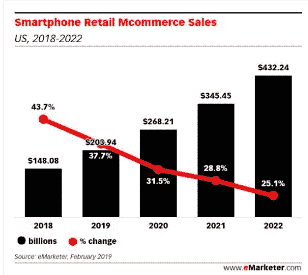
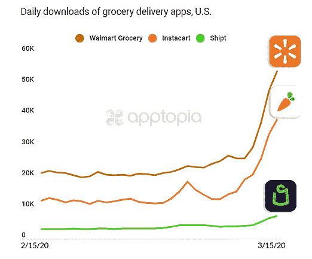
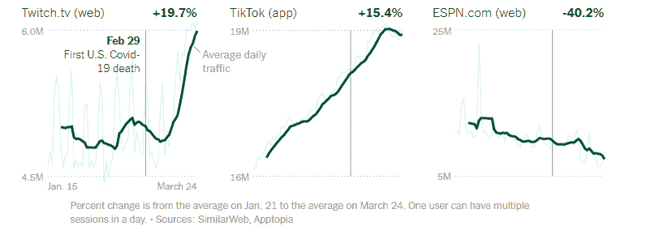
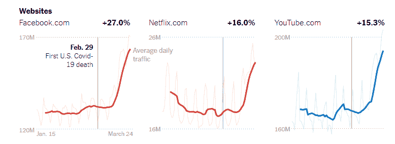
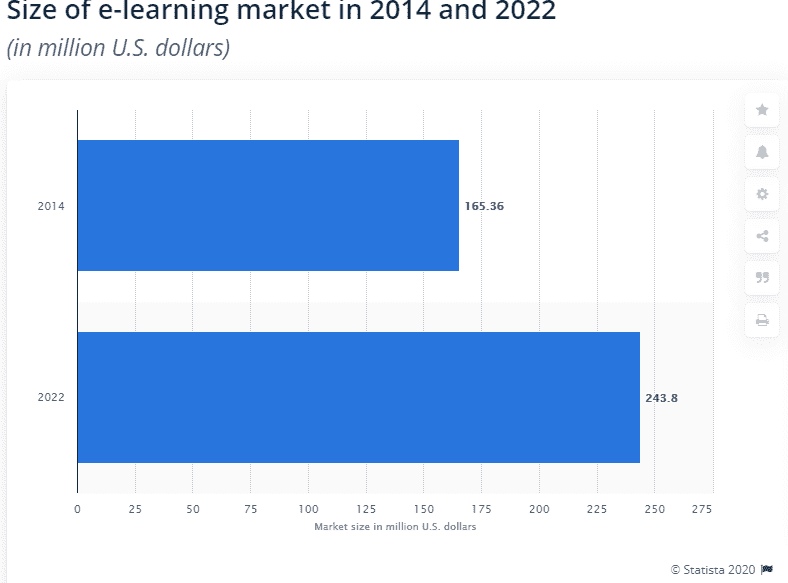
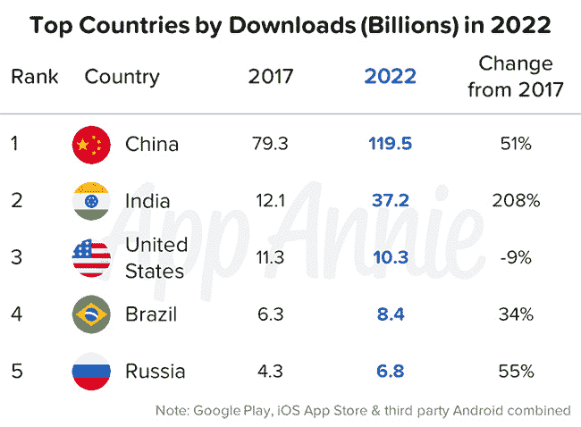
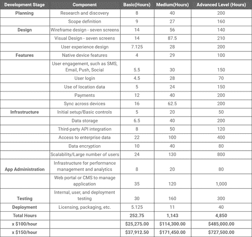

# 按需移动应用程序开发在新冠肺炎是如何发展的

> 原文：<https://pub.towardsai.net/how-on-demand-mobile-app-development-is-growing-during-covid-19-aa5e084678c2?source=collection_archive---------2----------------------->

无论你生活在世界的哪个角落，冠状病毒的爆发正在不可思议地影响着每个人的生活，并将经济推向毁灭。一方面，封锁迫使人们呆在家里，关闭他们的企业，另一方面，移动应用程序开发行业正以最快的速度增长。

***让我们浏览一下统计数据和事实，以便更好地了解冠状病毒期间移动应用行业的地位:***

*   来自 [Statista](https://www.statista.com/statistics/269025/worldwide-mobile-app-revenue-forecast/) 的预测显示，移动应用程序预计将产生约 9350 亿美元的收入，是 2019 年 4610 亿美元的两倍

图片来源:[https://www . statista . com/statistics/269025/world wide-mobile-app-revenue-forecast/](https://www.statista.com/statistics/269025/worldwide-mobile-app-revenue-forecast/)

*   到 2022 年，预计全球消费者在应用上的支出将增长 92%，达到 1570 亿美元。

图片来源:[https://www . app Annie . com/en/insights/market-data/app-Annie-2017-2022-forecast/](https://www.appannie.com/en/insights/market-data/app-annie-2017-2022-forecast/)

*   根据 eMarket 的预测，到 2020 年，移动应用在美国整体在线销售中的份额将达到近 50%，预计到 2022 年移动应用下载量将达到 2580 亿次，比 2017 年高出 45%。

图片来源:[https://www . emarketer . com/chart/191783/us-retail-ecommerce-sales-2014-2020-billions-change-of-total-retail-sales](https://www.emarketer.com/chart/191783/us-retail-ecommerce-sales-2014-2020-billions-change-of-total-retail-sales)

**简而言之:**根据上面的数字，有一点是明确的，移动应用行业正在增长，没有任何下降的迹象。你们中的许多人在阅读这些统计数据时一定会惊讶地发现这是怎么可能的，尤其是在这个流感季节，企业正努力在萎缩的市场中生存。

> 让我们从一开始就深入了解…

> **内容亮点**

*   ***什么是点播 App 行业，他们是如何运作的？***
*   ***冠状病毒期间移动应用开发行业需求增加背后的原因。***
*   ***冠状病毒*** 期间流行的点播类应用
*   ***按需杂货配送应用***
*   ***按需医疗服务应用***
*   ***按需社交媒体应用***
*   ***点播教育应用***
*   ***费用开发点播应用***
*   ***结论***

> 深入每个点…

## 1.按需产业到底是什么，它们是如何运作的？

毫无疑问，按需应用程序正在像火一样在市场上蔓延，因为它们在创建消费者和企业之间的层中发挥着重要作用，只需创建一个明确推广您的企业产品和服务的应用程序。换句话说，通过提供对他们正在寻找的产品和服务的简单访问，随需应变行业立即满足了客户的需求。由于按需应用程序是专门针对特定服务开发的，因此它增加了客户的便利性、速度和简单访问。

[**点播应用行业**](https://www.xicom.biz/offerings/mobile-app-development/) 正在与三个至关重要的部分合作，包括供应商、科技公司和消费者。IT 公司充当了企业和客户之间桥梁的中间人。IT 公司在构建应用程序时会考虑供应商的具体要求，同时牢记目标受众的需求。通过部署最适合的技术，他们开发了一个平台，消费者可以轻松访问企业提供的服务。

## 2.冠状病毒期间移动应用程序开发行业需求增加的原因。

今天，全世界有数十亿人因冠状病毒而处于封锁状态，并严格遵守政府关于社交距离的指导方针。但整个情况给许多人带来了挑战，甚至是管理他们的基本商品，包括杂货、食品、药品等等。

在这种情况下，留给人们的唯一选择是使用按需应用程序来满足他们的基本需求，并推动企业进入按需行业，以创建一个强大的在线业务存在。在世界范围内，基本的按需服务正在寻求不断增长的需求。

> 根据统计数据，这些是受冠状病毒疫情影响的几个主要领域。

# 冠状病毒期间，按需移动应用程序开发解决方案的需求不断增加的原因:

## —无接触交付

根据资源，几乎 95%的美国家庭在隔离期间使用至少一个按需应用程序来管理他们的需求。

世界各地冠状病毒病例的迅速增加增加了人们对社交距离的恐惧，并避免与供应商直接接触。在这种情况下，企业正在迅速采用按需服务，以防止送货专业人员和用户之间的接触，并打破传播链。

## —为一个应用程序提供多种选择

当谈到购买任何东西时，消费者总是会寻找各种各样的选择，无论他们是在线下还是在线上购买。一家著名的 [**软件开发公司**](https://www.xicom.biz/) 可以开发一个按需应用程序，该程序具有所有基本功能，允许用户仅通过访问产品和服务的多个选项来做出购买决定。

## —提供快速便捷的购物体验

没有任何线索表明这种疫情冠状病毒会在这个世界上持续多久，这就是消费者涌向商店、抢购积压商品的原因。虽然大多数商店都缺货并关闭，但按需应用程序可以完美地配合适当的计划来管理再订购，并为用户提供快速而轻松的购物体验。

为了确保商品和服务的正常流动，按需应用程序正在与数千名专业配送人员合作，以防止购买恐慌，并确保在家就能方便购物。

## 传播卫生意识

随着冠状病毒的出现，从购买必需品到保持卫生，人们到处都在恐慌。但事实是，他们对这种病毒知之甚少。在这种情况下，指导或教育你的客户应该采取什么必要的步骤来处理这种情况，以及如何保护你的社区的福利，可以是一个伟大的倡议。

应用程序开发人员帮助企业定制按需应用程序，提供这种创造认知和让消费者感到安全的独有功能。

## —提高客户满意度

用户害怕走在街上或市场上，但按需应用程序使人们摆脱了这种恐惧，并通过应用程序购买他们选择的产品。即时或 24 小时送货服务进一步提高了客户满意度，给他们留下了愉快的购物体验。

## —增加业务收入

在这个冠状病毒季节，按需应用显然是企业的福音。一方面， [**按需 app**](https://www.xicom.biz/offerings/mobile-app-development/)为消费者提供送货上门服务；另一方面，这些应用为企业主增加收入提供了很好的机会。

## 3.在冠状病毒疫情期间，什么类型的按需应用成为趋势？

冠状病毒对各种业务的影响表现不同。一方面，需要面对面与客户互动的企业可能正在失去市场，而那些可以通过送货上门提供服务的企业正面临需求激增。

你们中的许多人认为，当前疫情冠状病毒的爆发损害了企业。然而，即使在这种灰色的情况下，一些行业仅仅通过投资于按需应用程序就享受到了看不见的好处。

## a.按需杂货交付应用——沃尔玛杂货、Instacart 和 Shipt

按需应用对企业和客户来说并不是新概念，但根据应用商店情报公司 Apptopia 的说法，在线杂货应用，包括沃尔玛杂货，Instacart，Shipt，Instashop，正在创造每日下载的新纪录。对比 2 月至 3 月中旬的平均日下载量，这些品牌(Instacart、沃尔玛杂货和 Shipt)见证了[比其他日子高 218%、160%和 124%的日下载量](https://techcrunch.com/2020/03/16/grocery-delivery-apps-see-record-downloads-amid-coronavirus-outbreak/)。

图片来源:[https://blog . apptopia . com/insta cart-and-drugy-delivery-apps-set-continuous-days-of-record-downloads](https://blog.apptopia.com/instacart-and-grocery-delivery-apps-set-consecutive-days-of-record-downloads)

> 来自超市新闻的预测显示，在二月份，杂货应用的平均日下载量增长了 98%。

## b.)按需医疗保健应用——medi 24、Push Doctors、AmWell

Statista 的预测显示，全球医疗保健市场将从 2018 年的 217 亿美元达到 2020 年的 904.9 亿美元。但是，疫情冠状病毒将这个行业推向了一个新的高度，预计将产生超过 33.7%的收入。

图片来源:[https://blog . locus . sh/how-has-the-demand-industry-coped-the-coronavirus/](https://blog.locus.sh/how-has-the-on-demand-industry-coped-with-the-coronavirus/)

冠状病毒疫情迫使各国保持封锁，即使是基本服务。然而，对医生和药品的需求不能妥协，尤其是在这个流感季节。因此，在医院和诊所充满病毒病例的地方，按需医疗保健应用程序甚至对医疗用品也很方便。

[**Medi24:**](https://www.medi24.ch/en/) 一款基于瑞士的远程医疗应用于 1999 年推出，当时有一个由 90 名护士和 25 名医生组成的团队，每天接听 6000 个电话。但是，Allianze Partners 的[新闻稿称，在过去的一个月里，他们处理了 70，000 个电话，比前一年高出 34%。在 70，000 个电话中，他们接听了 30，000 个与冠状病毒有关的电话，并向患者建议自我治疗。](https://www.allianz.com/en/press/news/business/life_health/200406_Allianz-coronavirus-telehealth-services-doctors-on-call.html)

**推送医生:**一个总部位于曼彻斯特的在线医疗咨询应用程序观察到[上个月的咨询量上升了](https://www.whatech.com/mobile-apps/blog/647186-telemedicine-apps-the-best-way-to-reach-gps-during-this-coronavirus-flu-season)70%。

**嗯**:领先的电子远程医疗应用程序发现[下载量增长了](https://www.whatech.com/mobile-apps/blog/647186-telemedicine-apps-the-best-way-to-reach-gps-during-this-coronavirus-flu-season)400%。

## c.)点播社交媒体应用——网飞、脸书、Tiktok、YouTube

虽然冠状病毒已经将所有人锁在门后，没有工作，因此人们正在网飞，YouTube 等流媒体应用程序，Tiktok 等社交媒体视频应用程序上寻找娱乐，并通过脸书等社交媒体应用程序与他人联系。

**抖音:**这款视频制作应用拥有超过 5 亿用户，已经在青少年中流行开来，但是从 1 月 21 日到 3 月 24 日，它的使用百分比发生了巨大的变化。日均流量在两个月内从[1600 万变成了 1900 万](https://www.nytimes.com/interactive/2020/04/07/technology/coronavirus-internet-use.htm)。

图片来源:[https://www . nytimes . com/interactive/2020/04/07/technology/coronavirus-internet-use . html](https://www.nytimes.com/interactive/2020/04/07/technology/coronavirus-internet-use.html)

**脸书、网飞和 YouTube:** 冠状病毒疫情给流媒体行业带来了突然的增长。据报道，电视直播、点播流媒体和视频应用的收视率在 T2 增长了 8%到 22%。

图片来源:[https://www . nytimes . com/interactive/2020/04/07/technology/coronavirus-internet-use . html](https://www.nytimes.com/interactive/2020/04/07/technology/coronavirus-internet-use.html)

## d.点播教育应用——Byjus、ClassDojo、DragonBox

随着封锁的生效，在线直播教学已经成为教育行业的最新趋势之一。来自 Statista 的预测预测，2022 年，点播教育移动应用将赚得 2.438 亿美元。

图片来源:[https://www . statista . com/statistics/501104/world wide-elearning-market-size/](https://www.statista.com/statistics/501104/worldwide-elearning-market-size/)

**一言以蔽之:**考虑到上述数字和跟踪记录，很明显 [**雇佣移动应用开发者**](https://www.xicom.biz/offerings/hire-mobile-developers/) 是在下沉市场中生存下来的一个值得的决定。2021 年移动应用业务的增长为所有领域的企业创造了巨大的机会，因为它们在世界各地的需求都在增加。

图片来源:[https://www . app Annie . com/en/insights/market-data/app-Annie-2017-2022-forecast/](https://www.appannie.com/en/insights/market-data/app-annie-2017-2022-forecast/)

# 4.2021 年开发一个按需应用需要多少钱？

你确信在疫情冠状病毒期间 [**按需应用开发行业**](https://www.xicom.biz/offerings/mobile-app-development/) 的增长，并计划推出你的商务应用吗？但是不确定开发成本和时间，那么让我告诉你，你的问题没有直截了当的答案。

任何应用程序的开发成本取决于多种因素，包括应用程序的想法、应用程序的复杂性、开发技术的选择、特性和功能的集成、操作平台的选择等等。

> 根据 Clutch 的调查报告，应用程序开发的平均价格从 25，275 美元到 727，500 美元不等，根据应用程序及其功能的复杂程度，价格可能会更高。

## 以下是影响应用程序开发成本的两个因素:

> 注意:所有这些估计都基于 Clutch 的[调查报告，该报告已由 10 家领先公司进行了调查，以确定应用程序开发的平均成本。然而，利用 Android 应用程序开发服务的平均成本从每小时 18 美元到 30 美元不等。](https://clutch.co/app-developers/resources/cost-build-mobile-app-survey-2015)

# 结尾注释

在这篇博客的结尾，值得一提的是，抗击新冠肺炎不仅仅是一个卫生紧急事件，也让我们的经济处于警戒状态。一方面，小企业发现在全球各国目前的封锁下很难生存，另一方面， [**按需应用开发服务**](https://www.xicom.biz/offerings/mobile-app-development/) 的需求激增。

无论您在哪个领域工作，按需应用程序都可以为您提供接触消费者的方式，并通过牢记员工和客户的社区安全和卫生来提供送货上门服务。

因此，如果你仍然认为为你的企业开发一个按需应用程序对你来说是一项复杂的任务，那么现在是时候 [**聘请应用程序开发人员**](https://www.xicom.biz/offerings/hire-mobile-developers/) 来讨论你的项目细节，并实时获得一个完美的解决方案。