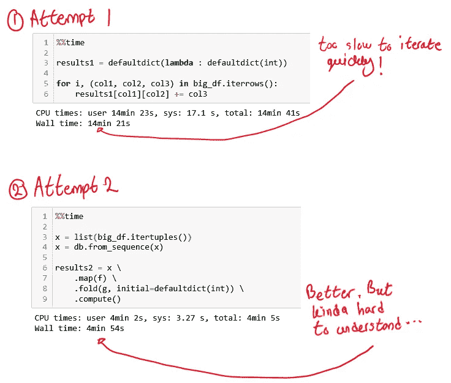
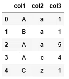
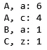
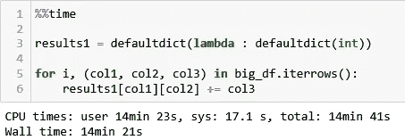
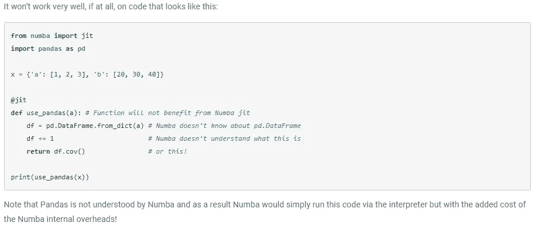
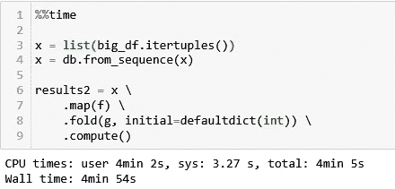
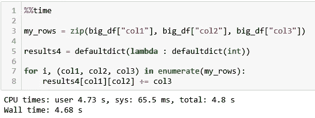
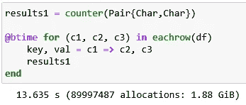
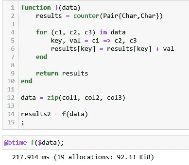

# Python 对于大规模数据科学项目的原型开发有多实用？

> 原文：<https://pub.towardsai.net/how-practical-is-python-for-prototyping-data-science-projects-at-scale-88d345fa849d?source=collection_archive---------0----------------------->

# 介绍

在本文中，我将分享我对使用 Python 进行计算密集型数据科学项目的实用性的想法。本文的主要读者是行业中的数据科学家，其次是依靠计算方法来回答研究问题的研究人员。

可以在这个[报告](https://github.com/hsm207/python_no_prototype)中找到重现本文中描述的结果的代码。

# 动机

> 因此，在学术环境中出现的大多数情况下，用普通 Python 开发、识别计算瓶颈并使用 Numba 消除它们是有意义的。

上面的引文来自[1]的摘要。对于上下文，作者认为尽管 Python 是一种缓慢的编程语言，但由于其表达能力和丰富的库，它是科学计算的理想选择。性能问题可以通过重写 Numba 中较慢的部分来解决，这通常只需要应用一些函数装饰器。

这句话让我思考:这个建议在工业界会有多好？

我将尝试通过解决一个问题来回答这个问题。这个问题故意保持简单，以免分散我们对本文要点的注意力。

# 问题陈述

我们将使用在我之前的文章[2]中提出的相同问题，所以我将在这里做一个简单的回顾:

给定如下所示的数据帧:

图 1:样本数据帧

我们希望迭代数据框的每一行，以生成如下所示的字典:

图 2:示例输出

# Python 解决方案

## 天真的解决方案

因为我们处于原型阶段，所以我们希望快速地得到一些东西，然后再考虑性能。因此，将问题陈述逐字翻译成代码将如下所示:

图 3:将问题陈述直译成 Python 代码

图 3 显示了 600 万行数据帧的执行时间。代码可读性很强，但速度很慢。

假设代码足够慢，阻碍了我们快速迭代的能力。我们能做些什么来加速它？按照[1]的建议，我们可以尝试研究 Numba。

## Numba 解决方案

这是 Numba 文档对其与熊猫兼容性的描述(在撰写本文时):

图 4: Numba 对熊猫的支持。来源:https://bit.ly/31nCVwG

看起来如果我们想使用 Numba，我们必须重写我们的代码，使它不依赖于熊猫。我们可以尝试使用 NumPy 数组重写它，但这会使代码不太直观，这是我们希望尽可能避免的。有其他选择吗？

如果您是那种紧跟 Python 数据科学社区最新发展的数据科学家，您将会知道有一个名为 Dask 的库，它使分布式计算变得很容易。所以让我们来看看。

## Dask 解决方案

这是我用 Dask 想出的解决方案:

图 5:使用 map-reduce 范式的 Dask 解决方案

与我们的第一个解决方案相比，该解决方案几乎快了 4 倍。但是，如果我们打算多次重复这个计算，4 分钟是很长的等待时间。

我们能做得更好吗？是的，如果你了解 Python 的内部或者知道如何分析你的代码。

## 定制解决方案

这是我在 Python 中能想到的最快的解决方案(参考[2]了解我如何得到这个解决方案的细节):

图 6:我在 Python 中的最佳解决方案

这是一个显著的加速。现在重复运行这段代码变得可行了。这不是我们问题陈述的直接翻译，但是不用花太多时间就能看出它是等价的。

现在让我们考虑一下达到这一步需要什么。

# 观察

我们开始写代码来解决一个问题，却发现我们写的代码太慢了。我认识的大多数数据科学家会立即考虑并行化他们的代码，例如，当他们无法让代码在单核上运行得更快时，就使用 Dask。因为这通常是可行的，所以他们决定采用这种策略，而错过了更快的定制解决方案。

要想想出像定制解决方案这样的东西，需要有人了解 Python 如何工作，或者如何分析和调试代码。这是一个罕见的特征，因为数据科学家不是软件工程师，许多人没有深入研究任何编程语言。更确切地说，他们只知道足够的程序来做好他们的工作。

为了最大限度地发挥数据科学家重复其想法的能力，他们必须能够以他们思考想法的相同方式进行编码，并使代码自动优化以尽可能快地运行，从而避免数据科学家重写代码以符合某些性能增强 API 的需要，或者思考重新表达其想法的聪明方法，以便与他们的编程语言的内部更加一致。

这样的编程语言存在吗？就算有，又有多适合数据科学工作呢？

# 朱莉娅上场了

我认为在写作的时候，Julia 是做数据科学的最佳语言。让我来说明为什么。这是 Python 中朴素解决方案的 Julia 版本:

图 Julia 中的简单解决方案

代码与 Python 版本非常相似，但是速度快了几个数量级。我认为这也足够好，可以重复运行，因为 13 秒仍然是很短的等待时间。对于第一次尝试来说还不错。

但是，如果你花时间学习这门语言，你能得到什么样的表现呢？看看这个:

图 Julia 中最快的解决方案

图 7 和图 8 中的代码几乎相同。然而图 8 要快几个数量级！另外，请注意，它比 Python 中的自定义解决方案快几个数量级。

# 经验教训

为了能在合理的时间内完成我的分析，我不得不重写我的 Python 代码，这些是我学到的经验:

1.  如果您的数据仍然可以轻松地存储在一台机器的 RAM 中，那么采用分布式计算可能是矫枉过正。
2.  学习你的编程语言的习惯用法和性能技巧，这样你就可以马上写出高性能的代码。
3.  跟上你所在领域的最新发展，而不仅仅是你使用的工具。

# 结论

我认为有了 Julia 在，Python 不再是快速原型制作的理想选择。

除非您决定深入研究 Python 和它的库，否则您很可能会陷入性能瓶颈，而没有立即解决的方法。在你看到解决方案之前，需要一些尝试和错误。

相比之下，Julia 就像 Python 一样富于表现力，并且拥有一个涵盖许多领域的繁荣的生态系统，就像 Python 一样。作为一种编译语言，它没有 Python 的性能缺点。您第一次编写的 Julia 代码通常足以完成您的原型/分析。

我希望这篇文章已经说服你在你的下一个数据科学项目中给 Julia 一个尝试。

请在评论中告诉我你对在数据科学中使用 Python 进行快速原型制作的看法。

# 参考

【1】[*比较 Python、Go、C++关于 N 皇后问题*](https://arxiv.org/abs/2001.02491) *。* Fua 和 Lis *。2020 年*

【2】[*为什么熊猫 itertuples()比 iterrows()快，如何让它更快*](https://medium.com/@_init_/why-pandas-itertuples-is-faster-than-iterrows-and-how-to-make-it-even-faster-bc50c0edd30d) *。*_ _ _ _ _ _*。2019*