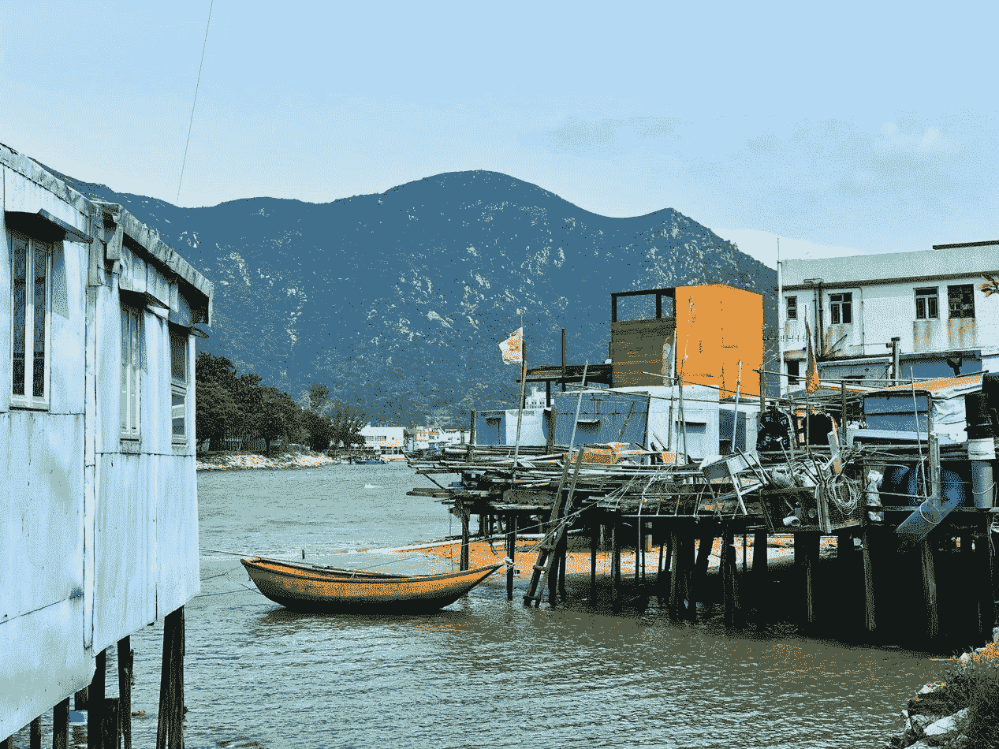
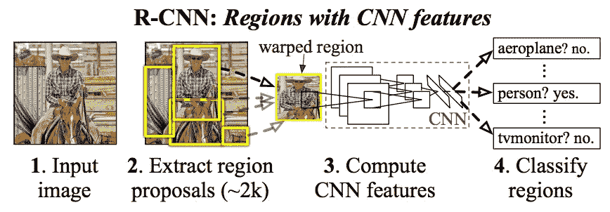
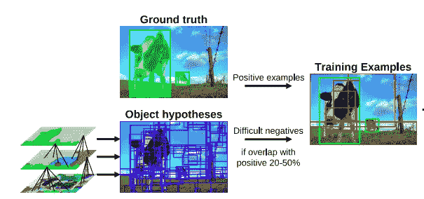
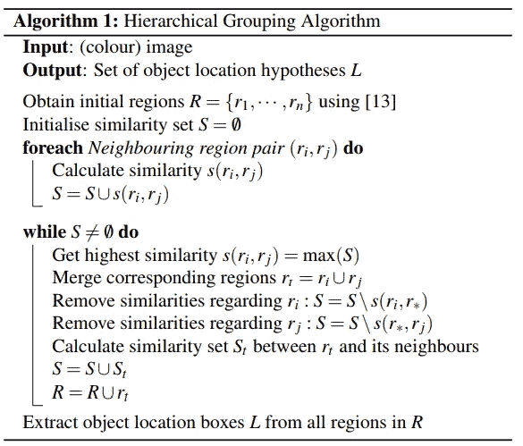
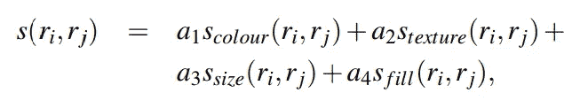

# R-CNN 是如何进行物体检测的？

> 原文：<https://pub.towardsai.net/how-r-cnn-works-on-object-detection-443679b0187c?source=collection_archive---------0----------------------->

## 卷积神经网络区域介绍

照片由[马志威](https://unsplash.com/@makcedward?utm_source=medium&utm_medium=referral)在 [Unsplash](https://unsplash.com?utm_source=medium&utm_medium=referral) 上拍摄

带卷积神经网络的区域(`R-CNN`)是 Girshick 等人在 2013 年提出的。它从根本上改变了目标检测领域。通过利用`selective search`、`CNN`和 SVM，Girshick 等人在 VOC 2012 上取得了非常好的成绩。

这个故事将介绍`R-CNN`，而后面的系列将包括由 Girshick 和其他团队成员介绍的`Fast R-CNN`、`Faster R-CNN`和`Mask R-CNN`。此外，还有其他异议检测方法，如`Single-Shot Object Detector (SSD)`和`You Only Look Once (YOLO)`。

图像分类的目的是对整个图像的类别进行分类。另一方面，目标检测不仅包括分类，还包括定位，定位被 Girshick 等人视为回归问题..

本故事将讨论 [R-CNN](https://arxiv.org/pdf/1311.2524.pdf) (Girshick 等人，2013 年)，并将涵盖以下内容:

*   R-CNN 的体系结构
*   选择性搜索
*   特征抽出
*   分类

# R-CNN 的体系结构

给定一幅图像，R-CNN 使用`selective search`生成大约 2000 个区域建议，通过使用卷积神经网络(CNN)来计算特征。区域建议是包括潜在对象的区域。它将被包装成 227 x 227 RGB 以适合 CNN。特征提取将在 CNN 层中完成，并传递给多个二元分类器，以计算出特定区域的类别。

R-CNN 的架构(Girshick 等人，2013 年)

# 选择性搜索

选择性搜索的架构(Uijlings 等人，2012 年)

在 R-CNN 中，`selective Search`方法被用于发现用于分类的区域提议。`selective Search`可以捕捉任何可能的规模和更少的计算复杂度。从`selective search`中选择 2000 个区域。

`selective search`的设计考虑因素是:

*   捕捉所有尺度
*   多样化
*   快速计算

为了实现这一点，选择分层分组算法以自底向上的方式对那些相似的区域进行分组。用于计算相似性的特征包括颜色、纹理、区域大小、区域填充，

## 分层分组算法

寻找区域建议是一种贪婪的搜索。这些程序是:

*   分段获取初始化区域
*   计算相邻区域的相似度
*   将相似区域分组到同一个桶中
*   来到同一个桶中最相似的区域。(重复此步骤)

分层分组算法(Uijlings 等人，2012 年)

## 多样化战略

计算不同的属性来寻找相似性。可能的属性可以是光强度、阴影、大小等。

多元化战略相似性公式(Uijlings 等人，2012 年)

# 特征抽出

选择 CNN 进行特征提取。如前所述，选择性搜索目标捕捉所有区域，这意味着有不同的规模和比例的图像。为了适合 CNN，所有区域都被包装成 227 x 227 RGB 图像。之后，通过 5 个卷积层和 2 个全连接层实现 4k 维特性。

# 分类

每个区域由多个 SVM 二元分类器进行分类。通过应用贪婪的非最大值抑制，对于每个类，具有较高分数区域的高交集/并集(IoU)重叠将被拒绝。

# 拿走

*   使用`selective search`来识别区域提议有一些缺点。耗时是主要问题之一。因为它需要非常大量的区域提议(~2k)，并且所有这些都必须贯穿 CNN 模型。一张图片大约需要 53 秒。
*   共 3 个模型，分别是 CNN 模型、SVM 分类模型和包围盒回归模型。分别训练 3 个型号是一个挑战。

# 关于我

我是湾区的数据科学家。专注于数据科学、人工智能，尤其是 NLP 和平台相关领域的最新发展。欢迎在 [LinkedIn](https://www.linkedin.com/in/edwardma1026) 上与 [me](https://makcedward.github.io/) 联系，或者在 [Medium](http://medium.com/@makcedward/) 或 [Github](https://github.com/makcedward) 上关注我。

# 参考

*   R.吉希克、j .多纳休、t .达雷尔和 j .马利克。[丰富的特征层次，用于精确的对象检测和语义分割](https://arxiv.org/pdf/1311.2524.pdf)。2013
*   J.R.R. Uijlings，K.E.A. van de Sande，T. Gevers 和 A.W.M. [物体识别的选择性搜索](http://www.huppelen.nl/publications/selectiveSearchDraft.pdf)。2012