# Rasa 如何计算故事的循环次数

> 原文：<https://pub.towardsai.net/how-rasa-calculates-the-number-of-turns-in-a-story-841d9300f9de?source=collection_archive---------6----------------------->

## [自然语言处理](https://towardsai.net/p/category/nlp)

## 使用 VS 代码学习他人源代码的一些工具和技巧

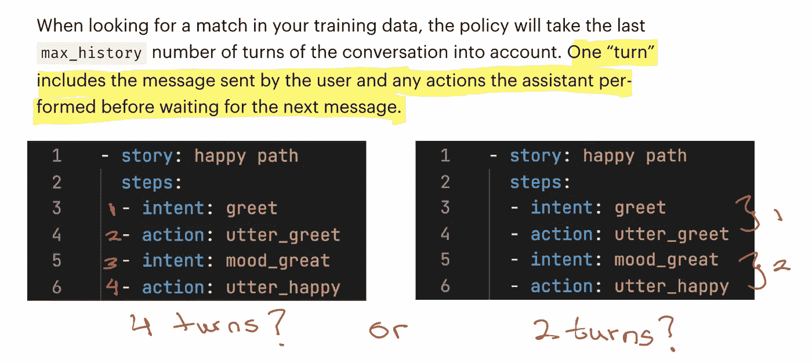

# 介绍

在这篇文章中，我将分享一些工具和技术来研究一个项目的源代码，以找到答案。目标是能够快速找到项目文档中没有涉及的一些实现细节问题的答案。

为了更具体，我将使用 [rasa 开源](https://github.com/rasahq/rasa)项目作为例子。不一定要熟悉这个项目才能理解，因为理解代码所需的领域知识会在过程中解释。

重现本文中描述的结果的代码可以在[这里](https://github.com/hsm207/rasa_story_steps)找到。

# 问题陈述

假设我们对微调聊天机器人使用的[记忆策略](https://rasa.com/docs/rasa/policies/#memoization-policy)感兴趣。根据文档，该策略有一个`max_history`参数，用于执行以下操作:

> 在您的训练数据中寻找匹配时，该策略会将对话的最后`max_history`轮次考虑在内。

“转弯”被描述为:

> 一个“回合”包括用户发送的消息和助理在等待下一个消息之前执行的任何动作。

所以，给定这个故事:

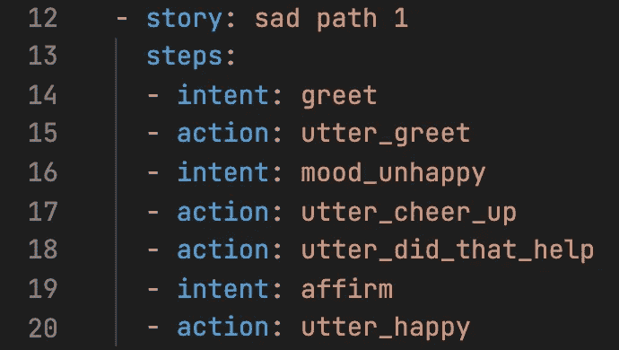

图 1:一个例子

当机器人需要预测意图`affirm`(第 19 行)之后的动作时，它将回顾的最大回合数是 6，因为第 20 行之前的每个意图和动作都算作一个回合……或者是 5，因为第 17 和 18 行中的连续动作实际上算作一个回合？或者，可能是 3，因为每个意图和动作都被配对来计算一次(除了第 19 行的`affirm`意图)？

如果文档中提供了一些关于如何计算故事情节转折的例子就好了…

在这一点上，我们可以在项目的[论坛](https://forum.rasa.com/)上问这个问题，但是考虑到未回答问题的数量，我们不太可能很快得到答案(如果有的话)。

让我们看看，在 VS 代码的帮助下，我们能否自己解决问题。

# 方法

## 概观

一般来说，找出不是你写的代码的实现细节是一个 5 步的过程:

1.  **设置项目**:这通常意味着将项目的源代码克隆到您的本地机器上
2.  **设置调试器**:这一步包括如何在项目启动时让调试器运行
3.  **确定一个好的起点**:人们总是可以从主入口点开始阅读代码，但是如果我们只对一个特定的行为感兴趣，这是低效的。熟悉一下项目的设计架构将有助于节省时间，因为它允许我们快速地将注意力集中在更小的一组功能或模块上。
4.  **添加日志点**:这是指将感兴趣的变量的值记录到控制台，以查看它们在程序执行过程中是如何演变的
5.  **使用断点:**如果事情变得太复杂，比如要跟踪的变量太多，那么你应该考虑暂停程序的执行，以便使用控制台更详细地检查其状态，或者一次执行一行程序。

## 步骤 1: Bot 设置

首先，在训练机器人时，我们将只关注图 1 中的一个训练故事。

接下来，我们还简化了机器人的`config.yml`，以便我们可以专注于`MemoizationPolicy`的机制:

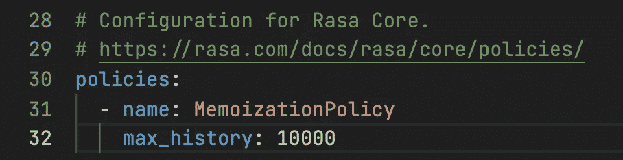

图 2:我们将用来计算 max_history 的 config.yml

请注意，我们将`max_history`设置为一个高得离谱的数字。我们这样做是为了当机器人试图预测第 20 行时，包含图 1 中的整个故事。我们可能还不知道什么是“转折”，但这个故事不可能有超过 10，000 个转折。

## 步骤 2:调试器设置

我们希望运行训练逻辑，这样我们可以在中途暂停执行，以便在必要时检查机器人的内部。

这可以通过在 VS 代码中创建一个[启动配置](https://code.visualstudio.com/docs/python/debugging#_initialize-configurations)来调试`rasa`模块来实现:

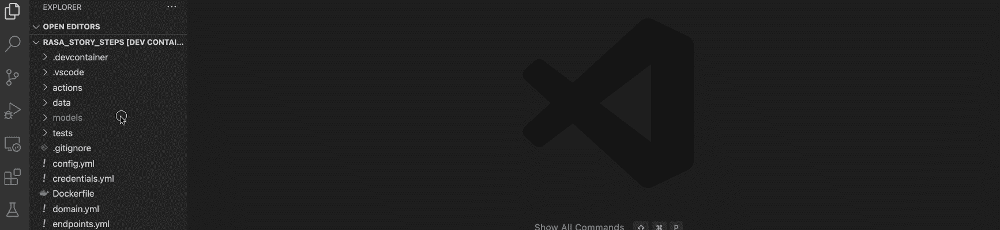

图 3:创建启动配置来调试 rasa 模块

需要注意的是，我们已经将`justMyCode`参数设置为`false`。如果我们不这样做，那么我们在模块`rasa`的任何地方插入的断点都将不起作用，因为源代码不在我们的项目中。

现在，我们可以随时转到`Run and Debug`并点击`Train core model`按钮，启动一个附带调试器的培训任务:

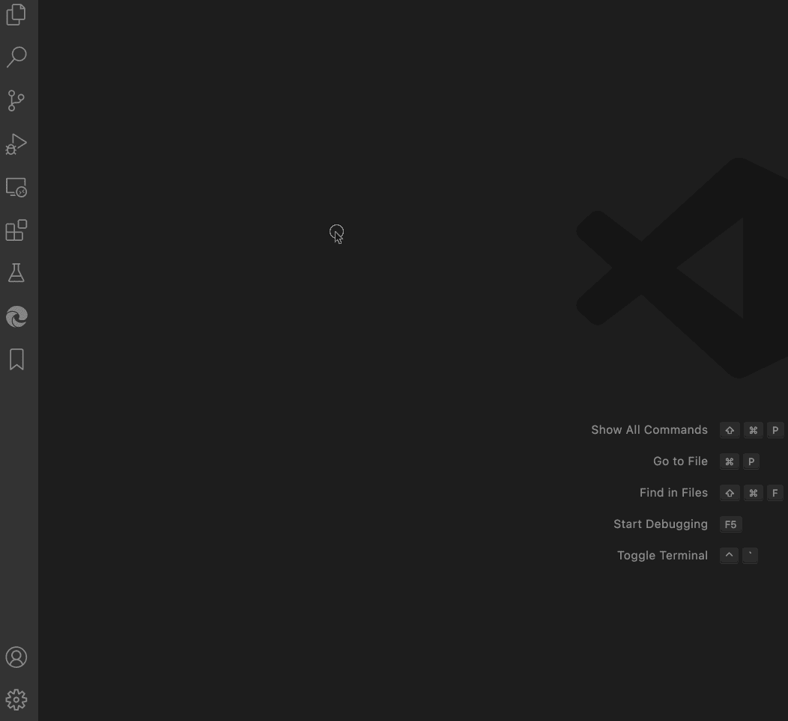

图 4:如何在附带调试器的中启动培训作业

## 步骤 3:找到开始调查的起点

从文档中，我们知道 rasa 源代码中的某个地方是`MemoizationPolicy`类的定义。从文档中我们还知道这个类必须有一个`train`方法。所以用这种方法作为我们的起点来弄清楚这个故事是如何被记住的是有意义的。

我们可以使用 VS 代码的搜索功能找到在哪里定义了`MemoizationPolicy`类:

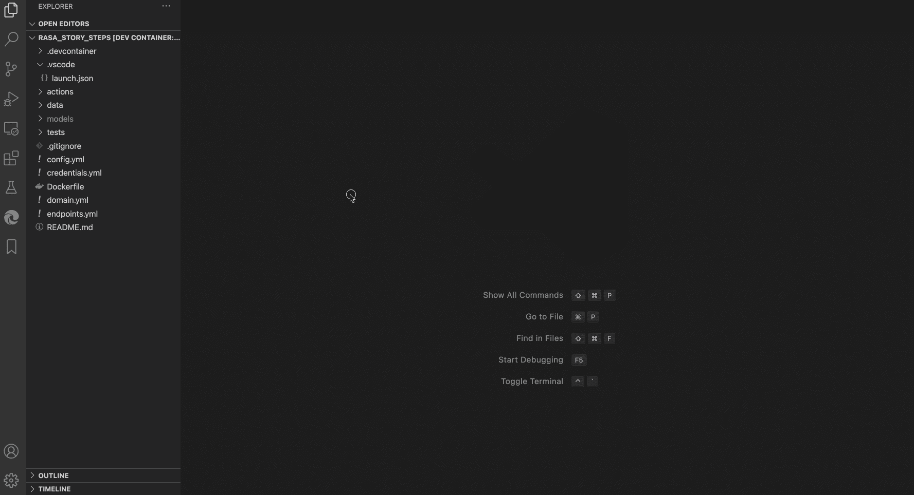

图 5:快速找到类的定义

我们首先打开一个终端，找出`rasa`模块安装在哪里。然后，我们使用搜索窗格来查找`memoizationpolicy`，并将搜索位置限制为仅在安装了`rasa`模块的位置进行搜索。最后，我们挑选任何使用`MemoizationPolicy`类的结果，并使用智能感知来实际访问类定义。

使用 VS 代码的`Outline`视图定位`MemoizationPolicy`类的`train`方法很容易:

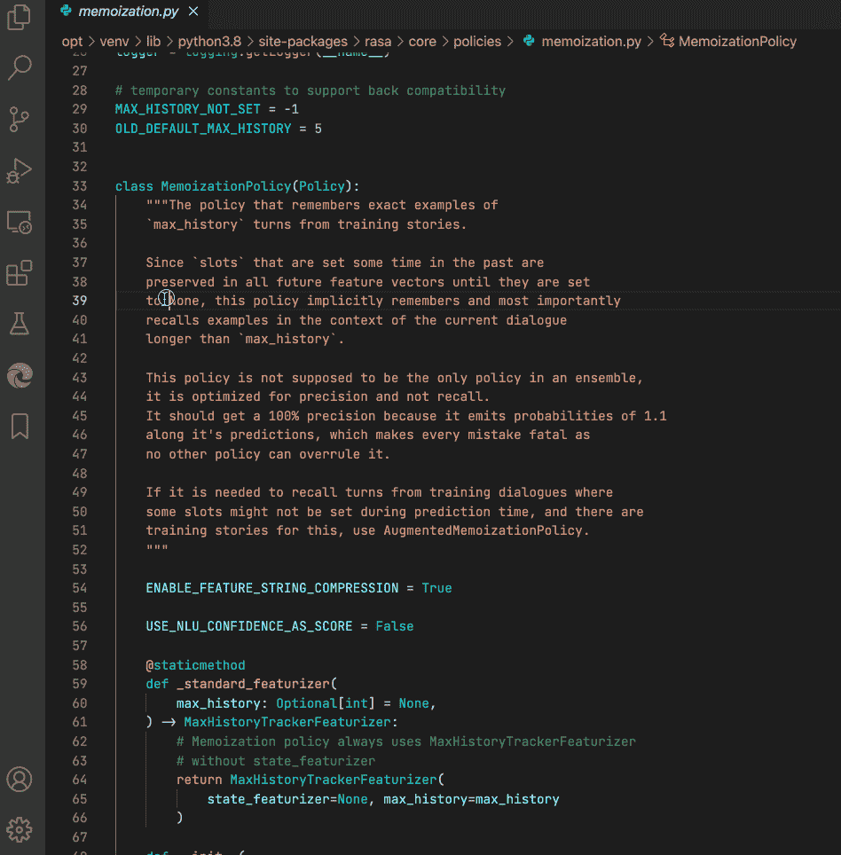

图 6:使用 Outline 视图探索一个类的方法

## 步骤 4:使用日志来验证事情

训练记忆化策略的代码非常简洁:

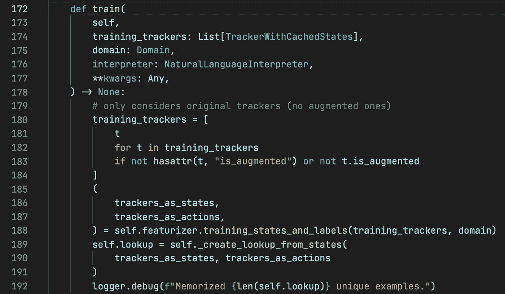

图 7:记忆策略是如何被训练的

对记忆化工作原理的总体理解清楚地表明，第 185 到 188 行创建了一个状态和动作对，其中状态是特征，动作是表示基本事实的标签。第 189 行使用这个状态和动作对来构建一个查找表。

因此，当记忆策略被训练时，我们应该检查对应于动作`utter_happy`的状态的内容。这可以在 VS 代码中使用[日志点](https://code.visualstudio.com/blogs/2018/07/12/introducing-logpoints-and-auto-attach)来完成:

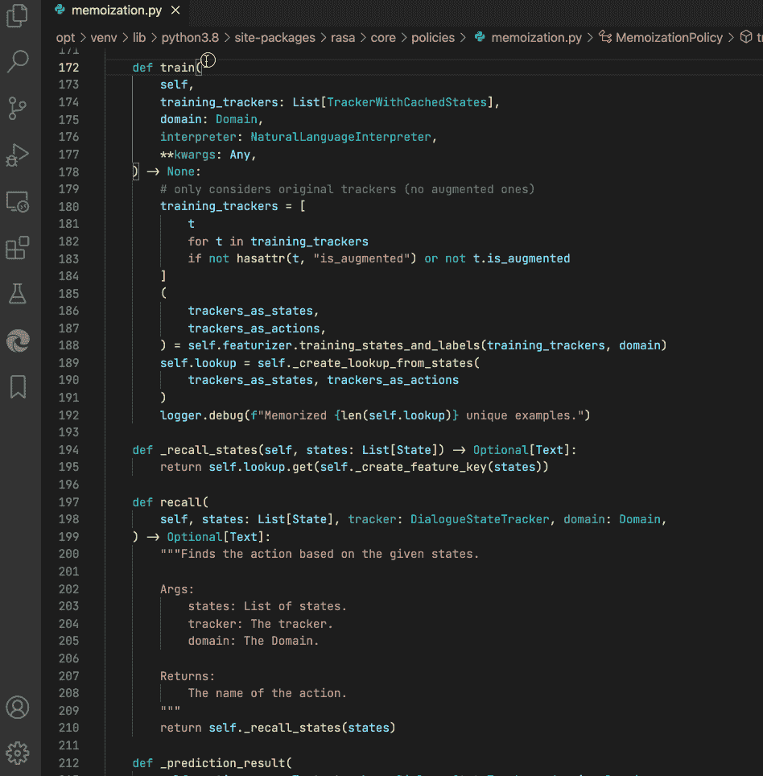

图 8:如何添加一个日志点

这是我们启动`Train core model`并观看`Debug Console`时发生的情况:

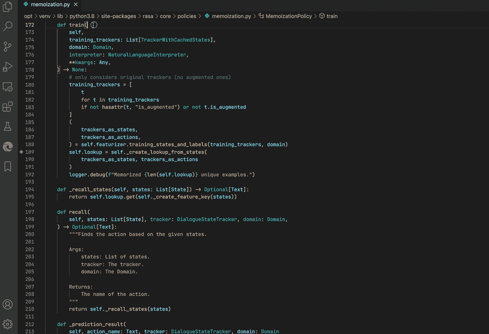

图 9:如何在运行时查看日志点

根据图 9，图 1 中的故事创建了 8 个状态，用于预测`utter_happy`的状态有 7 个转折。所以，我们的猜测没有一个是正确的。

## 步骤 5:使用断点进行详细调查

我们需要找出用于预测动作`utter_happy`的状态转动次数的猜测中的误差来源。

我们可以继续记录更多的细节，但是每次我们改变我们想要记录的东西时，都必须重新运行训练，这变得很乏味。此外，复杂的数据结构，例如字典列表，在调试控制台中打印不出来。

如果我们能够暂停代码的执行，并使用任意 python 代码检查代码的状态，那就更好了。这就是断点出现的地方。

我们可以用一个断点替换我们在图 8 中添加的日志点，以便在创建了`trackers_as_states`和`trackers_as_actions`之后立即暂停代码执行。然后，我们可以运行任意的 python 代码`Debug Console`来检查这些变量:

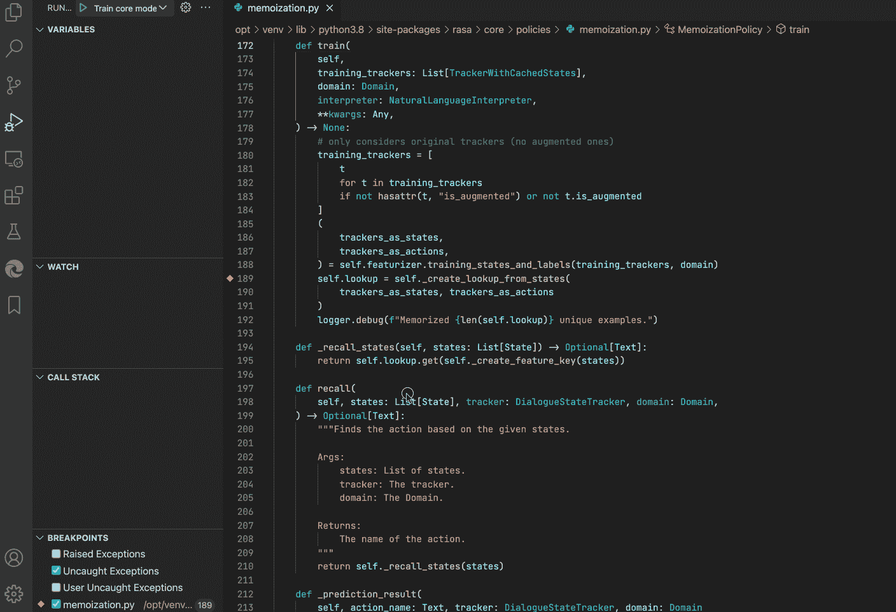

图 10:使用断点检查内部状态

图 10 显示了用于预测`utter_happy`的状态中的第一个元素是一个空字典，即`{}`。第二个元素对应于意图`greet`，即图 1 中的线 14。其余的元素也可以用一种明显的方式映射到故事中。

查看预测的标签，即`trackers_as_actions`变量，我们看到第一个元素是`action_listen`，因此我们得出结论，如果状态为空，即`{}`(例如，在对话开始时)，那么机器人应该只侦听用户输入。

# 回答

上一节已经表明，对以下内容的实际解释:

> 一个“回合”包括用户发送的消息和助理在等待下一个消息之前执行的任何动作。

每个意图和行为构成一个回合。此外，还有一个`action_listen`会自动附加在故事的开头(在结尾也是！)这也算一个回合。

因此，图 1 中的故事可以看作是:

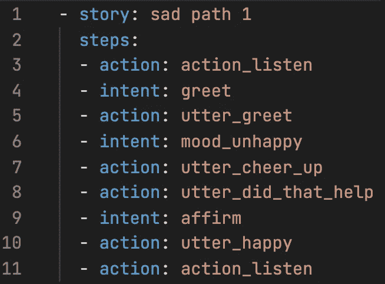

图 11:添加到图 1 中故事的隐含动作

这意味着故事实际上有 8 个回合，当机器人需要预测意图`affirm`之后的动作时，记忆策略将使用从第 3 行的`action_listen`开始的状态(7 个回合，从第 9 行的意图`affirm`开始计数)，当然假设`max_history`被设置为大于 7。

一个经常被问到的问题是:如果故事有很多`slot_was_set`事件会怎样？例如:

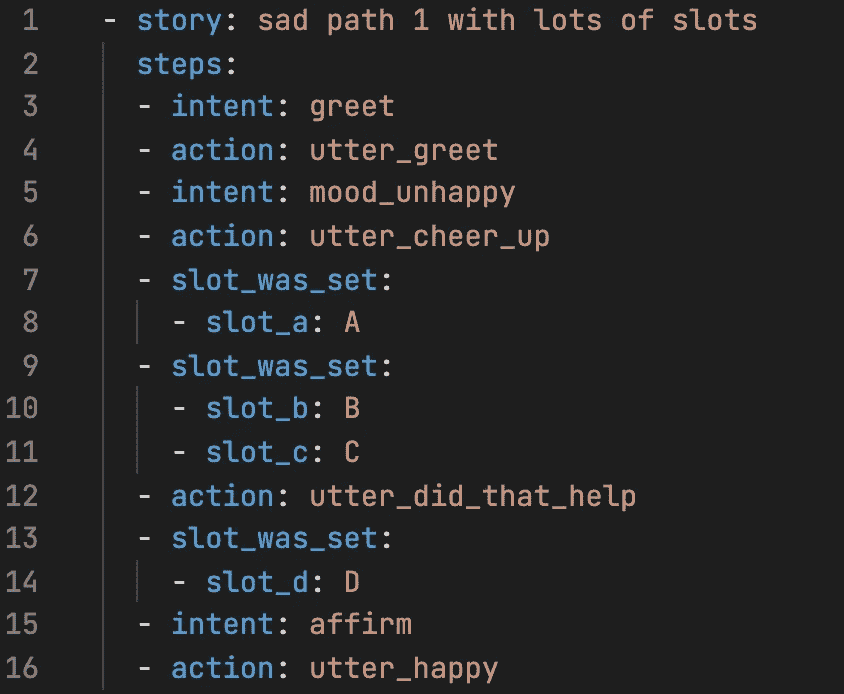

图 12:一个包含许多插槽设置事件的故事

每条`slot_was_set`线是否构成一个“转弯”？答案留给读者作为练习。

# 结论

本文描述了使用 VS 代码研究他人编写的一段代码的内部工作的一般方法。它以 rasa 开源项目为例来说明故事中的“转折”意味着什么，但同样的方法可以应用于任何编程语言的任何项目。

我希望你已经发现这是有用的。