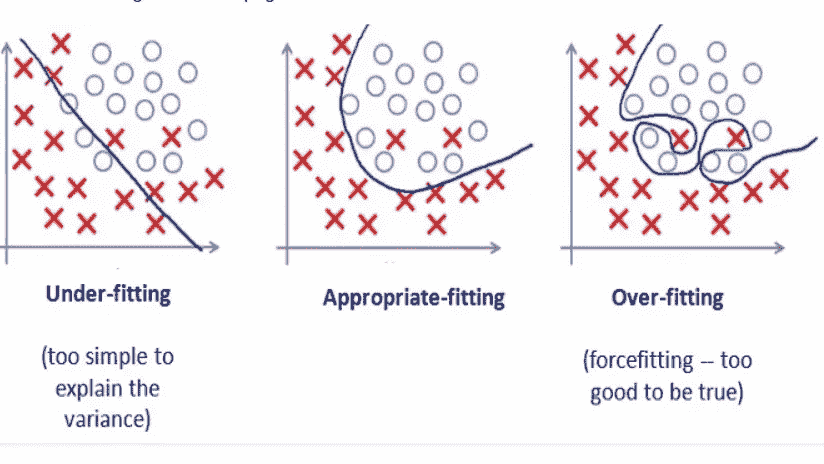
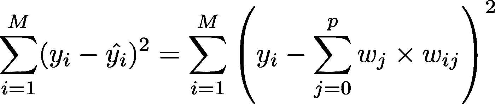
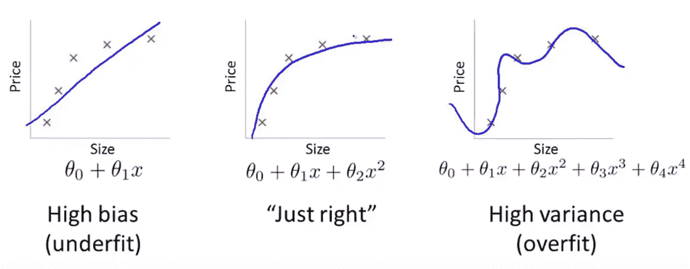
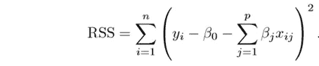
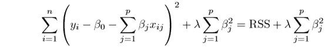
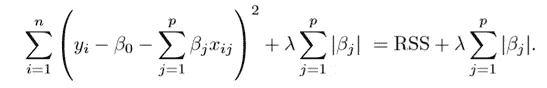
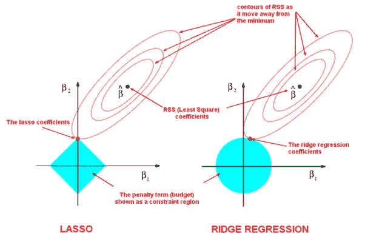
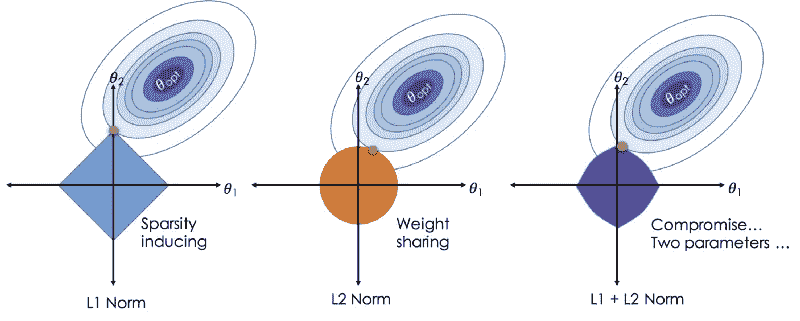
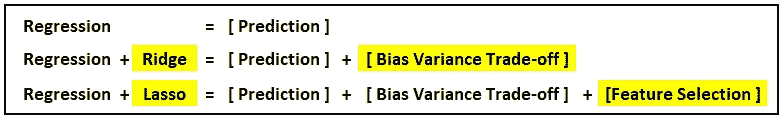

# 正则化如何帮助数据过度拟合

> 原文：<https://pub.towardsai.net/how-regularization-can-help-in-overfitting-the-data-ad9ff80f9ccc?source=collection_archive---------2----------------------->

资料来源:联合国人类住区规划署

## 无疑有助于减少寻找完美模特的痛苦

> *“知识是财富，实践是打开财富的钥匙”*

让我从一个简单的事实开始这篇文章。对于*回归来说，大多数时候，我们通过尝试拟合曲线*来开始建立模型。

当我们朝着数据的方向前进时，我们可能会遇到一个问题，这个问题可能会导致数据的过度拟合，这会给我们一个错误的印象和数据的错误含义。

嗯……怎么会？？

我们一会儿将会看到它是如何发生的，但是首先，让我们了解它为什么会发生？ 我们先从一些定义开始。

> 当我们的模型*太复杂*以至于不能概括新数据时，就会发生过度拟合。当我们的模型完美地拟合数据时，它不太可能很好地拟合新数据。
> 
> 当我们的模型不够复杂时，就会出现欠拟合。这在模型中引入了偏差，从而与真正的潜在估计量存在系统偏差。

没问题的..！！现在，让我们更详细地了解这一点。它如何影响我们的模型性能？我们将通过一个简单但最常见的图表对此有更多的了解。

显示欠拟合、恰到好处和过拟合曲线之间基本区别的图表

> 这里的第一种情况称为欠拟合，第二种是最佳拟合，最后一种是过拟合。

我们可以从第一个图表中看到，拟合线未能正确区分类别，这导致了拟合不足，这意味着拟合曲线未能正确解释数据的方差。

最后一个已经很好地拟合了数据，这对于我们的情况应该是理想的。但是这个力拟合曲线有一个问题。这也许能够解释我们模型的潜在差异，但是当我们用它来处理看不见的数据时，这将会彻底失败。简而言之，它将无法在看不见的数据上区分类别，从而给我们错误的预测。

> *我们认为第二张图是被选中的图，尽管它不能正确预测所有类别，因为当它需要根据看不见的测试数据对类别进行正确分类时，这张图会失败。*

现在，所有这些都可以归结为我们在机器学习领域经常听到的术语，即 [***偏差与方差权衡。***](https://towardsdatascience.com/understanding-the-bias-variance-tradeoff-165e6942b229)

为了建立一个好的模型，我们需要在偏差和方差之间找到一个好的平衡，使总误差最小化。

## **该如何……？**

让我们看看它的数学形式。

最小二乘法的等式可以表示为:

普通最小二乘方程

其中 ***y*** 为因变量，**yhat**为模型预测变量。 ***w*** 代表我们渐变中的权重。现在，最小二乘法会给我们一个模型，它是我们总体均值的预期方差和预测方差之差。如果差异很大，就会导致我们模型中的高方差，我们的目标是减少这种差异。这里需要选择一个模型来满足*偏差与方差问题。*

偏差-方差的影响

> 为了减少这种折衷的影响，我们使用了 ***正则化的概念。***

正则化试图通过简化估计量来减少估计量的方差，这将增加偏差，以这种方式减少期望误差。

> 根据维基百科，正则化“指的是引入额外信息以解决不适定问题或防止过度拟合的过程”。

我们知道，一个线性回归的一般方程可以表示如下:-

***Y≈β0+β1 x1+β2 x2+…+βpXp***

其中β是独立变量 x 的系数。现在，我们的目标是减少系数中的误差。这是通过使用残差平方和(RSS)来实现的。RSS 的等式可以定义为:-

这将有助于调整数据的残差。如果有噪声，就不能很好地概括数据。这就是 ***正则化*** 开始实施的地方，我们试图通过引入收缩因子来最小化误差。

**岭回归(L2 范数):**

这个因素是一个λ，它是一个调整参数，用来降低我们模型的灵活性，并找到最佳参数。如果λ是零，它不会影响结果，我们会得到相同的结果。然而，如果λ趋向无穷大，我们将得到完全不适合我们需要的结果。

因此，选择一个好的λ值对于我们找到正确的系数是至关重要的。这就是*交叉验证****派上用场的地方，它有助于估计测试集的误差，并决定哪些参数最适合模型*。**用这种方法产生的系数估计值也被称为*。***

*****拉索回归(L1 常模)**:***

***让我们看看另一种有助于减少方差的回归。***

******

***asso 只惩罚高系数。它使用|βj|(模数)而不是β的平方作为它的惩罚。在统计学上，这种 ***被称为 L1 常模*** 。***

****

*****蓝色的形状是指正则项，椭圆面是指我们的最小二乘误差(或数据项)。*****

> **岭回归可以看作是求解一个方程，其中系数的平方和小于或等于 s，而 Lasso 可以看作是一个方程，其中系数的模数之和小于或等于 s。**

***此处* ***s*** *为收缩因子λ的各值存在的常数。***

**因此，如果我们考虑有 2 个参数，并且如果我们查看更广泛的图片，我们可以看到 ***岭回归可以由β + β ≤ s*** 表示。**

**而对于套索，我们考虑模数，所以 ***这个方程就变成了，*****

*****|β1|+|β2|≤ s.*****

> **现在 Ridge 有一个问题，就是模型的可解释性。它将缩小最不重要的预测因子的系数，非常接近于零。但这永远不会使它们完全为零。换句话说，最终的模型将包括所有的预测值。然而，在套索的情况下，当调谐参数λ是 sufficiently 大时，L1 罚函数具有迫使一些 coefficient 估计恰好等于零的 effect。**因此，套索法也执行变量选择，据说能产生稀疏模型。****

## **正规化实现了什么？**

**标准最小二乘模型往往会有一些偏差。 ***正则化，显著降低了模型的方差，而没有大幅增加其偏差。*****

**因此，这一切都归结于调谐参数λ，它控制着偏差和方差的影响。随着λ值的增加，系数减小，从而方差减小。λ的增加仅在某一点之前是有益的，因为在某一点之后，如果我们继续增加其值，模型将开始失去重要的属性，从而增加模型中的偏差，导致拟合不足。**

# **典型使用案例**

*   ****脊:**主要用于*防止过配合*。因为它包括所有的特性，所以在过高的#特性的情况下，比如说数百万，它不是很有用，因为它会带来计算上的挑战。**
*   ****Lasso:** 因为它提供了*稀疏解*，所以它通常是对#特征数以百万计或更多的情况建模的首选模型(或这一概念的某种变体)。在这种情况下，获得稀疏解具有很大的计算优势，因为可以简单地忽略具有零系数的特征。**

****

****弹力网****

**L1 和 L2 范数的结合给了我们一个更好的正则化实现。**

****βˇ= arg minβy Xβ2+λ2 |β2 |+λ1 |β1 |****

**那么我们如何调整 **λs** 来控制 L1 和 L2 的罚项呢？让我们举个例子来理解。**

**假设，我们正试图从池塘里抓鱼。我们只有一张网，那我们该怎么办？我们会随机撒网吗？不，我们实际上会等到你看到一条鱼游来游去，然后我们会向那个方向撒网，基本上收集整个群体的鱼。因此，即使他们是相关的，我们仍然想看看他们的整个群体。**

**弹性回归以类似的方式工作。比方说，我们在一个数据集中有一堆相关的独立变量，那么弹性网络将简单地形成一个由这些相关变量组成的组。现在，如果这组变量中的任何一个是强预测变量(意味着与因变量有很强的关系)，那么我们将在模型构建中包括整个组，因为省略其他变量(就像我们在 lasso 中所做的那样)可能会导致在解释能力方面丢失一些信息，从而导致模型性能不佳。**

****结论****

****

**正如我们所看到的，Lasso 帮助我们进行偏差-方差权衡，同时帮助我们进行重要的特征选择。然而，Ridge 只能收缩接近于零的系数。**

****供进一步阅读:-****

** [## 机器学习中的正则化

### 训练机器学习模型的一个主要方面是避免过度拟合。该模型将有一个低…

towardsdatascience.com](https://towardsdatascience.com/regularization-in-machine-learning-76441ddcf99a)  [## 线性、脊形和套索回归初学者综合指南

### 我和我的一个朋友聊天，他碰巧是一家超市的运营经理…

www.analyticsvidhya.com](https://www.analyticsvidhya.com/blog/2017/06/a-comprehensive-guide-for-linear-ridge-and-lasso-regression/) 

暂时就这些了。下次见…！！干杯..！！！**