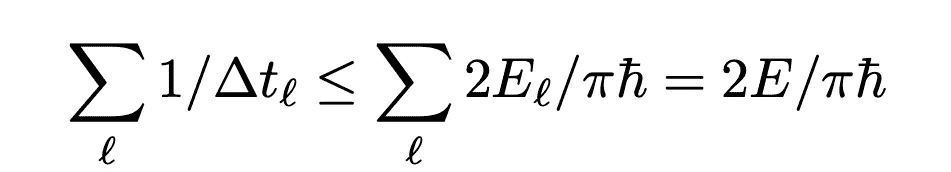

# 机器能变得多聪明

> 原文：<https://pub.towardsai.net/how-smart-can-machines-get-3ce73b192a23?source=collection_archive---------5----------------------->

## [未来](https://towardsai.net/p/category/future)，[意见](https://towardsai.net/p/category/opinion)，[技术](https://towardsai.net/p/category/technology)

## 答案会让你吃惊的

列宁·埃斯特拉达在 [Unsplash](https://unsplash.com?utm_source=medium&utm_medium=referral) 上的照片

人工智能呈指数增长，每天都变得越来越聪明。脸书部署的预测算法可以跟踪你并为你提供合适的广告(广告优化)，准确率高达 98%。换句话说，你可以说这个 AI 软件比你自己的家人还了解你！我们有 DeepFace(也是脸书的)，它识别人脸的准确率达到 97.25%，不考虑光照条件和角度。

***我们从 AI 中得到什么？***

人工智能已经成为识别、空间研究、运输等等的先驱。从根本上说，我们已经被 AI 包围了。我们许多人认为人工智能是一个拥有所有人类能力的巨型机器人，只是它更聪明。其实聪明是真的，但是 AI 不一定是一个巨大的会说话的机器人。AI 也存在于软件中。Siri，Alexa，Cortana 都是技术上的机器人。

***人工智能热潮...***

我们正在见证人工智能模型准确性的巨大飙升。然而，我们都生活在一个深深的困境中，一个高度智能和复杂的机器人可能会产生什么样的前所未有的影响？它真的有毁灭人类文明的能力吗？终结者会是真的吗？

埃隆·马斯克明确地称人工智能是对我们的“生存威胁”。他接着说——

> “我认为我们应该非常小心人工智能。如果要我猜我们最大的生存威胁是什么，可能是这个。”

也许埃隆·马斯克是对的。也许他错了。没人知道。没有人知道，因为我们不够聪明，无法准确预测未来。但我们确实知道一个事实，即当前的发展趋势可以建立一个基准，来想象 5 年或 10 年后人工智能会是什么样子。

除了宇宙，我不知道任何东西是无限的。因此，我认为计算机可以在传统物理学的一套规则下进行计算。简单来说，就是说计算机不可能无限聪明，因为它受到物理定律的限制。

# 机器真的能变得多聪明？

我们都受物理定律的指导。我们周围看到的每一个物理对象都受物理定律的指导，因此，计算机也是如此。

物理计算机可以进行固定数量的计算，因为它拥有固定数量的能量。本质上，整个宇宙中没有任何物体本身拥有无限的能量。万物总有一天会耗尽能量。就像我们的太阳在几十亿年后会变成红巨星一样。好吧，我们现在不要担心我们的太阳。

既然能量是有限的，速度也是有限的。你不能给一个运动员每天 3000 卡路里的热量，然后指望他一辈子不停地跑。这也是计算机的工作方式。让我告诉你怎么做！

数学方程式即将推出:

假设我们有一台重 1 千克的电脑。计算机应该具备的能量会是: ***E = mc，*** 也就是说 *m=1kg，***c 是光速(= 3×10⁸米/秒)。*将这些值代入等式，我们得到一个大约为 **8.9874 × 10 ⁶焦耳**的数值。*

*麻省理工学院教授 Seth Loyd 提出了一个有趣的等式，它定义了给定一些约束条件下计算机可以执行的最大运算次数。这个等式看起来像这样([1]):*

**

*􏰁*

*抱歉让事情变得复杂了。但我会尽可能让这件事变得透明。*

*在这里，我们真正应该看的是 ***2E/πh*** *。e 代表我们刚刚计算的能量，π是我们传统的 3.141592，h 是普朗克常数，也就是*6.62607004×10^-34·m·kg/s，把这些都放进去，我们得到一个大约每秒 5.4258 × 10⁵⁰运算的数。因此，我们可以将这个数字定义为一台机器以最大能量所能处理的操作的最终界限。这里需要注意的一点是，能量值 *E* 假设 100%被逻辑门用来执行运算。事实上，我们永远无法实现完全高效的计算机系统，因为一些能量总是以热量或声音的形式耗散在环境中。*

*顺便说一下，一个普通人的大脑每秒只能计算 1000 次基本运算。尽管人类的大脑可能比普通的计算机慢，但我们仍然拥有创造非凡事物的能力。同样是每秒 1000 次运算的大脑，却有能力造出比我们运算速度快 1000 万倍的机器。谁知道计算机是否有能力复制一种更快的工具，它能处理我们无法理解的数字。*

# *人工智能的未来*

*我们永远无法确定人工智能在未来会是什么样子。这个问题没有正确和错误的答案，也没有任何指标来预测人工智能可以变得多聪明。但我们可以肯定的是，人工智能无论多么复杂，都不可能无限聪明。它将永远被限制在物理学的范围之内。然而，当我写这篇文章的时候，我们永远不知道物理学会给我们带来什么。物理学仍在被发现，不像开尔文勋爵曾经说过的，*

> *“现在物理学中没有什么新发现。剩下的只是越来越精确的测量。”*

*量子力学打开了通往新物理世界的大门。我们认为神奇的一切后来都被量子力学所支配。我希望有一天，人工智能将只用于让人类生活更好，而不是让他们不存在。最后真的取决于我们如何让 AI 控制我们。如果我们自愿向机器提供对自己的控制，我们应该很快就会看到世界末日。如果我们控制了人工智能，我们就可以解决宇宙中一些无法回答的重大问题。无论哪种方式，它将永远被认为是人类作为人工智能机器人行动的根本原因。因此，由此得出的结论是:我们如何让人工智能控制我们，这完全取决于我们。*

## *参考资料:*

*[1][https://arxiv.org/pdf/quant-ph/9908043.pdf](https://arxiv.org/pdf/quant-ph/9908043.pdf)—计算的最终物理极限*