# 特斯拉如何针对 FSD 功能和超高效的机器人出租车车队优化其软件和硬件？

> 原文：<https://pub.towardsai.net/how-tesla-has-been-optimizing-its-software-and-hardware-for-fsd-capabilities-and-a-hyper-efficient-21493079b9bd?source=collection_archive---------1----------------------->

## [计算机视觉](https://towardsai.net/p/category/computer-vision)，自动驾驶汽车

FSD 芯片之旅，解决视觉问题，使用数据引擎的车队学习，使用向量空间的对象检测，传感器冗余，阴影模式，机器人出租车成本模型，等等。

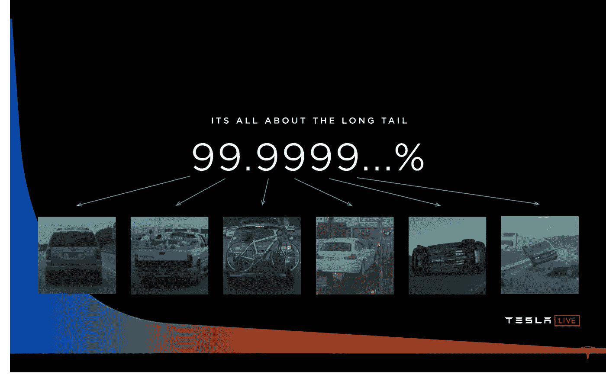

长尾问题:追逐最后几个 9 将会非常棘手和困难。它需要一个非常强大的视觉系统。

*读者注意:*

*我既没有直接工作过，也没有全面了解硬件的工作情况。因此，在本文的第 3 部分中，我主要介绍了硬件的规范和简要概述。*

请注意，本文倾向于提供关于自动驾驶人工智能的直觉和技术见解，而不是讲故事。

*尽管所有图片均可在公共平台上获得，但与本文中的事实和图片相关的所有权利和荣誉均属于 Tesla。*

# **动机:**

在过去的 6 年左右的时间里，我一直在关注和倾听关于特斯拉的工作，但我只是在过去的几年里才开始倾听他们的工作。

我相信，为了创新，我们需要保持好奇，并推动我们的科学极限的边界。不用说，融入乐观的心态和文化是克服这些挑战的关键。此外，创新(比如太空探索)通过找到共同点来促进与其他国家的和平联系。这篇文章就是这样一个例子，它包含了我对特斯拉自动驾驶人工智能及其潜力的理解和直觉，这些理解和直觉得到了一些事实和正在进行的研究的支持。

# 简要概述:

**第一部:** [**安德烈·卡帕西**](https://medium.com/u/ac9d9a35533e?source=post_page-----21493079b9bd--------------------------------)**(AI 与自动驾驶视觉总监)**

涵盖的概念:神经网络的基本要素(大型数据集、可变数据集、真实数据集)、对象检测、拐角情况、数据引擎、车队标记和学习、路径预测、仅来自视觉的深度感知。

**第二部分:** [**斯图尔特·鲍尔斯**](https://www.linkedin.com/in/stuart-bowers/) **(前工程副总裁)**

涵盖的概念:在生产中将硬件和人工智能包装成可行的产品，传感器冗余，向量空间，阴影模式，特征生命周期。

**第三部分:** [**皮特·班农**](https://www.linkedin.com/in/peterbannon/) **(硬件工程副总裁)**

涵盖的概念:FSD 计算机的完整旅程—图像信号处理器、神经网络处理器、视频编码器、GPU、主处理器、安全系统、安全系统、控制能量、后处理、神经网络编译器、HW 2.5 与 FSD 结果比较。

**第四部:埃隆·马斯克**

涵盖的概念:机器人出租车车队和成本模型，自动驾驶的未来。

# 第 1 部分:Andrej Karpathy，人工智能和自动驾驶视觉总监

Andrej 在视觉方面的工作概述:

1.  神经网络入门
2.  舰队优势
3.  视觉和激光雷达

神经网络基础:视觉识别，解释，人工神经网络。

注意:为了获得卷积神经网络的概述，我建议从观看 [YouTube](https://www.youtube.com/watch?v=NfnWJUyUJYU&list=PLkt2uSq6rBVctENoVBg1TpCC7OQi31AlC) 上的所有 CS231n 讲座视频开始。从 2015 年冬季到 2016 年冬季的所有课程的幻灯片和大纲可在[课程网站](http://cs231n.stanford.edu/2016/syllabus.html)上获得。

**车道标记:**

使用标记的数据为有趣的车道标志(比如弯曲的车道)训练神经网络。

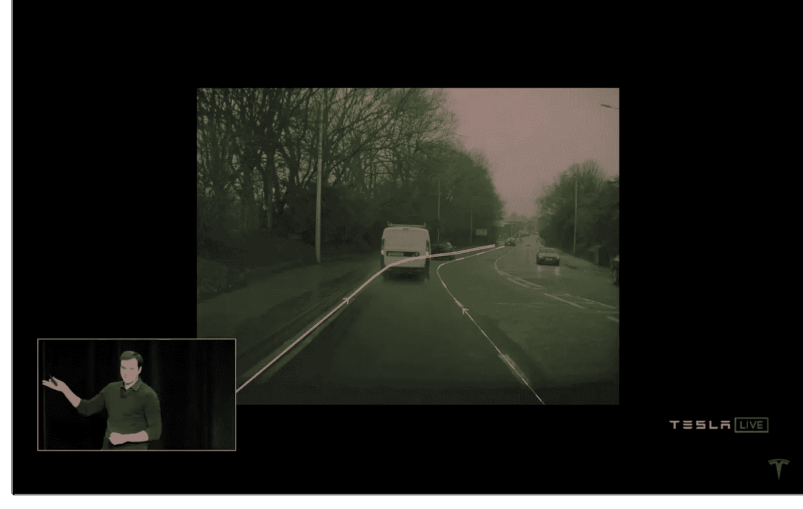

车道标记

**数据集中的变化:**

*   针对独特条件进行训练，包括但不限于照明、阴影、隧道。
*   如何应对这一挑战？—注释和训练尽可能多的边角案例图像。

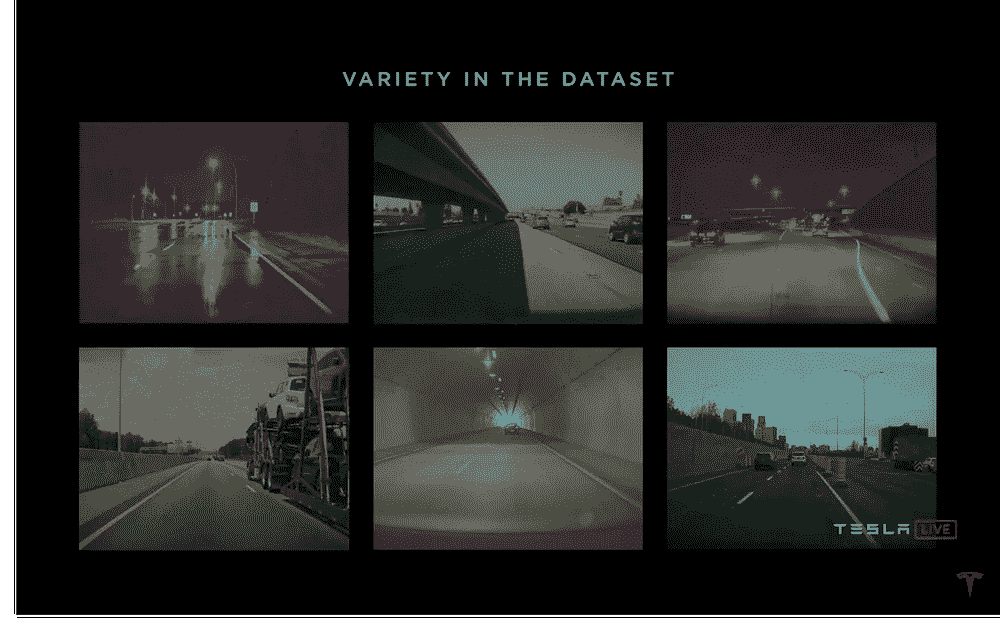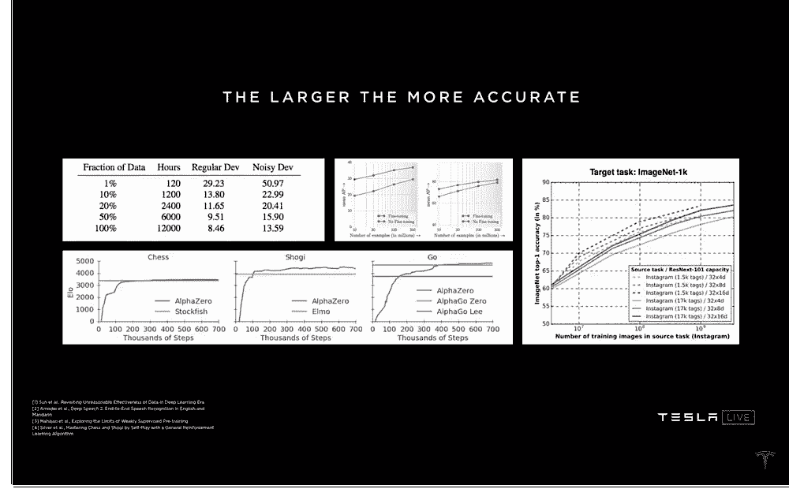

**为什么模拟不是最佳方法？**

*   模拟就像“给你自己的作业打分”,你已经知道(或者至少意识到)将要发生什么。

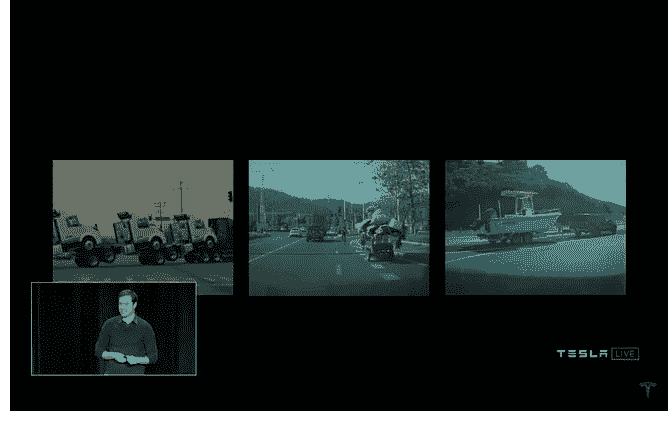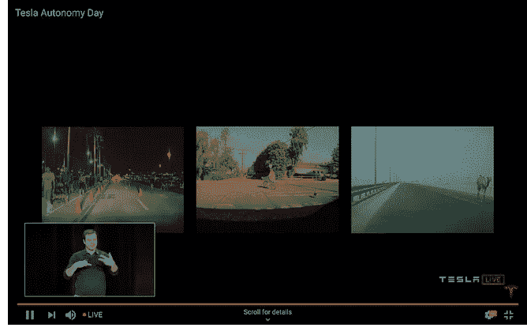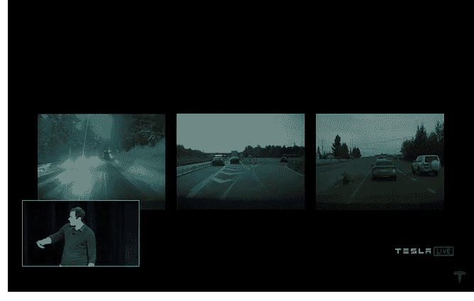

*   模拟在模拟你周围的代理人的外表、物理和行为方面有困难。
*   相反，现实世界有数百万个角落案例或边缘案例。
*   那么，神经网络的本质是什么？—大型数据集、可变数据集、真实数据集。

**物体检测:**

角落案例示例

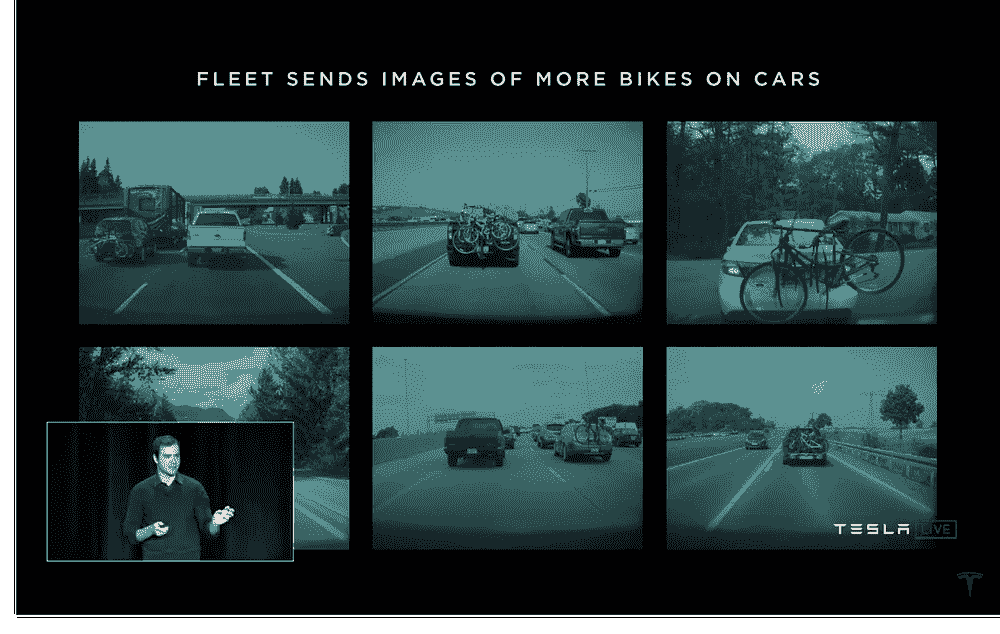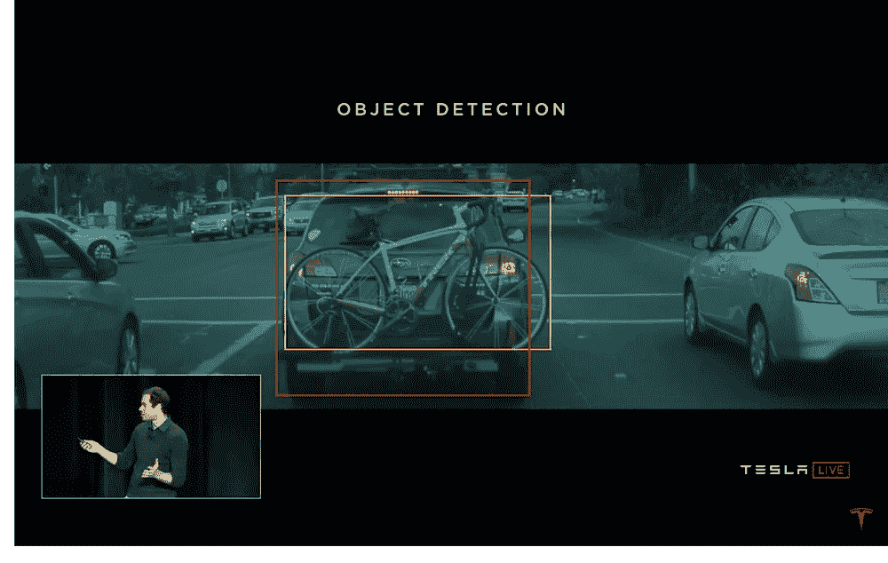

在调优和训练之后，车队会将对象(汽车+自行车)标注和检测为单辆汽车。

解决方案:

向舰队询问在世界各地收集的类似图像。现在，收集它们并将每个这样的图像标注为一辆车，也就是说，在这种情况下不要将自行车标注为一个单独的对象。遵循这种标记技术最终会提高检测机的性能。

**其他边角案例示例:**

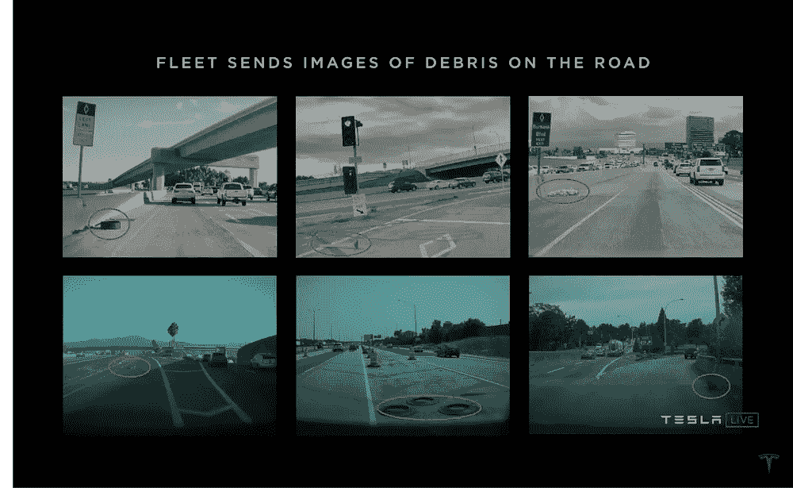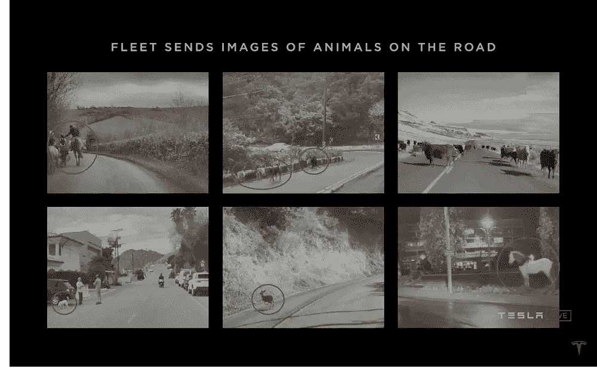

**数据引擎:**

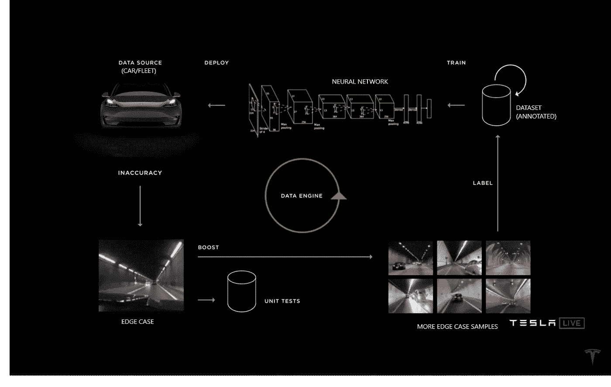

数据引擎:在检测器行为不当的情况下，特斯拉团队反复应用主动学习来获取示例的过程。然后，团队从这些示例中获取示例，进行标记，并将其作为训练集的一部分。

这是一个反馈回路，其中自动驾驶仪的驾驶错误(以脱离、中止和崩溃为标志)导致特斯拉工程师识别问题，并设计触发器来收集与该问题相关的传感器数据。

**数据引擎的核心原理和反馈回路:**

1.  用新的对象类注释初始数据集
2.  训练神经网络模型以检测新对象
3.  评估模型性能
4.  识别性能低下的情况
5.  将这些添加到数据单元测试中
6.  在“影子模式”下将模型部署到车队，以获取类似的边缘案例
7.  从车队中取回箱子
8.  审查并标记收集的边缘案例样本
9.  重新训练模型
10.  重复步骤 6-9，直到模型性能可以接受

**数据引擎如何帮助解决“长尾”问题？**

*   特斯拉的人工智能团队正在通过结合多任务学习和这个大规模的“数据引擎”来收集罕见的例子和角落案例，这是解决长尾问题的本质，从而推动深度学习的发展。
*   它有助于确保以最有效的方式收集数据，以覆盖模型在真实的无约束世界中可靠运行所需的极长的样本尾巴。

**数据引擎如何确保标签团队不会被误报淹没？**

Karpathy 在 ScaledML Conference 2020 的演讲中提到了几种克服这个瓶颈的方法，他也承认没有一种方法是完美的。测试时检测器缺乏健康的一些具有挑战性的例子包括闪烁的停车标志、从贝叶斯角度看的神经网络不确定性、只有在接近或接近后才惊讶地看到停车标志的情况、检测中的地图视觉不一致。

**特斯拉的车队优势:**

数据引擎的核心原理并不是特斯拉独有的:它受到了主动学习的启发，多年来一直是研究的热门话题。特斯拉的竞争优势是其无与伦比的车队学习和数据收集规模。

莱克斯·弗里德曼的[特斯拉自动驾驶里程统计](https://lexfridman.com/tesla-autopilot-miles-and-vehicles/)显示，特斯拉已经在自动驾驶方面收集了超过 30 亿英里的里程，目前领先(至少)其竞争对手 100 倍。

数据收集并不总是可能和容易的——通常是由于隐私和其他法规的原因——但特斯拉已经确保向客户公开数据收集和车队优势从长远来看对双方都有利。

*用一个例子场景来重申上面的陈述:* ***特斯拉*** *，截至 2020 年 6 月，* [*的毛利润已经达到 20.99%*](https://ycharts.com/companies/TSLA/gross_profit_margin) *，此外它也不必为其客户支付数据收集的费用(除了维护、存储、标签和处理数据的基础设施成本)。因此，* ***客户*** *能够以合理的价格以更快的速度获得无线软件更新，这得益于创新的指数级增长。*

**车队自动标注数据:**

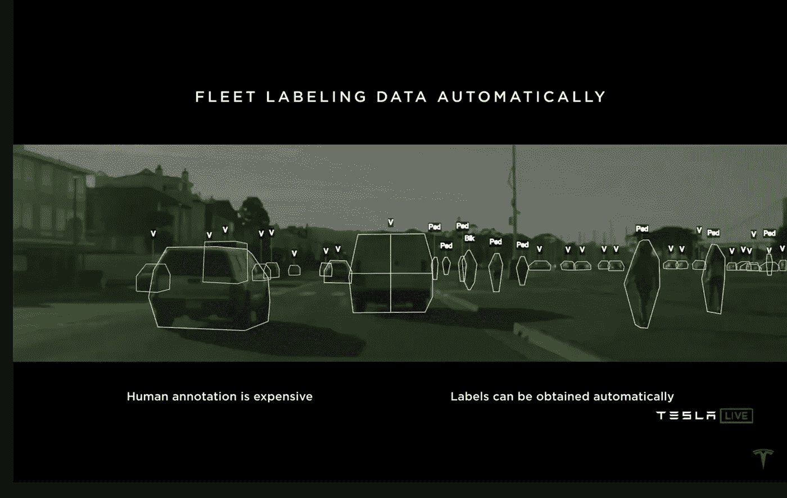

不需要人工注释。

**舰队学习:插队**

一个例子:一辆汽车，在我们前面，试图改变车道。

Tesla 工程师为处理这种边缘情况所采取的步骤:

*   让时间倒流
*   基于数据的行为自动注释数据
*   训练神经网络
*   在“影子模式”下运行汽车上的神经网络
*   分析并平衡误报和漏报(为有趣的情况训练神经网络，例如，我们前面的汽车只是不停地戏弄，并没有真正改变车道)

“影子模式”如何帮助监管机构评估特斯拉的安全性和可靠性？

在阴影模式下，汽车不采取任何行动，但它会记录它应该采取行动的时间。因此，汽车将在“影子模式”下运行 Autopilot，以便特斯拉收集统计数据来显示软件的误报和漏报。它将记录如果电脑控制汽车，汽车会如何行动，包括汽车如何避免事故(或造成事故)的信息。这些数据将被用来显示事故率相对于人工驾驶汽车的实质性改善。

**路径预测:**

转向角、弯道、复杂路径等。—所有这些都成为您的车队标记数据的一部分。

模仿学习:在这种情况下，模仿学习可以被定义为从现实世界中获取人类轨迹，并试图模仿人们在现实世界中的驾驶方式。然后，对所有这些应用相同的数据引擎曲柄，并使其随着时间的推移而工作。通过打开增强视觉，你可以在视频中看到汽车中的车道线和路径预测。(注意:特斯拉的团队专注于只模仿更好的司机，这涉及到许多技术方法来分割和切割数据。)

该预测实际上是一个投影回图像的 3D 预测(见下面左侧的图像)。通过这些我们可以了解地面的坡度，这对驾驶来说非常有价值。

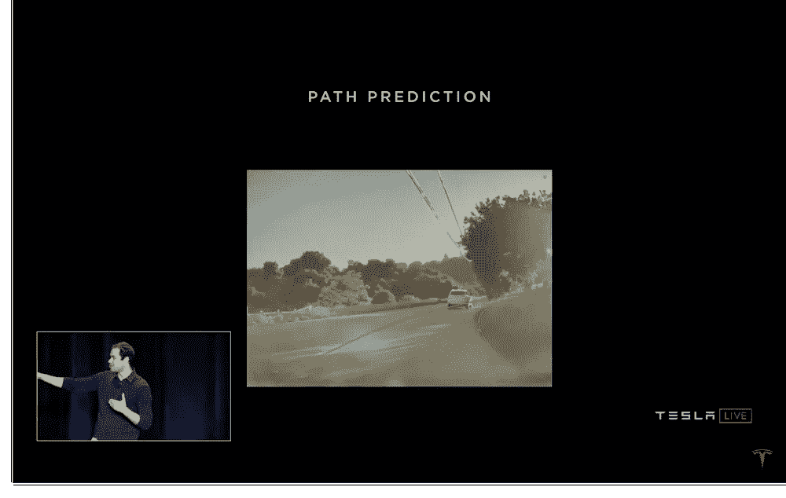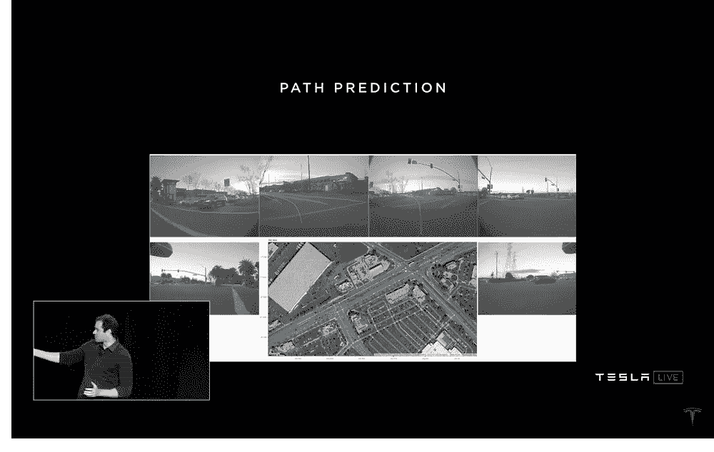

**特斯拉如何迭代网络预测并使其与时间一起工作的 3 个关键组成部分:**

## 仅使用视觉的深度感知:

视觉深度感知的三个例子包括:

1.  经典计算机视觉
2.  传感器监控
3.  自我监督

**①。经典计算机视觉**

这主要包括解决图像处理和对象检测中的问题。接下来的部分集中在特斯拉如何利用传感器监督和自我监督进行深度感知。

**②。雷达视觉学习:传感器监控**

神经网络是非常强大的视觉识别引擎，它们可以使用深度标签来预测“深度”(单目深度)。

演示这一点的示例项目:使用前向雷达，其中雷达正在查看对象的深度。现在，我们使用雷达来注释视觉所看到的内容，即来自神经网络的边界框。

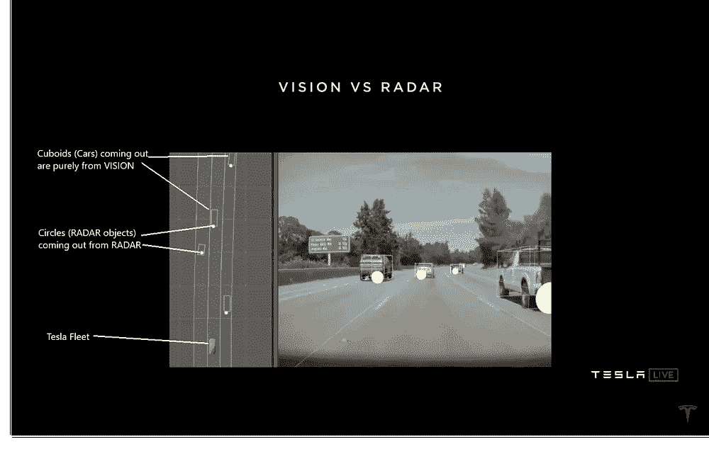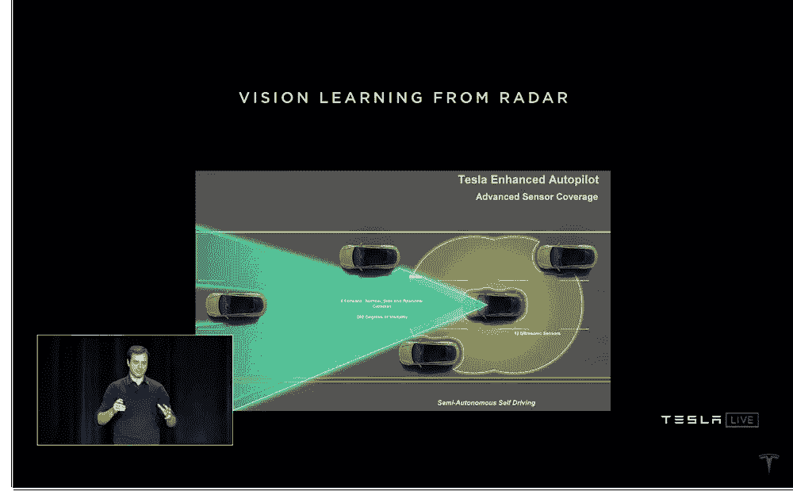

因此，长方体的深度是通过雷达的“传感器注释”得知的。你会看到自上而下视图中的圆圈与长方体一致，这再次强调了它工作得非常好的事实。这是因为神经网络非常擅长预测深度。他们可以从内部了解车辆的不同尺寸，这有助于非常准确地从中获得深度。

**(三)。来自视觉的深度:自我监督**

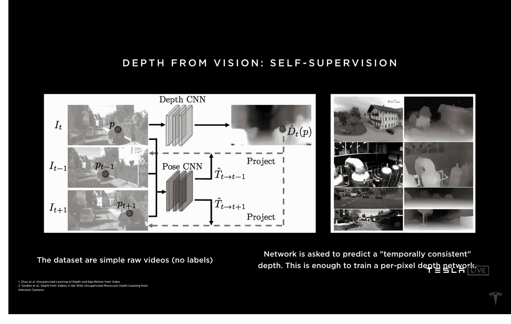

你只需将原始视频(没有标签)输入神经网络，让它们学习深度。

想法:神经网络预测视频中每一帧的深度，没有明确的目标，它应该回归到标签。相反，网络的唯一目标是随着时间的推移保持一致，也就是说，你预测的深度必须在该视频的持续时间内保持一致。

**结论:**

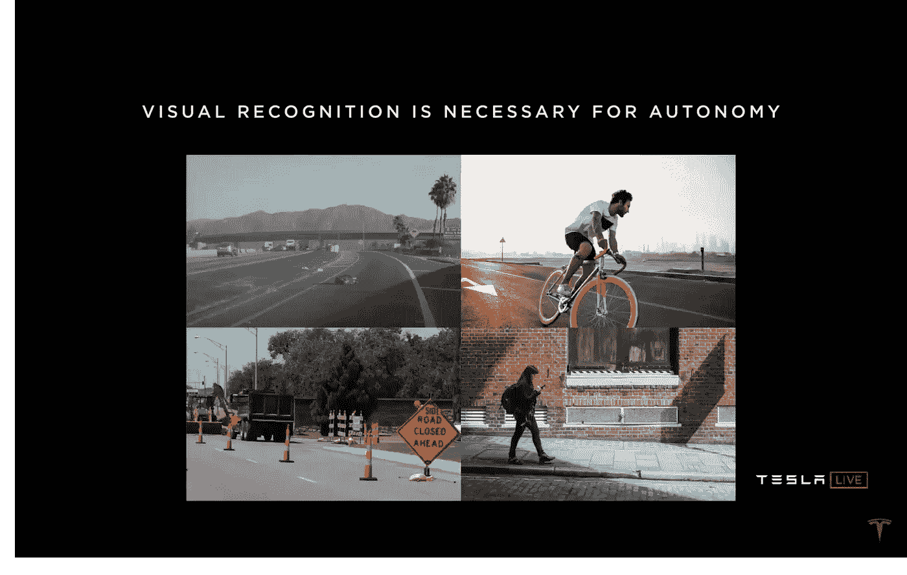

左上角图片中的物体是轮胎还是塑料袋？—激光雷达只能给你几个点。但是视觉可以告诉你这两者哪个是真的，最终影响你的控制。这些问题的答案在获得四级和五级自主性方面起着关键作用。

能够处理所有可能情况的自主性大多落在 99.99%的范围内。追赶最后几个 9 将会非常棘手和困难。这需要一个非常强大的视觉系统。下面是你可能在这些 9 中的任何一个片段中遇到的一些图像。

[**这里的**](https://www.tesla.com/autopilot) 是特斯拉视觉、高级传感器覆盖范围、处理能力、自动驾驶、未来 FSD 能力、标准安全功能的概述。

**问&答:**

*   多样性>>>规模—真正重要的是数据的多样性，而不是数据的规模。
*   为什么视觉优先于激光雷达？

a.激光雷达是昂贵的硬件。

b.一旦解决了视觉，激光雷达在这种情况下就一文不值了。但是，相机需要有足够的分辨率来知道你是在为一个真实的物体刹车，而不仅仅是一座桥或一个井盖。

c.如果你想使用激光雷达，使用像雷达一样的波长，这样它可以帮助看穿雾，雨，灰尘等。你可以依靠大约 4 毫米波长的雷达。

d.从根本上说，激光雷达只是可见光光谱中的主动光子生成。我们已经有足够的冗余，12 个超声波传感器用于近场信息，8 个摄像头，前向雷达。我们真的还需要什么吗？—不！

*   仅将 GPS 数据用于旅行和技巧，而不是作为感知/深度的主要来源。
*   一个优化的训练基础设施——[神经网络正随着时间的推移越来越多地侵蚀软件基础。此外，特斯拉正在努力集成一个名为](https://www.youtube.com/watch?v=hx7BXih7zx8&t=1118s) [**Dojo**](https://twitter.com/elonmusk/status/1224050025564725248?lang=en) 的新推理计算机，这基本上是一个训练基础设施，经过优化，可以从大规模视频中执行无监督学习。Dojo 的目标是在视频级别接收大量数据，并使用 Dojo 计算机对大量视频进行无人监督的训练。

> “Dojo 系统——类似于 FP16 训练系统，主要受热量和芯片间通信的限制。我们正在开发新的总线和一种新的热投影或冷却系统，使超高运算能力的计算机能够有效地处理视频数据。”
> 
> —埃隆·马斯克在 2020 年上海(虚拟)世界人工智能大会上谈道场。

注意:**半精度**浮点格式( **FP16** )使用 16 位，而单精度(FP32)使用 32 位。降低所需的内存可以训练更大的模型或训练更大的小批量。缩短训练或推理时间。执行时间可能对内存或运算带宽很敏感。更多关于 FP16 关于[深度学习性能文档](https://docs.nvidia.com/deeplearning/performance/mixed-precision-training/index.html)。

# 第 2 部分:斯图尔特·鲍尔斯(前)工程副总裁

斯图尔特工作的简要概述:

*   采用最先进的 ML，并通过稳健性和规模将它与客户联系起来。
*   以硬件和人工智能方面发生的惊人事情为例——将这些事情与所有的规划、控制、测试、操作系统的内核补丁、持续集成、模拟打包在一起，并将其构建到产品中，以用于生产汽车。

**如何通过“自动导航”实现这一点？**

目前，特斯拉车队已经增加了 7000 多万英里的“自动驾驶导航”——通过数据引擎和特斯拉车队，使更加自信的车道变化变得无缝。特斯拉的团队试图从这些案例中吸取教训，并在必要时进行干预(在失败的情况下)。

**传感器冗余:**

*   8 个 360 度视角摄像头，12 个超声波传感器，雷达，惯性测量单元，GPS，踏板/方向盘角度传感器。

**了解周围的世界:**

*   单个神经网络有助于查看其周围的检测，然后通过使用多个神经网络和多个检测进行缩放来构建所有这些。现在，通过引入其他传感器，将这些检测转换到一个' [**向量空间**](https://develevation.com/2019/04/23/self-driving-vector-space/) '中，这有助于了解车辆周围的世界。这些神经网络和检测随着更多不同的数据、调整和训练而变得更好。

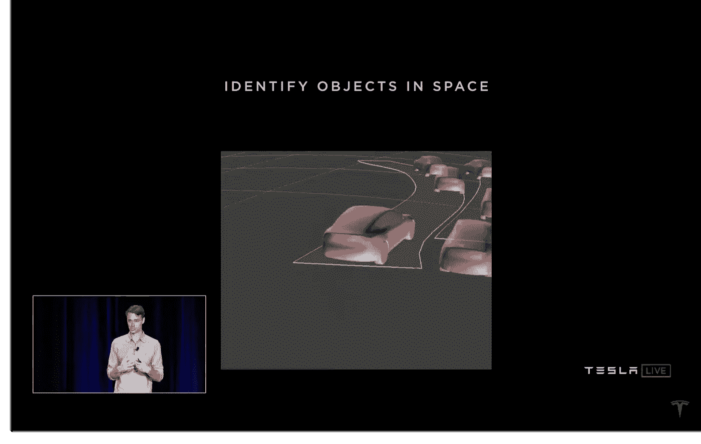

*   通过冗余视觉系统，特斯拉有助于从多个摄像头获得重叠的视野。通过将其与雷达和超声波传感器相结合，获得理解并建立准确的预测变得天衣无缝。这在构建下一代自动紧急制动(AEB)系统以避免或减轻车祸中发挥了关键作用。

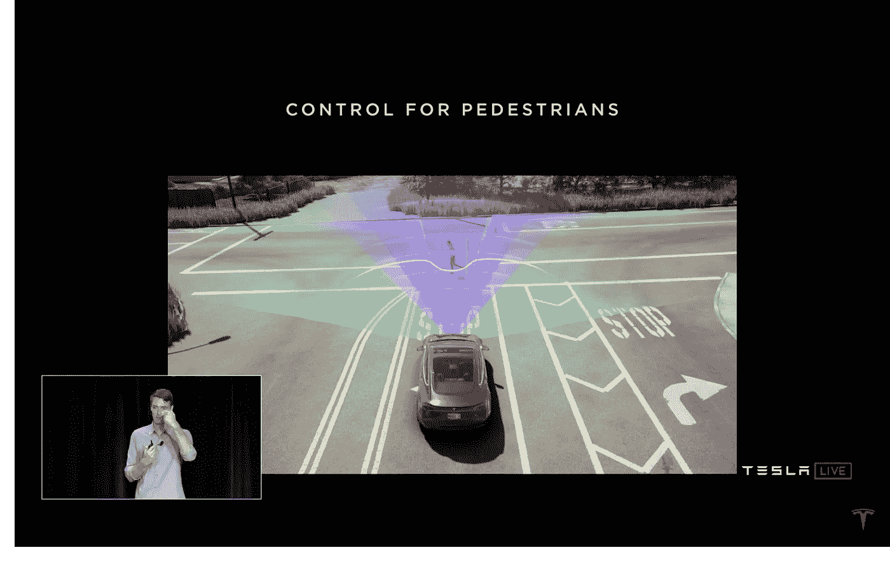

**阴影模式:**

随着时间的推移，特斯拉集成了新的算法，这有助于更细致地观察司机的行为和交通模式。最后，看看舰队在真实情况下会采取什么行动/决策。

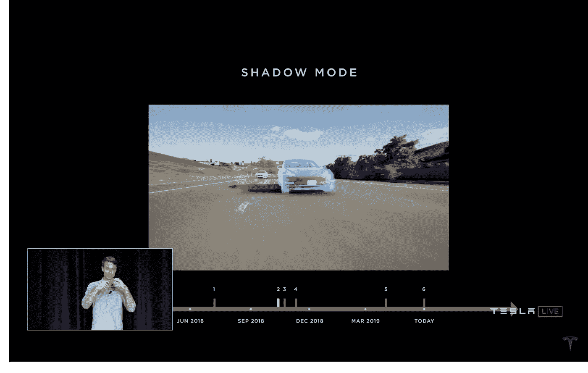

通过对 ML 模型进行更多的参数调整和培训，特斯拉帮助实现了“受控部署”，这仍然是特斯拉的早期接入计划。

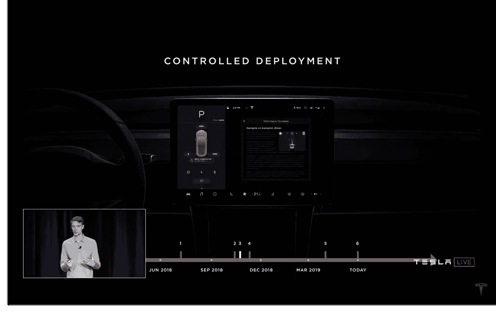

运行复杂的数据基础设施，以便随着时间的推移了解、调整和修复这些算法，并更接近人类行为，最终超越人类行为。

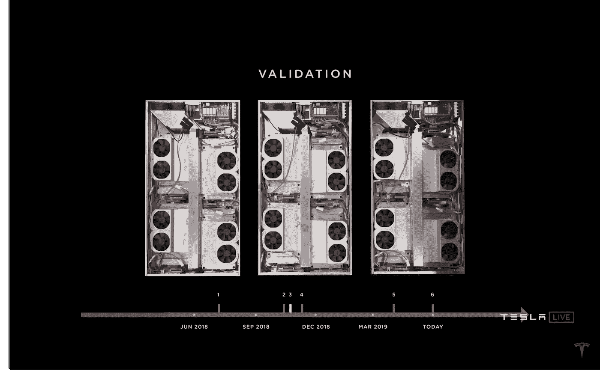

随着广泛的推广和持续的整合，特斯拉从车队中收集数据，包括一些有趣的案例，如高速公路上的同时合并。从这些场景中收集的数据有助于决定神经网络的适当行为和参数调整。随着时间的推移，已经有 900 多万次成功接受的车道变更。而且，目前高速公路上每天有超过 100，000 次自动变道。

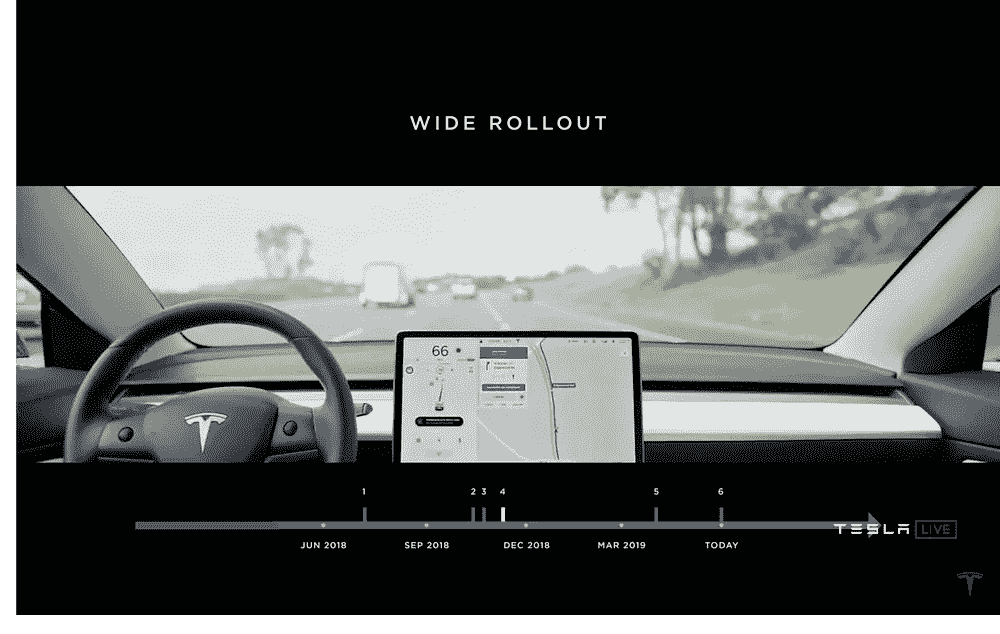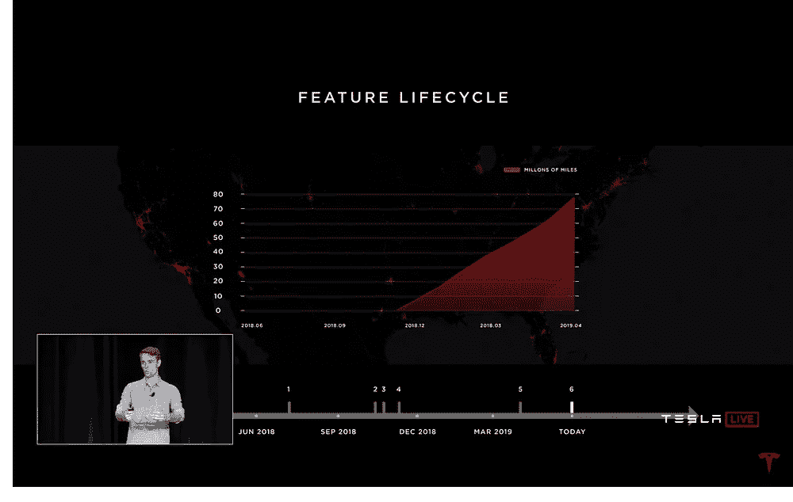

有了 FSD 计算机的基础设施、工具和组合能力，随着特斯拉从高速公路系统到城市街道的“自动驾驶导航”,数据引擎曲柄将随着时间快速增加。

# 第 3 部分:硬件工程副总裁皮特·班农

皮特工作的简要概述:

*   为全自动驾驶(FSD)定制设计的芯片。
*   <100W Power — Low parts costs i.e., at least 50 Trillion Operations Per Second (TOPS) of neural network performance; batch size =1 to minimize the latency or maximize safety and security.
*   Designed the dual redundant FSD Computer, HW 2.5 Computer Assembly, FSD Computer Assembly. These dual redundant chips add significant value to Perception with the help of Radar, GPS, Maps, IMU, Ultrasonic, Wheel Ticks, Steering angle. Then, these redundant systems finally compare and validate.

**利用特斯拉的现有团队:**

电源设计、信号完整性分析、封装设计、系统软件、板卡设计、固件、系统验证等。

**FSD 芯片:**

对新的 FSD 硬件的早期测试表明，在完全冗余的计算能力下，图像处理能力提高了 21 倍。

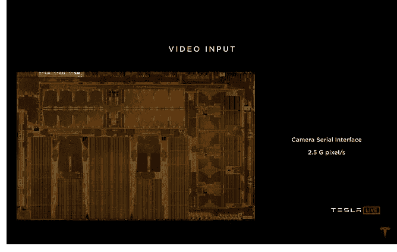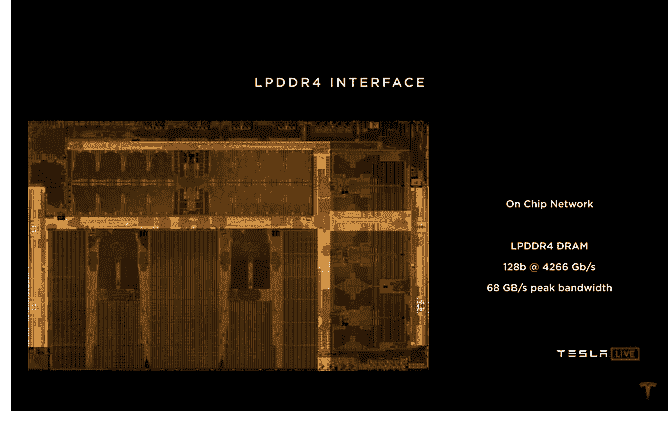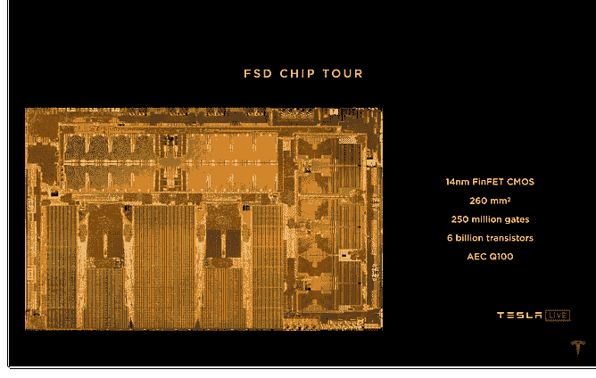

**图像信号处理器:**

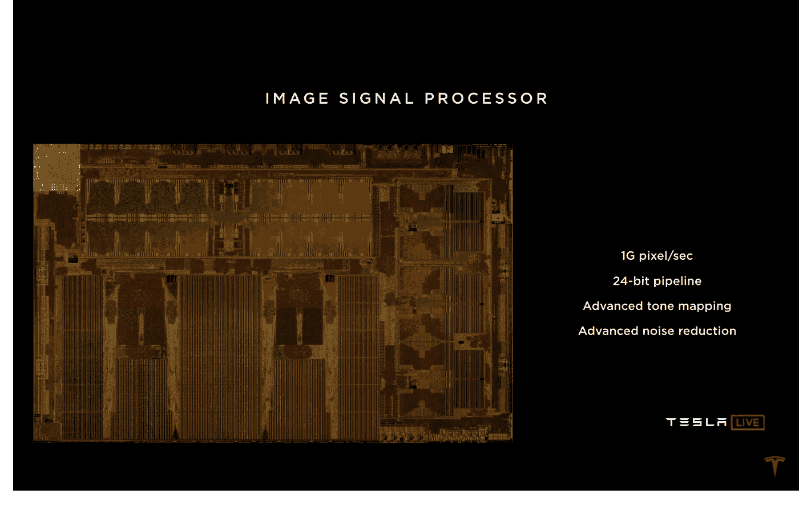

*   1G 像素/秒和 24 位流水线:充分利用汽车提供的 HDR 传感器。
*   高级色调映射:用于细节和阴影。
*   高级降噪:提高整体图像质量。

**神经网络处理器:**

*   32MB SRAM:保存临时结果，并最大限度地减少芯片内外传输所需的数据量。这反过来降低了功率。
*   其他规格:ReLU 硬件，池硬件，36 个最高 2 GHz。
*   每个芯片 2 个，总共 72 个。

**视频编码器:**

*   H.265 视频编码器

**图形处理器:**

*   1 GHz、600 GFLOPS、FP32、FP16

**主处理器:**

*   12 个 ARM A72 64b CPUs
*   2.2 千兆赫

**安全系统:**

*   锁定步骤 CPU
*   最终传动控制
*   控制验证

**安全系统:**

*   确保系统只运行由 Tesla 加密签名的代码。

**神经网络加速器:**

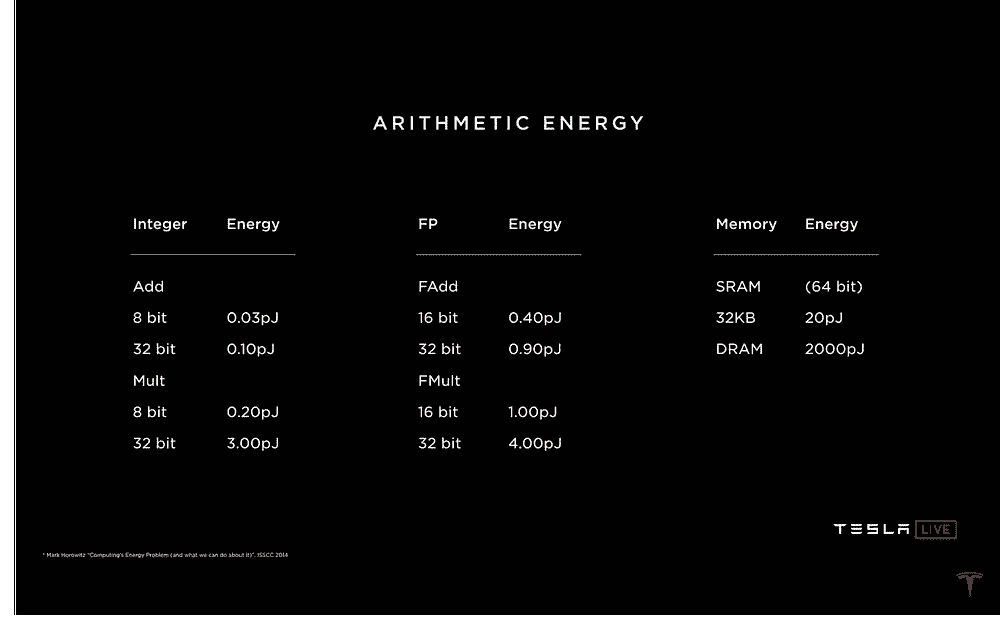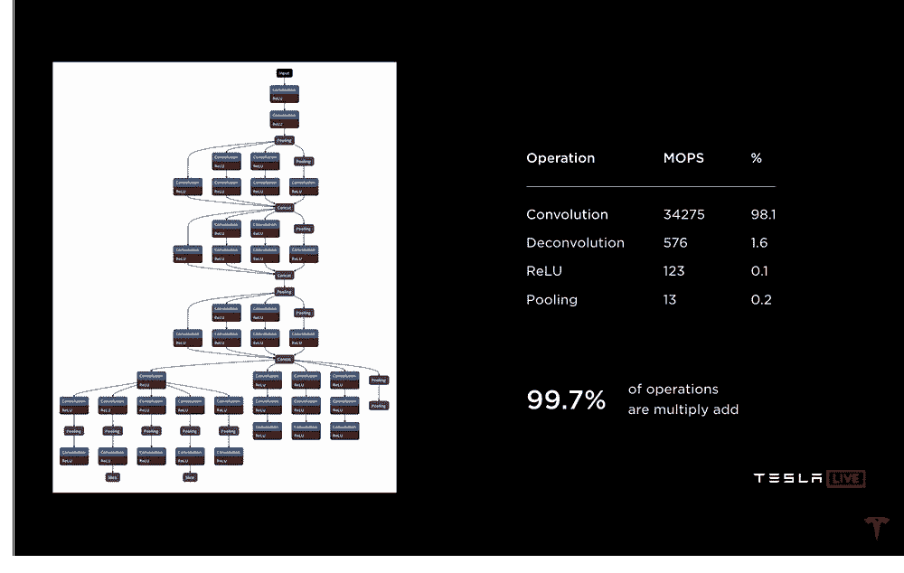

**控制能量:**

*   执行一条指令需要多少功率？
*   32b 增加的功率是总功率的 0.15%，即，最小化控制并将所有可用功率用于运算。

**计算-乘-加:**

每个时钟总共有 9216 次乘法加法。对于每个时钟，它显示

*   256b 的激活数据。
*   128b 的权重数据。

**后处理:**

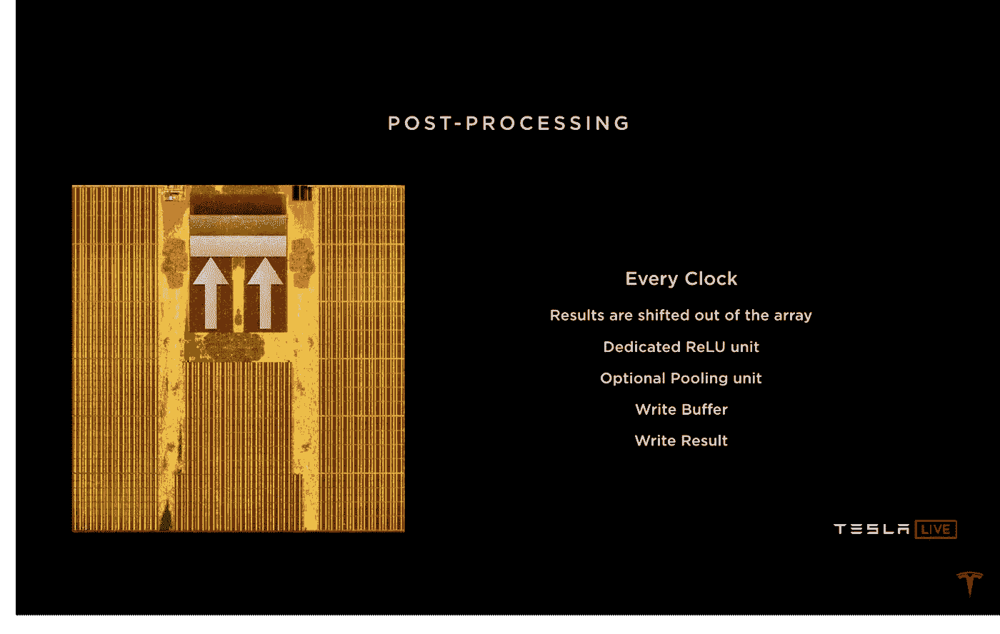

后处理的顺序步骤:计算完点积后，卸载引擎将数据移出→专用 ReLU 单元→可选池单元→写缓冲区→写结果。

**神经网络编译器:**

*   构建并填充网络图
*   将功能重新映射到硬件指令上
*   熔丝层(conv-Scale-ReLU-Pool)
*   平滑层
*   减少存储体冲突的通道填充
*   DMA 插入
*   代码生成

**简单编程模型:**

经营一个网络，仅仅四家店铺就包括

*   设置输入缓冲地址
*   设置输出缓冲地址
*   设置权重缓冲地址
*   设置程序地址并运行控制

**结果&比较(FSD 与 HW 2.5):**

功耗:HW 2.5 = 57W vs FSD = 72W (FSD 仍然是值得的，因为它在神经网络上运行的效率很高)

成本:FSD =硬件 2.5 的 0.8 倍

性能(FPS): FSD =硬件 2.5 的 21 倍

顶:FSD =144 顶 vs Drive Xavier = 21 顶

**结论:**

FSD 计算机将使特斯拉汽车的安全性和自主性达到新的水平，而不会影响成本或里程。

*   出色的表现(144 分)
*   出色的动力/性能
*   完全冗余
*   适中的成本

**问&答:**

*   特斯拉的车队(即路上的“数据收集车”)是其最大的优势

打个比方:谷歌搜索引擎比其他搜索引擎有巨大的优势，因为随着越来越多的人用他们的查询有效地编程谷歌，它会变得更好。

*   功耗在消防安全中发挥着巨大的作用，最重要的是，对于城市中的机器人出租车车队来说。
*   最近，电动汽车竞争者之间的竞争已经缩小到努力消除钴，锂离子电池中最昂贵的金属。关于这些数字以及特斯拉如何努力降低其电池组成本的简要概述，请阅读史蒂夫·莱文的文章。
*   真实世界里程>>>模拟里程: ***如果模拟真的捕捉到了真实世界，那么这将证明我们已经生活在模拟的*** (事实显然并非如此)。现实世界非常复杂、怪异、不断发展，并且有数百万个案例。

# 第四部分:埃隆·马斯克谈机器人出租车和自动驾驶的未来

为了有一个消防汽车或机器人出租车网络，有必要在整个车辆的硬件水平冗余。自 2016 年 10 月以来，所有特斯拉汽车都是为了实现具有必要功能的机器人出租车车队而生产的。它们有冗余硬件，包括动力转向、电源、数据线、电机、辅助动力系统。

**全自动驾驶的未来:**

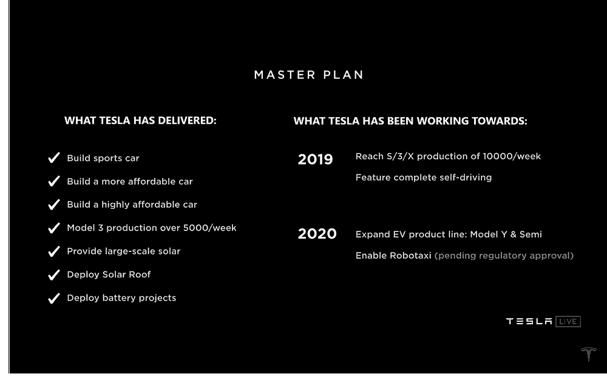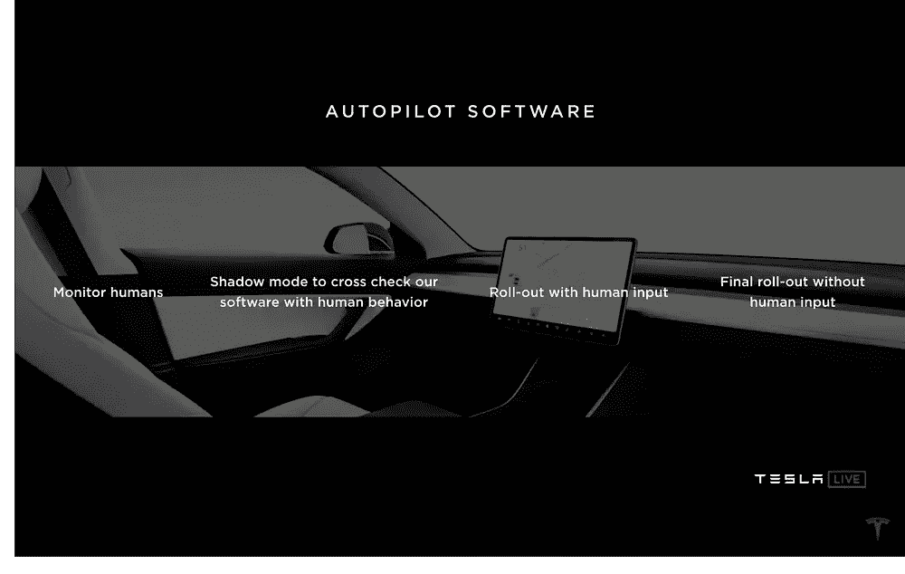

这类似于优步和 Airbnb 的组合模式:你可以在特斯拉网络中添加或删除你的汽车，特斯拉将获得 25-30%的收入。

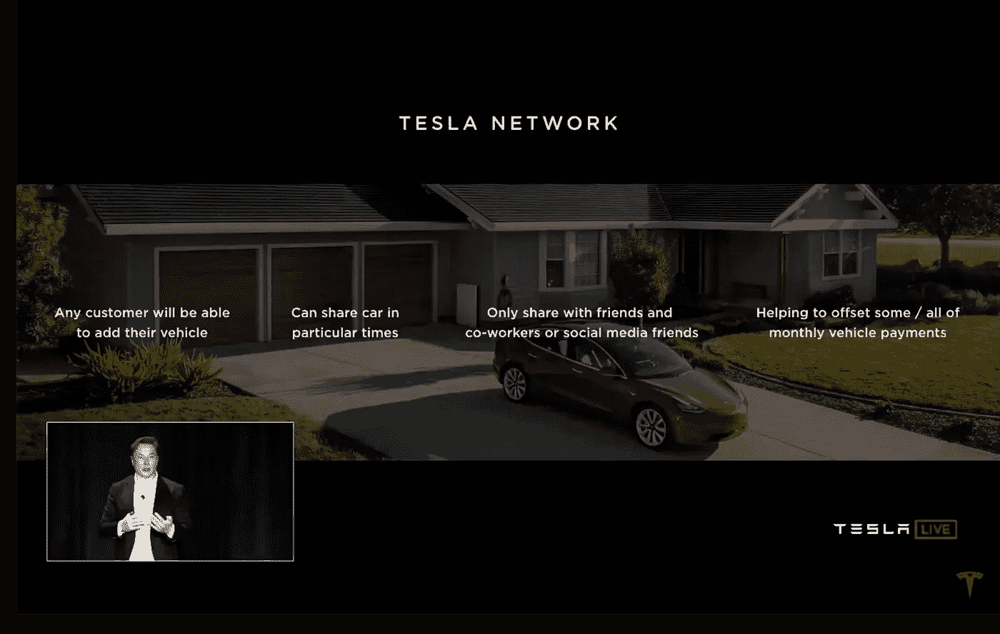

你可以用手机通过拼车应用召唤你的车，从网络中添加或删除你的车。

**平滑需求分布曲线的潜力:**

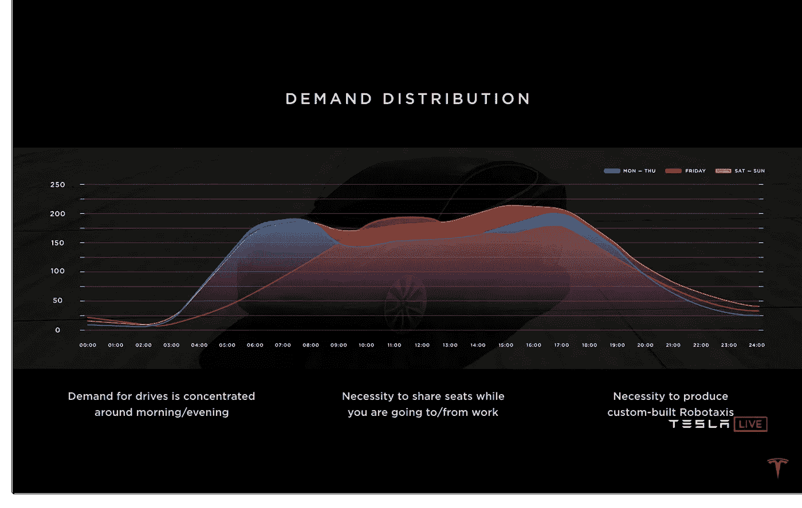

通常情况下，汽车的使用时间约为每周 10-12 小时。但在自动驾驶和机器人出租车模式下，汽车的使用时间可能会增加到一周的 1/3，即一周 55-60 小时。因此，车辆的基本效用增加了 5 倍，这是“经济效率”的巨大提高。

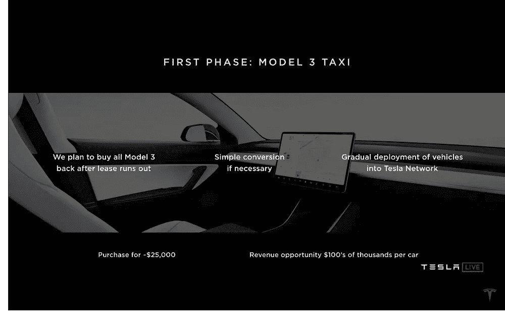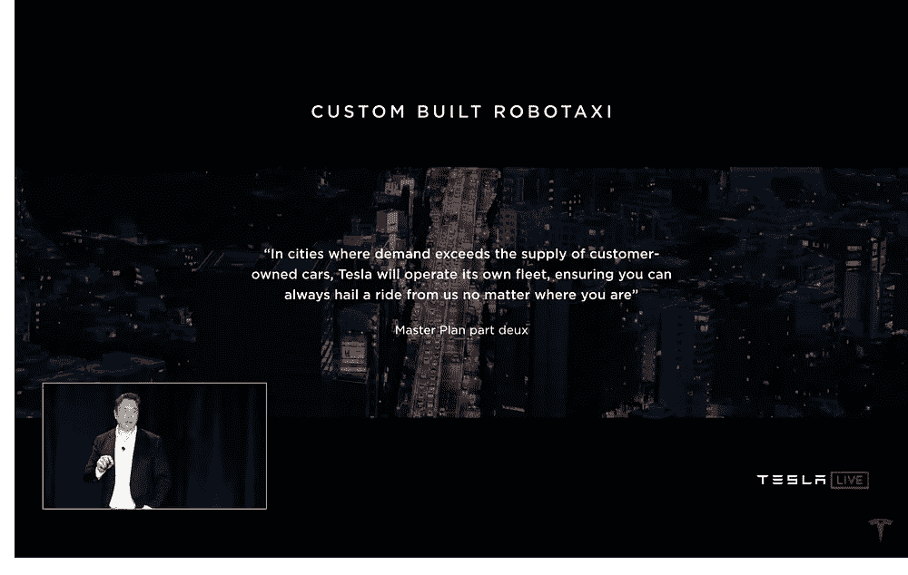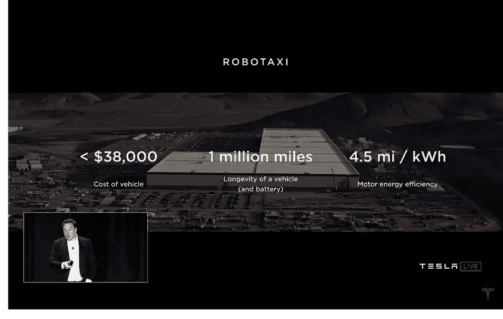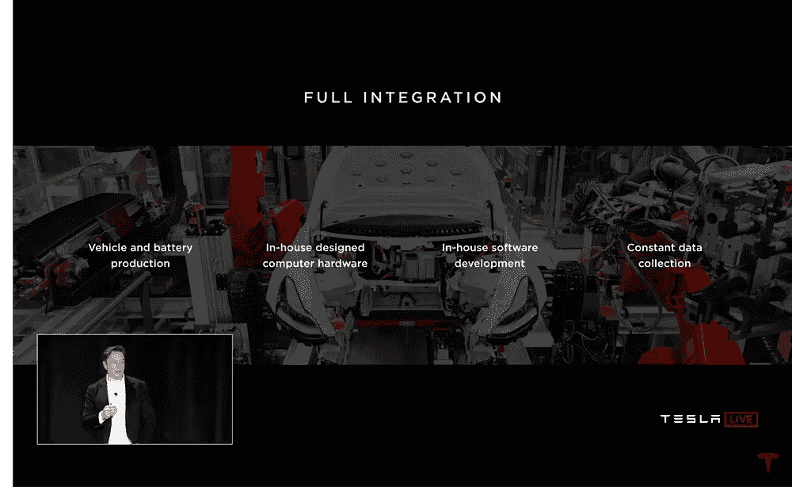

这种机器人出租车的设计寿命长达 100 万英里，维护量很少。特斯拉的硬件团队一直在优化汽车，以实现超高效的机器人出租车轮胎设计，并最终摆脱方向盘、踏板和其他部件，因为它们在未来的某个时候变得不那么重要。

**机器人出租车成本模型:**

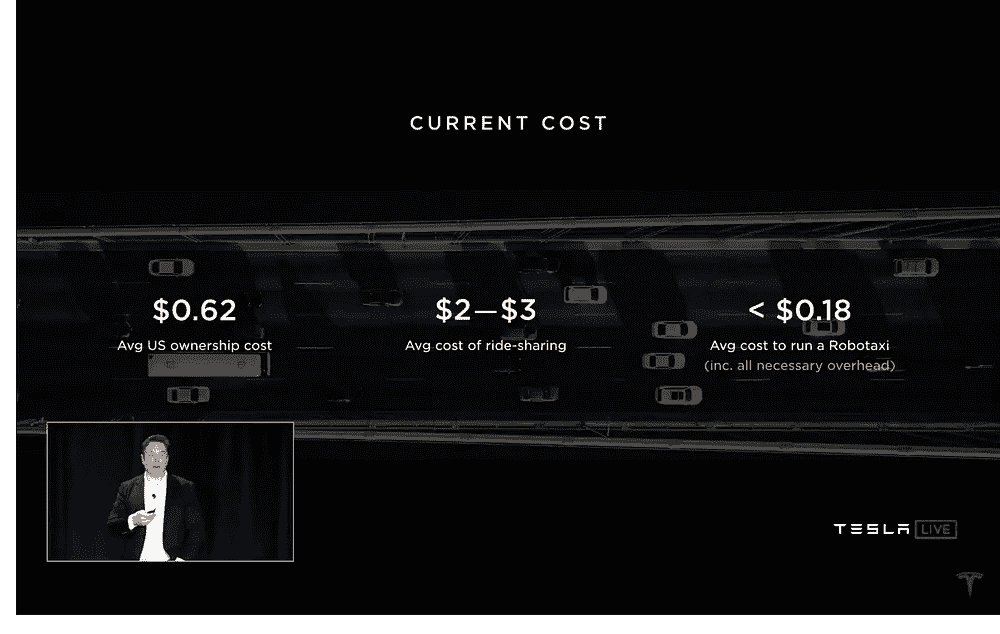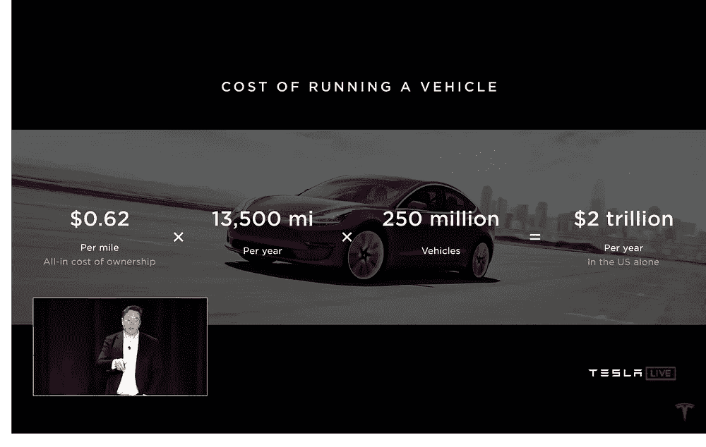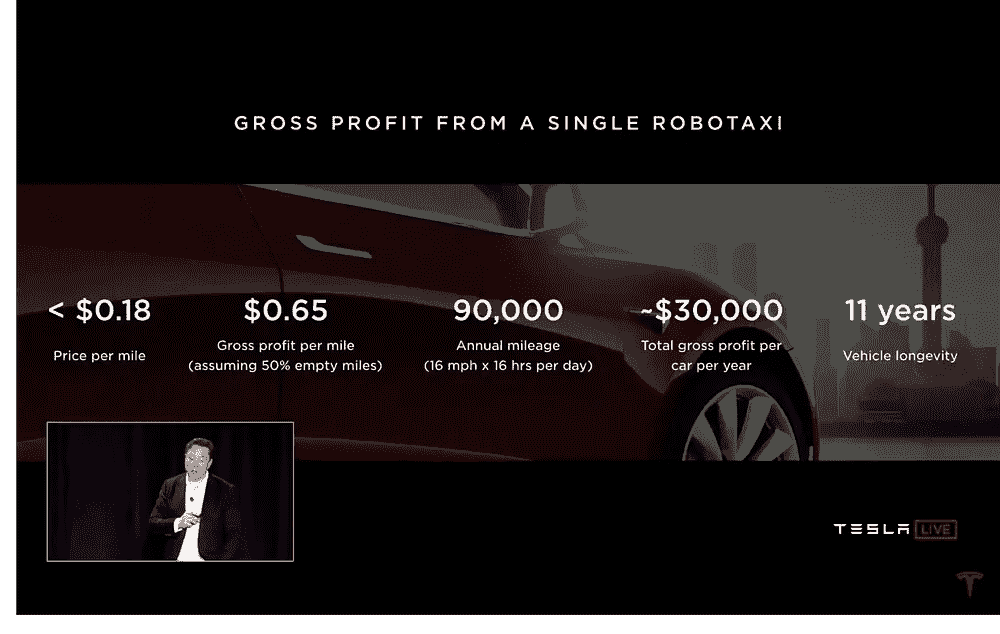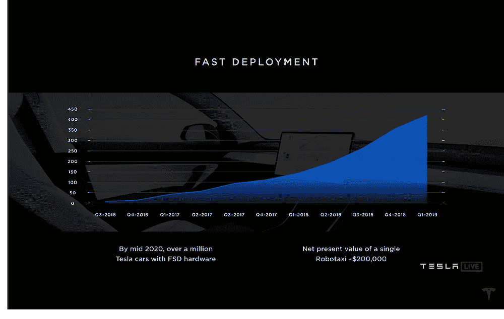

**特斯拉的文化及其乐观的目标:**

埃隆被认为是一个总是承诺的人——他可能对其中一些事情的时机持乐观态度，但在大多数情况下，他从未对结果做出过多承诺。

> “这不是我开出一个关于世界的观点，而是我预测消费者的需求。未来，消费者会要求不允许人们驾驶这些两吨重的死亡机器。”
> 
> —埃隆·马斯克(Elon Musk)谈自主的未来。

引用马斯克在一次采访中的话，“我宁愿乐观错误，也不愿悲观正确”——我个人认为，与这句话/信念相关的他的大多数决定和承诺都是基于背景、直觉和远见的。在过去几年里跟踪了 SpaceX 和 Autopilot AI 团队的工作之后，我确信特斯拉和 SpaceX 的内部目标都非常乐观——并且，在特斯拉和 SpaceX 的文化中贯穿这种信念是需要高度赞赏的事情。

我很好奇，并期待了解更多关于“Dojo”架构的见解，以及机器人出租车车队在未来几年可能如何改变监管和保险业务。

**进一步阅读和视频:**

我强烈推荐以下讲座/视频，以了解 Andrej 和他的团队在开发 FSD 能力时是如何应对挑战性案例和瓶颈的:

1.  [PyTorch 在特斯拉，安德烈·卡帕西](https://www.youtube.com/watch?v=oBklltKXtDE)
2.  [Andrej Karpathy——全自动驾驶的 AI](https://www.youtube.com/watch?v=hx7BXih7zx8)
3.  [安德烈·卡帕西:特斯拉自动驾驶和感知与预测的多任务学习](https://www.youtube.com/watch?v=IHH47nZ7FZU)
4.  [自动驾驶研讨会的可扩展性| CVPR 20 周年主题演讲| Andrej Karpathy | Tesla](https://www.youtube.com/watch?v=X2CpuabzRaY)
5.  [构建软件 2.0 堆栈(Andrej Karpathy)](https://www.youtube.com/watch?v=y57wwucbXR8)
6.  [Andrej Karpathy 在特斯拉谈人工智能(全栈深度学习——2018 年 8 月)](https://www.youtube.com/watch?v=ZVJTqAuPvTU)

*如果您有任何意见想与我分享(或)为我的写作或想法提供任何相关反馈，我很高兴收到您的来信。欢迎随时在*[***Twitter***](http://twitter.com/ThisIsSandeepA)*[***LinkedIn***](https://www.linkedin.com/in/sandeep-a/)*上与我联系，或者在*[***GitHub***](https://github.com/SandeepAswathnarayana)*上关注我。**