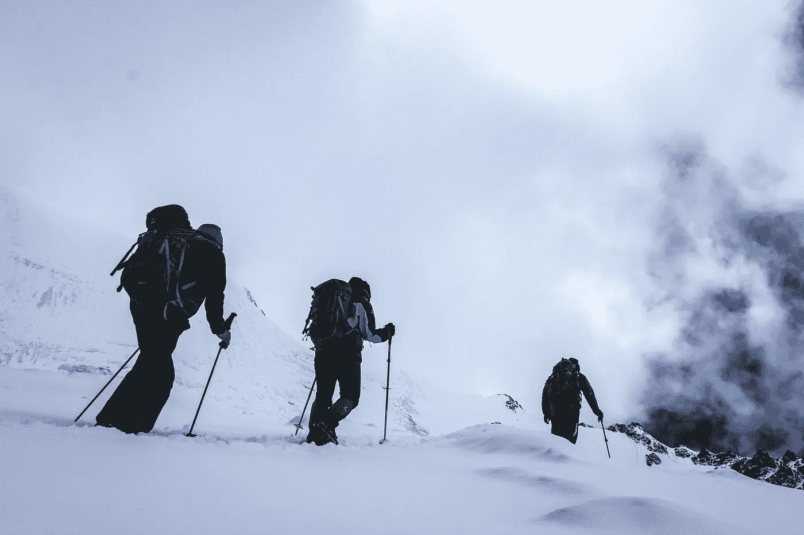
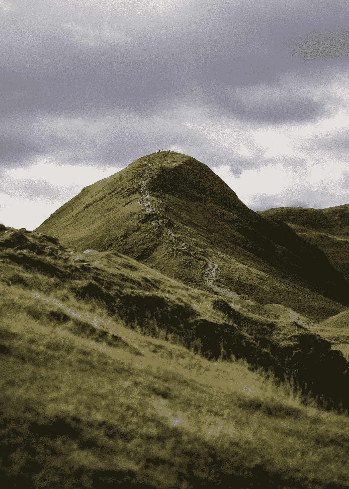
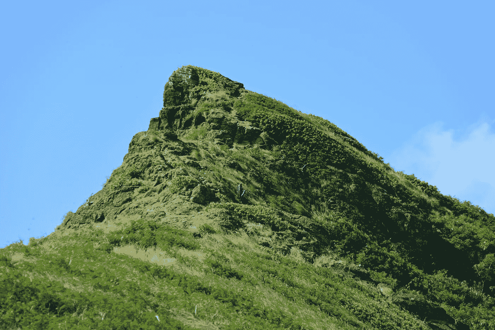
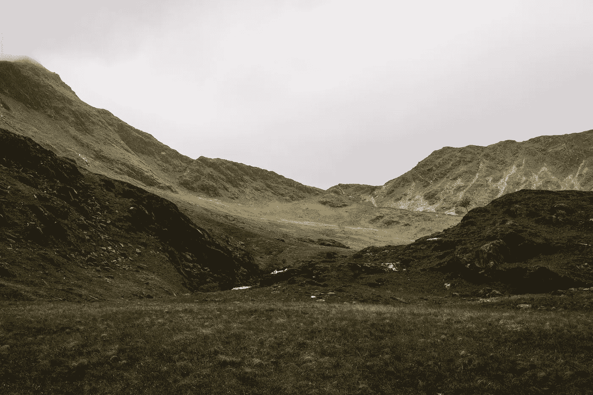

# 为什么爬山算法是最重要的人工智能方法

> 原文：<https://pub.towardsai.net/how-the-hill-climbing-algorithm-is-the-most-important-ai-method-316908b015ed?source=collection_archive---------2----------------------->

## 爬山算法最佳实践、用例、实现方法和途径、不同类型和挑战

来自 Unsplash 的 Kunzang Dorjey

爬山算法的功能是作为优化问题的局部搜索技术[2]。它的工作方式是从一个随机点开始，然后移动到下一个最佳设置[4]，直到它达到局部或全局最优[3]，无论哪个先出现。

作为一个例子，假设我们想找到某个丘陵地形上的最高点[5]。我们可以如下使用爬山算法:从地图上的任意位置开始[5]；评估哪个方向通向上坡；朝那个方向移动；从第二步开始重复，直到你不能再爬得更高为止(也就是说，你已经到达了一个局部最高点)。

来自 Unsplash 的 Nicholas Beel

# 一个典型的方法在这个年表中排序

—适应度函数是我们想要最小化的优化问题[6]。

—从函数图上的任意点开始，这可以是任何有效的解(x0)。

—评估 f(x0)的值，以确定它是否已经低于当前已知的最佳解决方案[1]。

—通过向上或向下移动一个维度来比较 f(x0)与其邻居:如果您当前位于 X 轴上的位置 2，您可能的下一步是 1 和 3 [7](所谓的邻居)。

来自 Unsplash 的 Heriberto García

# 激活它的数学程序

用例:求函数的局部最大值。该算法从山顶开始，然后沿着斜坡向下移动，直到到达底部[8]。一旦到了山底，它就会寻找另一座山去爬。重复这个过程，直到再也找不到山[9]或者达到最大迭代次数。综上所述，该方法按如下顺序排列(按时间顺序):(1)找到一个景观的最高点；(2)从该点向下行进；(3)如果有多个高度相同的点，选择任意一个；(4)记录去过的地方，以免重游；以及(5)当你不能继续下坡时停下来。

来自 Unsplash 的 Max Duzij

# 关于如何使用它的一些想法

—爬山算法可应用于需要找到最佳解决方案但没有已知起点的问题。例如，一个旅行中的员工问题要求找到恰好访问每个城市一次并返回起点的最短路线。没有已知的最佳路线；爬山算法可用于发现最优解。

—使用爬山法可以解决的其他优化问题包括在两点之间寻找最短路径，或者通过选择最有利可图的产品或服务组合，在业务场景中实现利润最大化。

—爬山可用于解决难题或与对手玩国际象棋或跳棋等游戏。在这些情况下，该算法用于通过考虑所有可能的移动并选择导致分数最大增加或剩余棋子数量最小减少的移动来寻找下一个最佳移动。

—爬山可应用于多目标问题，例如找到一条最小化行驶距离和燃料消耗的路线。

来自 Unsplash 的杰里米·贝赞格

# 用这个算法解决的难题

—查找两点之间的最短路径:例如，在地图上查找两点之间的最短路径。可以部署爬山算法，通过从一个点开始并考虑每一个可能的下一步直到到达目的地来找到最佳路径。

—确定一组任务的最佳顺序:另一个例子是确定完成某个目标的有效行动顺序，例如制定一个避免冲突并最大限度提高效率的课程或活动计划。

—优化机器学习模型:爬山算法可以通过调整参数来优化机器学习模型，直到模型在训练数据上达到最佳性能。

—安排资源以实现最大效率:即，在制造操作中，错开工人休息时间以使现场始终有足够的工人是很重要的；给定不同的约束条件(例如，休息多长时间；基于基于分钟时间约束建立优化模型)。

—制定避免冲突的时间表:在许多组织中，员工有非竞争性的兴趣，但仍然需要他们自己的时间。

来自 Unsplash 的[伊丹·科恩](https://unsplash.com/@edan)

# 算法的变体

—首选爬山:运行直到达到局部最大值，然后返回当前解决方案，这可能导致“陷入”次优解决方案[10]。

—随机重新开始爬山:从搜索空间中的随机点开始，运行 N 步首选爬山，其中 N 是某个预定义的值，然后从搜索空间中的另一个随机点重新开始，并重复此过程 K 次，然后返回找到的最佳解决方案。这种方法通过从新的点重新开始，而不是一旦达到局部最优就继续下山，有助于避免像常规爬山那样经常陷入困境。

—模拟退火:类似于随机重启爬山，不同之处在于，模拟退火不是像常规爬山那样朝着更好的解决方案向上移动，也不是像随机重启爬山那样从头开始，而是当模拟退火似乎要远离全局最优(总体上最好的解决方案)时，它有时会暂时接受更差的解决方案。随着时间的推移，接受这些更差[12]解决方案的概率会稳步下降，因为在算法逻辑的每次运行过程中，温度会降低[12]。这背后的直觉是，如果算法总是朝着更好的解决方案向上走，它们可能会陷入局部最优(次优解决方案)，永远不会找到全局最优。通过偶尔走下坡路走向更差的解决方案，它有机会最终找到摆脱任何次优陷阱的方法[13]。

—局部波束搜索:更复杂的爬山算法[14]并行运行多个首选爬山实例，每个实例从搜索空间中不同的随机点开始。然后，每个过程找到的局部最优解被保存为“波束”[15]，并用于为下一次迭代生成新的后续状态。这种方法通常能找到比常规爬山法甚至模拟退火法更好的整体解决方案[16],因为它同时运行多个过程，而不是一个过程，因此增加了最终偶然发现全局最优解的机会。

来自 Unsplash 的阿吉特·桑德胡

# 机器学习应用

—通过迭代改进以前的解决方案，找到问题的最佳解决方案。

—查找两点之间的最短路径，或通过查找最大值或最小值来优化函数。

—训练人工神经网络[17]和其他类型的预测器；为模型选择超参数，如决策树和朴素贝叶斯分类器[18]，并在数据预处理任务中选择特征，如特征选择和维数减少。

—约束优化问题:许多商业应用需要一种优化技术，能够解决对变量施加约束的问题。

—数据拟合/回归分析:使用回归分析或曲线拟合确定数值优化方法。这里的目标还是最小化与我们的未知模型系数与观测数据值的拟合程度相关的一些成本函数

来自 Unsplash 的 Traworld 官员

# 自然语言处理任务

—当设计一个计算机程序来击败人类对手时，人工智能系统可能会在搜索最佳步骤的过程中使用爬山算法。

—当试图了解如何最好地玩一种新游戏(如围棋或扑克)时，可以使用人工神经网络，该网络在其训练过程中使用爬山算法来尝试局部优化其性能函数近似值。

—在自然语言处理中，词性标注和语法分析树构建等任务涉及在给定输入数据(通常是句子)的情况下，查找最可能的标签或单词序列。可以使用基于顺序的方法，其中每一步对应于通过挑选产生后验概率估计的最大增加的一个选项来在可用选项中进行选择，直到不可能有进一步的改进。

—给定一个大的文本语料库，人们可能想要找到特定主题的单词或短语特征。为此目的，可以使用爬山算法，从一组随机的分配开始，然后重复交换两个项目，如果它增加了一致性分数，直到没有进一步改进的可能。

来自 Pexels 的 from 马德雷布纳

—在给定上下文中查找同义词或近义词的文本处理任务可能代表不同的抽象级别。想法是从现有的词义消歧解决方案开始，并通过局部改变分配和重新计算相似性度量来尝试改进它，直到找不到更好的解决方案。

—在信息检索中，当在大量文档中搜索与某个用户查询相关的文档时，位置敏感散列技术[19]可以通过使用将相似对象映射到同一个“桶”[20]中的散列来加速该过程，而不相似的对象不太可能被散列到同一个桶中。

—将数据点聚类到组中，以便每个组中的成员比组之间的成员更相似(在某些距离度量方面)。例如，用于播种[21]初始聚类中心的 k-means++方法使用爬山技术进行迭代，如果运行足够长的时间，则该迭代致力于找到近似解。

# 优化算法的困难

我们不需要深入研究这个领域，因为这是相当简单的:他们可以陷入局部最优[22]，这意味着他们找到一个次优的解决方案，因为他们没有探索整个搜索空间，他们可能会很慢地收敛到一个解决方案，特别是如果搜索空间很大。

# 离别的思绪

任何优化问题都可以表示为一个搜索空间，并可能使用爬山算法来解决。许多现实世界的工程和设计问题过于复杂，无法通过分析来解决。

*参考文献:*

*1。Goldfeld 等人，通过改进的二次爬山和其他方法最大化。*[*https://www . Princeton . edu/~ ERP/ERP archives/archive pdf/m95 . pdf*](https://www.princeton.edu/~erp/ERParchives/archivepdfs/M95.pdf)

*2。*[*https://nscpolteksby . AC . id/Ebook/files/Ebook/Computer % 20 工程/算法%20(2013)/9。% 20 chapter % 208% 20-% 20 hill % 20 clipping . pdf*](https://nscpolteksby.ac.id/ebook/files/Ebook/Computer%20Engineering/Algorithms%20(2013)/9.%20Chapter%208%20-%20Hill%20Climbing.pdf)

*3。动态爬山:克服最优化技术的局限性。*[*https://citeseerx.ist.psu.edu/viewdoc/download?doi = 10 . 1 . 1 . 53 . 6367&rep = rep 1&type = pdf*](https://citeseerx.ist.psu.edu/viewdoc/download?doi=10.1.1.53.6367&rep=rep1&type=pdf)

*4。雅各布森，&尤瑟森。(未注明)。广义爬山算法的性能分析。启发式期刊，10(4)，387–405。*[【https://doi.org/10.1023/B:HEUR.0000034712.48917.a9】T21](https://doi.org/10.1023/B:HEUR.0000034712.48917.a9)*5。*

*5。Sathiyaraj，c .，Ramachandran 先生，m .，教授，Amudha，m .，夫人，Kurinjimalar，r .，密西西比州。(2022).爬山优化方法综述。管理和商业的近期趋势，3(1)，1–7。*[*https://doi.org/10.46632/rmc/3/1/1*](https://doi.org/10.46632/rmc/3/1/1)

*6。考顿。(2008 年 1 月 1 日)。*应用于场景生成的适应度函数的自动发明*。施普林格柏林海德堡。[https://link . springer . com/chapter/10.1007/978-3-540-78761-7 _ 41](https://link.springer.com/chapter/10.1007/978-3-540-78761-7_41)*

*7。将遗传算法与爬山法混合用于全局优化:两种可能的方法*。(未注明)。IEEE Xplore。于 2022 年 7 月 29 日从[https://ieeexplore.ieee.org/abstract/document/349948/](https://ieeexplore.ieee.org/abstract/document/349948/)检索

*8。*戈麦斯-巴列罗，加尔巴利，菲雷兹，&奥尔特加-加西亚。(2011 年 1 月 1 日)。*基于上山单纯形算法的爬山攻击及其在签名验证中的应用*。施普林格柏林海德堡。[https://link . springer . com/chapter/10.1007/978-3-642-19530-3 _ 8](https://link.springer.com/chapter/10.1007/978-3-642-19530-3_8)

*9。在很多小山丘上爬山。(未注明)。*国际会计师联合会会议录卷*， *2* (2)，第 322–334 页。[https://doi . org/10.1016/s 1474-6670(17)69049-9](https://doi.org/10.1016/S1474-6670(17)69049-9)*

*10。*智能混合布谷鸟搜索和β-爬山算法。(未注明)。*沙特国王大学学报—计算机与信息科学*， *32* (2)，159–173。[https://doi.org/10.1016/j.jksuci.2018.05.003](https://doi.org/10.1016/j.jksuci.2018.05.003)

11。(未注明)。ACM 数字图书馆。于 2022 年 7 月 29 日从 https://dl.acm.org/doi/abs/10.1145/2716282.2716287 检索到

12。模拟退火算法:概述。(未注明)。IEEE Xplore。于 2022 年 7 月 29 日从[https://ieeexplore.ieee.org/abstract/document/17235](https://ieeexplore.ieee.org/abstract/document/17235)检索

*13。CSDL* 。(未注明)。IEEE 计算机学会。2022 年 7 月 29 日检索，来自[https://www . computer . org/csdl/proceedings-article/icassp/1988/00196808/12 omnb 06 lam](https://www.computer.org/csdl/proceedings-article/icassp/1988/00196808/12OmNB06laM)

*14。Chang 等人*柔性制造系统中基于瓶颈的波束搜索作业调度。[*https://www . tandfonline . com/doi/ABS/10.1080/00207548908942666*](https://www.tandfonline.com/doi/abs/10.1080/00207548908942666)

*15。*基于输入的自适应随机测试用例优先化:局部波束搜索方法。(未注明)。*系统与软件杂志*， *105* ，91–106。[https://doi.org/10.1016/j.jss.2015.03.066](https://doi.org/10.1016/j.jss.2015.03.066)

16。威尔特，C. M .，塞耶，J. T .，&鲁姆尔，W. (2010 年 8 月 25 日)。*贪婪搜索算法的比较*。[https://www . aaai . org/OCS/index . PHP/SOCS/SOC S10/paper/view/2101](https://www.aaai.org/ocs/index.php/SOCS/SOCS10/paper/view/2101)

17。使用爬山局部搜索解决低利用率问题的优化 dragonfly 算法。(未注明)。IEEE Xplore。检索于 2022 年 7 月 29 日，来自[https://ieeexplore.ieee.org/abstract/document/9537102](https://ieeexplore.ieee.org/abstract/document/9537102)

*18。学习具有精确排序的加权朴素贝叶斯*。(未注明)。IEEE Xplore。检索于 2022 年 7 月 29 日，来自[https://ieeexplore.ieee.org/abstract/document/1410362](https://ieeexplore.ieee.org/abstract/document/1410362)

*19。一种基于位置敏感散列的生成可取消指纹模板的方法*。(未注明)。IEEE Xplore。检索于 2022 年 7 月 29 日，来自[https://ieeexplore.ieee.org/abstract/document/9185991](https://ieeexplore.ieee.org/abstract/document/9185991)

20。李，郑，李，李。(2017).使用 map reduce 范式平衡桶大小的局部敏感散列。*集群计算*， *22* (1)，1959-1971。[https://doi.org/10.1007/s10586-017-1013-2](https://doi.org/10.1007/s10586-017-1013-2)

21。 k-Means++在近似下的稳定性。(未注明)。*理论计算机科学*， *588* ，37–51。[https://doi.org/10.1016/j.tcs.2015.04.030](https://doi.org/10.1016/j.tcs.2015.04.030)

*22。阿尔贝塔尔。(2016).$ $ \ beta $ $β-爬山:探索性的本地搜索。*神经计算与应用*， *28* (1)，153–168。[https://doi.org/10.1007/s00521-016-2328-2](https://doi.org/10.1007/s00521-016-2328-2)*