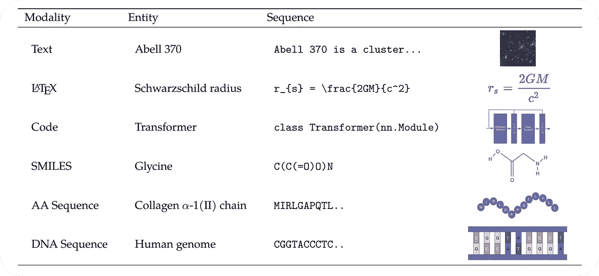

# 如何通过卡拉狄加获取科学知识

> 原文：<https://pub.towardsai.net/how-to-access-scientific-knowledge-with-galactica-8adc96ebe931?source=collection_archive---------2----------------------->

## 使用 Meta AI 的大型语言模型执行科学 NLP 任务的教程

科学知识的世界大得令人难以置信。搜索相关的研究论文、理解复杂的概念以及撰写学术文献可能会令人望而生畏，而且非常耗时，尤其是对于没有经验的研究人员而言。幸运的是，随着 Meta AI 大语言模型的出现，获取科学知识变得前所未有的简单。


Galactica 使用户能够访问科学知识和处理科学 NLP 任务(由作者和稳定传播创建)

在本教程中，我将向您展示如何使用 [Meta AI 的 Galactica](https://galactica.org/static/paper.pdf) 快速有效地执行各种科学 NLP 任务。我们将涵盖诸如查找相关引用、生成学术论文、处理多模态数据(例如，乳胶方程、代码片段、化学式等)等主题。)调研时经常遇到的，还有更多。

# Meta AI 的 Galactica 是什么？



卡拉狄加训练代表科学现象的文本序列(来源:[卡拉狄加论文](https://galactica.org/static/paper.pdf)

Galactica 是一个 120B 参数的大型语言模型，在精心策划的科学语料库上进行训练。训练数据不仅包括大量的科学文献，还包括下游科学 NLP 任务的数据集和代表科学现象的特殊标记。

专门化的标记化是 Galactica 不可或缺的一部分，因为它使模型能够预测引用或处理形式，如蛋白质序列或微笑公式:

*   **引用**:引用用引用标记`[START_REF]`和`[END_REF]`包装。
*   **推理** : `<work>` token 通过模仿内部工作记忆来实现一步一步的推理(本教程不涉及)。
*   **SMILES 公式** : SMILES 公式序列用记号`[START_SMILES]`和`[END_SMILES]`包裹。对于异构微笑，使用标记`[START_I_SMILES]`和`[END_I_SMILES]`。
*   **氨基酸序列**:氨基酸序列用记号`[START_AMINO]`和`[END_AMINO]`包裹。
*   **DNA 序列** : DNA 序列用令牌`[START_DNA]`和`[END_DNA]`包裹。

Meta AI 报告称，Galactica 的引文预测生成方法优于检索方法，这表明了语言模型取代搜索引擎的潜力。此外，Galactica 在推理任务基准(如 MMLU 和 MATH)上击败了现有方法，并在几个下游科学 NLP 任务(如 PubMedQA 和 MedMCOA)上树立了新的艺术水平。

尽管拥有强大的能力，类似于大多数语言模型，卡拉狄加还是容易产生幻觉。也就是说，模型在某些情况下会输出无意义的结果。因此，使用 Galactica 的研究人员应该经常检查生成的结果。

# 如何使用卡拉狄加

卡拉狄加可以通过`galai` Python 库访问。可以用`load_model`下载模型。

```
import galai as gal

model = gal.load_model(name="standard", num_gpus=2)
```

*   `name`参数是要使用的模型版本的名称。该模型有五个版本可用(`‘mini’, ‘base’, ‘standard’, ‘large’, ‘huge’`)，每个版本都有不同的参数大小(`125M, 1.3B, 6.7B, 30B, 120B`)。
*   `num_gpus`参数是要使用的 GPU 数量。我能够在两个英伟达 RTX 3090 GPU 上加载`‘standard’`版本；该型号为每个设备占用了大约 19GB 的内存。

# 文本生成

与大多数大型语言模型相似，Galactica 将每个 NLP 任务都框架为文本生成。您可以使用`generate`来生成文本。

```
# free-form text generation
input_text = "The reason why Transformers replaced RNNs was because"

generated_text = model.generate(input_text=input_text, 
                                max_length=256, 
                                new_doc=False, 
                                top_p=None)
print(generated_text)

"""
The reason why Transformers replaced RNNs was because they were able to capture long-term dependencies in the input sequence.

# 2.2.2\. Attention Mechanism

The attention mechanism was introduced in [START_REF] Neural Machine Translation by Jointly Learning to Align and Translate, Bahdanau[END_REF] to improve the performance of the encoder-decoder model...
"""
```

*   `input_text`是用于生成模型的输入上下文。卡拉狄加的其他高级功能可以通过输入环境的即时工程来使用。
*   `max_length`修改生成文本的最大令牌长度。默认值是 60 个令牌，因此对于更长的代，`max_length`应该设置为更高的值。模型的最大上下文长度是 2048 个令牌。
*   如果`new_doc`被设置为`True`，一个填充标记会自动附加到输入文本的前面，这样模型会把它当作一个新文档的开始。对于自由格式文本生成，`new_doc`应设置为`False`。
*   `top_p`参数用于细胞核取样。如果生成的结果看起来太重复，将值设置为 1 到 0 之间的浮点数，如`0.9`。否则`top_p`默认为`None`并使用贪婪解码。

## 论文和调查

你可以通过 prompt engineering 用 Galactica 生成各种类型的学术文献。如果一个提示被设计成类似于某种文档，那么它的完成也是如此。对于纸质文件，使用`Title:`。

```
# generate paper document
input_text = "Title: Self-Supervised Learning, A Survey\n\nAuthors: John Smith\n\n"

generated_text = model.generate(input_text, new_doc=True)
print(generated_text)

"""
Title: Self-Supervised Learning, A Survey

Authors: John Smith

# Abstract

Self-supervised learning is a class of machine learning methods that learn representations of data without the need for human-provided labels.\nIn this survey, we provide a comprehensive overview of the field
"""
```

当您需要对特定主题进行全面调查时，此功能特别有用。只需将提示设计为`Title: TOPIC, A Survey`，Galactica 将自动为您生成一个。

## 课堂讲稿和维基百科文章

对于维基百科风格的文章或讲稿，以`#`开始提示。

```
# generate wiki style articles
input_text = "# Multi-Head Attention\n\n"

generated_text = model.generate(input_text, new_doc=True)
print(generated_text)

"""
# Multi-Head Attention

The multi-head attention mechanism is a generalization of the single-head attention mechanism. The multi-head attention mechanism is a combination of multiple single-head attention mechanisms. The multi-head attention mechanism is shown in Figure 2.

The multi- ...
"""

# generate lecture notes
input_text = "# Lecture 1: The Ising Model\n\n"

generated_text = model.generate(input_text, new_doc=True)
print(generated_text)

"""
# Lecture 1: The Ising Model

# 1.1 The Ising Model

The Ising model is a simple model of ferromagnetism. It was introduced by Lenz in 1920 [[START_REF] Beitrag zur Theorie des Ferromagnetismus, Ising[END_REF]]
""" 
```

# 引文预测

Galactica 在一个大型科学语料库上接受训练，该语料库包括超过 3.6 亿条上下文引用和超过 5000 万条不同来源的唯一引用。这使得模型能够建议引用并帮助发现相关论文。引用用`[START_REF] TITLE, AUTHOR [END_REF]`表示。

## 搜索

要搜索讨论某个主题的论文，请使用下面的提示— `PAPER TOPIC [START_REF]`。由于`[START_REF]`标记被附加到输入上下文的末尾，Galactica 会将其视为引用的开始并完成其余部分。

```
# search citation
input_text = "An NLP paper that compares different ways of encoding positions in Transformer-based architectures "

generated_text = model.generate(input_text + "[START_REF]")
print(generated_text)

"""
An NLP paper that compares different ways of encoding positions in Transformer-based architectures 
[START_REF] On Position Embeddings in BERT, Wang[END_REF]
"""
```

## 预言；预测；预告

除了明确地搜索引文，你还可以提示 Galactica 在一个文档中建议一篇相关的论文。该模型已经在许多学术文本上进行了训练，其中包括隐式引用图的表示。因此，给出一个提示，比如`TEXT [START_REF]`，Galactica 可以自动建议与`TEXT`相关的引文。

```
# predict citation
input_text = """Recurrent neural networks, long short-term memory and gated recurrent neural 
networks in particular, have been firmly established as state of the art 
approaches in sequence modeling and transduction problems such as language 
modeling and machine translation """

generated_text = model.generate(input_text + "[START_REF]")
print(generated_text)

"""
Recurrent neural networks, long short-term memory and gated recurrent neural 
networks in particular, have been firmly established as state of the art 
approaches in sequence modeling and transduction problems such as language 
modeling and machine translation [START_REF] Recurrent neural network based 
language model, Mikolov[END_REF][START_REF] Sequence to Sequence Learning with 
Neural Networks, Sutskever[END_REF][START_REF] Neural Machine Translation by 
Jointly Learning to Align and Translate, Bahdanau[END_REF] ...
"""
```

## 生成比检索好吗？

人们可能会怀疑依靠 Galactica 进行引用预测，因为众所周知，大型语言模型会产生远离事实的内容。然而，Meta AI 报告说，在引文预测任务中，Galactica 的生成方法优于优化的稀疏和密集检索方法。Galactica 远非完美，但实验表明，该模型比传统搜索引擎产生更好的结果。

# 下游 NLP 任务

您可以使用 Galactica 完成传统的下游 NLP 任务，例如摘要、实体提取和问题回答。虽然通用语言模型可能会与科学术语或医学术语发生冲突，但 Galactica 却不是这样。例如，Meta AI 报告称，该模型在 PubMedQA 和 MedMCOA 问答基准上取得了新的最先进的结果；这两项任务都需要对高级生物医学概念有严格的理解。

## 摘要

要生成摘要，只需在文档末尾添加`TLDR:`。

```
# summarization
input_text = """Information overload is a major obstacle to scientific progress. The explosive growth in scientific literature and data has made it ever harder to discover useful insights in a large mass of information. Today scientific knowledge is accessed through search engines, but they are unable to organize scientific knowledge alone. In this paper we introduce Galactica: a large language model that can store, combine and reason about scientific knowledge. We train on a large scientific corpus of papers, reference material, knowledge bases and many other sources. We outperform existing models on a range of scientific tasks. On technical knowledge probes such as LaTeX equations, Galactica outperforms the latest GPT-3 by 68.2% versus 49.0%. Galactica also performs well on reasoning, outperforming Chinchilla on mathematical MMLU by 41.3% to 35.7%, and PaLM 540B on MATH with a score of 20.4% versus 8.8%. It also sets a new state-of-the-art on downstream tasks such as PubMedQA and MedMCQA dev of 77.6% and 52.9%. And despite not being trained on a general corpus, Galactica outperforms BLOOM and OPT-175B on BIG-bench. We believe these results demonstrate the potential for language models as a new interface for science. We open source the model for the benefit of the scientific community."""

generated_text = model.generate(input_text + "\n\nTLDR:", max_length=400)
print(generated_text)

"""
Information overload is a major obstacle to scientific progress. The explosive growth in scientific literature and data has made it ever harder to discover useful insights in a large mass of information. Today scientific knowledge is accessed through search engines, but they are unable to organize scientific knowledge alone. In this paper we introduce Galactica: a large language model that can store, combine and reason about scientific knowledge. We train on a large scientific corpus of papers, reference material, knowledge bases and many other sources. We outperform existing models on a range of scientific tasks. On technical knowledge probes such as LaTeX equations, Galactica outperforms the latest GPT-3 by 68.2% versus 49.0%. Galactica also performs well on reasoning, outperforming Chinchilla on mathematical MMLU by 41.3% to 35.7%, and PaLM 540B on MATH with a score of 20.4% versus 8.8%. It also sets a new state-of-the-art on downstream tasks such as PubMedQA and MedMCQA dev of 77.6% and 52.9%. And despite not being trained on a general corpus, Galactica outperforms BLOOM and OPT-175B on BIG-bench. We believe these results demonstrate the potential for language models as a new interface for science. We open source the model for the benefit of the scientific community.

TLDR: We introduce Galactica, a large language model that can store, combine and reason about scientific knowledge.</s>
"""
```

## 实体提取

您可以从问答格式的文档中提取实体。设计如下提示— `TEXT\n\nQ:What scientific entities are mentioned in the abstract above?\n\nA:`。根据文档的主题，您可以用更特定于领域的术语来替换`scientific entities`，比如`biomedical entities`。

```
# entity extraction
input_text = """Information overload is a major obstacle to scientific progress. The explosive growth in scientific literature and data has made it ever harder to discover useful insights in a large mass of information. Today scientific knowledge is accessed through search engines, but they are unable to organize scientific knowledge alone. In this paper we introduce Galactica: a large language model that can store, combine and reason about scientific knowledge. We train on a large scientific corpus of papers, reference material, knowledge bases and many other sources. We outperform existing models on a range of scientific tasks. On technical knowledge probes such as LaTeX equations, Galactica outperforms the latest GPT-3 by 68.2% versus 49.0%. Galactica also performs well on reasoning, outperforming Chinchilla on mathematical MMLU by 41.3% to 35.7%, and PaLM 540B on MATH with a score of 20.4% versus 8.8%. It also sets a new state-of-the-art on downstream tasks such as PubMedQA and MedMCQA dev of 77.6% and 52.9%. And despite not being trained on a general corpus, Galactica outperforms BLOOM and OPT-175B on BIG-bench. We believe these results demonstrate the potential for language models as a new interface for science. We open source the model for the benefit of the scientific community."""
query = '\n\nQ: What scientific entities are mentioned in the abstract above?\n\nA:'

generated_text = model.generate(input_text + query, max_length=400)
print(generated_text)

"""
Information overload is a major obstacle to scientific progress. The explosive growth in scientific literature and data has made it ever harder to discover useful insights in a large mass of information. Today scientific knowledge is accessed through search engines, but they are unable to organize scientific knowledge alone. In this paper we introduce Galactica: a large language model that can store, combine and reason about scientific knowledge. We train on a large scientific corpus of papers, reference material, knowledge bases and many other sources. We outperform existing models on a range of scientific tasks. On technical knowledge probes such as LaTeX equations, Galactica outperforms the latest GPT-3 by 68.2% versus 49.0%. Galactica also performs well on reasoning, outperforming Chinchilla on mathematical MMLU by 41.3% to 35.7%, and PaLM 540B on MATH with a score of 20.4% versus 8.8%. It also sets a new state-of-the-art on downstream tasks such as PubMedQA and MedMCQA dev of 77.6% and 52.9%. And despite not being trained on a general corpus, Galactica outperforms BLOOM and OPT-175B on BIG-bench. We believe these results demonstrate the potential for language models as a new interface for science. We open source the model for the benefit of the scientific community.

Q: What scientific entities are mentioned in the abstract above?

A: LaTeX equations, mathematical MMLU, MATH, PubMedQA, MedMCQA, BIG-bench</s>
"""
```

## 问题回答

在论文中，作者在问题前加上`Q:`或`Question:`。典型的格式是`Question: QUERY\n\nAnswer:`。

```
# question answering
query = "What is the notch signaling pathway?"
input_text = f"Question: {query}\n\nAnswer:"

generated_text = model.generate(input_text)
print(generated_text)

"""
Question: What is the notch signaling pathway?

Answer: Notch signaling pathway is a cell-cell communication pathway that regulates cell fate decisions during development. It is involved in cell proliferation, differentiation, apoptosis, and cell migration. The Notch signaling pathway is activated by the binding of ...
"""
```

# 多模态任务

如上所述，Galactica 可以处理非结构化文本以外的模态，如 LaTeX 方程、代码、SMILES 公式、DNA 序列和氨基酸序列。该模型使用特定于任务的标记来支持各种形式的科学知识。这种设计使用户能够处理多模态任务，这些任务涉及自然语言和科学现象表示之间的交互。

## 数学

数学方程用 LaTeX 表示。Galactica 用括号`\[ EQUATION \]`将 LaTeX 方程括起来，因此要生成数学描述，请确保以`\[`结束提示。这是一个给定自然语言描述预测 LaTeX 方程的例子。

```
# predict math formula
input_text = "The Schwarzschild radius is defined as: "

generated_text = model.generate(input_text + "\[")
print(generated_text)

"""
The Schwarzschild radius is defined as: \[r_{s}=\frac{2GM}{c^{2}}\]
"""
```

如果将自然语言转换成数学是可能的，那么反之亦然。卡拉狄加可以流利地在不同模态之间进行翻译，包括数学到自然语言的转换。当在研究论文中遇到难以理解的数学公式时，该功能尤其有用。

```
# translate math formula to natural language
math_formula= "\[\zeta(s) = \sum_{n=1}^{\infty} n^{-s}\]"
input_text = f"Question: Translate the following Math formula: {math_formula} into plain English.\n\nAnswer:"

generated_text = model.generate(input_text, max_length=128)
print(generated_text)

"""
Question: Translate the following Math formula: \[\zeta(s) = \sum_{n=1}^{\infty} n^{-s}\] into plain English.

Answer: The Riemann zeta function is the sum of the reciprocals of all positive integers raised to the power of s.
"""
```

有趣的是，卡拉狄加不知何故学会了将数学方程式转换成代码。

```
# translate math formula to code
math_formula= "\[\zeta(s) = \sum_{n=1}^{\infty} n^{-s}\]"
input_text = f"Question: Translate the following Math formula: {math_formula} into Python code.\n\nAnswer:"

generated_text = model.generate(input_text, max_length=128)
print(generated_text)

"""
Question: Translate the following Math formula: \[\zeta(s) = \sum_{n=1}^{\infty} n^{-s}\]into Python code.

Answer:

def zeta(s):
    return sum(n**(-s) for n in range(1, 1000000))
"""
```

## 密码

下面是一个将代码片段翻译成自然语言描述和数学描述的演示。

```
# translate code to natural language
code_snippet = """
def cheapestProduct(products: List[Product]) -> Product:
    return min(products, key=lambda p: p.price)
"""

input_text = f"Question: Translate the following Python code:{code_snippet}\ninto plain English\n\nAnswer:"

generated_text = model.generate(input_text)
print(generated_text)

"""
Question: Translate the following Python code:

def cheapestProduct(products: List[Product]) -> Product:
    return min(products, key=lambda p: p.price)

into plain English.

Answer: The function returns the product with the lowest price.
"""

# translate code to math formula
input_text = f"Question: Translate the following Python code:{code_snippet}\ninto math formula\n\nAnswer:"

generated_text = model.generate(input_text)
print(generated_text)

"""
Question: Translate the following Python code:

def cheapestProduct(products: List[Product]) -> Product:
    return min(products, key=lambda p: p.price)

into math formula.

Answer: \operatorname{argmin}_{p \in \text{products}} p.\text{price}
"""
```

## 化学理解

通过提供一个 SMILES 数据接口，Galactica 可以帮助组织化学信息。SMILES 公式将化学结构表示为一系列字符，并与自然语言描述或 IUPAC 名称(命名有机化合物的方法)一起出现在 Galactica 训练语料库中。这表明该模型可能已经学会在给定 SMILES 公式输入的情况下预测 IUPAC 名称。

对于 IUPAC 名称预测，设计一个类似于 PubChem 文档的提示— `[START_I_SMILES] SMILES_FORMULA [END_I_SMILES]\n\n## Chemical and Physical Properties\n\nThe following are chemical properties for`。

```
# IUPAC name prediction
smiles_formula = "C(C(=O)O)N"
input_text = f"[START_I_SMILES]{smiles_formula}[END_I_SMILES]\n\n## Chemical and Physical Properties\n\nThe following are chemical properties for"

generated_text = model.generate(input_text)
print(generated_text)

"""
[START_I_SMILES]C(C(=O)O)N[END_I_SMILES]

## Chemical and Physical Properties

The following are chemical properties for 2-amino-2-oxo-acetic acid
"""

# Note this is an incorrect prediction. IUPAC name prediction doesn't seem to work well with the standard model (6.7B)
```

## 生物学理解

Galactica 处理生物形态(即 DNA 和氨基酸序列)的能力可能在帮助组织生物医学信息方面发挥作用。例如，该模型可以用功能关键字来注释蛋白质序列。作者声称，该模型学会了将序列与它在训练中看到的相似序列进行匹配，并可以利用这一点来预测功能关键词。

蛋白质注释的提示可以设计如下— `[START_AMINO] AMINO_ACID_SEQUENCE [END_AMINO]\n\n## Keywords`。

```
# protein functional keyword prediction
protein_seq = "GHMQSITAGQKVISKHKNGRFYQCEVVRLTTETFYEVNFDDGSFSDNLYPEDIVSQDCLQFGPPAEGEVVQVRWTDGQVYGAKFVASHPIQMYQVEFEDGSQLVVKRDDVYTLDEELP"
input_text = f"[START_AMINO]{protein_seq}[END_AMINO]\n\n## Keywords"

generated_text = model.generate(input_text, max_length=512)
print(generated_text)

"""
[START_AMINO]GHMQSITAGQKVISKHKNGRFYQCEVVRLTTETFYEVNFDDGSFSDNLYPEDIVSQDCLQFGPPAEGEVVQVRWTDGQVYGAKFVASHPIQMYQVEFEDGSQLVVKRDDVYTLDEELP[END_AMINO]

## Keywords

Cytoplasm, Methyltransferase, rRNA processing, S-adenosyl-L-methionine, Transferase
"""
```

# 结论

本教程概述了 Meta AI 的 Galactica 如何使用户能够访问科学知识并利用这些知识来处理各种科学 NLP 任务。这些任务从生成学术文献到处理多模态数据，所有这些任务都可能在科学发现中发挥作用。尽管该模型远非完美，但实验表明，该模型的预测往往优于传统方法。该模型令人印象深刻的性能和易用性值得进一步研究和探索。在未来，我希望我们能继续探索像这样的大型语言模型如何帮助科学研究和科学本身的进程。