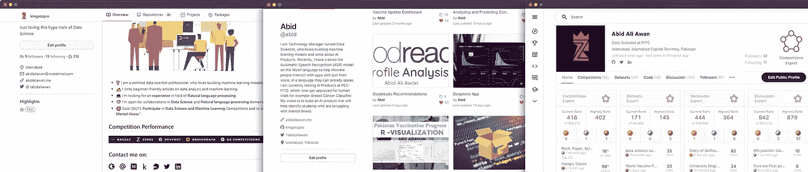
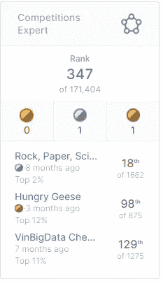
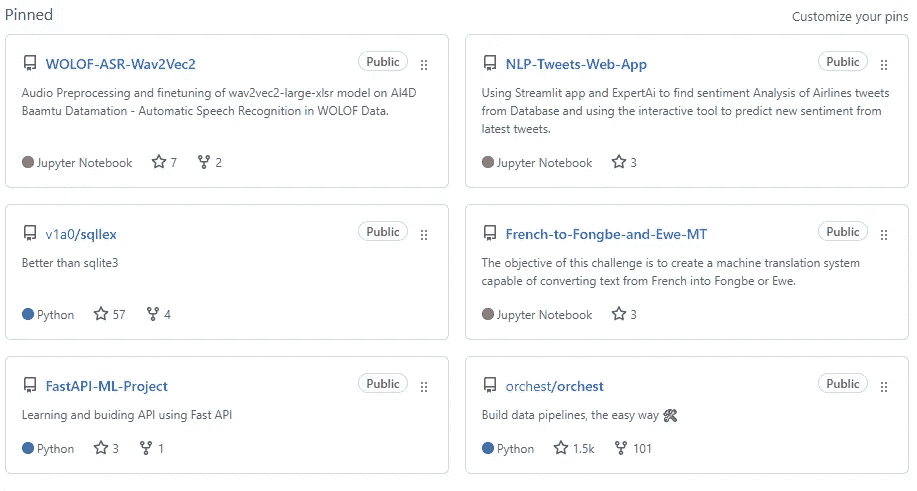
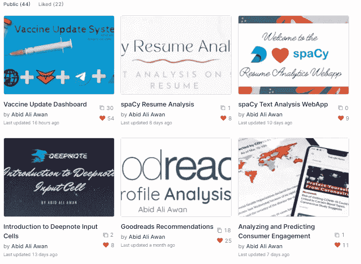
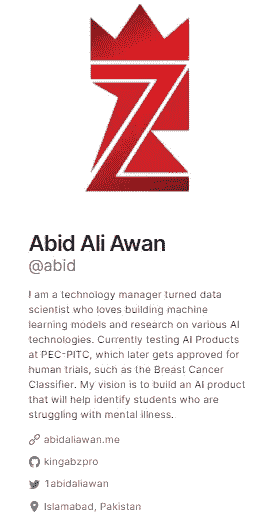

# 如何通过投资组合项目赢得数据科学面试？

> 原文：<https://pub.towardsai.net/how-to-ace-data-science-interview-by-working-on-portfolio-projects-6e5027430565?source=collection_archive---------0----------------------->

## [职业生涯](https://towardsai.net/p/category/careers)

## 了解维护 GitHub、Deepnote 和 Kaggle 档案如何帮助我在多个数据科学面试中胜出。

由[马兰达·范德格里夫](https://unsplash.com/@mkvandergriff?utm_source=medium&utm_medium=referral)在 [Unsplash](https://unsplash.com?utm_source=medium&utm_medium=referral) 上拍摄的照片

# 介绍

招聘人员在联系你面试之前会检查你的在线状态。他们会寻找你的 LinkedIn 个人资料、GitHub 和 Kaggle，以确定你会给他们的公司带来什么价值。招聘经理还会寻找最新的博客或项目来准备面试问题，这样他们就可以测试你的智力了。除此之外，参与现实世界的项目也会给你提供工作所需的经验，将项目添加到你的文件夹中会给招聘人员的数据天赋留下好印象。

作者图片

我们将学习新的方法来破解你的面试，通过创建一个强大的文件夹，这将有助于清除技术面试阶段。我会给你一些建议来改善你目前的项目，以及招聘人员如何审查你的个人资料。这篇文章是基于我的个人经历和我从职业教练那里学到的东西。

> 读完这篇文章后，你会增加通过面试的机会。

[KDnuggets 银奖](https://www.kdnuggets.com/2021/10/ace-data-science-interview-portfolio-projects.html)

# 面试# 1

一位招聘人员在浏览了我的简介后联系了我，告诉我他对我最近的竞争表现印象深刻。他问我他是否愿意在电话中多谈一些。老实说，我很惊讶这么大的金融机构是如何通过 Kaggle 联系我的，以及如何为竞争做出贡献使我获得了与首席数据科学家的面试。

图片作者| [阿比德·阿里·阿万|专家|卡格尔](https://www.kaggle.com/kingabzpro)

> ***洞察力*** 参加 Kaggle 比赛可以让你得到一份工作。

在采访中，我们谈到了我以前的项目和我以前的比赛。我向他解释了我如何积极参与其他竞争平台，如 [Zindi](https://zindi.africa/users/kingabzpro/competitions) 。他问我目前正在做的项目以及我未来的目标是什么。

> ***洞察力*** 创建投资组合项目将在你的简历上捍卫你的技能。

面试结束时，他对我目前的表现印象深刻，并告诉我，我是这份工作的最佳人选。

# 面试# 2

这次面试非常不同，因为接受我面试的数据科学家更关注我的 GitHub 个人资料，而不是我的简历。这次面试后，我意识到招聘人员对投资组合比对 LinkedIn 简介或简历更感兴趣。

因此，在 LinkedIn 上申请了这份工作后，我收到了一封关于面试的电子邮件，在面试中，我们谈到了我的 GitHub 项目。他们甚至问我在项目过程中面临的问题是什么，我是如何解决那个问题的。

图片作者| [kingabzpro (Abid)](https://github.com/kingabzpro)

> ***洞察*** 即使是数据科学家也会维护 GitHub 概要文件。

面试结束后，我回去查看我的个人资料，注意到面试官正专注于我存储库中的最新项目，并附有描述。他还谈到了我的固定项目，我正要回答每个问题，因为我知道这些项目从开始到结束的每个部分。

> ***洞察*** 永远 100%钉住/高亮你做过的项目。

总的来说，面试比我想象的要顺利，我收到了招聘人员的反馈，他们把我和哈佛毕业生进行了比较。

# 面试#3

第三次面试相当令人惊讶，因为我接受了来自不同部门的五个人的面试，他们都直接或间接地谈到了我的 Deepnote [个人资料](https://deepnote.com/@abid)。这次采访是我开始写这篇文章的原因，这样其他人可以利用我的经验。

申请工作后，我接到了国内顶级电信公司的电话。我的第一次面试是由他们领域的三位专家进行的。他们问我过去的工作和我的目标。在最初的介绍之后，我们进入了关于我的项目和 Deepnote 简介的详细讨论。专家数据科学家问了我一些关于 NLP 的关键问题，以及我如何在我的项目中使用它们。他们浏览了顶级项目，问我是如何解决某些问题的。

> ***洞察*** 将自己最好的作品以笔记本的形式发布，并附有详细的描述。

图片作者| [Abid](https://deepnote.com/@abid)

我的第二次面试是由高层管理人员主持的，他们对我的思维方式以及我如何处理某些数据很感兴趣。他们问了我关于功能工程的问题，最后其中一位经理问了我关于 Deepnote 简介的简历。他对我构建一个应用程序来帮助患有精神疾病的学生的愿景很感兴趣。最后，他问我在公司工作如何帮助你实现目标。

> ***洞察*** 传记应该是个人的，它应该描述你的人生目标。

作者图片

就反馈而言，我的两次面试都非常出色，公司的高层对我关于未来目标的回答印象深刻。我已经解释了与他们一起工作将如何帮助我成长并实现我的长期目标。

# 技巧

1.  **整理好自己的资料:**如果有与 NLP 相关的面试，将无关的回购和笔记本私密化，让面试官可以专注于与领域相关的项目。
2.  **项目描述:**确保他们读到的第一行是关于项目总结的。写一份关于 GitHub repo 或 Deepnote 笔记本的描述，将有助于招聘人员提出相关问题。
3.  **修改你的项目:**你应该仔细阅读 GitHub 或 Deepnote 上的项目描述，以便在面试中你可以详细回答这个项目是关于什么的，以及你如何克服一些关键问题。
4.  保持你的作品集更新:这会给招聘人员留下你积极为项目做贡献的印象。这也会帮助你提高技能，伴随着独特的问题而来的是独特的学习体验。
5.  关注个人简历:写下你的工作经历和你目前的项目。写下你的目标会帮助你被注意到。确保这是你的个人故事，你关心你的愿景。
6.  参加 Kaggle 竞赛:这将增加你被关注的机会，让你成为一个有吸引力的求职者。
7.  **修订数据科学备忘单:**即使你了解项目的一切，你也可能会陷入技术知识，如主题建模和 tf-idf 如何工作。

# 作者

[**阿比德·阿里·阿万**](https://www.polywork.com/kingabzpro) ( [@1abidaliawan](https://twitter.com/1abidaliawan) )是一名认证数据科学家专业人士，热爱构建机器学习模型。目前，他专注于内容创作，并撰写关于机器学习和数据科学技术的技术博客。Abid 拥有技术管理硕士学位和电信工程学士学位。他的愿景是为患有精神疾病的学生建立一个使用图形神经网络的人工智能产品。

> **你可以在我每周发布文章的** [**LinkedIn**](https://www.linkedin.com/in/1abidaliawan/) ， [**Ko-fi**](https://ko-fi.com/kingabzpro) **和**[**Polywork**](https://www.polywork.com/kingabzpro)**上关注我。**

原创博客发布在 [KDnuggets](https://www.kdnuggets.com/2021/10/ace-data-science-interview-portfolio-projects.html) 上。