# 如何在不牺牲剥削的情况下实现有效探索

> 原文：<https://pub.towardsai.net/how-to-achieve-effective-exploration-without-the-sacrifice-of-exploitation-492aeb05d5ce?source=collection_archive---------3----------------------->

## [机器学习](https://towardsai.net/p/category/machine-learning)

## 永不放弃(NGU)代理简介

图片由来自 Pixabay 的 Gerd Altmann 提供

现代深度强化学习代理通常在探索或开发方面做得很好。像 [R2D2](https://openreview.net/forum?id=r1lyTjAqYX) 和 [PPO](https://arxiv.org/abs/1707.06347) 这样的代理可以在奖励密集的游戏上轻松实现超人的表现，但当奖励信号变得稀疏时，他们通常会惨败。另一方面，探索方法如 [ICM](https://arxiv.org/abs/1705.05363) 和 [RND](https://arxiv.org/abs/1810.12894) 可以在稀疏奖励环境中有效学习，但代价是在密集奖励环境中的性能。

我们讨论一个智能体，即 Puigdomènech Badia 等人在 DeepMind 提出的永不放弃(NGU)。，在没有任何先验知识的情况下，在雅达利的艰苦探索游戏中实现了最先进的性能，同时在其余游戏中保持了非常高的分数。简而言之，NGU 代理使用 1)结合情节性和终身新颖性来鼓励代理访问很少访问的国家，从而实现有效的探索；2)通用价值函数逼近器(UVFA)的框架，使代理能够同时学习探索和开发之间的不同权衡。

这篇文章由两部分组成:首先，我们讨论 NGU 主体如何计算激励它有效探索环境的内在奖励。其次，我们讨论整个主体，看看它如何利用 UVFA 来学习探索性和开发性策略。

# 内在报酬

## 以往内在奖励方法的局限性

众所周知，天真的探索方法，如𝝐-greedy，很容易在稀疏的奖励设置中失败，这往往需要长期的行动。最近提出了许多内在奖励方法来推动探索。一种是基于状态新鲜感的概念，这种概念量化了当前状态与已经访问过的状态之间的差异。问题是，当代理人熟悉环境时，这些探索奖励会逐渐消失。一旦新鲜感消失，这就阻碍了未来对各州的任何访问，不管它可能允许下游的学习机会。另一种内在回报建立在预测误差的基础上。然而，从观察值构建预测模型通常成本高昂，容易出错，并且很难推广到任意环境。在缺乏新奇信号的情况下，这些算法退化为无方向的探索方案。因此，经常需要在学习算法的速度和消失奖励的速度之间进行仔细的校准。

## 永不放弃的内在奖励

Puigdomènech Badia 等人提出了一种内在奖励方法，该方法结合了阶段性和终身新颖性，如下所示

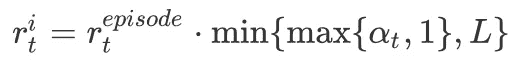

其中，终身新奇𝛼可以被解释为一个调制器，它控制着阶段性内在报酬 r^{episodic}的规模，l 是一个选定的最大报酬规模。

在上面的等式中，情节新鲜感鼓励访问与之前的州不同的州，但是很快不鼓励在同一情节中重访相同的州。另一方面，终生的新鲜感通过慢慢抑制对跨情节多次访问的州的访问来调节情节的新鲜感。我们将在下面的小节中讨论每一个新颖性是如何计算的。

**情节新奇模块**

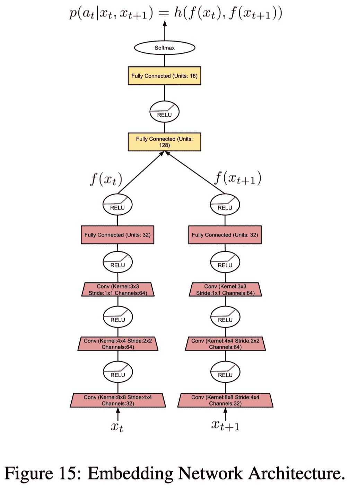

为了计算情节内在报酬，代理维护一个情节记忆 *M* ，它跟踪一个情节中的可控状态。可控状态是由嵌入函数 *f* 产生的观察的表示。它是可控的，因为函数被学习来忽略不受代理行为影响的观察方面。在实践中，NGU 通过逆动力学模型进行训练，该模型是来自 [ICM](https://arxiv.org/abs/1705.05363) 的子模块，它接收观察值 *x_t* 和 *x_{t+1}* 并预测动作 *a_t* (参见左侧图 15)。情节性内在报酬被定义为

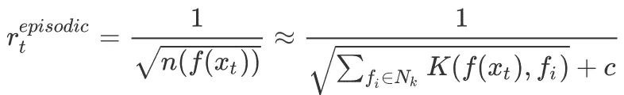

其中 *n(f(x_t))* 是访问抽象状态 *f(x_t)* 的次数。我们将这些计数近似为由内核函数 *K* 在内存 *M* 的内容上给出的相似性的总和。实际上，伪计数是从存储器 *M* 中的状态 *f(x_t)* 的 *k* 最近邻使用以下逆核来计算的

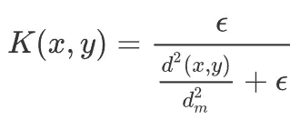

其中𝝐保证最小量的“伪计数”， *d* 是欧几里德距离，而 *d _m* 是 *k-* 个最近邻居的平方欧几里德距离的移动平均值。该运行平均值用于使内核对于正在解决的任务更加鲁棒，因为不同的任务在学习到的嵌入之间可能具有不同的典型距离。算法 1 详述了该过程

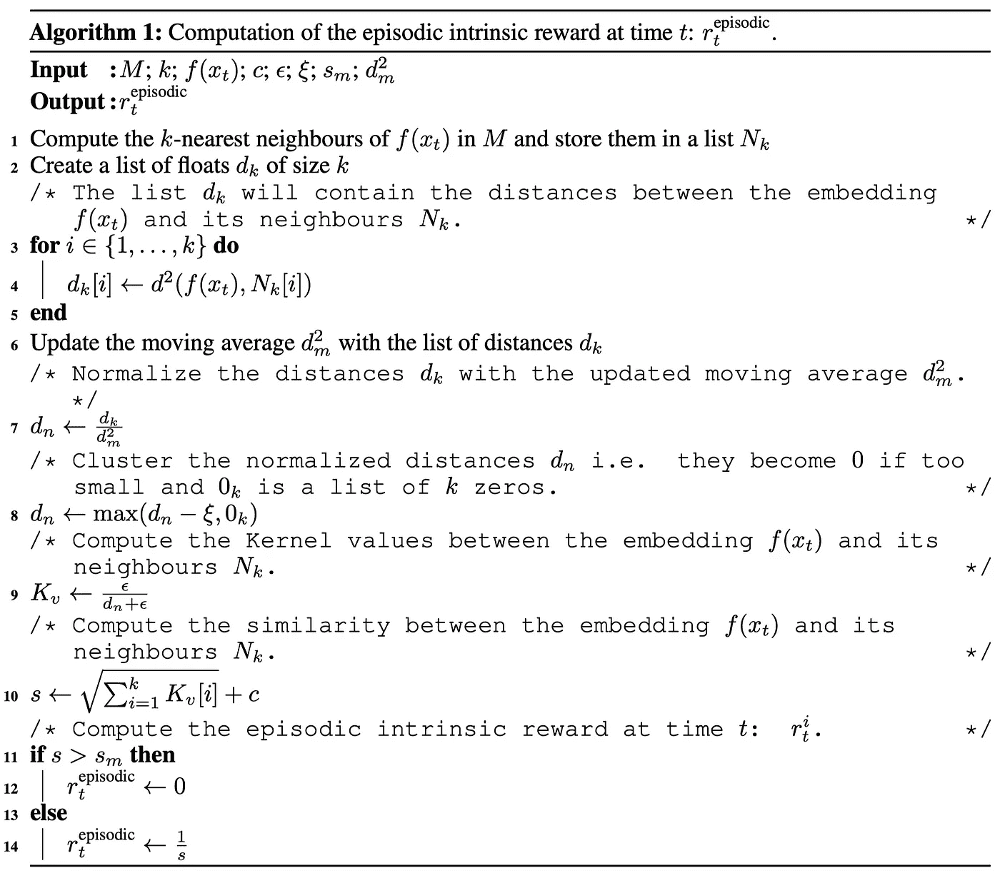

**终身新奇模块**

Puigdomènech Badia 等人使用 [RND](/{{ site.baseurl }}) 来计算终身好奇心，它训练预测器网络 *\hat g* 来逼近随机网络 *g* 。终身新鲜感随后被计算为归一化均方误差:

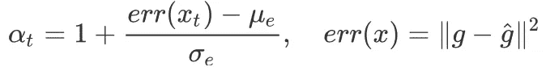

其中𝜇和𝜎是 err(x)的均值和标准差

下图演示了代理使用的 RND 体系结构

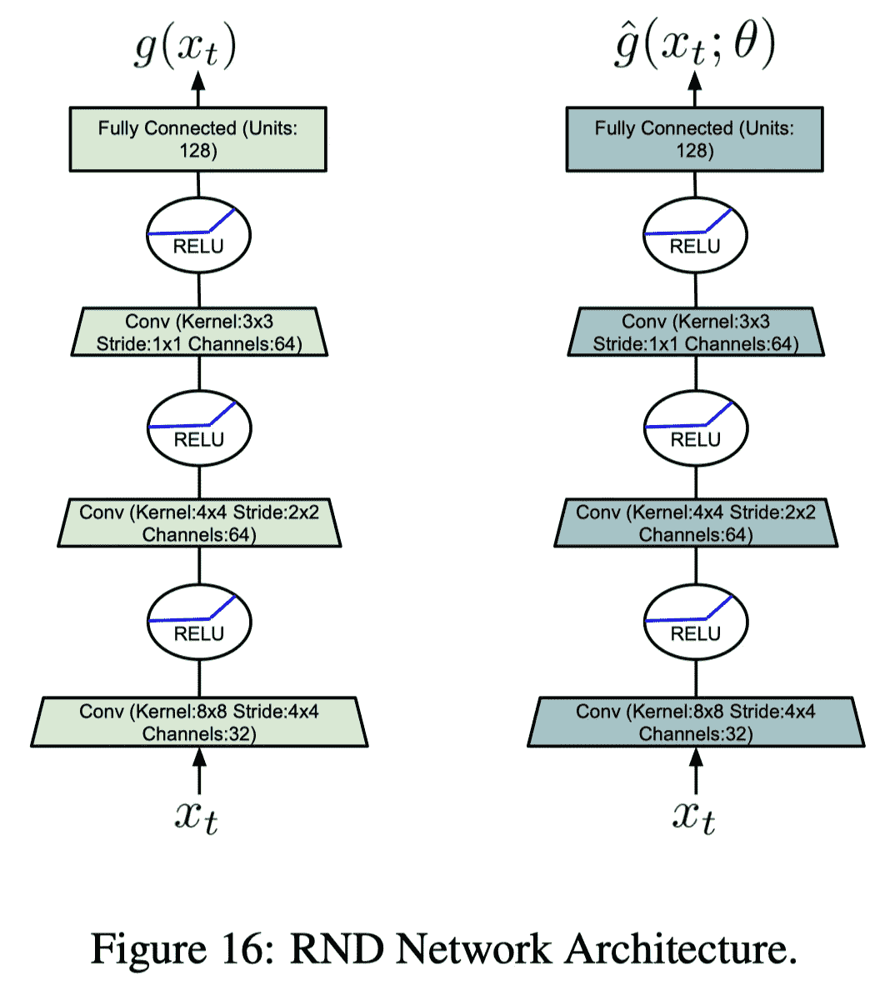

# 永不放弃的特工

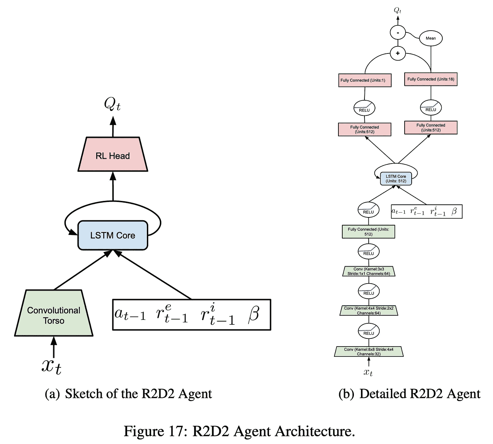

如图 17 所示，NGU 代理使用与 [R2D2](https://openreview.net/pdf?id=r1lyTjAqYX) 代理相同的架构，除了它额外将内在报酬 *r^i* 和它们的系数𝛽馈送给 LSTM。该方案遵循通用价值函数逼近器(UVFA ),允许代理同时逼近关于一族形式的增强报酬的最优价值函数

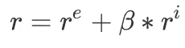

其中 *r^e* 是环境提供的外在奖励， *r^i* 是上一节定义的内在奖励。奖励以及策略由集合 *{* 𝛽_j}_{j=0}^{N-1}中的离散值𝛽*{*来参数化，该值控制 *r^i.* 的强度。这允许代理学习一系列在勘探和开发之间做出不同权衡的策略。

学习大量策略的优势来自于这样一个事实，即从行为角度来看，开发性和探索性策略可能非常不同。拥有大量平稳变化的策略可以提高培训效率。可以将联合训练探索策略，即 *𝛽 > 0* 视为训练辅助任务，有助于训练共享架构。

在实践中，我们还将剥削政策(与𝛽=0)与最高的贴现因子𝛾相关联，将最具探索性的政策(与最大的𝛽)与最小的贴现因子𝛾.相关联我们对探索性政策使用较小的贴现因子，因为内在回报密集，价值范围小，而我们希望对开发性政策使用尽可能高的贴现因子，以便尽可能接近优化未贴现回报。以下等式显示了 Puigdomènech Badia 等人在实验中使用的时间表。

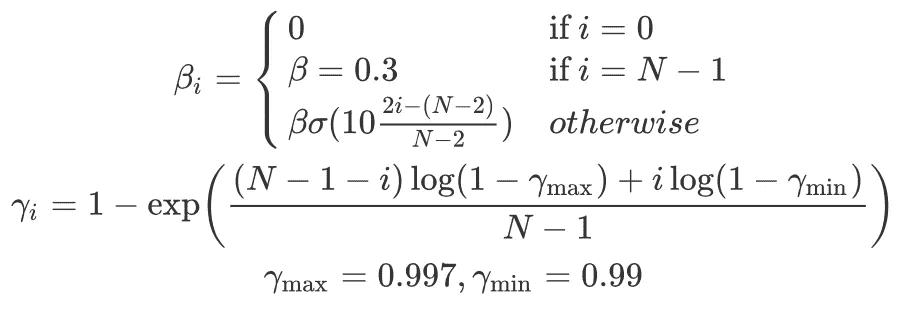

其中，𝜎是 sigmoid 函数，N=32 是𝛽和𝛾的可用选项总数

**强化学习目标**

由于代理是用序列数据训练的，Puigdomènech Badia 等人使用了[retrace(𝝀](https://arxiv.org/abs/1606.02647)和[转换的贝尔曼算子](https://arxiv.org/abs/1805.11593)的混合。这给了我们下面的转换回描算子

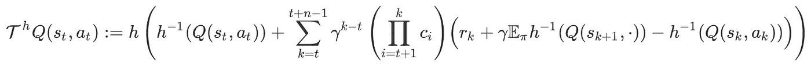

像 DDQN 一样，我们使用目标网络计算这个操作符，并更新在线 *Q* 网络以接近这个值。

# 参考

巴迪亚、阿德里亚·普伊格多姆涅奇、巴勃罗·斯普雷赫曼、亚历克斯·维特维奇基、丹尼尔·郭、比拉尔·皮奥特、史蒂文·卡普托罗夫斯基、奥利维尔·蒂勒曼等。“永不放弃:学习定向探索策略”，1–28。[http://arxiv.org/abs/2002.06038.](http://arxiv.org/abs/2002.06038.)