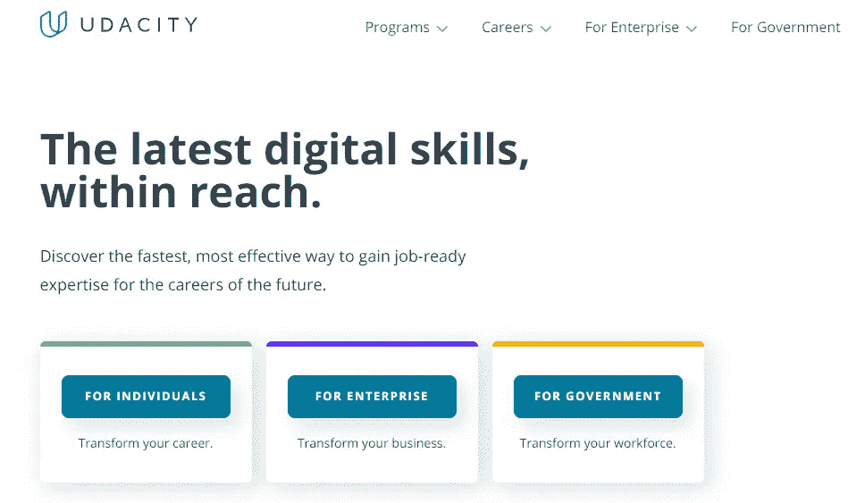
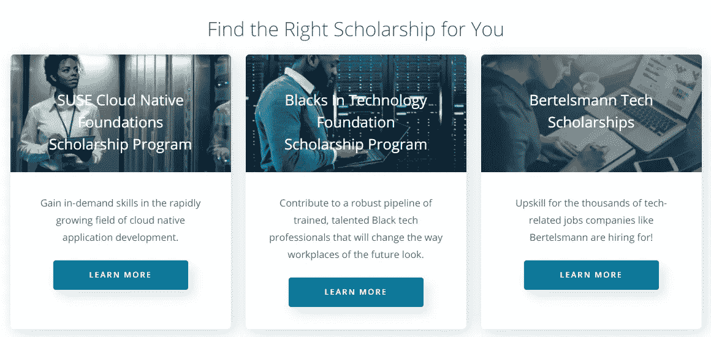
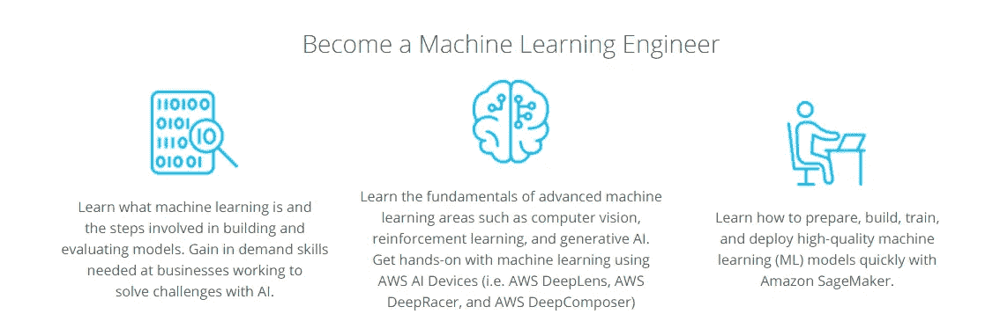
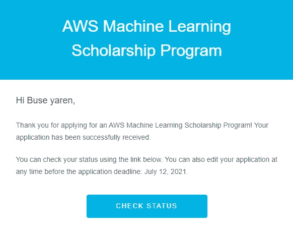
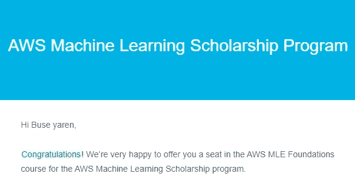

# 如何取得 Udacity AWS 机器学习奖学金？

> 原文：<https://pub.towardsai.net/how-to-achieve-udacity-aws-machine-learning-scholarship-d5e882b0f3f1?source=collection_archive---------1----------------------->

由 [Unsplash](https://unsplash.com?utm_source=medium&utm_medium=referral) 上的 [krakenimages](https://unsplash.com/@krakenimages?utm_source=medium&utm_medium=referral) 拍摄的照片

T4:今天是学习新东西的好日子，你不觉得吗？让我们今天的 ML / DL 文章休息一下，一起呼吸。作为一名机器学习工程师或研究开发人员，拥有一份有很多好处的奖学金不是很好吗？我将与你们分享我是如何通过这个奖学金的步骤和我自己的路线图的。如果你正在寻找获得 AWS ML 奖学金的方法，让我们一起聊聊。

## 1️⃣How:我找到 AWS 机器学习奖学金了吗？

这个奖学金项目，以及成为 TensorFlow 土耳其社区核心成员的冒险经历，是我通过我亲爱的老师 Yusuf sargoz 了解到的一个奖学金项目。

## 2️⃣So 什么是 Udacity？

Udacity 是一个非营利性的学习平台，有许多在线课程。Udacity 是斯坦福大学在 2011 年提供的免费计算机科学课程的产物。很多课程都包含培训证书作为内容。正因如此，它是大多数用户首选的平台。

[Udacity 平台内容](https://www.udacity.com/?utm_source=gsem_brand&utm_medium=ads_r&utm_campaign=12949811881_c&utm_term=123473112204&utm_keyword=%2Budacity_b&gclid=CjwKCAjwx8iIBhBwEiwA2quaq_NCVYWFLesz8pYS-ihlGghKdiSpkMML9oMuC66u7NXbPgey7LyDqBoC2SIQAvD_BwE)

当你进入 Udacity 的网站时，你会看到许多选项，这些选项会根据你的职业道路和专业知识来指导你。你会在 Udacity 平台上找到很多你在业余时间寻找的提升自己的工具和课程。

## 3️⃣:奖学金项目中只有 AWS 机器学习奖学金吗？

不是，在这篇文章里，我说的是 AWS ML Scholarship 奖学金，是 Udacity 的特色奖学金。然而，我们谈论的是 10 个不同的奖学金项目和 22K 名学生。下面是其中的一些！

[uda city 不同奖学金项目样本](https://www.udacity.com/scholarships)

## 4️⃣Why:我们应该申请这项奖学金吗？

Udacity 它与最大的科技公司合作，如亚马逊、谷歌、脸书和类似的公司。它为数百万人提供了终身学习的机会，让他们获得他们想要的工作所需的新技能。Udacity 奖学金让全世界的学生都能更负担得起这个机会。AWS ML 奖学金奖学金由 [AWS](https://aws.amazon.com/free/?nc1=h_ls&all-free-tier.sort-by=item.additionalFields.SortRank&all-free-tier.sort-order=asc&awsf.Free%20Tier%20Types=*all&awsf.Free%20Tier%20Categories=*all) 赞助。在你获得的奖学金范围内；

*   您将学习什么是机器学习，并了解模型创建和评估中涉及的步骤。
*   你将发展在为人工智能的未来做准备的企业中非常需要的技能。
*   您将在 AWS 生产环境中应用机器学习技术和算法，包括部署。

## 5️⃣逐步成为奖学金范围内的“机器学习工程师”

正如你在图片中看到的，它有很多优点。我不想不提到几个重要的优势就结束。您将学习高级机器学习领域的基础知识，如计算机视觉、强化学习和生成式人工智能。您将能够使用 AWS AI 设备(例如 AWS DeepLens、AWS DeepRacer 和 AWS DeepComposer)亲自学习机器学习。 ***最重要的是，通过亚马逊 SageMaker，你将学习如何快速准备、构建、训练和部署高质量的机器学习(ML)模型。***

📦**亚马逊 SageMaker:**

 [## 亚马逊 SageMaker -机器学习-亚马逊网络服务

### Amazon SageMaker 是一个完全托管的服务，为每个开发人员和数据科学家提供构建…

aws.amazon.com](https://aws.amazon.com/sagemaker/) 

我们引用纳米学位校友、AWS ML Hero 和 AWS 机器学习工程师 Juv Chan 的话来提升我们获得 AWS ML 奖学金的动机👇🏻

> “AWS 机器学习工程师 Nanodegree 计划让我能够按照自己的节奏学习和获得有价值的机器学习技能，并通过互动模块使学习变得有趣和有效。花时间学习机器学习可能会令人不知所措，尤其是在软件工程师工作的高要求程序下。它提供的灵活性让我能够在适合我的时间表内学习新技能。”

## 6️⃣谁可以注册？

AWS 机器学习伙伴计划面向所有有兴趣扩展其 AWS 机器学习技能和专业知识的开发人员。每个 18 岁以上的候选人都可以参加这个项目。

## 7️⃣成功完成的条件是什么？

为了成功完成 AWS 机器学习基础课程，学生必须在大约 3.5 个月内每周投入 3-5 小时，并在 2021 年 10 月 11 日之前完成评估测试。为了完成 AWS 机器学习工程师纳米学位，奖学金获得者需要在 2022 年 1 月 25 日之前每周花 6-7 个小时学习约 3 个月来完成纳米学位。

## AWS 2021 发布中的 8️⃣What's 新？

*   “机器学习导论”新课
*   AWS DeepRacer 强化学习(RL)新介绍
*   AWS DeepLens 计算机视觉新介绍
*   DeepComposer 部门下的两个新的生产性 AI 模型(AR-CNN 和 Transformers)

## 9️⃣:报名日期是什么时候？

2021 年报名期网上报名时间为 2021 年 5 月 26 日至 2021 年 7 月 12 日。为了有资格获得 *AWS 机器学习工程师纳米学位*奖学金，学生必须在 2021 年 10 月 11 日之前完成他们的课程并参加在线评估。如果你错过了这个奖学金期，不要担心，下一个学期在等着你！

现在，让我们继续他们问你的关于奖学金的问题。一般来说，当你申请奖学金时，你会被要求回答几组问题。

➰Why:你想申请这项奖学金吗？➰Why，你认为你应该被选中获得这项奖学金吗？➰How:如果你被选中获得奖学金，你会用它吗？

正如你在上面看到的，在申请过程中你会被问到一些问题。你应该尽可能多地填写这些字段。你展示的工作细节越多，你就越有可能。当您完成应用程序时，您将看到如下结果。

奖学金申请信息

在这个申请阶段之后，你将被告知结果将在哪些日期公布。当您的申请过程成功时，您将收到一封祝贺电子邮件，如下所示！

奖学金项目申请结果

恭喜🎉你获得了奖学金。我们一起完成 AWS 机器学习伙伴计划怎么样？

☘️更多内容，你可以关注我的 [GitHub](https://github.com/BuseYaren) 、 [YouTube](https://www.youtube.com/channel/UCzAODG3wgdKtRov8VvyXvtw) 和 [Twitter](https://twitter.com/BuseYarenTekin) 。

# 资源

1.  维基百科，Udacity，[https://en.wikipedia.org/wiki/Udacity](https://en.wikipedia.org/wiki/Udacity)。
2.  Udacity，AWS 机器学习奖学金，[https://www . uda city . com/scholarships/AWS-Machine-Learning-Scholarship-program](https://www.udacity.com/scholarships/aws-machine-learning-scholarship-program)。
3.  中，[https://medium . com/@ sauravism/my-journey-to-uda city-AWS-machine-learning-scholarship-feddddbaf 8225](https://medium.com/@sauravism/my-journey-to-udacity-aws-machine-learning-scholarship-fedddbaf8225)。