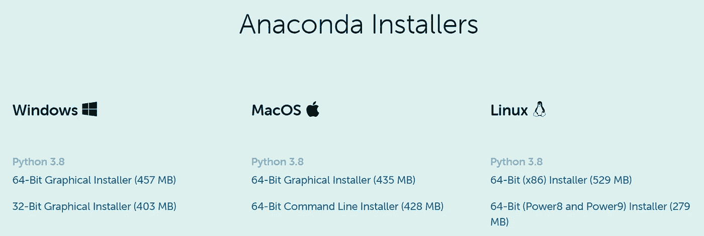
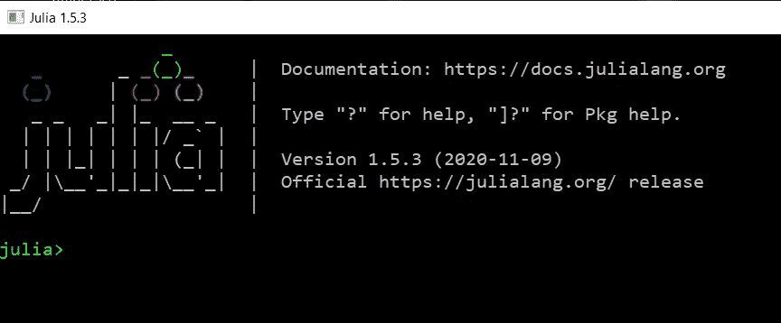
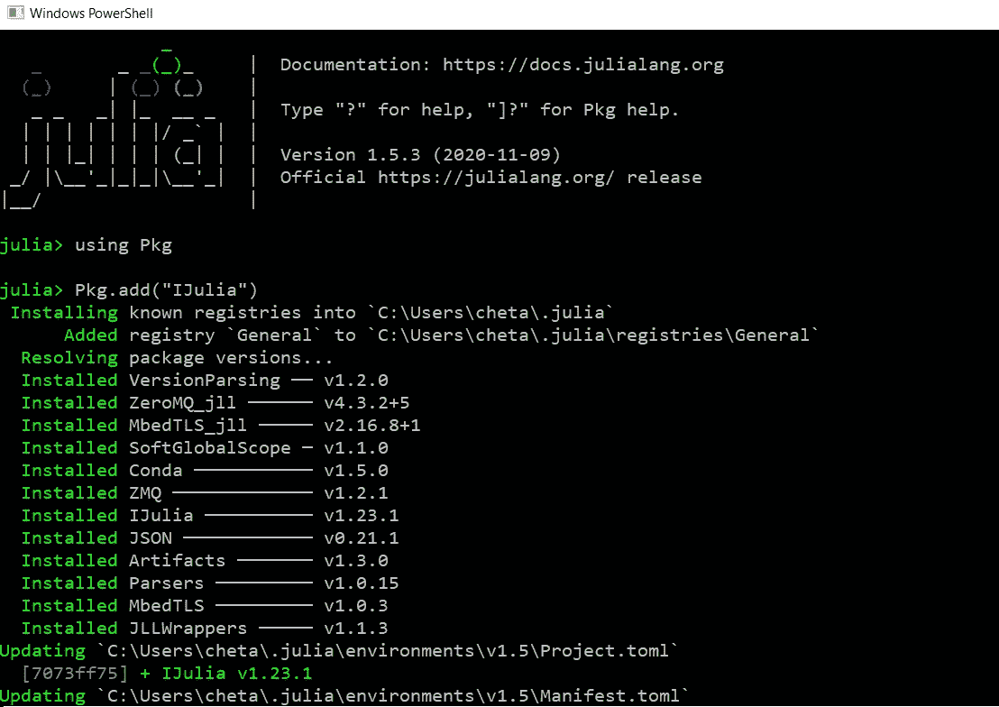
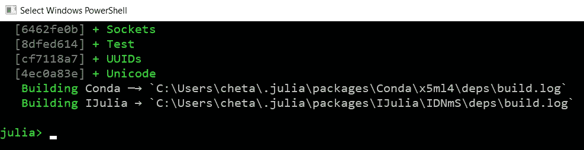
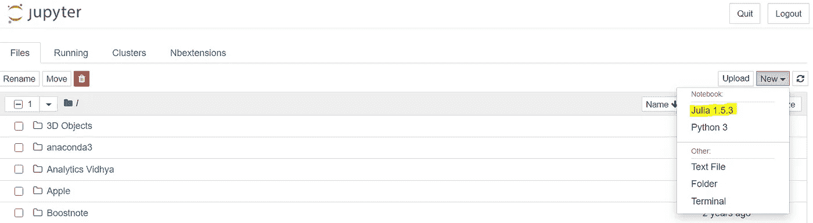
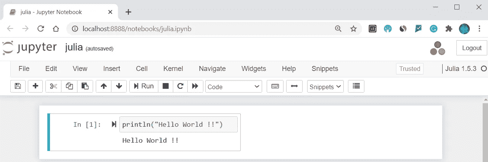

# 如何将 Jupyter 添加到 Jupyter 笔记本

> 原文：<https://pub.towardsai.net/how-to-add-julia-to-jupyter-notebook-54dae7662d08?source=collection_archive---------2----------------------->

## [数据科学](https://towardsai.net/p/category/data-science)，[机器学习](https://towardsai.net/p/category/machine-learning)

## 向机器学习的朱莉娅迈出第一步


来源: [Github](https://github.com/JuliaLang/julia)

Julia 是一种高级的、高性能的动态语言。Julia 最近越来越受欢迎，因为它也可以用于数据科学和机器学习。我们将在另一篇文章中详细介绍 Julia，但在这篇文章中，让我们看看如何在 Jupyter notebook 上设置 Julia。

# 步骤 1:下载并安装 Anaconda

我假设您知道 Anaconda 和 Jupyter Notebook，并且已经在您的机器上安装了这两个工具。如果你是 Anaconda 新手，从官方页面 [**这里**](https://www.anaconda.com/products/individual) 安装。如果您已经安装了，请继续执行步骤 2。



# 步骤 2:下载并安装 Julia

接下来我们需要从官方页面 [**这里**](https://julialang.org/downloads/) 下载安装 Julia。我使用的是 Windows 64 位机器，所以我已经下载并安装了 Windows 64 位(安装程序)。


成功安装 Julia 后，打开 Julia CLI，您将看到下面的屏幕。



# 步骤 3:从 Julia CLI 将 Julia 添加到笔记本

接下来，我们需要运行下面两个命令来添加 Julia 笔记本。然后等待几分钟，安装完成。请参考以下截图，以供参考。

```
using Pkg
Pkg.add('IJulia')
```



最后的安装信息将如下所示，您将`julia>`提示并确认安装成功完成。



# 步骤 4:创建新笔记本

现在打开 Jupyter 笔记本，点击新建。您应该可以在下拉列表中看到 Julia。通过选择 Julia 创建一个新笔记本。



# 第五步:打印 Hello World！

写入`println(‘Hello World !!’)`并运行单元以查看输出。通过在 Julia 中安装并运行 hello world 程序，您已经迈出了学习 Julia 的第一步。



# 结论

为 Jupyter Notebook 设置 Julia 真的很容易。我确信你们大多数人已经在使用 Notebook 进行 Python 的数据科学实验了，现在你可以开始使用 Julia 了。

我希望你喜欢阅读这篇文章。如果你喜欢我的文章并想订阅 Medium，你可以在这里这样做:

[](https://chetanambi.medium.com) [## Chetan Ambi -介质

### 阅读 Chetan Ambi 在媒体上的文章。数据科学|机器学习| Python。参观 https://pythonsimplified.com/…

chetanambi.medium.com](https://chetanambi.medium.com) 

*阅读更多关于 Python 和数据科学的此类有趣文章，* [***订阅***](https://pythonsimplified.com/) *到我的博客*[***【www.pythonsimplified.com】***](http://www.pythonsimplified.com)***。*** 你也可以通过 [**LinkedIn**](https://www.linkedin.com/in/chetanambi/) 联系我。