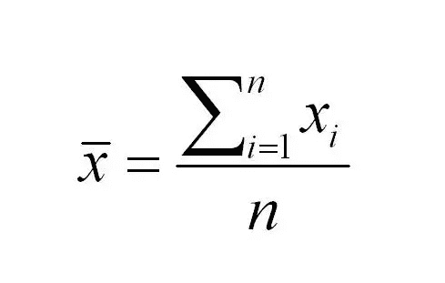
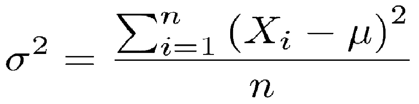
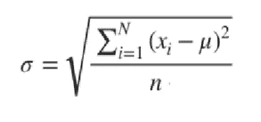
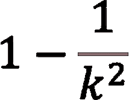

# 如何估算样本集的结果(经验法则与切比雪夫公式)

> 原文：<https://pub.towardsai.net/how-to-approximate-the-results-of-your-sample-set-empirical-rule-vs-chebyshevs-formula-92f1a1dac0b7?source=collection_archive---------4----------------------->

## 经验法则是一种强大的工具，可以捕捉数据集中观察值的分布。但是，这不是唯一的方法，尤其是当数据集不是正态分布时。

## 指数:
1。问题描述
2。回顾统计数据
3。经验法则
4。切比雪夫定理

# 问题描述

想象一下，你有 60 个学生上数学课，你监控了学生完成一个练习需要多少时间。
你得到下一个结果。平均值:7 英尺，方差:5 英尺
我们想知道花费超过 15 英尺做一次练习的学生的最大数量是多少。

# 查看统计数据

在给出解决方案之前，让我们快速回顾一下基本的统计学概念。平均值是按照下一个公式计算的。

平均值取数据集中所有观测值的总和，然后除以观测值的数量

方差显示了平均值周围观察值的离差。它将单个观察值与平均值之差的和提升到平方，然后除以观察值的数量。

下一步，我们将需要一个**标准差**。也就是方差的平方根。

# 经验法则

如果我们有一个正态分布的数据集，我们可以应用经验规则(有时也称为 3 sigma 规则，因为希腊 sigma 符号定义了标准偏差)来了解观察值出现在数据集特定范围内的概率。

经验法则说:
68%的观察值位于平均值的 1 个标准差范围内。95%的观察值位于平均值的±2 标准偏差范围内。
99.7%的观察值位于平均值的±3 标准偏差范围内。

因为我们的问题没有明确指出我们是正态分布。我们不能相信经验法则。在这种情况下，我们可以使用切比雪夫的概率定理。

# 切比雪夫定理

如果数据集不是正态分布的，这并不意味着我们不能得到数据集中观察值的近似分布。
切比雪夫公式指出:

其中 k 表示目标范围之间的距离有多少标准差。
在我们的案例中。标准差是 2.24(5 的平方根)

求 15 '前面积需要多少个标准方程的方程是
15 = 7+k(2.24)
k(2.24)= 8
k = 3.57

3.57 平均值的标准偏差需要达到 15 英尺。现在，我们有了所有的输入值来计算平均值±3.57 范围内的百分比。

1–1/3.5⁷= 0.92 * 100
为了找出超过 15 英尺的学生的最大数量，需要 0.07*60。= ~4 个学生。

# 结论

感谢您的关注。希望你喜欢这篇文章。对于任何疑问或批评，请随时留下评论。