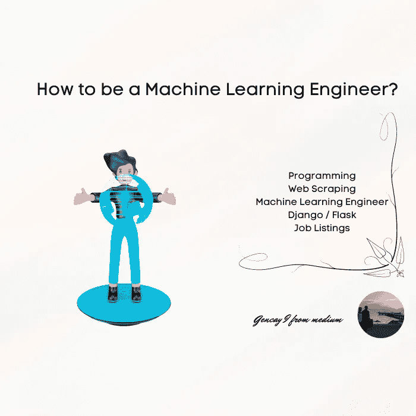
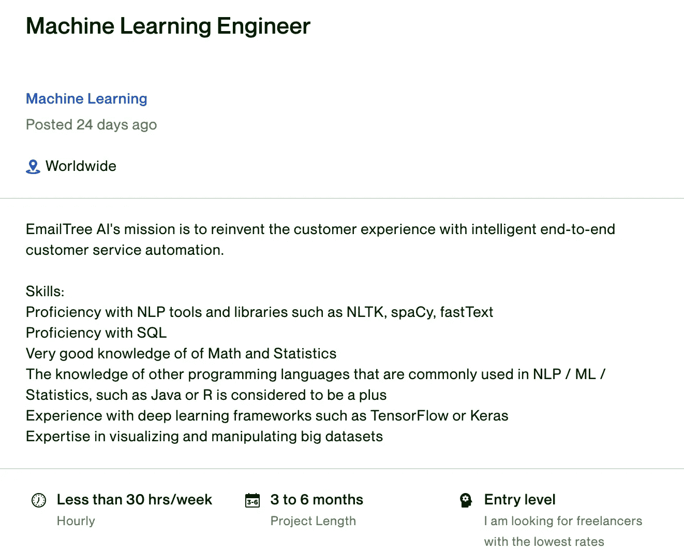
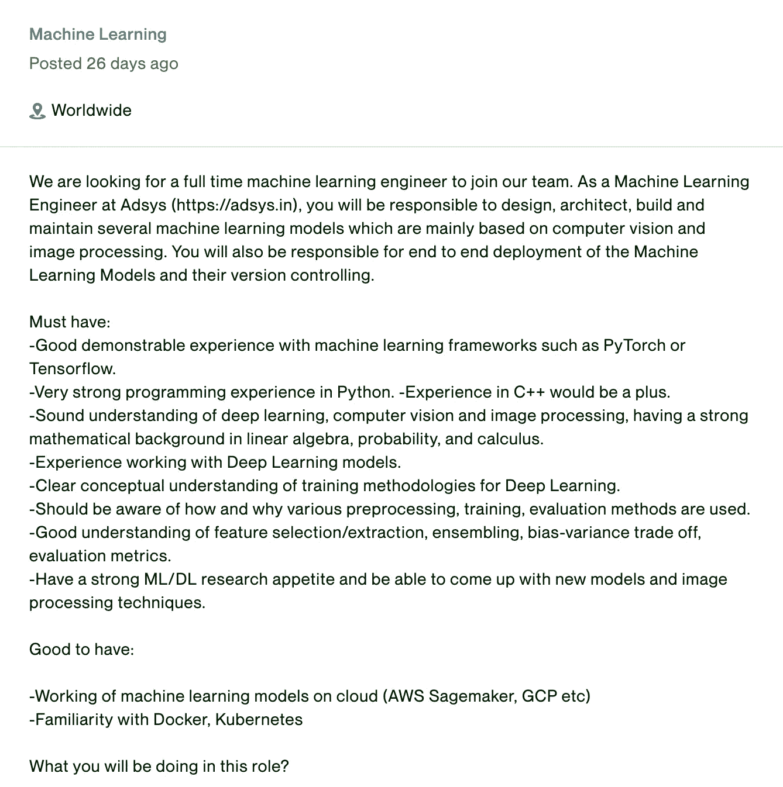
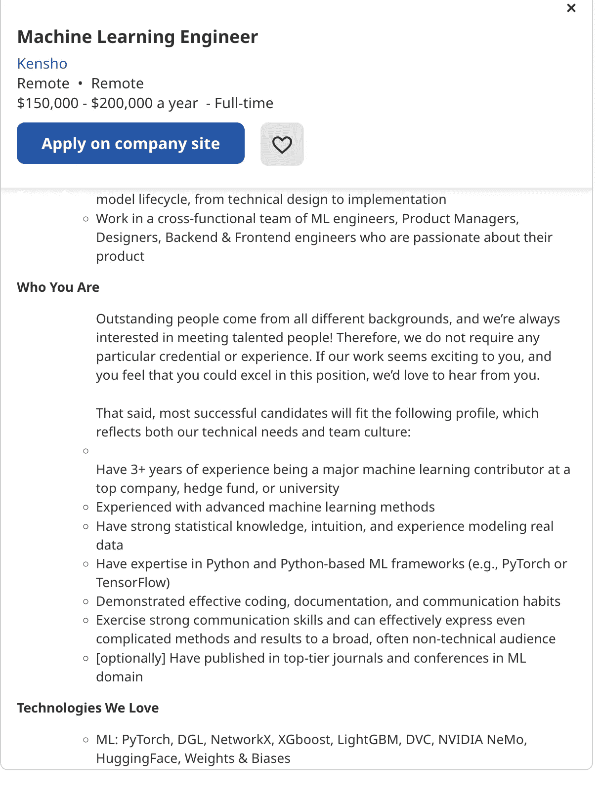

# 如何成为一名机器学习工程师？

> 原文：<https://pub.towardsai.net/how-to-be-a-machine-learning-engineer-f7302ca5dbc3?source=collection_archive---------0----------------------->

在这里，我们将讨论如果你想成为一名机器学习工程师，找到必要的技能，如 SQL，Python，Django，或 flask，以及云服务。

作者图片

**内容表**

[简介](#f5c7)
[职位列表](#23dc)
[编程](#7d7e)
[机器学习](#d7c3)
[网页抓取](#131e)
[Django/Flask](#f7da)
[云知识](#1544)
[结论](#ef05)

# 介绍

在这篇文章中，我将通过解释你必须具备的技能，向你解释如何成为一名机器学习工程师。

我们将从 Indeed 和 Upwork 查看几个职位列表。

如果您正在从事任何数据相关领域的职业，这篇文章非常适合您。此外，如果你是任何数据相关工作的大四或大三学生，阅读这篇文章也会给你一个有用的总结。

现在，让我们继续这篇文章，看看招聘经理看起来是什么样的机器学习工程师。

# 工作列表

照片由[猎人在](https://unsplash.com/@huntersrace?utm_source=medium&utm_medium=referral) [Unsplash](https://unsplash.com?utm_source=medium&utm_medium=referral) 上比赛

作者图片

让我们略读一下，SQL 编程、编码语言和深度学习在这个清单中看起来是必须的。

作者图片

这是另一个。它希望你了解编程(Python 和 C++会更好)、机器学习(当然还有统计学和微积分)、深度学习，以及 Pytorch 和 Tensorflow 这样的库。

作者图片

如果你有兴趣申请，这里有链接。

你可能会开始看到相似之处；

*   编程；编排
*   机器学习
*   网页抓取
*   Django/ Flask
*   云知识

现在我们来分别解释一下。

# 编程；编排

奥斯卡·伊尔迪兹在 [Unsplash](https://unsplash.com?utm_source=medium&utm_medium=referral) 拍摄的照片

SQL 是大多数数据相关工作的必备。因为要操作数据，首先，你必须将它存储在数据库中。然后你必须有能力使用 SQL 数据。

如果您正在从事数据科学方面的职业，您可能知道 Python 是最受欢迎的编程语言，因为它具有易于阅读的语法和社区。还有，机器学习用户一般都用 Python。在这里，我详细阐述了这种情况，并涵盖了这个主题。如果你想了解更多关于开发者正在做的研究，点击这里。

还有，在选择了你的编程语言之后，另一个重要的标准就是确定你的编码环境。因为一旦你养成了使用它的习惯，一切都会变得容易，如果你要改变你的编码环境，那对你来说会很难。当然，一旦过了很长时间，你可以很容易地使用它们中的大部分，然而在开始的时候，你应该小心。这里有许多[选项。](https://medium.com/codex/how-to-choose-your-python-compiler-and-why-cdb914fe6f87)

有很多网站包含非常详细的教程，比如[真实 python](https://realpython.com/start-here/) 和[学习 python。](https://learnpython.org/)

还有一种学习方法是通过阅读。如果你还在阅读并喜欢我的文章，这里是我关于 Python 编码的教程列表。

[用 Python 计算 Google 数据科学家工资](https://medium.com/mlearning-ai/google-data-scientist-salary-calculation-with-python-2a4406506498)， [4 个用于编码面试的 Python 算法](https://medium.datadriveninvestor.com/4-python-algorithms-for-coding-interviews-1110e0fea1f5)， [7 个最好了解的列表方法](https://medium.com/codex/7-better-to-know-python-list-methods-ca1c263d84b7)，[你应该知道的前 4 个 Numpy 函数](https://medium.com/mlearning-ai/top-4-numpy-functions-you-should-know-6d6cc7586494)

# 机器学习

[charlesdeluvio](https://unsplash.com/@charlesdeluvio?utm_source=medium&utm_medium=referral) 在 [Unsplash](https://unsplash.com?utm_source=medium&utm_medium=referral) 上拍摄的照片

当然，在搜索“如何成为一名机器学习工程师”时，很重要的一点就是机器学习。有许多关于机器学习的特殊课程。这里我先把它分成几个部分来解释。

*   Python 基础
*   数字图书馆
*   熊猫图书馆
*   Matplotlib- Seaborn 库
*   sci kit-学习库
*   张量流/Keras/Pytorch

最后一个是深度学习，然而当你开始学习机器学习时，我认为你也想继续学习深度学习。

还有，可以从阅读开始学习。(我做到了。)

以下是我关于机器学习的教程；

[机器学习 A-Z](/machine-learning-a-z-briefly-explained-4ff86bd81e3a) ，[机器学习 A-Z 2，](/machine-learning-a-z-briefly-explained-part-2-61191a01c235) [回归 A-Z，](/regression-a-z-briefly-explained-618e5d5c89f8) [分类 A-Z](https://medium.com/mlearning-ai/classification-a-z-briefly-explained-25ca811ab4e4) ，[线性代数](https://medium.datadriveninvestor.com/linear-algebra-a-z-for-machine-learning-68dadcd0b757)，[统计 A-Z](/statistics-for-machine-learning-a-z-66a82fbf2622) ，[统计 A-Z 2。](/statistics-for-machine-learning-a-z-part-2-fef63089b09d)

机器学习中的编码；

[机器学习检查表:代价函数和梯度下降](/machine-learning-checklist-cost-function-and-gradient-descent-c3fabbd0e00b)、 [Python 先验机器学习数据可视化](/machine-learning-prior-part-1-data-visualization-ba6155bf118)、 [Python 先验 2 机器学习数据分析](/python-prior-machine-learning-part-2-data-analysis-c79260d28ae9)

# 网页抓取

赛·基兰·阿纳加尼在 [Unsplash](https://unsplash.com?utm_source=medium&utm_medium=referral) 上拍摄的照片

要建立机器学习管道，数据当然是最重要的。存在的网站太多了，都是[开源](https://medium.datadriveninvestor.com/7-free-resources-to-download-datasets-4689a419ccf9)。然而，当建立一个机器学习模型时，这可能还不够。特别是，如果您想提高建模效率，一种方法是添加数据。但是，您无法为您的案例找到合适的数据集。在这种情况下，您应该通过找到数据源并抓取它来创建自己的数据集。

这也是为什么很多公司希望机器学习工程师具备网页抓取技能的原因。就像我一直告诉你的，我的选择，当然，将是 Python，但是有几个用于 web 抓取的包。他们都有自己的优势，这就是为什么如果你想开始了解他们，你应该做好你的研究。

# Django / Flask

费萨尔在 [Unsplash](https://unsplash.com?utm_source=medium&utm_medium=referral) 上拍摄的照片

在获得数据和建立模型之后，现在是将模型投入生产的时候了，但是怎么做呢？

有两个流行的框架，Django 和 flask。每一种都有它的优点。

这是我的网站，它试图根据你的身体测量来预测你的体重。我在烧瓶中开发了这个，但是我也喜欢使用 Django。

正如我所说的，根据你的项目，每一种都有自己的优点、优点和缺点。然而，了解弗拉斯克或姜戈是必须的。

# 云知识

照片由[西格蒙德](https://unsplash.com/@sigmund?utm_source=medium&utm_medium=referral)在 [Unsplash](https://unsplash.com?utm_source=medium&utm_medium=referral) 上拍摄

AWS、Azure 或 GCP(谷歌云)。当然，选择可能会增加，但为什么呢？

因为你应该先存储数据。为了存储这些数据，使用云服务至关重要。此外，云中有许多模块可以帮助您开发机器学习模型或增强它。它可用于训练系统、识别模式和预测结果。

# 结论

在这篇文章中，我试着向你解释你需要具备的主要技能，并且我们一起查找了工作列表。

当你决定走哪条路的时候，做好你的研究，计算好路，坚持不懈，永不止步。

感谢阅读。

这是我的 [Numpy 小抄](https://gencay.ck.page/)。

这是“[如何成为亿万富翁](https://gencay.ck.page/billionaire)”数据项目的源代码。

这里是使用 Python 数据项目的具有 6 种不同算法的[分类任务的源代码。](https://gencay.ck.page/bfd9d41fdc)

以下是能效分析数据项目中[决策树的源代码。](https://gencay.ck.page/2df5d07388)

***如果你还不是 Medium 的一员，渴望通过阅读来学习，这里是我推荐的*** [***链接。***](https://medium.com/@geencay/membership)

> “机器学习是人类需要创造的最后一项发明。”尼克·博斯特罗姆