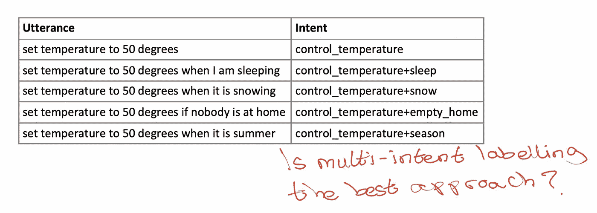
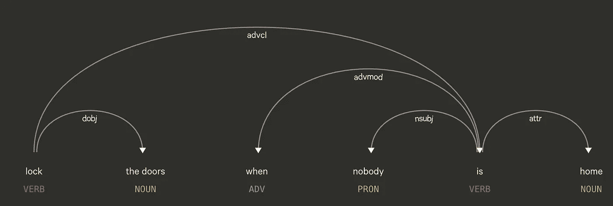
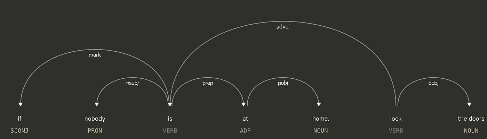
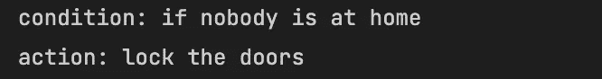
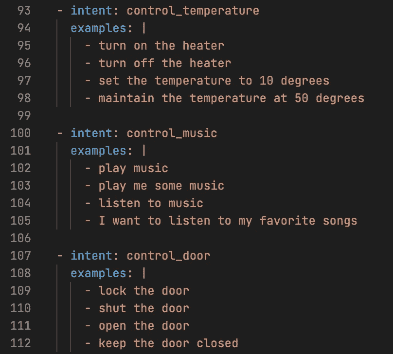
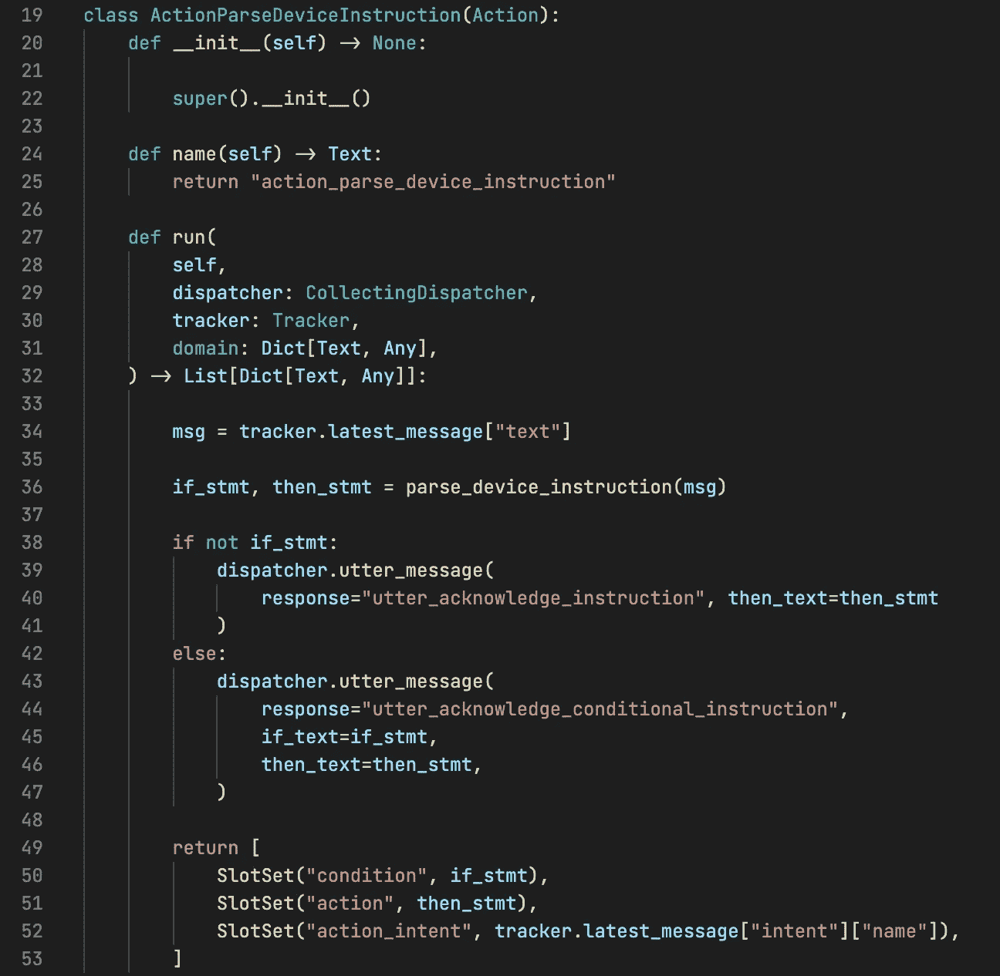
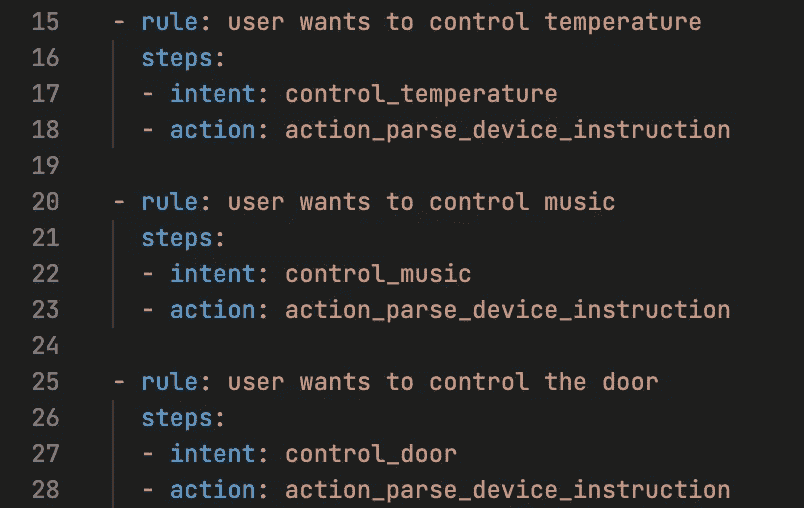

# 如何构建理解条件语句的聊天机器人

> 原文：<https://pub.towardsai.net/how-to-build-a-chatbot-that-understands-conditional-statements-39ea5a840d5?source=collection_archive---------1----------------------->

## [自然语言处理](https://towardsai.net/p/category/nlp)

## 计算语言学方法

# 介绍

在本文中，我将分享一种帮助构建理解条件语句的聊天机器人的方法。

复制本文中描述的机器人的代码可以在[这里](https://github.com/hsm207/conditional-stmt-bot)找到。

让我们以一个例子来解释赋予机器人这种能力的原因。

# 为什么要构建理解条件语句的聊天机器人

假设你刚买了一个智能恒温器，比如 [Nest](https://support.google.com/googlenest/topic/9361772?hl=en&ref_topic=9361189,9371069,7029808,) 。

以下视频展示了如何创建温度预设:

图 1:如何在 Nest 中创建预设温度

有一个漂亮的移动应用程序可以用来配置设备，这真的很方便……但它还能更好吗？

如果您想在睡觉时将温度设置为 60 度，您需要:

1.  打开应用程序
2.  轻按几个按钮以获得所需的设置
3.  操纵一些部件以获得想要的效果

现在，将图 1 中的界面与如下界面进行比较:

图 2:配置智能设备的对话方式

在图 2 中，用户可以从他们的手机上打开一个消息应用程序，例如 WhatsApp、Signal、Telegram，并配置他们的任何智能设备，就像他们在与人交谈一样。

对话式方法不仅速度更快，而且更加用户友好，因为人们不需要记住他们需要遵循的步骤序列来获得所需的设置。用户只需要声明他们的目标，后端集成会处理剩下的事情。

除了配置智能设备之外，对话式方法还有其他有用的使用案例:

*   股票投资:“如果 XOM 在 Q2 的收益超过分析师的预期，就在市场上买入”
*   提醒:“提醒我在阿尔迪买鸡蛋”

上述所有用例中的共同线索是，它需要识别用户的话语有两个组成部分:

*   一个动作:“在市场买 XOM”或“提醒我买鸡蛋”
*   一个条件:“如果它在 Q2 的收益超过分析师的预期”或者“当我在阿尔迪的时候”

仅当条件为真时，才应触发该操作。

让我们讨论一下如何实现这个特性。

# 实施

本文将重点介绍如何在智能家居环境中构建一个能够理解条件语句的机器人。让我们想象这个机器人可以控制恒温器、门、窗和音乐等设备。

## 提取动作和条件

考虑以下关于控制门的说法:

> 没人在家时锁上门

通过依赖解析器传递该话语会产生以下解析:

图 3:机器人如何理解“没人在家时锁门”。来源:[https://bit.ly/3D0hNh5](https://bit.ly/3D0hNh5)

让我们看看如果我们稍微修改一下语句，解析会是什么样子:

> 如果没人在家，锁上门

图 4:机器人如何理解“如果没人在家，把门锁上”。来源:[https://bit.ly/3rpbktI](https://bit.ly/3rpbktI)

出现了几种模式(在我们领域的限制范围内)。我们注意到:

*   “如果-那么”形式的话语有一个状语从句(advcl 关系)
*   “门”是我们希望机器人理解的对象之一，是动词“锁”的直接对象(dobj 关系)
*   “没人在家”是一个名词性主语(nsubj 关系)

因此，我们可以遍历依赖树来提取动作和条件语句。确切的细节超出了本文的范围，但可以在附带的回购协议中找到。读者可以参考[1]来学习如何解释依赖树。

本节的关键要点是，给出一个类似“如果没人在家，把门锁上”的话语，机器人应该能够像这样区分`action`和`condition`:

图 5:从“如果没人在家，锁上门”中提取动作和条件

接下来，让我们讨论一下我们能对话语的`action`和`condition`做些什么。

## 与环境互动

机器人影响变化的方式基于话语的`action`和`condition`将取决于许多事情，例如用于构建机器人的平台和智能设备中可用的接口。

让我们假设我们已经使用 [rasa](https://rasa.com/) 构建了这个机器人。

在 rasa 中实现这一点的一种方法是为我们希望机器人支持的每个设备定义一个意图:

图 6:控制温度、音乐和门的意图

图 6 显示了如果我们希望用户能够通过机器人控制他们家的温度、音乐和门，我们将创建的意图。

请注意，意图不是“如果-那么”的形式。

为什么？

因为这些例子代表了明确表征用户如何与设备交互的令牌序列。任何辅助令牌，如`condition`将在单独的步骤中解析。

从话语中提取`action`和`condition`的解析器可以实现为一个定制动作:

图 7:从用户话语中提取“动作”和“条件”的自定义动作

提取话语的`action`和`condition`发生在图 7 中的第 36 行。动作运行后，`condition`、`action`和`action_intent`槽被设置。这些信息可以传递给其他自定义动作，这些动作将触发实际的交互或首先进行进一步处理，例如，`action`“锁门”和`action_intent`“控制 _ 门”是关于开门还是关门？

为了将所有的东西放在一起，我们可以创建这样的规则:

图 8:处理用户控制设备意图的规则

我们为每个设备创建一个单独的规则，以防每个设备需要不同的接口。

例如，如果我们有一个支持视觉问答(VQA)的摄像机系统，那么我们可以创建一个组件，将`condition`作为一个问题发送给系统，如果答案是肯定的，就触发`action`。[2]中描述了这种架构的细节。

# 结论

本文描述了一种从 if-else 语句中提取含义的方法。它围绕着基于话语语言特征的写作规则。根据语句和领域的复杂程度，规则可能很脆弱。

在下一篇文章中，我们将讨论一种使用机器学习的替代方法。

我希望你已经发现这是有用的。

# 参考

[1] [通用依赖关系](https://universaldependencies.org/)

【2】[智能家电:与你的冰箱聊天](https://arxiv.org/abs/1912.09589)。古多夫斯基等人。艾尔。2019