# 如何建立一个复杂的混合人工智能模型来预测石油和天然气项目的成本？

> 原文：<https://pub.towardsai.net/how-to-build-a-complex-hybrid-ai-model-to-predict-oil-and-gas-project-overcosts-b99c8d1a0ad8?source=collection_archive---------3----------------------->


[华纳](https://unsplash.com/@warnerl?utm_source=unsplash&utm_medium=referral&utm_content=creditCopyText)在 [Unsplash](https://unsplash.com/s/photos/oil-construction?utm_source=unsplash&utm_medium=referral&utm_content=creditCopyText) 上的照片

## 能源项目成本超支的混合人工智能模型

在这篇文章中，我将一步一步地解释如何创建一个混合人工智能模型，它能够预测一个能源项目(这里是石油和天然气)成本超支的概率。这篇文章基于我的博士研究。(激发这篇文章的完整论文可以在[的](https://www.sciencedirect.com/science/article/pii/S0166361519309480?via%3Dihub)这里找到)。

# 需要解决的一般“现实问题”:

项目管理的目的是增加项目成功的可能性，这表现在关键的运营绩效成就(客户价值、交付周期、成本等)上。).因此，专家们开发了几个项目管理成熟度模型来评估和改进项目的结果和绩效。然而，**专家们想要开发模型，将度量的成熟度和项目成功的预期概率联系起来**。

> 本文提出的模型的目的是解释实践者，例如项目经理，如何通过定性专业知识和数据的混合分析来增强他们的决策并交付更具成本效益的服务。

我选择使用贝叶斯网络 **(BN)，这是基于专家知识和数据的风险分析诊断和预测(预测)的相关工具。**bn 基于条件概率关系的观察推断。因此，本文提出的方法将项目管理最佳实践视为信息原子作为输入，将**项目成本超支的概率范围作为输出**。**我们的方法将应用于石油和天然气行业项目的数据。**该数据集关注项目成本超支的最常见原因。

因此，该职位的目标如下:

> 提出一种解释油气行业项目管理成熟度和项目成本超支之间关系([因果关系和相关性](https://towardsdatascience.com/causality-and-bayesian-networks-fcd959d4c80a))的方法。
> 
> 使用建议的方法建立贝叶斯网络，预测一组项目的成本超支范围。


[附身摄影](https://unsplash.com/@possessedphotography?utm_source=unsplash&utm_medium=referral&utm_content=creditCopyText)在 [Unsplash](https://unsplash.com/s/photos/intelligence?utm_source=unsplash&utm_medium=referral&utm_content=creditCopyText) 上拍照

# 为什么我选择为这个问题创建贝叶斯网络？

在目前的情况下，因果模型应融合不同的来源，例如专家在项目管理最佳做法方面的知识，以及存储以往项目绩效信息的数据库。**项目管理审计员检查项目的绩效，以及客户组织是否已经(或没有)实施了核心的最佳实践。**然后，专家们有了可以进行诊断和预测的因果模式。此外，客户没有一个广泛的结构化数据库来衡量跨同一领域的几个项目的项目管理成熟度。这意味着只有少量证据确凿的案例存在。然后我有一个情况，我有专业知识和不完整的数据。然而，尽管有这些原材料，我可以使用 BNs 来构建具有学习能力的因果模型。

然而，由于人工计算的限制，我不能要求专家将大量的输入变量(成熟度评估)与项目绩效的几个标准、我们事业中的成本超支相关联。幸运的是，我可以请专家们详细说明因果网络最可爱的结构。

通常，当客户在项目管理中遇到困难时，专家会被要求解决特定的问题。**然后，专家的方法集中于识别功能失调点，并在试图应对有害后果之前实施预防措施**。专家知道如何找到失败原因(这里我称之为漂移因素)，以及项目管理成熟度与这些原因之一发生的概率之间的因果关系是什么。因此，我的**方向是** **问他们项目管理成熟度水平和项目管理漂移因素之间的关系是什么，而不是直接问项目管理成熟度和项目运营绩效之间的关系。**

遵循第一条**构建规则，我在这篇** 的 [**结论中定义，我应该“将模型的语义限制在项目管理的特定领域”。然后，我将因果模型的语义限制在项目管理成熟度评估上。我定义了一个必须满足三个要求的评估模型:**](https://towardsdatascience.com/using-bayesian-networks-for-project-management-evaluation-13a6eda50605)

*(1)与现有的成熟度模型相比，其标准数量应减少，以便于相关性和计算。*

*(2)评价标准应基于项目管理成熟度评价的原则。*

*(3)这些标准必须能够被专家理解，以便为客户组织提供未来的建议。*

因此，**我使用一个规范化的模型，其中最佳实践是原子。**在这个描述性结构中，项目过程组可以分为三个不变的与时间相关的结构，称为基于项目阶段的年表:准备、监控和估价。此外，年表中的活动和例程具有共同的不变特征:它们由某人完成(资源不变)，它们在特定的时间内完成，或者它们可能具有重复的性质(频率不变)，并且它们具有几个级别的细节和粒度(活动粒度不变)。我还提出，活动和例行程序可以分为四个不变的领域，这四个不变的领域分为十个项目管理知识领域(社会领域、合同领域、结果领域和界面领域)。下图显示了我们的描述性模型的相应术语矩阵。

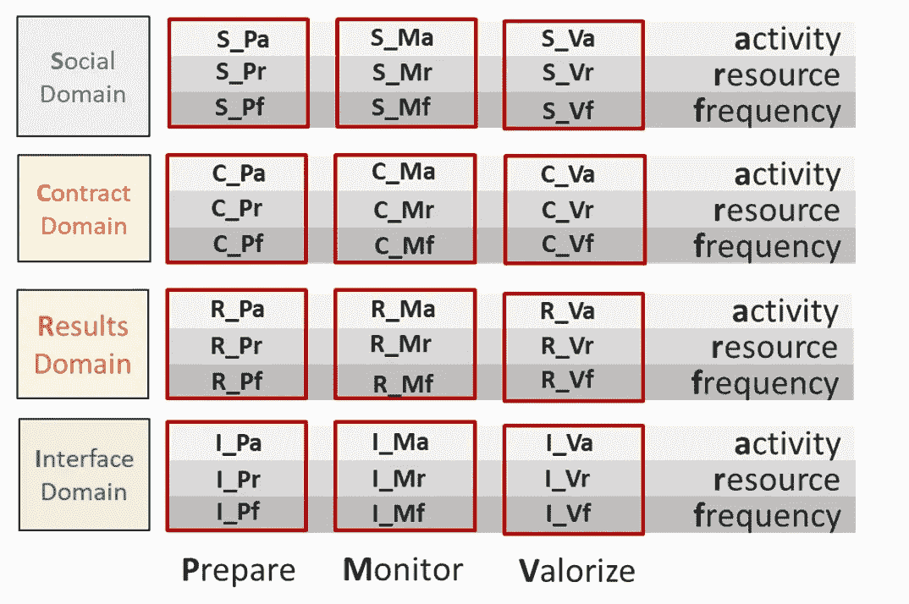

作者创作-博士论文论文(此处[开放访问](https://www.researchgate.net/publication/340598019_An_Approach_Based_on_Bayesian_Network_for_Improving_Project_Management_Maturity_An_Application_to_Reduce_Cost_Overrun_Risks_in_Engineering_Projects))。

如果你有兴趣从商业的角度更深入地理解这个模型的逻辑，我推荐这篇文章，在这篇文章中，我解释了如何以及为什么提出这个模型。

[](https://medium.com/agileinsider/how-to-make-project-management-maturity-models-useful-for-agile-projects-37473d4c557e) [## 如何让项目管理成熟度模型对敏捷项目有用？

### 项目管理成熟度模型用于评估和改进项目管理。有没有可能向他们学习，创造一个新的模式应用…

medium.com](https://medium.com/agileinsider/how-to-make-project-management-maturity-models-useful-for-agile-projects-37473d4c557e) 

# **如何建立模型？**


Jukan Tateisi 在 [Unsplash](https://unsplash.com/s/photos/first-step?utm_source=unsplash&utm_medium=referral&utm_content=creditCopyText) 上拍摄的照片

**第一步:选择如何对输入节点建模**

当人们研究成熟度等级时，他们倾向于将输入节点的每个状态与每个成熟度等级联系起来。然而，这对于手头的*数据量*和可能结果的*完整性*来说效率不高。在之前的文章中，我已经用[构造规则#2 解释过，](https://towardsdatascience.com/using-bayesian-networks-for-project-management-evaluation-13a6eda50605)我应该“**限制输入节点的数量**”。当从历史数据中学习先验概率时，重要的是**保证所选择的状态数量适合数据库大小**。这意味着必须在 BN 结构和结果质量之间找到一个平衡点。如果状态数太高，则 CPT 计算会增加对数据的需求。在这种情况下，状态的数量应该减少，这解释了为什么高性能 BN 在大多数变量中有两个状态。

在建议的因果模型中，部分显示在下图中，每个独立节点代表一个成熟度级别**，有两种状态:“真”或“假”**。我在遵循 [**构造规则#3:** “限制输入节点的状态数”。](https://towardsdatascience.com/using-bayesian-networks-for-project-management-evaluation-13a6eda50605)每个状态对应于一个成熟度评估问题的答案，检查一个实践是否被执行。例如，Social_Monitor_Resources (S_Mr)不变量对应于进度报告的定义。执行此不变量的级别由检查为“是”的节点数表示，也就是说，如果报告未建立或者是临时的，级别 1 将被检查为“是”，其他将被检查为“否”。如果建立了报告，用于测量和分析数据，级别 1、2 和 3 将被勾选为“是”，级别 4 和 5 被勾选为“否”

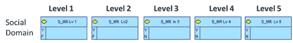

作者的创作

遵循构造规则#4，我应该“**使用合成节点**”。在这种方法中，[综合节点](https://towardsdatascience.com/bayesian-networks-and-synthetic-nodes-721de16c47e2)将解释项目过程中可能出现的问题；在这里，它们被称为**‘漂移因素’，被定义为在评估项目结束时，预期成本和实际成本之间可能的未来成本超支的原因。**

模拟漂移因素包括三项模拟任务:

**1。漂移因素的识别:**专家从数据集中识别特定项目类型中潜在的漂移原因，然后将它们组织在一个集合中，

**2。漂移因子的选择:**从集合中选择显著的漂移因子，排除不显著的漂移因子。

**3。漂移因子的匹配:**它们识别漂移因子和 PMMM 不变量之间的因果关系，并将它们组织成元组。

项目管理成熟度等级是与综合节点相关的单个节点(在本研究中称为漂移因子)。下图显示了每个漂移因子如何拥有 5 个父节点(以模拟 5 个成熟度级别)。

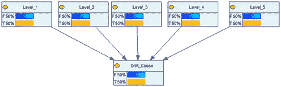

作者的创作

在实践中，重大漂移原因的识别和选择应与项目管理专家一起进行。在这个过程之后，所选择的漂移原因可以被组织为元组(匹配漂移原因和项目管理成熟度标准)。为了比较不同项目的特点，并确保数据的一致性，受访专家被要求在一个拟议的不变矩阵中对漂移因素进行分类。下图显示了我们如何绘制选定的漂移系数

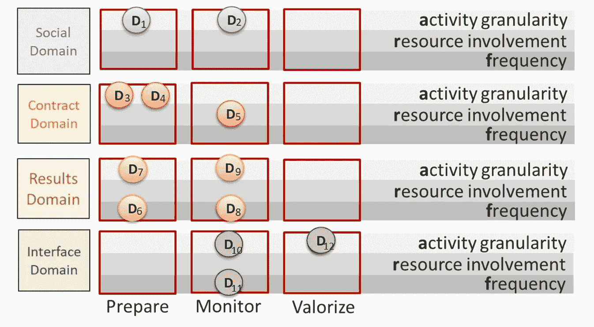

作者的创作

**综上所述，每个漂移因子节点是五个成熟度级别节点的子节点。我采访了一些专家，让他们的知识变得清晰，以定义每个成熟度等级与每个漂移因素之间的因果关系。**

为了对这部分进行建模，我根据专家对以下问题的回答创建了通用条件概率表:**每个成熟度级别对每个漂移因子的影响是什么？**

为了估计项目管理成熟度等级和漂移因素之间的关系，我们定义了“聚合权重”。我们假设较高的成熟度意味着较低的漂移发生率。这个假设和权重已经与专家讨论过了。他们接受了这一假设，并确定了下表所示的权重。此表显示了每个成熟度级别对未达到漂移因子 P(漂移=假)的概率的影响。

在这种情况下，为了简单起见，专家假设所有成熟度标准的给定成熟度水平同等地影响每个漂移因子。根据这一标准，每个级别都具有相同的权重(20%)

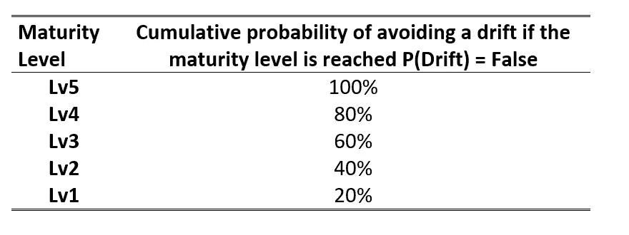

**等于**分布的到期汇总权重(作者创建)

而另一种分布，我称之为渐进分布，随着成熟度的增加，其权重也会增加。

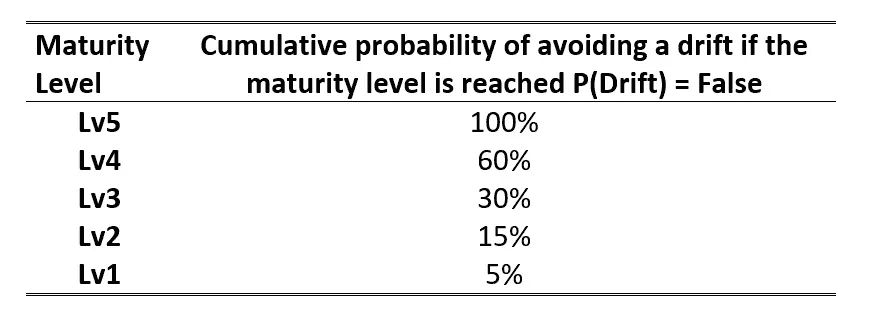

**累进**分布的到期汇总权重(作者创作)

漂移因子节点有两种状态:“真(T)”或“假(F)”。一旦专家为每个漂移因子节点的 CPT 的 P(漂移=假)线选择了聚集权重。下表显示了这种构造的结果。每个成熟度级别有两种状态(是/否)，它们的组合从全“真”到全“假”。线 P(漂移=真)表示漂移因子出现的概率。同样，P(Drift = False)是它的补数。基于此，我创建了以下条件概率表。

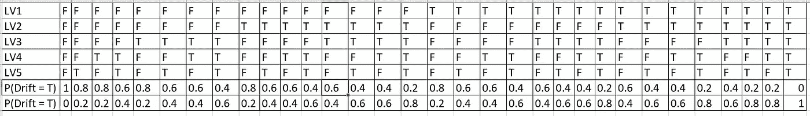

**平均**分布的条件概率表(CPT)(作者创作)

我使用这个 CPT 表来模拟 5 万行 CSV，这将是 python 代码(EqualLevels.csv)的输入文件之一，该文件将存储在数据框 **EqualLevels** 中。

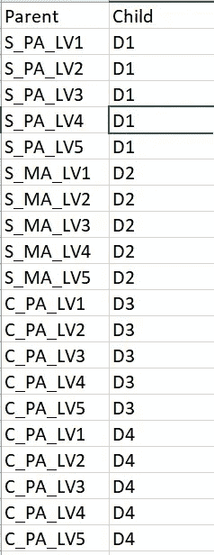

inputMaturityModel.csv 文件(作者创作)

另一个输入文件是一个名为 **inputMaturityModel** 的 CSV 文件，其中有两列(左边的图像)，第一列是所有父节点的列表，第二列是对应于未来贝叶斯网络的每个父节点的子节点。该文件概述了网络的预期结构(由专家根据因果关系成熟度等级定义- >项目漂移的原因)。

下面的代码导入创建的 CSV，然后将状态“T，F”(True，False)转换为状态 0 和 1，以便于以后的计算。

然后，我应用一个名为 **maturity_df** 的函数，该函数使用之前生成的 CSV，并为每一列分配对应于每个不变量(input.csv 文件的第一列)的父项的名称。最后，最后一列对应于对应的漂移原因 D1 到 D12。

所有这 12 个数据帧在内容上是相同的，它们只是具有不同的列名(前五个对应于父节点，最后一个对应于漂移的原因)。这意味着假设每个成熟度等级对每个漂移原因的影响相等。


林赛·亨伍德在 [Unsplash](https://unsplash.com/s/photos/next-step?utm_source=unsplash&utm_medium=referral&utm_content=creditCopyText) 上的照片

**第二步:选择如何模拟合成节点**

**多个** [**合成节点**](https://towardsdatascience.com/bayesian-networks-and-synthetic-nodes-721de16c47e2) **:** 引入合成节点作为漂移因子是这种建模方法的基础。为了确保提议的 BN 包括项目中可能出现的所有最重要的漂移因素，我采访了石油和天然气项目开采管理方面的专家。从每次采访中，我都提取和收集了主要的漂移因素。

已经使用了从石油和天然气海上项目获取的工业数据集。在这种情况下，考虑了 15 个持续四年的工程项目。他们每个人都有一个包含漂移常见原因的数据库。这些数据包含了关于漂移原因的详细信息，例如日期、金钱损失的数量、主要因素和一些纠正它们的措施，或者应该做些什么来避免重复[(本帖中有更多关于该数据集的详细信息)](https://towardsdatascience.com/datascience-in-oil-and-gas-engineering-projects-daace6e6c7f)。

**我们的调查涉及十五个海上油气项目中出现的重大漂移因素的分析。**研究油气项目常见问题原因的专家选出了这些原因。而且，我采访了行业专家。他们被提供了一个被评估项目的主要漂移因素的列表，以检查原因是否有意义以及是否与他们所属的领域一致。由于被评估的项目属于同一个行业，它们共享特定的漂移因子。因果模型具有有限数量的经验定义的漂移因子。下表显示了所研究项目中最常见的漂移因素。为了证实我们的研究，该表还显示了 PM 文献的来源，其中相同领域(石油和天然气建设)的项目使用相同的漂移系数进行实验。

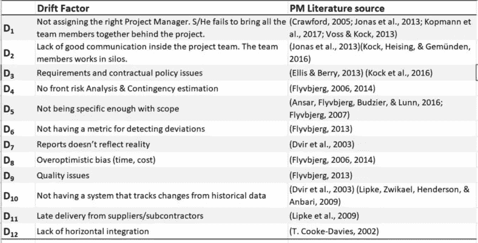

选定的漂移系数。(作者的创作)

漂移因子的选择是一个过程，可能会根据项目的类型或不同的环境而变化。在这一案例研究中，对项目业务绩效(即费用超支)的评价涉及同一时期(连续 4 年内)和同一地区(类似的政治和经济特征)的同类项目。

[在这篇文章中，我为数据集](https://towardsdatascience.com/datascience-in-oil-and-gas-engineering-projects-daace6e6c7f)制作了 EDA，下图是定义每种漂移原因的平均影响值和标准偏差的指南。发生的概率也是基于对实际数据的分析。

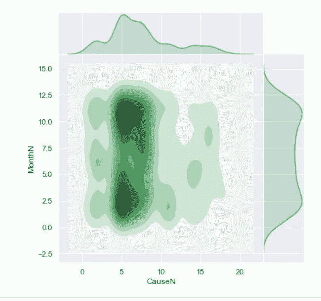

每月漂移系数(CauseN)的影响。(作者的创作)


由[大卫·格里菲斯](https://unsplash.com/@itscakefortea?utm_source=unsplash&utm_medium=referral&utm_content=creditCopyText)在 [Unsplash](https://unsplash.com/s/photos/finish-line?utm_source=unsplash&utm_medium=referral&utm_content=creditCopyText) 上拍摄的照片

**最后一步:用数据训练贝叶斯网络**

由于所研究项目的数据是私人的，我不能在这里分享与漂移的每个原因和对成本超支的影响之间的关系对应的数据。在这种情况下，12 个漂移原因对油气项目成本超支产生影响。

数据帧包含训练贝叶斯网络所需的信息。列的名称对应于将用作网络节点的轴。

```
Index(['S_PA_LV1', 'S_PA_LV2', 'S_PA_LV3', 'S_PA_LV4', 'S_PA_LV5', 'D1',
       'S_MA_LV1', 'S_MA_LV2', 'S_MA_LV3', 'S_MA_LV4', 'S_MA_LV5', 'D2',
       'C_PA_LV1', 'C_PA_LV2', 'C_PA_LV3', 'C_PA_LV4', 'C_PA_LV5', 'D3',
       'C_PA2_LV1', 'C_PA2_LV2', 'C_PA2_LV3', 'C_PA2_LV4', 'C_PA2_LV5', 'D4',
       'C_MR_LV1', 'C_MR_LV2', 'C_MR_LV3', 'C_MR_LV4', 'C_MR_LV5', 'D5',
       'C_PF_LV1', 'C_PF_LV2', 'C_PF_LV3', 'C_PF_LV4', 'C_PF_LV5', 'D6',
       'R_PA_LV1', 'R_PA_LV2', 'R_PA_LV3', 'R_PA_LV4', 'R_PA_LV5', 'D7',
       'R_MF_LV1', 'R_MF_LV2', 'R_MF_LV3', 'R_MF_LV4', 'R_MF_LV5', 'D8',
       'R_MR_LV1', 'R_MR_LV2', 'R_MR_LV3', 'R_MR_LV4', 'R_MR_LV5', 'D9',
       'I_MR_LV1', 'I_MR_LV2', 'I_MR_LV3', 'I_MR_LV4', 'I_MR_LV5', 'D10',
       'I_MF_LV1', 'I_MF_LV2', 'I_MF_LV3', 'I_MF_LV4', 'I_MF_LV5', 'D11',
       'I_VA_LV1', 'I_VA_LV2', 'I_VA_LV3', 'I_VA_LV4', 'I_VA_LV5', 'D12',
       'Impact'],
      dtype='object')
```

5 万行中的每一行都是模拟的一个状态，在每个状态中，节点可以具有值 1 或 0，这取决于事件是否发生(例如，S_PA LV1 = 1)以及该事件(连同该行中发生的其他事件)是否对“影响列”具有足够的影响以超过上面定义的阈值(即 10%)。

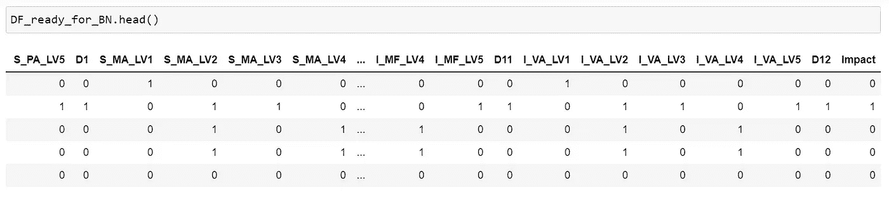

为了创建网络的边，我使用了 inputMaturityModel 文件，其中的结构已经分为两列。父节点和子节点。下面的代码为整个网络结构创建一个元组(父、子)列表。这样，每当我需要创建一个新的贝叶斯网络或重新配置现有的贝叶斯网络时，我只需更改输入文件中的结构。

获得的列表如下。这个列表中元组的元素与训练贝叶斯网络的数据帧的列相一致是非常重要的(在这个例子中是 DF_ready_for_BN)。否则，我的训练会有问题。

```
[('S_PA_LV1', 'D1'), ('S_PA_LV2', 'D1'), ('S_PA_LV3', 'D1'), ('S_PA_LV4', 'D1'), ('S_PA_LV5', 'D1'), ('S_MA_LV1', 'D2'), ('S_MA_LV2', 'D2'), ('S_MA_LV3', 'D2'), ('S_MA_LV4', 'D2'), ('S_MA_LV5', 'D2'), ('C_PA_LV1', 'D3'), ('C_PA_LV2', 'D3'), ('C_PA_LV3', 'D3'), ('C_PA_LV4', 'D3'), ('C_PA_LV5', 'D3'), ('C_PA2_LV1', 'D4'), ('C_PA2_LV2', 'D4'), ('C_PA2_LV3', 'D4'), ('C_PA2_LV4', 'D4'), ('C_PA2_LV5', 'D4'), ('C_MR_LV1', 'D5'), ('C_MR_LV2', 'D5'), ('C_MR_LV3', 'D5'), ('C_MR_LV4', 'D5'), ('C_MR_LV5', 'D5'), ('C_PF_LV1', 'D6'), ('C_PF_LV2', 'D6'), ('C_PF_LV3', 'D6'), ('C_PF_LV4', 'D6'), ('C_PF_LV5', 'D6'), ('R_PA_LV1', 'D7'), ('R_PA_LV2', 'D7'), ('R_PA_LV3', 'D7'), ('R_PA_LV4', 'D7'), ('R_PA_LV5', 'D7'), ('R_MF_LV1', 'D8'), ('R_MF_LV2', 'D8'), ('R_MF_LV3', 'D8'), ('R_MF_LV4', 'D8'), ('R_MF_LV5', 'D8'), ('R_MR_LV1', 'D9'), ('R_MR_LV2', 'D9'), ('R_MR_LV3', 'D9'), ('R_MR_LV4', 'D9'), ('R_MR_LV5', 'D9'), ('I_MR_LV1', 'D10'), ('I_MR_LV2', 'D10'), ('I_MR_LV3', 'D10'), ('I_MR_LV4', 'D10'), ('I_MR_LV5', 'D10'), ('I_MF_LV1', 'D11'), ('I_MF_LV2', 'D11'), ('I_MF_LV3', 'D11'), ('I_MF_LV4', 'D11'), ('I_MF_LV5', 'D11'), ('I_VA_LV1', 'D12'), ('I_VA_LV2', 'D12'), ('I_VA_LV3', 'D12'), ('I_VA_LV4', 'D12'), ('I_VA_LV5', 'D12'), ('D1', 'Impact'), ('D2', 'Impact'), ('D3', 'Impact'), ('D4', 'Impact'), ('D5', 'Impact'), ('D6', 'Impact'), ('D7', 'Impact'), ('D8', 'Impact'), ('D9', 'Impact'), ('D10', 'Impact'), ('D11', 'Impact'), ('D12', 'Impact')]
```

最后，我可以训练网络。由于 CausalNex 库，训练贝叶斯网络变得非常类似于任何其他机器学习算法:

用这段代码，我创建了下面的贝叶斯网络:

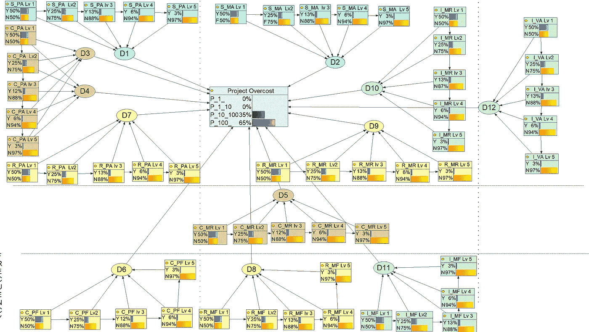

BN 表示(作者的创作)

# 结论

这篇文章展示了如何建立一个模型，使用数据和人类知识来预测石油和天然气项目的成本超支。这个帖子链接了我之前在 [TDS](https://towardsdatascience.com/search?q=felipe%20sanchez) 发布的所有作品。

在这篇文章中，我使用了 BN 来结合因果分析和相关性，以提出一个更详细的因果模型。尽管如此，我还是关注了一个运营绩效，那就是成本超支。我也用了数据，专家的知识，然后 BN 作为机器学习技术。

我已经举例说明了因果建议模型在石油或天然气部门的重量级项目中的应用。我已经用特定的贝叶斯网络(BN) **对项目管理成熟度等级和项目失败概率之间的因果关系进行了建模。该网络可用于促进项目经理的改进建议。除了黑盒类型的模型，我们的建议允许用户与节点进行交互，了解因果网络的结构，并根据项目的情况选择可能需要的最佳实践来提高项目性能**

从这个构建中可以得出的结论是，80%的工作是概念化的模型，与专家交谈，定义理论框架，剩下的 20%的工作是构建和训练贝叶斯网络的代码。需要注意的是，这个贝叶斯网络是我在这个学术期刊上发表的博士论文的产物(此处[开放存取](https://www.researchgate.net/publication/340598019_An_Approach_Based_on_Bayesian_Network_for_Improving_Project_Management_Maturity_An_Application_to_Reduce_Cost_Overrun_Risks_in_Engineering_Projects))。

在另一篇文章中，我将解释这个模型的疑问和要点，回答如下问题:当聚合不是均等而是渐进时会发生什么？如何可能创建基于 BN 的推荐场景？

**感谢阅读！！**

如果你想继续阅读这样的故事，你可以[在这里订阅！](https://fesan818181.medium.com/membership)