# 基于内容的推荐系统的实际实现

> 原文：<https://pub.towardsai.net/how-to-build-a-content-based-recommendation-system-f7d881a53e9a?source=collection_archive---------1----------------------->

## 一个完整的端到端的基于内容的推荐系统，根据用户的输入推荐相似的电影。

图片来自 Unsplash，由 [Krists Luhaers](https://unsplash.com/@kristsll) 上传

每当我们去购物中心购买一双新鞋或衣服时，我们都会找到一个专注的人，他会根据我们的喜好帮助我们选择应该购买的产品，并让我们的工作变得更简单。简单来说，他就是一个推荐系统。但在这个现代世界，一切都是在线的，互联网上有如此多的内容，Youtube 上有大量的视频，亚马逊上有大量的产品，这让用户很难选择。推荐系统出现了，它通过推荐下一个要观看的视频或要购买的类似产品，让用户的生活变得简单。

推荐系统是一段足够智能的代码，可以理解用户的偏好，并根据他/她的兴趣推荐东西，目标是增加利润。例如，Youtube 和网飞希望你在他们的平台上花更多的时间，所以他们根据用户的喜好推荐视频。亚马逊希望你从他们的网站上购买产品，这样他们可以获得更多利润。

 [## 用 Python 编写复杂模式的简单方法，仅需 4 分钟。

### 用 python 编写复杂模式程序的简单方法

medium.com](https://medium.com/@gowthamsr37/pattern-programming-in-python-23d5af04211e) 

# 有哪些不同类型的推荐系统？

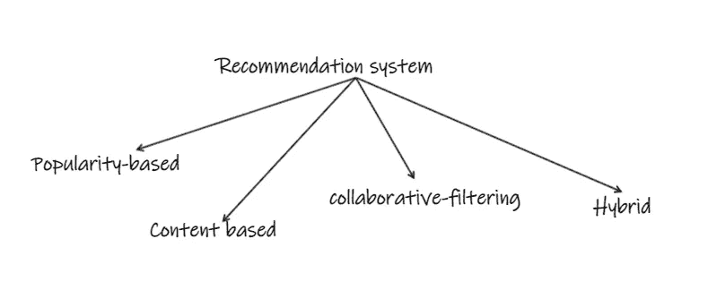

作者图片

**基于人气的**:向每个用户推荐他们网站上的顶级产品。这种方法不会考虑用户的兴趣。例如 Youtube 上的趋势部分、IMDB 的前 250 部电影。

**基于内容:**

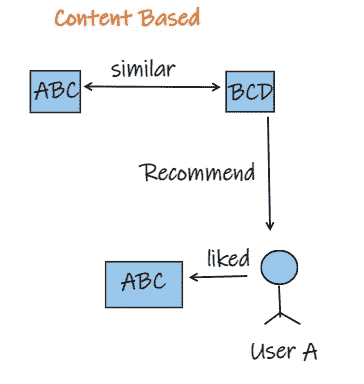

作者图片

这是基于产品之间的相似性。例如，如果用户已经观看了一部电影并且喜欢它，他可能喜欢在将来观看类似的电影。这可以基于类型、男演员、女演员或导演。

**协同过滤**:

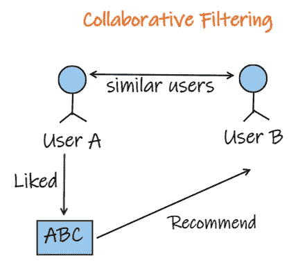

作者图片

这是基于用户的相似性。例如，如果人 A 和 B 已经观看并喜欢电影 M，接下来如果人 A 观看了电影 Z 并喜欢它，我们可以向人 B 推荐电影 Z，因为 A 和 B 是相似的用户。

如果你很想知道我们如何建立一个基于流行度和基于协同过滤的推荐系统，可以考虑阅读下面的博客。

 [## 一个完整的基于端到端机器学习的推荐项目

### 基于协同过滤和流行度过滤的机器学习推荐方案。

medium.com](https://medium.com/@gowthamsr37/step-by-step-approach-to-building-a-recommendation-system-a65be5a54045) 

**混合滤波**:利用上述全部或部分方法形成混合模型。

# 基于内容的电影推荐系统；

让我们看看如何建立一个基于内容的图书推荐系统。下面是我们将为这个项目建立的最终模型的图像。

作者图片

以下是我们将要执行的步骤。

*   让我们导入基本库，读取数据集并创建数据框。数据集可以从链接[数据集](https://www.kaggle.com/datasets/tmdb/tmdb-movie-metadata?select=tmdb_5000_credits.csv)下载

*   合并“电影”和“演职员表”数据帧，以获得最终的数据帧。

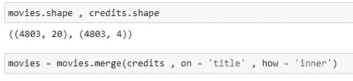

*   只考虑必需的列。

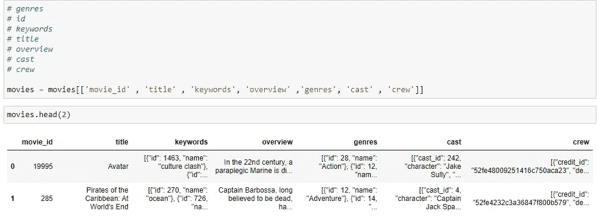

*   处理专栏-流派:

“流派”列是字典列表，它既有键又有值，但是我们只需要流派值，所以让我们创建一个函数来只获取所需的数据。

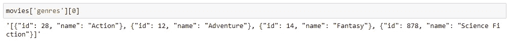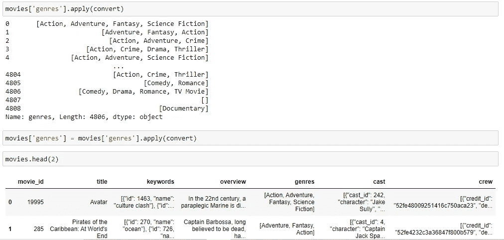

“流派”列现在只包含必需的数据。

*   让我们将相同的函数应用于“关键字”列

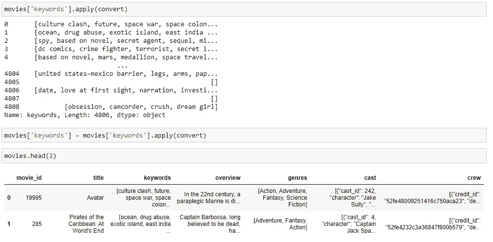

*   让我们修改上面的函数，只获取前 3 个角色名称。

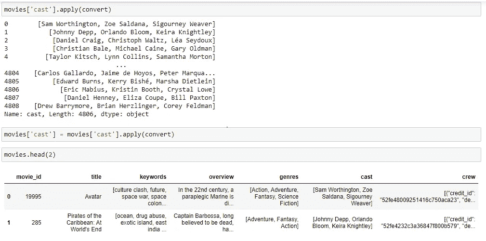

*   让我们通过修改上面的函数从“crew”列中获得导演的名字。

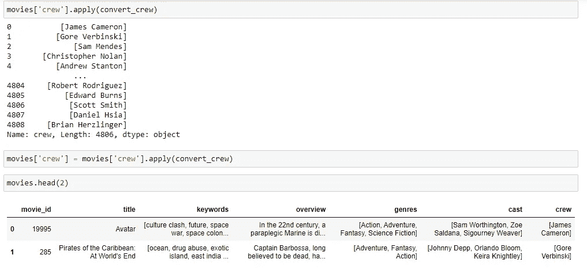

*   让我们将“概述”列从字符串转换为列表

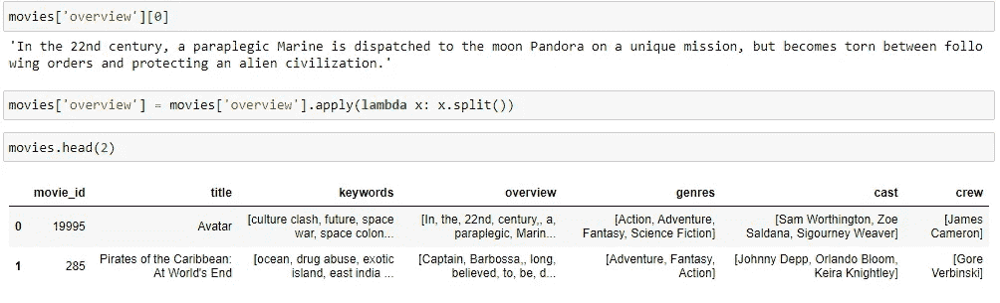

*   我们需要修改工作人员和演职人员的姓名，使姓名之间没有任何空格，因为当我们将单词转换为向量时，我们的机器学习模型将受到影响。例如，詹姆斯·卡梅隆应该转换为“詹姆斯·卡梅隆”，约翰尼·德普应该转换为约翰尼·德普，科幻小说应该转换为科幻小说。

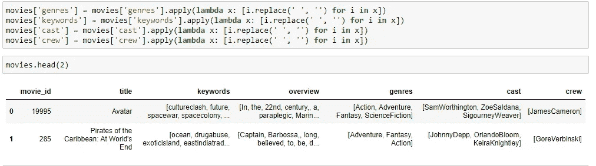

*   让我们通过连接“关键字”、“概述”、“流派”、“演员”和“船员”来创建一个名为“标签”的新列。

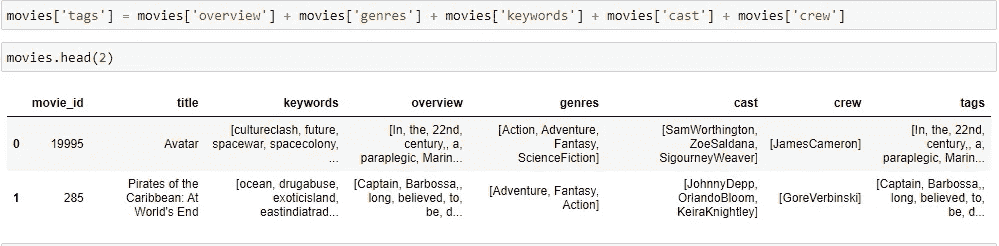

*   让我们通过仅采用特征‘movie _ id’、‘title’和‘tags’来制作新的数据帧 new_df。

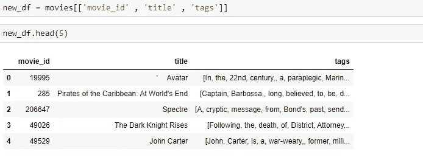

*   让我们将特性“标签”从列表转换为字符串。

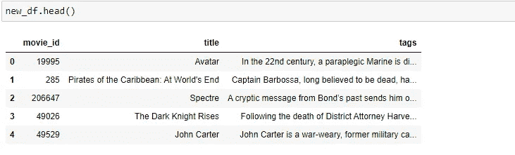

*   将功能“标记”转换为小写。

*   应用词干将单词转换成它们的基本形式。

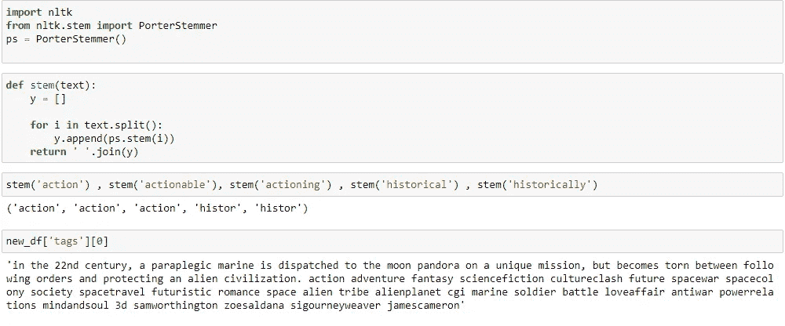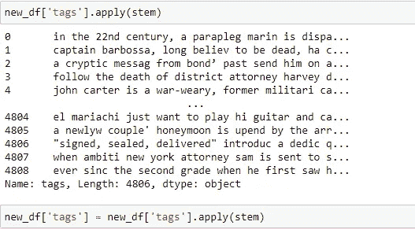

*   现在让我们把标签转换成一个单词包，同时去掉所有的停用词，现在电影向量就准备好了。每部电影都是一个 5000 维的向量。

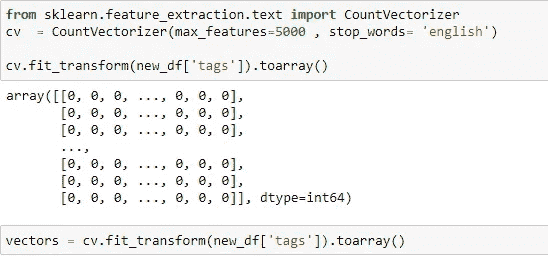

*   让我们计算每个电影向量之间的相似性得分。

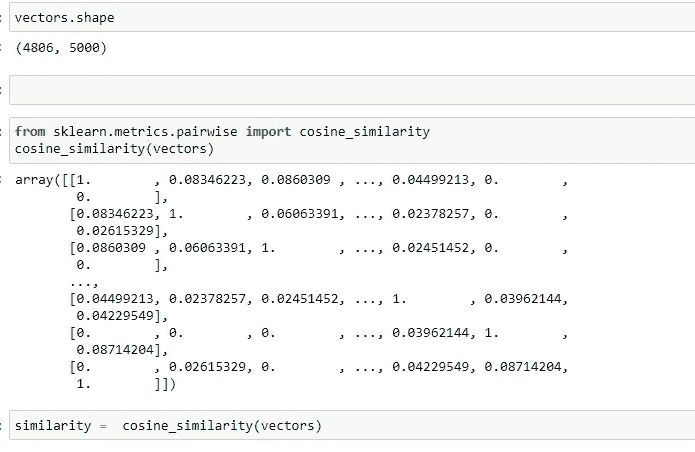

*   让我们创建一个函数，将电影名称作为输入，并根据相似性得分推荐 5 部电影。

看看模型中的一些建议。

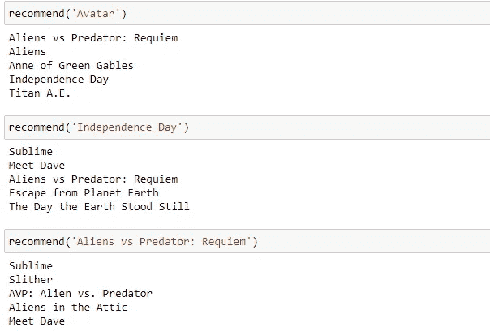

*   模型部署:让我们利用“streamlit”库来制作一个简单的 GUI 并部署模型。

我们已经成功完成了应用程序的前端，您可以将其部署到任何云平台。看看下面的一些建议。

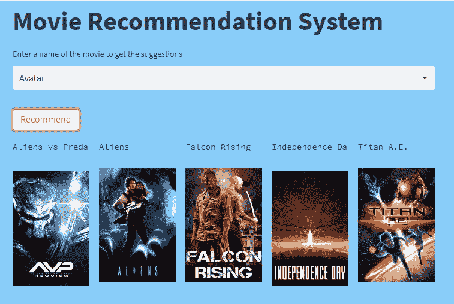

作者图片

作者图片

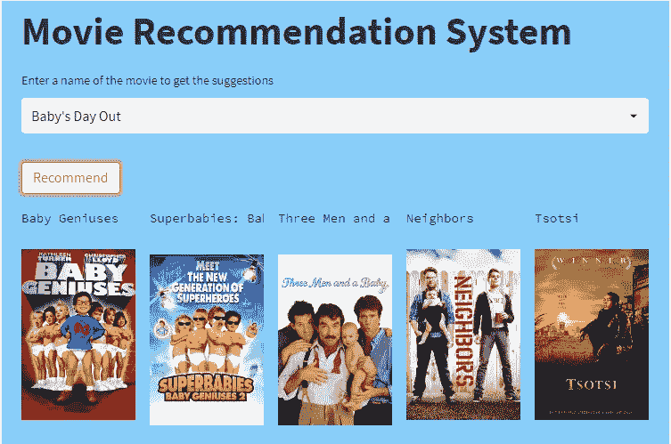

作者图片

我们已经成功地完成了所有的步骤，我们的模型已经准备好了。你可以尝试建立一个类似的模型。完整的代码可以在我的 [Github](https://github.com/gowthamsr37/Movie-Recommendation-System) 页面上找到。