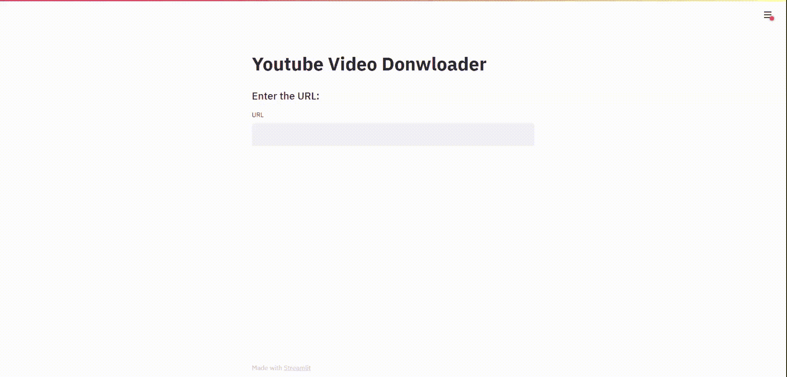
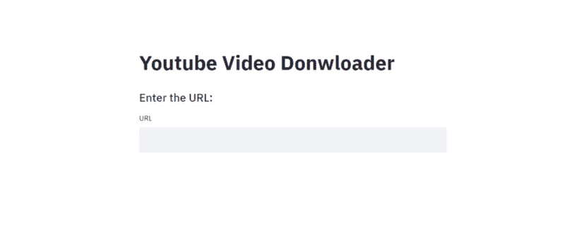
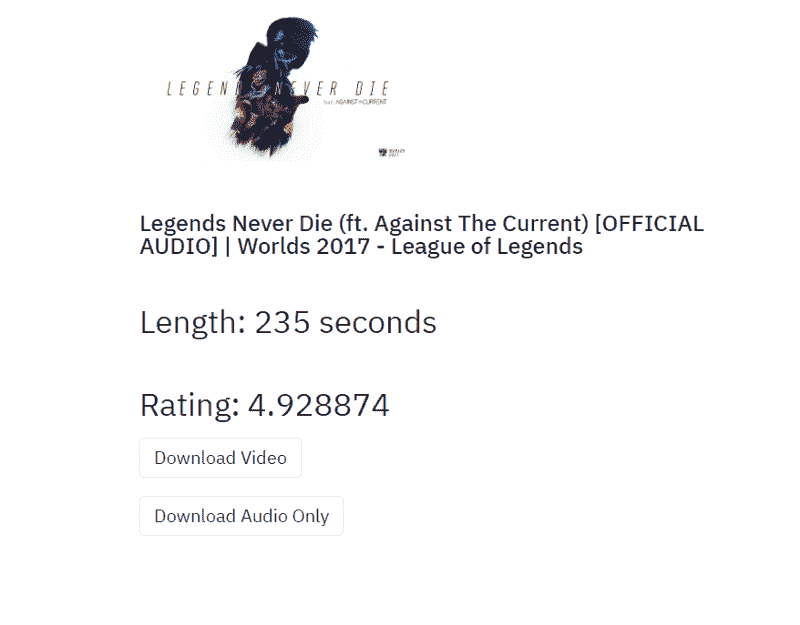

# 如何用 30 行代码构建下载 YouTube 视频的 Web 应用程序— Python 项目教程

> 原文：<https://pub.towardsai.net/how-to-build-a-web-app-to-download-youtube-videos-in-30-lines-of-code-python-project-tutorials-79bb52178a6b?source=collection_archive---------3----------------------->

## [编程](https://towardsai.net/p/category/programming)

我们将使用 Streamlit 和 pytube 来构建我们的 youtube 下载器 web 应用程序。我还将简要介绍 pytube 库。



作者截屏

我们将实现以下功能

*   用户将 URL 作为输入的能力
*   如果可用，能够选择视频与音频/音频下载

# 设置虚拟环境

开始之前，我们需要设置并激活一个虚拟环境

```
pip install virtualenv /* Install virtual environment */ virtualenv venv /* Create a virtual environment */ 
venv/Scripts/activate /* Activate the virtual environment */
```

# 安装所需的库

我们需要安装以下库

## 细流

[](https://www.streamlit.io/) [## Streamlit -创建数据应用程序的最快方式

### Streamlit 是一个面向机器学习和数据科学团队的开源应用框架。在…中创建漂亮的数据应用程序

www.streamlit.io](https://www.streamlit.io/) 

## pytube

 [## pytube - pytube 10.1.0 文档

### 文档的这一部分从项目的一些背景信息开始，然后着重于一步一步的…

python-pytube.readthedocs.io](https://python-pytube.readthedocs.io/en/latest/index.html) 

键入以下命令安装库

```
pip install streamlit, pytube
```

# 步骤 1:导入库

```
import streamlit as st
from pytube import YouTube
```

导入已安装的库，并根据需要定义别名。

# 步骤 2:标题和 URL 输入



作者截图

我们将为文本使用 streamlit 的 **title()** 和 **subheader()** 函数。两者都是以一个字符串作为参数，并显示出来。

对于用户输入，我们将使用 **text_input()** 函数。标签可以作为参数传递。

```
st.title("Youtube Video Donwloader") 
st.subheader("Enter the URL:") url = st.text_input(label='URL')
```

我们需要将 URL 存储在一个变量中。每当用户键入一个 URL 并按下回车键，应用程序就会重新运行，函数 **text_input()** 将返回输入的 URL

> *我将使用以下网址*[*https://www.youtube.com/watch?v=4Q46xYqUwZQ*](https://www.youtube.com/watch?v=4Q46xYqUwZQ)

# 步骤 3:获取 Youtube 视频的数据

首先，我们需要创建一个从 pytube 导入的 YouTube 对象的实例。Youtube 对象的构造函数要求将 URL 作为参数传入。

```
yt = YouTube(url)
```

YouTube 对象有许多有用的属性，下面列出了其中一些

*   **缩略图 url:** 缩略图的 url。streamlit 的 **image()** 函数可以使用这个 URL 来显示图像。
*   **标题:**视频的标题
*   **长度:**以秒为单位的视频长度
*   **评分:**视频的平均评分

Youtube 对象也有一个名为 **streams 的属性。这是一个流对象列表。我们将在下一步讨论它们。**

# 步骤 4:理解流对象

```
print(yt.streams)
```

我稍微修改了输出。我还截断了输出，因为它很长。

```
---------------------- Stream Object 1 ----------------------------- <Stream: itag="18" mime_type="video/mp4" res="360p" fps="30fps" vcodec="avc1.42001E" acodec="mp4a.40.2" progressive="True" type="video">, ---------------------- Stream Object 2 ----------------------------- <Stream: itag="22" mime_type="video/mp4" res="720p" fps="30fps" vcodec="avc1.64001F" acodec="mp4 a.40.2" progressive="True" type="video">, ---------------------- Stream Object 3 ----------------------------- <Stream: itag="299" mime_type="video/mp4" res="1080p" fps="60fps" vcodec="avc1.64002a" progressive="False" type="video">, 
---------------------- Stream Object 4 ----------------------------- <Stream: itag="303" mime_type="video/webm" res="1080p" fps="60fps" vcod ec="vp9" progressive="False" type="video">
```

我们将需要选择其中一个流，并使用它来下载我们的视频/音频。有两种类型的流:基于 HTTP 的渐进流和动态自适应流(DASH)。渐进流同时具有视频和音频成分，而虚线流仅具有其中之一。DASH 流用于下载高分辨率视频。视频和音频组件必须单独下载，然后使用软件合并在一起。

如果您检查流对象，您会注意到每个对象都有一个名为 **progressive 的布尔属性。**流对象 1 和流对象 2 的**渐进**设置为真，表示它是渐进流。它们都有一个 **vcodec** 属性和一个 **acodec 属性**分别指视频和音频。

另一方面，流对象 3 和流对象 4 将**渐进**设置为假，暗示它是破折号流。两者都只有 **vcodec** 属性，没有 **acodec** 属性。因此，它们只是视频组件。

每个流对象还有一个 **res** 属性，它是视频的分辨率。

根据 [pytube 的官方文件](https://readthedocs.org/projects/python-pytube/downloads/pdf/stable/)

> *在单个文件中包含音频和视频的传统流(称为“渐进式下载”)仍然可用，但仅适用于 720p 及以下分辨率。*

每个流对象都有一个 **download()** 方法，该方法将路径作为可选参数。如果未提供路径，文件将下载到 python 脚本所在的文件夹中。

# 步骤 5:选择要下载的流对象

如前所述，YouTube 对象有一个名为 **streams 的属性。这是一个 StreamQuery 对象。它有很多有用的方法来帮助我们获得一个流对象。**

*   **filter(res，progressive，only_audio，only_video):** 该方法根据传递的参数值返回流列表。 **res** 是一个字符串，而其他都是布尔型。将 **progressive** 设置为 True 将仅返回渐进流。将【T30 only _ audio 设置为真将返回仅具有音频分量的流，类似地，将【T32 only _ video】设置为真将仅返回没有音频分量的视频分量。此方法返回 StreamQuery 对象。
*   **first():** 返回 StreamQuery 对象中的第一个流对象
*   **last():** 返回 StreamQuery 对象中的最后一个流对象
*   **get _ highest _ resolution():**返回分辨率最高的渐进流对象
*   **get_lowest_resolution():** 返回最低分辨率的渐进流对象
*   **get_by_itag(itag):** 如果你想要一个特定的流对象，你可以传递它的 itag

> *注意:****filter()****方法返回一个 StreamQuery 对象，需要使用****filter()****方法下面的 5 个方法之一来返回一个我们可以下载的 Stream 对象。*

# 步骤 6:结合上述步骤



作者截图

```
if url != '':
    yt = YouTube(url)
    st.image(yt.thumbnail_url, width=300)
    st.subheader('''
    {}
    ## Length: {} seconds
    ## Rating: {} 
    '''.format(yt.title , yt.length , yt.rating))
    video = yt.streams
    if len(video) > 0:
        downloaded , download_audio = False , False
        download_video = st.button("Download Video")
        if yt.streams.filter(only_audio=True):
            download_audio = st.button("Download Audio Only")
        if download_video:
            video.get_lowest_resolution().download()
            downloaded = True
        if download_audio:
            video.filter(only_audio=True).first().download()
            downloaded = True
        if downloaded:
            st.subheader("Download Complete")
    else:
        st.subheader("Sorry, this video can not be downloaded")
```

*   首先，我们检查用户是否输入了 URL。如果我们创建一个带有空 URL 的 Youtube 对象，它会给出一个错误
*   然后，我们得到有关视频的信息，如缩略图网址，标题，视频长度和平均收视率。我们使用 streamlit 的 **image()** 方法来显示图像。
*   接下来，我们获得 StreamQuery 对象，一些 Youtube 视频不可下载，将返回一个空的 StreamQuery 对象。德雷克的《上帝的计划》等歌曲返回一个空的流查询。我不知道为什么会这样，如果你找到了解决方法，请在评论中告诉我🙂
*   我们使用 streamlit 的 **button()** 方法创建一个按钮。它返回一个初始设置为 False 的布尔方法。每次点击按钮时，Streamlit 都会重新运行应用程序，并且 **button()** 方法会返回 True
*   根据用户点击的按钮，我们要么下载带音频的视频，要么只下载音频。

# 结论

我们已经成功地用 30 行代码构建了一个下载 YouTube 视频的 web 应用程序😃如上所述，一些 youtube 视频返回一个空的 StreamQuery 对象，因此无法下载。请让我知道，如果你发现一个变通办法或有任何猜测，为什么会发生这种情况。

如果您对部署您的 streamlit 应用程序感兴趣，请查看下面我的教程

[](https://towardsdatascience.com/use-streamlit-sharing-to-deploy-your-streamliy-apps-c7ff096e2bc4) [## 使用简化 it 共享来部署您的简化 it 应用

### 使用 Streamlit 共享部署您的机器学习 Web 应用程序。

towardsdatascience.com](https://towardsdatascience.com/use-streamlit-sharing-to-deploy-your-streamliy-apps-c7ff096e2bc4) 

我最近用 WordPress 创建了一个博客，如果你能看看的话，我会很高兴的😃

 [## Python 项目教程-使用这些 Python 项目教程改进您的简历/作品集。

### 使用 Streamlit 共享部署您的机器学习 Web 应用程序在我以前的文章中，我谈到过构建一个…

realpythonproject.com](https://realpythonproject.com/) 

在 LinkedIn 上与我联系

[](https://www.linkedin.com/in/rahulbanerjee2699/) [## Rahul baner JEE——产品工程实习生——EY | LinkedIn

### 查看 Rahul Banerjee 在世界上最大的职业社区 LinkedIn 上的个人资料。拉胡尔有 4 个工作列在他们的…

www.linkedin.com](https://www.linkedin.com/in/rahulbanerjee2699/) 

*原载于 2020 年 12 月 21 日*[*【https://realpythonproject.com】*](https://realpythonproject.com/how-to-build-a-web-app-to-download-youtube-videos-in-30-lines-of-code/)*。*