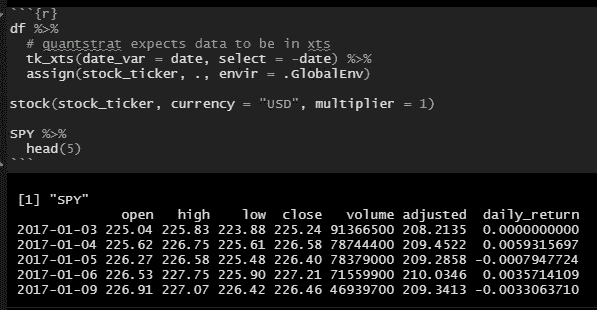
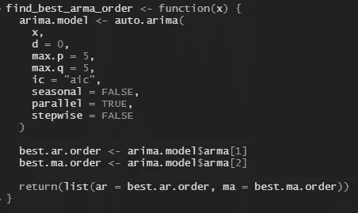
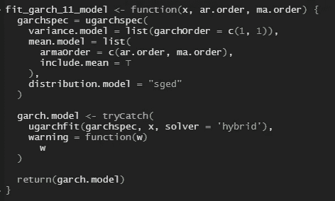
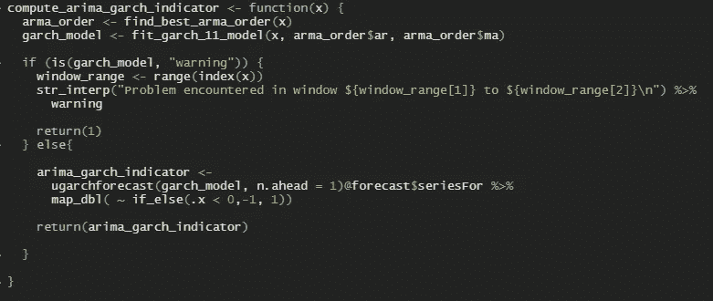
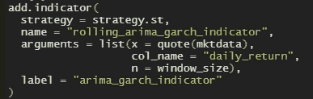
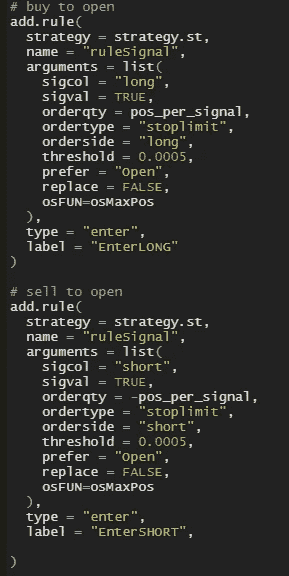
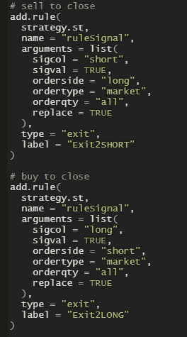
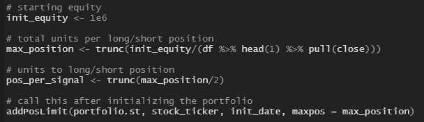
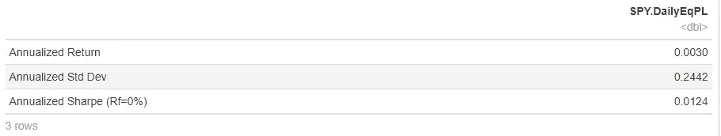
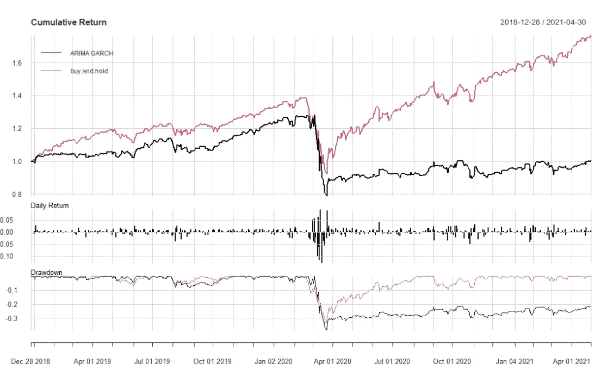

# 如何使用 quantstart 建立 ARIMA+GARCH 交易策略

> 原文：<https://pub.towardsai.net/how-to-build-an-arima-garch-trading-strategy-using-quantstart-a6eec45b6f7d?source=collection_archive---------1----------------------->

## [数据可视化](https://towardsai.net/p/category/data-visualization)

马克西姆·霍普曼在 [Unsplash](https://unsplash.com?utm_source=medium&utm_medium=referral) 上的照片

# 介绍

在这篇文章中，我将展示我如何使用 quant strat R 软件包构建 ARIMA+GARCH 交易策略。

我假设读者熟悉构成 quantstrat 交易策略的基本构件。如果不是这样，我强烈推荐阅读[1]的第 1 章到第 5 章。

可以在这个[报告](https://github.com/hsm207/arimagarch_quantstrat)中找到重现本文中描述的结果的代码。

# 动机

我遇到的所有关于 quantstrat 的在线教程都使用了技术指标，这些指标可以通过 [TTR](https://cran.r-project.org/web/packages/TTR/index.html) 包现成获得，以演示 quant strat 是如何工作的。我找不到任何描述如何建立自定义指标，所以我必须做一些探索，并认为我会分享我的发现。

# 战略概述

我们将实施[2]中描述的策略。

简而言之，该策略包括使用 ARIMA+GARCH 模型预测第二天的回报，该模型是在过去 500 天的回报滚动窗口上训练的。

如果预测的回报是正的，我们把它作为做多的信号，如果是负的，它是做空的信号。

# 实施细节

## 资料组

我们将使用 SPDR 标准普尔 500 交易所交易基金信托(股票代码:SPY)来评估这一交易策略。

拟合 ARIMA 和 GARCH 模型是一项计算量很大的任务，因此为了节省时间，我们将使用可用数据的一小部分。我们将开始日期设定为 2017 年 1 月 1 日，结束日期设定为 2021 年 5 月 2 日。下面是数据的一个片段:

图 1:原始事物的样子

专栏`date`到`adjusted`是从 Yahoo！财务，而`daily_return`是手动计算的，是基于`close`价格的日志回报。

我们要让 quantstrat 知道这件事。一种方法是创建一个根据股票代码命名的全局变量，即 SPY，并以 xts 格式指定 tibble 的值。这是如何做到的:

图 quantstrat 看到的数据

## 构建指标

该指标基于 GARCH(1，1)模型的预测，其 ARIMA 阶(即 p 和 q (d 设置为 0 ))是通过拟合过去回报的最佳 ARIMA 模型得到的。如果预测的下一期回报率为正，则指标应返回 1，否则返回-1。

这是一个复杂的指标，因此将其分解成几个较小的函数会有助于避免错误。

首先，我们有一个函数，它将找到给定单变量时间序列的最佳 ARIMA 模型，并返回 AR(即 p)和 MA(即 q)顺序的值:

图 3:如何找到最佳 p 和 q

接下来，给定一个单变量时间序列和期望的 AR 和 MA 顺序，我们编写一个适合 GARCH(1，1)模型的函数:

图 4:符合 GARCH(1，1)模型的逻辑

请注意，我们将对`ugarchfit`的调用包装在一个`tryCatch`调用中，这样我们就可以知道 fit 何时无法收敛(如果发生这种情况，函数将抛出警告，这就是为什么我们要捕捉它)。

将所有内容放在一起，我们现在可以编写函数来计算我们在本节开始时描述的指标:

图 5:ARIMA+GARCH 指标

请注意，我们已经决定返回 1，以防 GARCH(1，1)模型无法收敛。

当给定一个单变量时间序列时，图 5 中的函数工作良好。但要让它与 quantstrat 一起工作，还有一些工作要做。

我们需要告诉 quantstrat 如何使用图 2 中的数据来计算指标的滚动版本:

图 6:滚动 ARIMA+GARCH 指标

图 6 中的函数将图 2 中的数据、窗口大小和列名作为参数，我们希望它们符合 ARIMA+GARCH 模型。由于 quanstrat 期望数据是 xts 对象，并且该函数使用 [tidyquant](https://github.com/business-science/tidyquant) 包来实现期望数据是 tibble 对象的滚动逻辑，我们需要在这两个对象之间来回转换。

最后，我们可以将 ARIMA+GARCH 指标添加到我们想要回测的策略中:

图 7:将 ARIMA+GARCH 指标添加到策略中

## 产生信号

当 ARIMA+GARCH 指标为 1 时，我们要做多，当指标为-1 时，我们要做空。该代码片段将创建两个布尔列来指示我们应该何时这样做:

图 8:何时做多/做空

## 交换信号

我们需要做的最后一件事是告诉 quantstrat 如何交易信号。我们会让事情变得简单。

对于空缺职位:

图 9:如何开仓多空

对于平仓:

图 9:如何退出多头和空头头寸

除了这些规则之外，我们还对任何给定的多头或空头头寸规定了 4，439 的最大持有量。在这个数量上，我们几乎用完了我们所有的初始资本 100 万美元。非常不现实，特别是对于一个短期职位，但无论如何。我们也不想立即持有最大头寸，所以每个订单都是最大持有量的一半。以下是施加这些约束的代码:

图 10:订单大小的约束

# 结果

这种交易策略的结果真是可悲:

图 11:策略的年度“风险”和回报

这是该策略与买入并持有策略的对比:

图 12:ARIMA+GARCH 策略与买入并持有策略

这种策略的表现一直不如买入并持有。然而，直到 2020 年 1 月，它仍能产生可观的回报。新冠肺炎崩盘后，ARIMA+GARCH 指标的预测信号似乎明显恶化，因为它仍未从 2021 年 4 月的下跌中恢复过来，但自 2020 年 9 月以来，买入并持有一直在创下新高。

回购中有更多的统计数据。

# 结论

本文展示了如何使用 quantstrat 对包含自定义指标的交易策略进行回溯测试。quantstrat 和 R 丰富的统计程序库的结合使得建立和测试包含复杂统计计算的交易策略变得非常容易。

# 参考

[1] [用 R](https://timtrice.github.io/backtesting-strategies/) 回测策略。蒂姆·崔斯。2016.最后访问时间 2021 年 5 月 6 日。

[2] [ARIMA+GARCH 交易策略对 S & P500 股票市场指数使用 R](https://www.quantstart.com/articles/ARIMA-GARCH-Trading-Strategy-on-the-SP500-Stock-Market-Index-Using-R/) 。QuantStart。最后访问时间 2021 年 5 月 6 日。