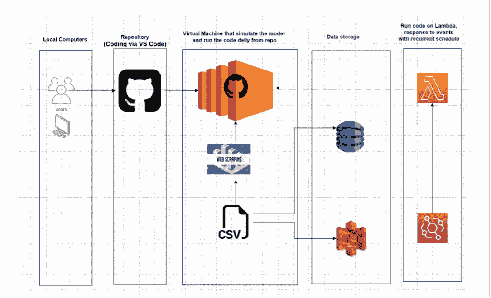
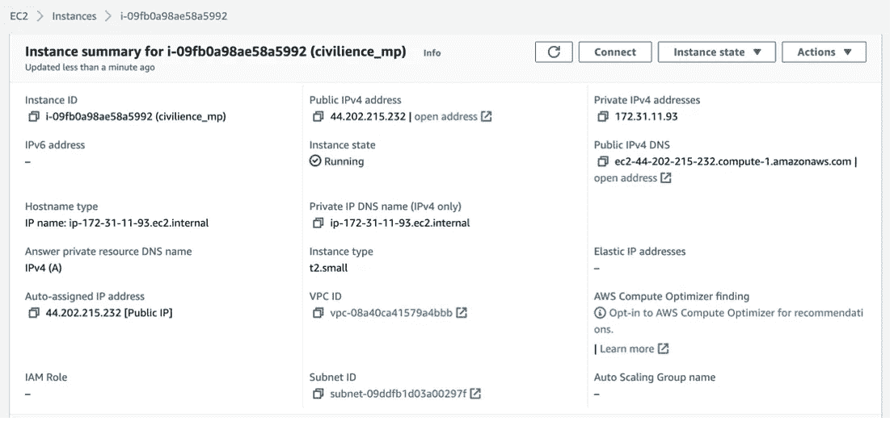
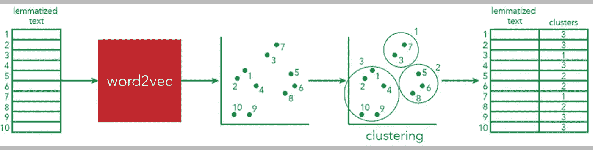
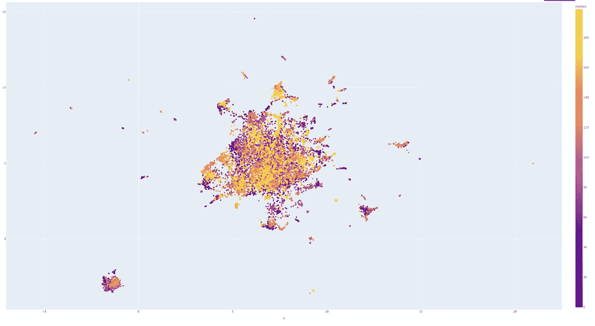
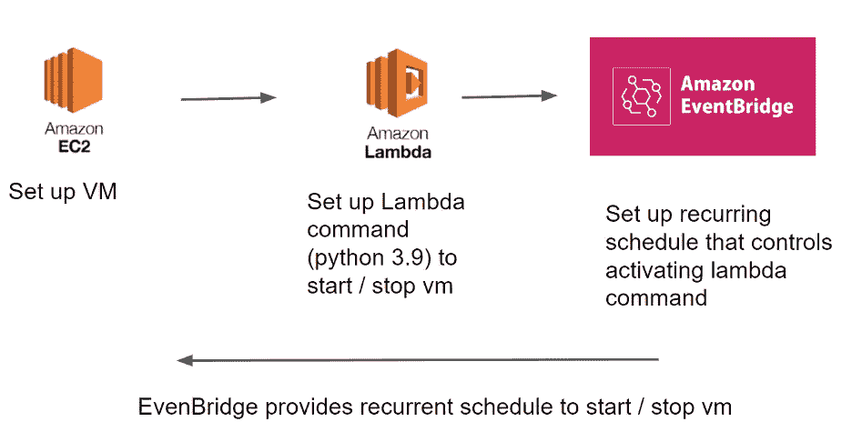
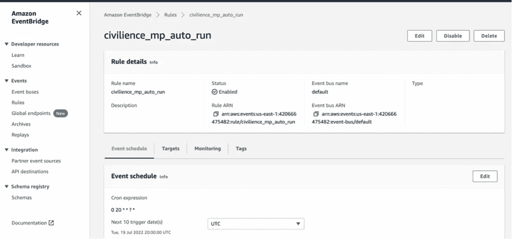
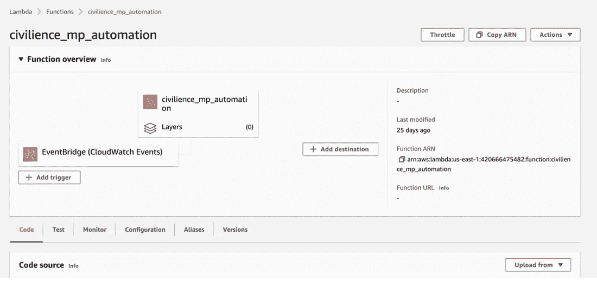

# 如何在 AWS 上构建 NLP 管道

> 原文：<https://pub.towardsai.net/how-to-build-an-nlp-pipeline-on-aws-52fb34363ed5?source=collection_archive---------4----------------------->

## 了解如何在虚拟机上部署 NLP 代码

今年夏天，我一直在美国当地的一家公司做数据科学实习生。我和四个同事一直在做的一个重要项目是关于建立一个基于云的管道，每天从 50，000 条推文中自动提取最相关的讨论主题。

亚马逊网络服务

在本文中，我将解释创建一个托管在 AWS 上的类似项目所需遵循的主要步骤。

# 为什么要使用云？

如果你还没有开始学习如何使用云，你可能已经把所有的项目都本地化了。当你有一个轻量级的软件，你想随意运行时，这不是一个问题，但是，如果你想要一个每天运行的程序，它需要被托管在别的地方。为此，我们可以从一个主要的云提供商(在我们的例子中是 AWS)那里租用云服务，这样我们的软件在运行时就不需要我们的个人电脑了。

## 项目大纲

我们要做的项目将遵循这一架构，并将按以下步骤组织:

1.  **设置虚拟机**
2.  **编写 python 代码**

*   **刮推文**
*   **主题建模**
*   **聚类**
*   **数据可视化**

**3。安排管道每天运行**

# 双手抱头。

如果您试图按照这些步骤创建一个类似的项目，请确保您已经拥有一个 AWS 帐户。

## **1。** **设置虚拟机**

虚拟机是一台模拟的计算机，你可以从云中租用(你可以支付低至 0.04 美元/小时的费用)，使你能够运行你的代码。您将需要用来设置 VM 的 AWS 服务称为 EC2。

在我的实验中，我将使用 t2.small，因为它是最小的实例，我可以在其中安装我将要使用的一个主要库:句子转换器。根据您的代码，您甚至可以租用较小的 EC2 实例，比如 t2.nano 或 t2.micro，它们的成本相对较低。

当您启动 EC2 时，这将是它的样子

亚马逊网络服务公司(AWS)为个人、公司和政府提供云计算平台，以根据需要执行各种网络服务。AWS 云有很多突出的特性，包括高可伸缩性、高弹性、高可用性等等。

与任何物理服务器不同，虚拟机是一种完全虚拟化的计算机系统。虚拟机从远程服务器(如 AWS)或物理计算机“借用”其 CPU 和内存。它不仅在运行不能在本地计算机上运行的应用程序和代码时非常有用，还可以备份用户当前的操作系统。

## **2。** **写起了 python 代码**

**答.网页抓取**

snscrape 库用于网络抓取，用户可以根据他们用 Python 指定的主题和时间范围从 Twitter 下载大量的 tweets。在我们的案例中，由于新冠肺炎作为一个全球性的疫情对社会的巨大影响，我们专注于这个话题，我们总共收集了 50，000 条推文。

**b.** **主题建模**

主题建模是一种统计建模方法，它在一组文档中抽象出“主题”。

主题建模的基本步骤

首先，数据被检索并保存在一个 CSV 文件中，这样每个句子都在一行中。然后应用编码方法将每个句子转换成空间坐标。接下来，使用聚类方法将空间中的每个点标记到特定的组中。最后，所有的点都在空间中可视化。

为了执行编码，我们将使用一个名为[句子转换器](https://www.sbert.net/)的库，它将文本作为输入，并输出一个多维向量。编码后，每个句子都被转换成一个维度为 768 的空间坐标。通过对我们所有的矢量化数据应用聚类，我们可以识别所有共享相似内容的群体:基本上，我们能够从我们的推文中提取所有趋势/主题。

因为我们想要执行简单的聚类，所以我们对所有的 tweets 使用参考数量为 200 的 K-Means 聚类。

**d .**数据可视化

最后一步是以清晰的方式可视化数据。一个重要的步骤是将维度从 768 减少到 2(使用 [Umap](https://umap-learn.readthedocs.io/en/latest/) 作为维度减少算法)，由于不可能可视化维度大于 3 的向量，我们决定使用 [Plotly](https://plotly.com/python/) 在 X-Y 平面上可视化结果。

二维平面上的数据可视化

在生成的图上，每个点都用特定的颜色标记，表示它们的群体身份。在这种情况下，总共有 200 个组。

## **3。** **安排虚拟机每天运行**

为了安排虚拟机每天运行，Lambda 和 EventBridge 是 AWS 上的两个 web 服务，它们被部署来自动激活和关闭虚拟机。特别是，lambda 命令用于启动和停止虚拟机，而 EventBridge 帮助 Lambda 设置触发 Lambda 命令的循环调度。

Lambda 用于启动和停止虚拟，EventBridge 用于循环调度 Lambda

通过 AWS 启动的 EventBridge

Lambda 和 EventBridge 通过虚拟机连接在一起