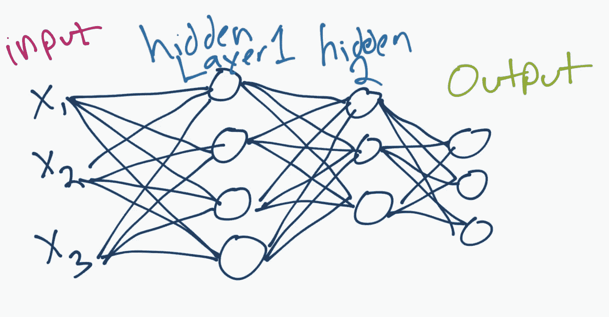
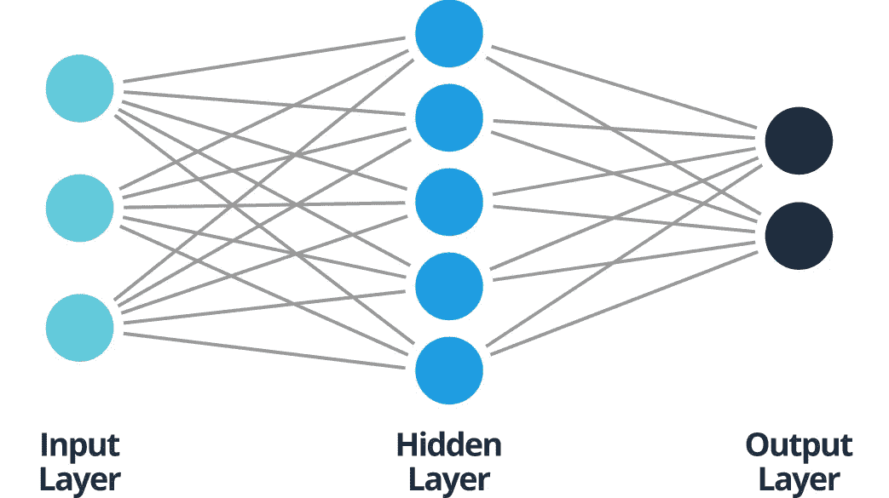
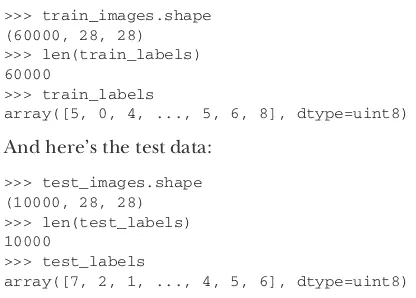

# 如何建立和训练你的第一个神经网络

> 原文：<https://pub.towardsai.net/how-to-build-and-train-your-first-neural-network-9a07d020c4bb?source=collection_archive---------0----------------------->

## [机器学习](https://towardsai.net/p/category/machine-learning)



来源:[python 编程](https://pythonprogramming.net/introduction-deep-learning-neural-network-pytorch/)

在我们开始构建神经网络之前，有几个先决条件你需要知道。

1.  [张量](https://en.wikipedia.org/wiki/Tensor)
2.  [张量运算](https://machinelearningmastery.com/introduction-to-tensors-for-machine-learning/)
3.  [差异化](https://www.khanacademy.org/math/ap-calculus-ab/ab-differentiation-1-new)
4.  渐变下降

为了更好地理解这个概念，请务必阅读这些主题。

# 什么是神经网络？

神经网络是一组用于识别非结构化数据中的模式的算法。这些神经网络试图模仿人脑，因为它们模仿人脑。

神经网络的类型有:

1.  人工神经网络
2.  卷积神经网络(CNN)
3.  递归神经网络(RNN)

## 神经网络的优势:

1.  他们可以从给出的训练数据中学习，并很容易找到相似之处。
2.  即使一个神经元没有反应，它仍然可以设法得到输出。
3.  并行进程可以在不影响整体性能的情况下运行。

## 神经网络的应用:

1.  图像处理
2.  语音识别
3.  模式预测
4.  聚类等。

作为一个初学者，安将是非常容易和简单的理解。所以，我会更加关注安。

## 什么是人工神经网络？

这些是最简单的神经网络形式。在输入节点的帮助下，信息只在一个方向上传递，直到它到达输出。这种类型的神经网络也称为前馈神经网络。

让我们来看看简单的安。



来源:[智能表](https://www.smartsheet.com/sites/default/files/IC-simplified-artificial-neural-networks-corrected.svg)

ANN 由三个主要层组成，即输入层、隐藏层和输出层。人工神经网络主要解决与图像、文本和表格数据相关的问题。

## 人工神经网络的工作

输入层接收来自外部的信息，并通过两个或多个隐藏层。这些隐藏层将输入转换为输出。

在我们深入之前。让我们看一个实际的用法。

我将使用 MNIST 样本数字数据集来解释安的。我们将使用人工神经网络将图像分为 10 类。

## 步骤 1:导入所有需要的库

*你可以在下面的* [*链接*](https://www.liquidweb.com/kb/how-to-install-keras/) *中找到 Keras 的安装程序。*

## 步骤 2:加载 MNIST 数据集

MNIST 数据集以 Numpy 数组的形式预装在 Keras 中。

数据集被分成测试集和训练集。

看一看训练和测试数据集。



## 步骤 3:创建神经网络

层是神经网络最重要的组成部分。你可以把它们看作是数据的过滤器。看看我们的网络。我们有一系列两个紧密相连的层，它们是完全相连的。最后一层是 10 路 softmax 层，它返回 10 个概率得分的数组。

## 激活是什么意思？

这些是决定神经网络输出的数学函数。这些决定了深度学习模型的输出，其准确性，以及模型的计算效率。

## 5 激活功能的基本类型有:

1.  热卢
2.  乙状结肠的
3.  Softmax
4.  线性的

## 步骤 4:网络编译

compile 函数有三个参数:优化器、损失和指标。

1.  **优化器**:这些是某些算法，用来改变神经网络的属性，以降低损失率。
2.  **损失**:用于计算模型在训练过程中应该寻求最小化的数量。
3.  **指标**:用于判断模型的表现。

## 步骤 5:重塑输入数据

我们必须通过整形和缩放来预处理数据，使值从 0 到 1。

数据的原始形状是类型单元 8 的(60000，28，28)。我们要把它转换成 float 类型的(10000，28 * 28)。

## 步骤 6:准备标签

测试和训练标签被转换成分类值。

## 步骤 7:训练模型

fit 函数将训练图像、训练标签、时期和批量大小作为参数。

**时期:**fit 函数将训练图像、训练标签、时期和批量大小作为参数。

使用这行代码来检查网络上测试数据的准确性。

```
test_loss, test_acc = network.evaluate(test_images, test_labels)
print('test_acc:', test_acc)
```

测试准确率约为 98.9%。

## 步骤 8:保存你的模型

```
network.save("model.h5")
```

保存模型后，您可以重用它。你不需要从一开始就训练模型。

## 步骤 9:如何加载模型

```
from keras.models import load_model# load modelmodel = load_model('model.h5')
```

加载模型后，它的过程与您在步骤 7 中所做的相同。

# 结论:

我希望你理解了基础知识，对神经网络有了一点了解。感谢阅读到最后，敬请期待更多有趣的文章。

请不要忘记鼓掌并跟着做。