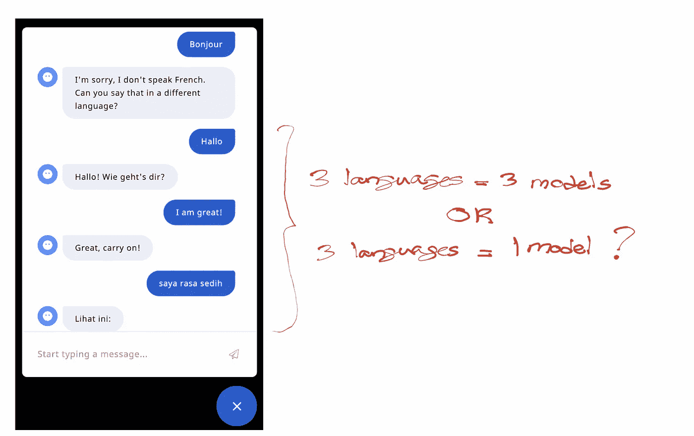
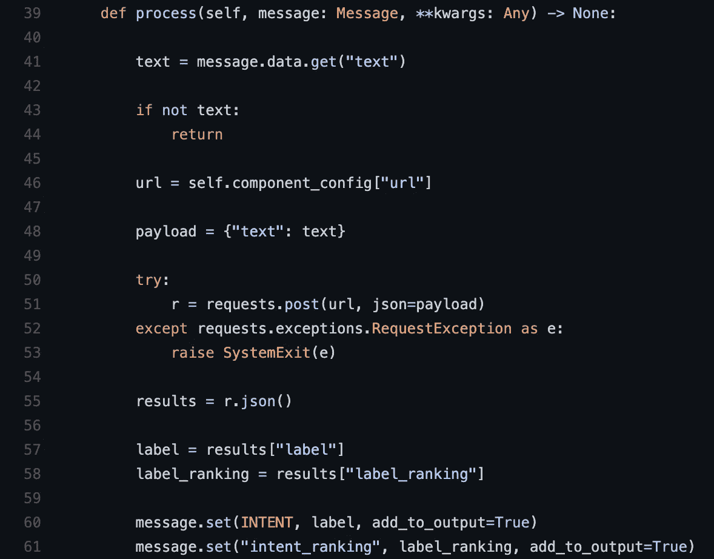
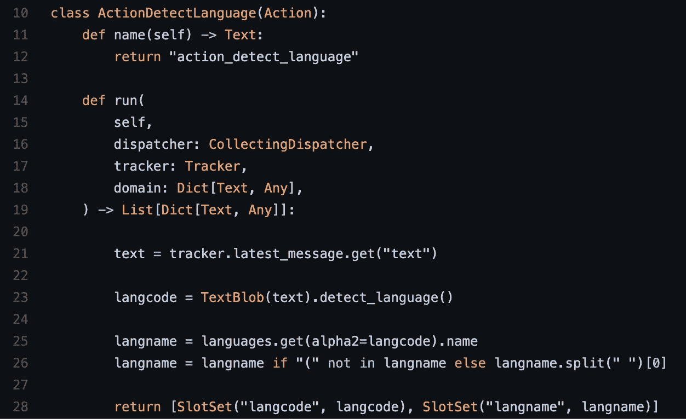
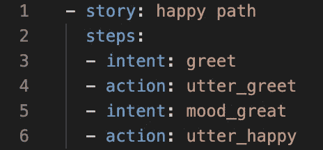
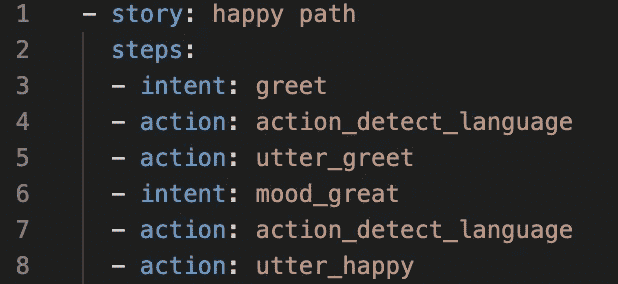
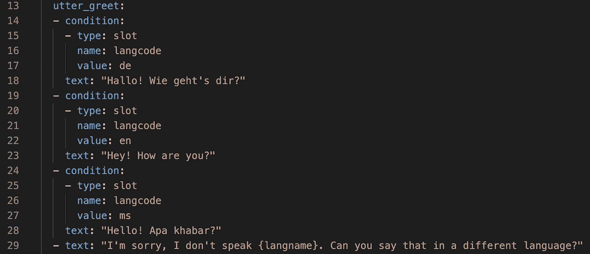

# 如何构建一个聊天机器人来处理多种语言

> 原文：<https://pub.towardsai.net/how-to-build-one-chatbot-to-handle-multiple-languages-b0accd6401e2?source=collection_archive---------0----------------------->

## [自然语言处理](https://towardsai.net/p/category/nlp)

## 跨语言语料库预处理语言模型的实际应用

# **简介**

在这篇文章中，我将分享一个想法，如何建立一个聊天机器人，可以理解多种语言，而不必为每种语言部署一个机器人。换句话说，我们将学习如何构建一个健壮的 NLU 和对话管理模型来处理任意数量的语言。

我们将使用 [rasa](https://rasa.com/) 来演示本文中讨论的想法，但实际上，这些想法可以应用于任何聊天机器人框架(允许定制)。

重现本文中描述的结果的代码可以在[这里](https://github.com/hsm207/moodbot_multilingual)找到。

# 问题陈述

假设你是一家欧洲银行的聊天机器人开发者。该银行已经开发了一个客户服务聊天机器人，在减少其国内市场德国的人工代理人的负担方面做得非常好。受此鼓舞，管理层已经计划将 bot 的使用扩展到该地区的其他市场。他们想从法国开始。

法国机器人在功能上与德国机器人相同，只是语言不同。

你将如何建造法国机器人？

一种常见的方法是克隆德国机器人，将其响应翻译成法语，并在德语发音的法语等价物上训练它。这是可行的，但是现在你必须维护两个机器人。

现在想象一下，如果管理层希望将 bot 扩展到欧盟(EU)的所有市场。你可能最终不得不支持 24 个机器人，每个机器人对应欧盟的一种官方语言。

让我们看看是否有一种方法可以让一个机器人理解所有的语言。

# 这个想法

XLM-E [1]是在多语言语料库上训练的语言模型的一个例子。根据[1]，这些类型的模型可以:

> ……在零投跨语言迁移上表现出色(Devlin et al .，2019；Conneau 等人，2020)，即在将模型直接应用于其他目标语言的同时，用英语训练数据进行微调

这意味着，如果德国机器人基于在多语言语料库上预先训练的语言模型，我们可以在没有任何额外训练的情况下向它传递法语话语，“它就会工作”。

下一节将描述如何使用 rasa 应用这一思想。

# 实施

## 概观

让我们构建一个多语言版本的 rasa 默认机器人 [moodbot](https://github.com/RasaHQ/rasa/tree/main/examples/moodbot/data) ，它支持以下语言:

*   英语
*   德国人
*   马来西亚语

用户可以在对话过程中随时切换上述语言。

这是我们需要考虑的 3 个关键因素:

1.  训练模型
2.  检测输入语言
3.  切换响应语言

## 训练模型

我们将采用 [BERT 多语言基础模型](https://huggingface.co/bert-base-multilingual-cased)，在 moodbot 的英语数据集上对其进行微调，并将其托管在某个服务器上进行推理。

接下来，我们构建一个名为 multilingualbertinntentclassifier 的[定制组件](https://rasa.com/docs/rasa/2.x/components)，它将调用托管模型进行意图分类。因为预测是由外部服务完成的，所以我们只需要实现定制组件的`process`方法:

图 1:multilingualbertientclassifier 如何进行意图分类

## 检测输入语言

在 [TextBlob](https://textblob.readthedocs.io/en/dev/) 库的帮助下，使用[自定义动作](https://rasa.com/docs/rasa/2.x/custom-actions)可以检测用户说的是哪种语言:

图 2:检测用户语言的自定义动作

注意，我们使用了两个槽，`langcode`和`langname`来分别跟踪检测到的语言代码(例如 en)和名称(例如 English)。

我们需要在每次用户说话时运行这个检查，因为我们希望支持用户在对话中多次切换语言的情况。因此，我们需要在每个`intent`步骤之后更新机器人的故事来运行这个动作。例如，这个故事:

图 moodbot 的默认故事之一

现在会是这个样子:

图 4:更新图 3 中的故事以支持多语言切换

## 切换响应语言

我们可以使用 rasa 的[条件反应变异](https://rasa.com/docs/rasa/2.x/responses#conditional-response-variations) (CVR)功能，让机器人以用户输入的语言做出反应。

下面是使用 CVR 的`utter_greet`的响应:

图 5:使用 CVR 支持多语言响应

请注意，选择哪个版本的`utter_greet`响应将取决于由`action_detect_language`自定义动作设置的`langcode`槽。如果用户说的语言不是这三种受支持的语言之一，那么机器人将通知用户它不会说这种语言(第 29 行)。

# 演示

这里有一个演示来展示所有东西是如何组合在一起的:

# 进一步的工作

## 提高模型准确性

回想一下，该模型在零镜头设置中对非英语话语的意图进行了分类，即仅在 moodbot 的英语数据集上进行了微调。

在实践中，您可能有特定领域的语料库，例如您的目标语言的通话记录，因此应该进一步预训练或微调该数据集上的模型，以提高其准确性。

然而，一旦我们建立了一个英语机器人，我们就不需要收集额外的特定领域训练示例的想法真的很有吸引力，因此有兴趣了解这一研究领域最新发展的读者可以在 [XTREME 基准](https://sites.research.google/xtreme)上跟踪进展。

## 执行实体识别

Moodbot 是一个如此简单的机器人，它不需要实体识别就能工作。对于大多数现实世界的机器人来说就不一样了，例如，用于预订航班的机器人需要提取旅程的开始和结束位置作为实体。

这篇文章中描述的思想也能应用于实体识别吗？

是的，有兴趣了解如何将多语言预训练语言模型转换为多语言实体提取器的读者可以参考[2]，其中作者描述了他们为斯拉夫语言构建实体提取器的方法。

# 结论

本文展示了如何使用多语言模型来构建一个可以理解多种语言的聊天机器人，以避免管理多个本质上相同的机器人的开销。

我希望你已经发现这是有用的。

# 参考

[1] [XLM-E:通过 ELECTRA 进行跨语言语言模型预训练](https://arxiv.org/abs/2106.16138)。迟等。艾尔。2021.

[2] [为特定语言命名实体识别调整多语言转换器](https://aclanthology.org/W19-3712/)。阿尔希波夫等人。艾尔。2019.