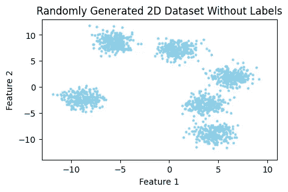
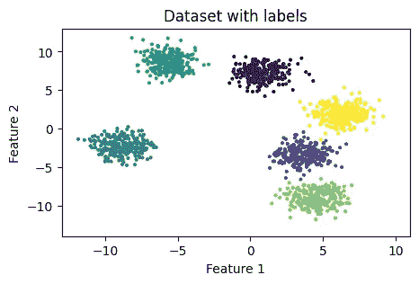
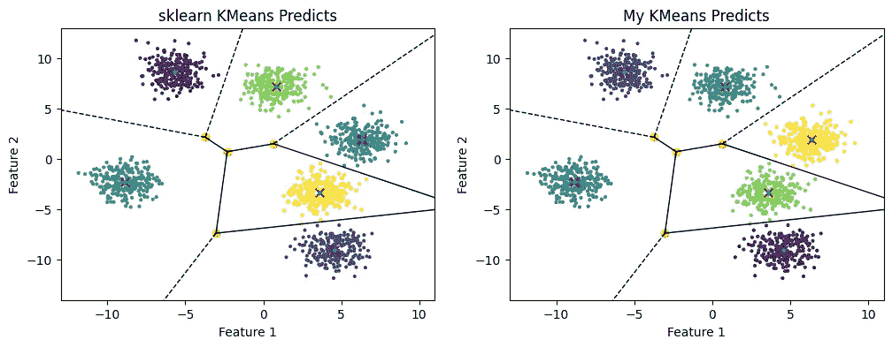

# 如何用 K-Means++初始化从零开始用 Python 构建自己的 K-Means 算法实现

> 原文：<https://pub.towardsai.net/how-to-build-your-own-k-means-algorithm-implementation-in-python-from-scratch-with-k-means-f652ed08ea31?source=collection_archive---------5----------------------->

## 有什么比自己从 0 开始实现更好的加深对算法原理知识的方法？


梅尔·普尔在 [Unsplash](https://unsplash.com/s/photos/clusters?utm_source=unsplash&utm_medium=referral&utm_content=creditCopyText) 上的照片

## **什么是 K-Means？**

K-Means 是一种**无监督机器学习技术** ，用于将多个*【n】个观察值*拆分成*【k】个不同的聚类*，其中每个观察值属于质心最近的聚类。结果将是数据集被分割成 *Voronoi 单元*。

假设我们有一个包含两个要素的数据集。



图一。随机生成的二维无标签数据集。作者插图。

正如您在*图 1* 中所注意到的，肉眼很容易就可以看出这个数据集可以被划分成六个不同的集群*(或组)*。但是算法如何确定哪个观测值属于哪个聚类呢？

为了给每个样本分配一个特定的组，K-Means 算法遵循以下步骤:

1.  初始化“k”个质心，每个聚类一个。
2.  根据最近的质心为每个样本分配一个聚类。
3.  基于指定的点重新计算聚类中心。
4.  重复步骤 2 和 3，直到质心不再改变。

瞧，K-Means 就是这样得出最终结果的。

## k-意味着用例

这种聚类算法的一些最常见的用例包括诸如 ***搜索引擎、异常检测*** 和 ***基于先前行为(兴趣、购买等)的客户分割*** 等主题。)

## **质心的初始化方法**

我们应该考虑的一件重要的事情是**最终的结果将取决于**对**聚类中心的初始化**方法**。最常用的两种初始化方法是*‘random’*和*‘k-means++’*。这两者之间的主要区别是“k-means++”试图推动质心尽可能远离彼此，这意味着**它会更快地收敛到最终的解决方案**。**

对于这个实现，我们将使用*‘k-means++’*作为初始化方法。

## **实现**

```
class myKMeans:
    def __init__(self, n_clusters, iters):
        """
        KMeans Class constructor.

        Args:
          n_clusters (int) : Number of clusters used for partitioning.
          iters (int) : Number of iterations until the algorithm stops.

        """
        self.n_clusters = n_clusters
        self.iters = iters

    def kmeans_plus_plus(self, X, n_clusters):
        pass

    def find_closest_centroids(self, X, centroids):
        pass

    def compute_centroids(self, X, idx, K):
        pass

    def fit_predict(self, X):
        pass
```

这是我们将要构建的类的结构。 *'kmeans_plus_plus()'、' find _ closed _ Centros()'*和*' compute _ Centros()'*方法将分别执行算法的第一、第二和第三步。*‘拟合 _ 预测()’*方法将获取数据集并在标签上进行预测。

```
def kmeans_plus_plus(self, X, n_clusters):
    """
    My implementation of the KMeans++ initialization method for computing the centroids.

    Args:
        X (ndarray): Dataset samples
        n_clusters (int): Number of clusters

    Returns:
        centroids (ndarray): Initial position of centroids
    """
    # Assign the first centroid to a random sample from the dataset.
    idx = random.randrange(len(X))
    centroids = [X[idx]]

    # For each cluster
    for _ in range(1, n_clusters):

        # Get the squared distance between that centroid and each sample in the dataset
        squared_distances = np.array([min([np.inner(centroid - sample,centroid - sample) for centroid in centroids]) for sample in X])

        # Convert the distances into probabilities that a specific sample could be the center of a new centroid
        proba = squared_distances / squared_distances.sum()

        for point, probability in enumerate(proba):
            # The farthest point from the previous computed centroids will be assigned as the new centroid as it has the highest probability.
            if probability == proba.max():
                centroid = point
                break

        centroids.append(X[centroid])

    return np.array(centroids)
```

*以上功能实现了 K-Means 算法第一步**(初始化方法)**。*

我们从数据集中随机抽取一个样本，并将其指定为 ***第一个质心*** 。然后*重复计算*每个样本*与所有质心*之间的距离，并将剩余的所有质心分配到距离先前计算的中心最远的*点*。

```
def find_closest_centroids(self, X, centroids):
    """
    Computes the distance to the centroids and assigns the new label to each sample in the dataset.

    Args:
        X (ndarray): Dataset samples  
        centroids (ndarray): Number of clusters

    Returns:
        idx (ndarray): Closest centroids for each observation

    """

    # Set K as number of centroids
    K = centroids.shape[0]

    # Initialize the labels array to 0
    label = np.zeros(X.shape[0], dtype=int)

    # For each sample in the dataset
    for sample in range(len(X)):
        distance = []
        # Take every centroid
        for centroid in range(len(centroids)):
            # Compute Euclidean norm between a specific sample and a centroid
            norm = np.linalg.norm(X[sample] - centroids[centroid])
            distance.append(norm)

        # Assign the closest centroid as it's label
        label[sample] = distance.index(min(distance))

    return label
```

*上的函数实现了 K-Means 算法的第二步*(求最近质心)。

对于数据集中的*每个样本*，我们取*每个质心*和**计算它们之间的欧几里德范数**。我们将其存储在一个列表中，最后，我们将观察结果分配给*最接近的质心*。

```
def compute_centroids(self, X, idx, K):
    """
    Returns the new centroids by computing the mean of the data points assigned to each centroid.

    Args:
        X (ndarray): Dataset samples 
        idx (ndarray): Closest centroids for each observation 
        K (int): Number of clusters

    Returns:
        centroids (ndarray): New centroids computed
    """

    # Number of samples and features
    m, n = X.shape

    # Initialize centroids to 0
    centroids = np.zeros((K, n))

    # For each centroid
    for k in range(K):   
        # Take all samples assigned to that specific centroid
        points = X[idx == k]
        # Compute their mean
        centroids[k] = np.mean(points, axis=0)

    return centroids
```

上面的*功能实现了 K-Means 算法的*第三步**(重新计算新的聚类中心)**。

对于*的每个质心*，我们取*所有分配给该*特定组的点*和**计算其平均值**。结果会给我们*新的聚类中心*。*

```
def fit_predict(self, X):
    """
    My implementation of the KMeans algorithm.

    Args:
        X (ndarray): Dataset samples

    Returns:
        centroids (ndarray):  Computed centroids
        labels (ndarray):     Predicts for each sample in the dataset.
    """
    # Number of samples and features
    m, n = X.shape

    # Compute initial position of the centroids
    initial_centroids = self.kmeans_plus_plus(X, self.n_clusters)

    centroids = initial_centroids   
    labels = np.zeros(m)

    prev_centroids = centroids

    # Run K-Means
    for i in range(self.iters):
        # For each example in X, assign it to the closest centroid
        labels = self.find_closest_centroids(X, centroids)

        # Given the memberships, compute new centroids
        centroids = self.compute_centroids(X, labels, self.n_clusters)

        # Check if centroids stopped changing positions
        if centroids.tolist() == prev_centroids.tolist():
            print(f'K-Means converged at {i+1} iterations')
            break
        else:
            prev_centroids = centroids

    return centroids, labels
```

最后但并非最不重要的是，将调用*' fit _ project()'*函数对数据集中的样本进行预测。

最后*，*您的 *K-Means 类*应该是这样的**:**

```
class myKMeans:
    def __init__(self, n_clusters, iters):
        """
        KMeans Class constructor.

        Args:
          n_clusters (int) : Number of clusters used for partitioning.
          iters (int) : Number of iterations until the algorithm stops.

        """
        self.n_clusters = n_clusters
        self.iters = iters

    def kmeans_plus_plus(self, X, n_clusters):
        """
        My implementation of the KMeans++ initialization method for computing the centroids.

        Args:
            X (ndarray): Dataset samples
            n_clusters (int): Number of clusters

        Returns:
            centroids (ndarray): Initial position of centroids
        """
        # Assign the first centroid to a random sample from the dataset.
        idx = random.randrange(len(X))
        centroids = [X[idx]]

        # For each cluster
        for _ in range(1, n_clusters):

            # Get the squared distance between that centroid and each sample in the dataset
            squared_distances = np.array([min([np.inner(centroid - sample,centroid - sample) for centroid in centroids]) for sample in X])

            # Convert the distances into probabilities that a specific sample could be the center of a new centroid
            proba = squared_distances / squared_distances.sum()

            for point, probability in enumerate(proba):
                # The farthest point from the previous computed centroids will be assigned as the new centroid as it has the highest probability.
                if probability == proba.max():
                    centroid = point
                    break

            centroids.append(X[centroid])

        return np.array(centroids)

    def find_closest_centroids(self, X, centroids):
        """
        Computes the distance to the centroids and assigns the new label to each sample in the dataset.

        Args:
            X (ndarray): Dataset samples  
            centroids (ndarray): Number of clusters

        Returns:
            idx (ndarray): Closest centroids for each observation

        """

        # Set K as number of centroids
        K = centroids.shape[0]

        # Initialize the labels array to 0
        label = np.zeros(X.shape[0], dtype=int)

        # For each sample in the dataset
        for sample in range(len(X)):
            distance = []
            # Take every centroid
            for centroid in range(len(centroids)):
                # Compute Euclidean norm between a specific sample and a centroid
                norm = np.linalg.norm(X[sample] - centroids[centroid])
                distance.append(norm)

            # Assign the closest centroid as it's label
            label[sample] = distance.index(min(distance))

        return label

    def compute_centroids(self, X, idx, K):
        """
        Returns the new centroids by computing the mean of the data points assigned to each centroid.

        Args:
            X (ndarray): Dataset samples 
            idx (ndarray): Closest centroids for each observation 
            K (int): Number of clusters

        Returns:
            centroids (ndarray): New centroids computed
        """

        # Number of samples and features
        m, n = X.shape

        # Initialize centroids to 0
        centroids = np.zeros((K, n))

        # For each centroid
        for k in range(K):   
            # Take all samples assigned to that specific centroid
            points = X[idx == k]
            # Compute their mean
            centroids[k] = np.mean(points, axis=0)

        return centroids

    def fit_predict(self, X):
        """
        My implementation of the KMeans algorithm.

        Args:
            X (ndarray): Dataset samples

        Returns:
            centroids (ndarray):  Computed centroids
            labels (ndarray):     Predicts for each sample in the dataset.
        """
        # Number of samples and features
        m, n = X.shape

        # Compute initial position of the centroids
        initial_centroids = self.kmeans_plus_plus(X, self.n_clusters)

        centroids = initial_centroids   
        labels = np.zeros(m)

        prev_centroids = centroids

        # Run K-Means
        for i in range(self.iters):
            # For each example in X, assign it to the closest centroid
            labels = self.find_closest_centroids(X, centroids)

            # Given the memberships, compute new centroids
            centroids = self.compute_centroids(X, labels, self.n_clusters)

            # Check if centroids stopped changing positions
            if centroids.tolist() == prev_centroids.tolist():
                print(f'K-Means converged at {i+1} iterations')
                break
            else:
                prev_centroids = centroids

        return labels, centroids
```

**酷。现在让我们看看**我们的实现的结果**与相比看起来是怎样的(相比于 K-Means 的 *sklearn* 版本):**

```
import random
import numpy as np
import matplotlib.pyplot as plt
from sklearn.cluster import KMeans
```

**接下来，我们需要一个数据集，我们将对其执行聚类。为了简单起见，我将使用 *'make_blobs()'* 函数从*sklearn . dataset .*生成一个虚拟数据集**

```
from sklearn.datasets import make_blobs

# Generate 2D classification dataset
X, y = make_blobs(n_samples=1500, centers=6, n_features=2, random_state=67)
```

**上面的代码片段将为我们生成以下数据集:**

****

**图 2。随机生成的二维标记数据集。作者的插图。**

**现在，让我们运行 K-Means 的两个版本(*拥有*和 *sklearn* 实现)并看看它们是如何运行的。**

```
# sklearn version of KMeans
kmeans = KMeans(n_clusters=5)
sklearn_labels = kmeans.fit_predict(X)
sklearn_centers = kmeans.cluster_centers_

# own implementation of KMeans
my_kmeans = myKMeans(5, 50)
mykmeans_labels, mykmeans_centers = my_kmeans.fit_predict(X)
```

**很好。现在我们有了推论，让我们把它们和 Voronoi 细胞一起可视化。😁**

```
plt.figure(figsize=(12,4)) 
vor = Voronoi(sklearn_centers)
fig = voronoi_plot_2d(vor, plt.subplot(1, 2, 1))
plt.subplot(1, 2, 1)
plt.title("sklearn KMeans Predicts")
plt.xlabel("Feature 1")
plt.ylabel("Feature 2")
plt.xlim([-13, 11])
plt.ylim([-14, 13])
plt.scatter(X[:, 0], X[:, 1], 4, c=sklearn_labels) 
plt.scatter(sklearn_centers[:, 0], sklearn_centers[:, 1], marker='x', c='red', s=50)
vor = Voronoi(mykmeans_centers)
fig = voronoi_plot_2d(vor, plt.subplot(1, 2, 2))
plt.subplot(1, 2, 2)
plt.title("My KMeans Predicts")
plt.xlabel("Feature 1")
plt.ylabel("Feature 2")
plt.xlim([-13, 11])
plt.ylim([-14, 13])
plt.scatter(X[:, 0], X[:, 1], 4, c=mykmeans_labels) 
plt.scatter(mykmeans_centers[:, 0], mykmeans_centers[:, 1], marker='x', c='red', s=50)
plt.show()
```

****

**图 3。我们从头开始实现 K-Means 和 sklearn 版本的比较。作者插图。**

**哇哦。如果你问我，那看起来真的令人印象深刻 。结果基本相同。**

## **结论**

**总之，这或多或少是您需要了解的关于这个强大的聚类算法的一切。我希望这篇文章能帮助你了解 K-Means 原则。感谢阅读！**

**如果你对这篇文章有任何意见，请写在评论里！我很想读读它们😋**

## **关于我**

**大家好，我叫 Alex，是一名年轻热情的机器学习和数据科学学生。**

**如果你喜欢的内容，请考虑下降关注和鼓掌，因为他们真的很感激。此外，请随时在 [LinkedIn](https://www.linkedin.com/in/alexandru-florin-belengeanu-74b1a3128/) 上与我联系，以便获得一些关于机器学习相关主题的每周见解。**

## **参考**

**[1]大卫·亚瑟和谢尔盖·瓦西里维茨基， [k-means++精心播种的优势](http://ilpubs.stanford.edu:8090/778/1/2006-13.pdf) (2007)，[http://ilpubs.stanford.edu:8090/778/1/2006-13.pdf](http://ilpubs.stanford.edu:8090/778/1/2006-13.pdf)**

**[2][https://en . Wikipedia . org/wiki/K-means _ clustering #应用](https://en.wikipedia.org/wiki/K-means_clustering#Applications)**

**[3][https://www . kdnuggets . com/2020/06/centroid-initial ization-k-means-clustering . html](https://www.kdnuggets.com/2020/06/centroid-initialization-k-means-clustering.html)**