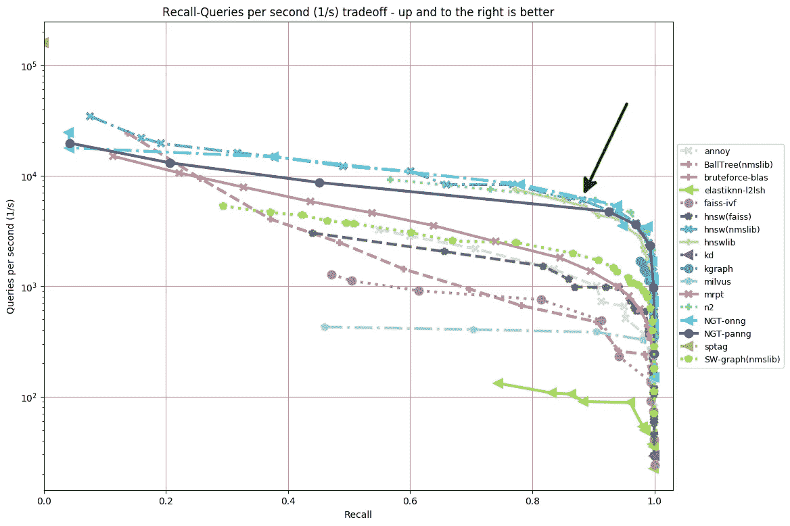
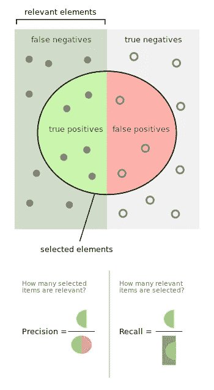
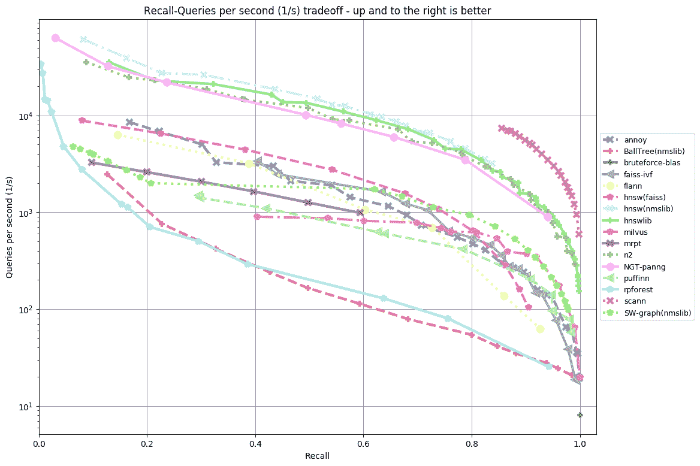
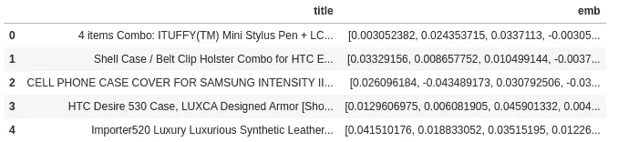

# 如何选择最佳最近邻算法

> 原文：<https://pub.towardsai.net/how-to-choose-the-best-nearest-neighbors-algorithm-8d75d42b16ab?source=collection_archive---------1----------------------->

## [机器学习](https://towardsai.net/p/category/machine-learning)，[意见](https://towardsai.net/p/category/opinion)

## 一种数据驱动的方法，用于在您的自定义数据集上选择最快、最准确的人工神经网络算法

最快最准确的。[来源](https://github.com/stephenleo/adventures-with-ann/blob/main/ann_benchmarking.ipynb)

# ANN 背景

在我之前的帖子里，KNN 死了！】，我比较了一个名为`HNSW`的人工神经网络算法和`sklearn's` KNN，证明了 HNSW 具有非常优越的性能，速度提高了 380 倍，同时提供了 99.3%的相同结果。

为了让事情更有趣，有几个人工神经网络算法，如

1.  Spotify 的[惹恼了](https://github.com/spotify/annoy)
2.  谷歌的 [ScaNN](https://github.com/google-research/google-research/tree/master/scann)
3.  脸书的失败
4.  我个人最喜欢的:层次可导航小世界图 [HNSW](https://github.com/nmslib/hnswlib)
5.  还有更多

作为一名数据科学家，我非常支持做出数据驱动的决策，正如我在[如何选择最佳的 Keras 预训练模型](https://towardsdatascience.com/how-to-choose-the-best-keras-pre-trained-model-for-image-classification-b850ca4428d4)中提到的。因此，在这篇文章中，我将展示一种数据驱动的方法，通过使用优秀的`[ann-benchmarks](https://github.com/erikbern/ann-benchmarks)` GitHub 库来决定哪种人工神经网络算法是定制数据集的最佳选择。

# 人工神经网络基准

`[ann-benchmarks](https://github.com/erikbern/ann-benchmarks)`代码通过绘制每个算法的`Recall`与`Queries per second.`来比较多个人工神经网络算法。这样，您可以直观地选择最快(每秒查询数)的算法，同时提供最小的期望召回。我们选择 Recall 作为感兴趣的度量，因为我们想知道 ANN [ [精度和 Recall](https://en.wikipedia.org/wiki/Precision_and_recall) ]检索到的真实最近邻的百分比。

来源:[维基百科](https://en.wikipedia.org/wiki/Precision_and_recall)上的[沃尔伯](https://commons.wikimedia.org/wiki/User:Walber)

下图是使用`angular`距离度量在`glove-100`数据集上运行 ANN-Benchmarks 得到的图表。在这个数据集上，`scann`算法在任何给定的`Recall`都有最高的`Queries per second`，因此是这个数据集上最好的算法。

使用角距离度量在 glove-100 数据集上的 ANN 基准。[来源](https://github.com/erikbern/ann-benchmarks)

# 设置

这些是在自定义数据集上运行 ann-benchmarks 代码所涉及的步骤。

1.  在 python 3.6 环境中安装 ann 基准。
2.  将您的自定义嵌入数据帧上传到`ann-benchmarks/data`目录。
3.  更新`ann-benchmarks/ann-benchmarks/dataset.py`以读取和分割新的定制嵌入数据帧。
4.  运行基准测试代码。
5.  绘制结果，瞧！最佳算法会出现在你面前。

# 1.在 python 3.6 环境中安装人工神经网络基准

这个步骤的代码需要在您的`Terminal`中执行。我使用 anaconda 进行环境设置。这将需要几分钟才能完成。您可以通过使用— `proc`参数增加并发进程的数量来加快速度。我故意在安装完成后才升级`pandas and scipy`。

***重要！截至本文撰写之时，Ann-benchmarks 仅支持 Python 3.6。***

## 潜在问题:

1.  `gcc`未安装:使用`sudo apt-get install gcc`安装 GCC。
2.  `Docker`未安装:根据此[链接](https://docs.docker.com/engine/install/ubuntu/)的说明安装 Docker。请记住选择正确的发行版。
3.  权限问题:如果您在运行`python install.py`时遇到任何权限问题，只需使用`sudo /opt/conda/envs/ann/bin/python install.py`运行即可。当您使用`sudo`时，记得在您的`ann`环境中提供 anaconda python 的完整路径。

# 2.上传您的自定义嵌入数据框架

在此步骤中，您可以将自定义数据框文件粘贴到`ann-benchmarks/data`目录中。对于这篇文章，我的数据框架是相同的[ [亚马逊产品数据集](http://deepyeti.ucsd.edu/jianmo/amazon/) ]，具有我在上一篇文章中使用的 FastText 句子嵌入:[*KNN(K-Nearest Neighbors)死了！*](https://medium.com/towards-artificial-intelligence/knn-k-nearest-neighbors-is-dead-fc16507eb3e) 但我只是随机抽取了 50K 行，以确保基准测试在合理的时间内运行。下面是将嵌入数据框保存为 pickle 文件`custom-euclidean.pkl`的代码，该文件位于正确的目录中，同时也是数据框前 5 行的摘录。

自定义数据集的前 5 行。[来源](https://github.com/stephenleo/adventures-with-ann/blob/main/ann_benchmarking.ipynb)

# 3.更新`datasets.py`来处理您的自定义数据帧

我们需要更新 ANN 基准代码，以了解如何处理我们的新数据框架。我们通过在`ann-benchmarks/ann-benchmarks/datasets.py`文件的末尾添加一个新的函数和字典元素来做到这一点。距离参数允许的选项是`"euclidean", "angular", "hamming" or "jaccard"`。距离度量的选择取决于您的问题。对于我的情况，我发现“欧几里得”提供了良好的最近邻。

# 4.运行基准代码

如果到目前为止一切顺利，我们现在可以简单地通过从您的`Terminal`调用下面的行来运行基准测试。将`parallelism`的值更改为您想要使用的 CPU 内核数。我使用的是 16 核 CPU，所以我选择`parallelism=14`为其他任务保留 2 核。这将需要一些时间来完成。我的 50K 行数据框架在 20%测试集下运行了大约 7 个小时。

# 5.标绘结果

一旦运行完成，我们可以通过运行`plot.py`来绘制结果。我们还可以启用 y 轴以`log`比例绘图。注意这里我使用了`sudo`和我的 Anaconda Python 的完整路径，因为我在正常运行 plot.py 时遇到了权限问题:`python plot.py --dataset=custom-euclidean --y-log`。你可以用任何适合你的。

结果图作为 png 文件保存在`results`目录中。对于我在本文中使用的 50K 行亚马逊数据集，结果如下。

在我们的自定义数据集上，多个人工神经网络算法的每秒召回数与查询数。[来源](https://github.com/stephenleo/adventures-with-ann/blob/main/ann_benchmarking.ipynb)

从这个图中，我们看到一些算法，如`NGT-onng, hnsw(nmslib), n2, hnswlib, SW-graph(nmslib)`明显比其他算法好，在任何给定的召回中每秒提供更高的查询。因此，我们可以在亚马逊产品数据集上进一步探索这些算法。

# 结论

总之，通过使用`ann-benchmarks`，并组合一些额外的代码，我们可以在我们自己的定制数据集上测试大量的人工神经网络算法，以缩小几个人工神经网络算法的范围，供进一步研究。这篇文章的所有代码都可以在我的 [Github 库](https://github.com/stephenleo/adventures-with-ann/blob/main/ann_benchmarking.ipynb)中找到。感谢您的阅读！

下一步是什么？如果你想在“大数据”上部署 HNSW ANN，你可以在 Docker 容器中使用 Elasticsearch

 [## 基于 Docker 弹性搜索的近似最近邻

### 将人工神经网络扩展到上亿

medium.com](https://medium.com/towards-artificial-intelligence/approximate-nearest-neighbors-on-elastic-search-with-docker-15342153f22a) 

编辑 1:将代码片段转换成 GitHub gists