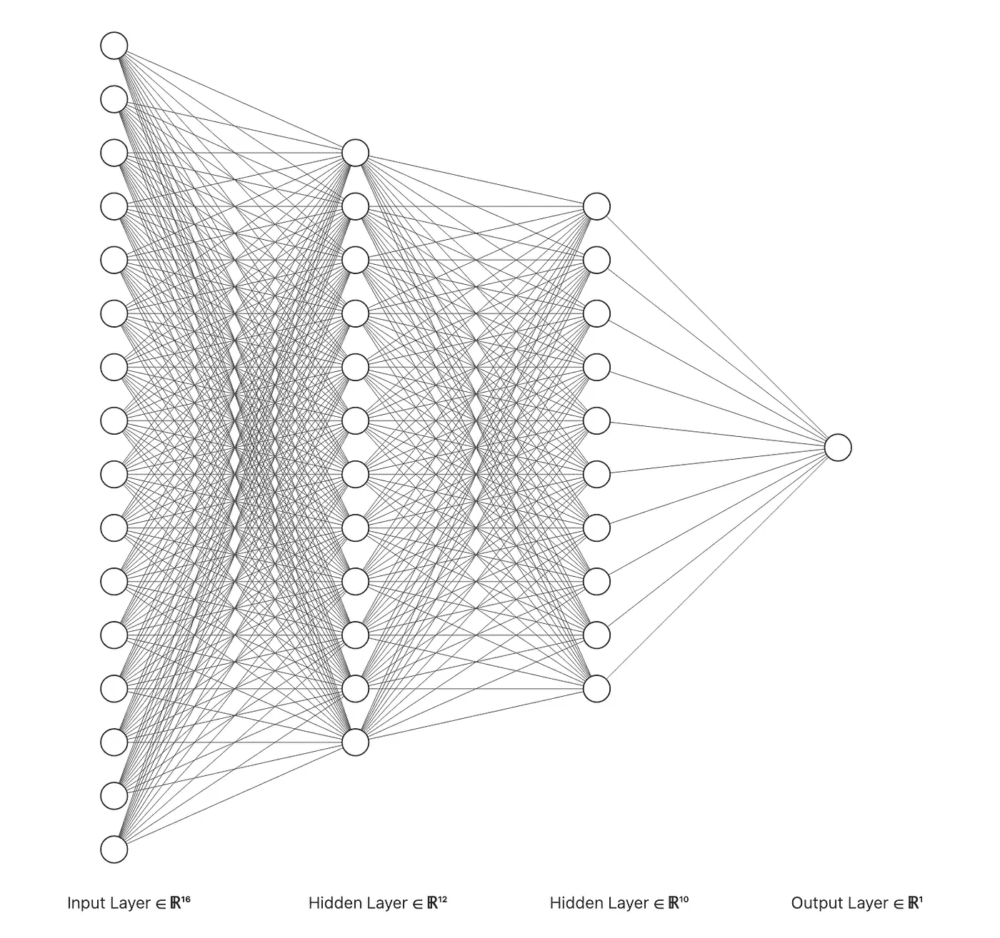
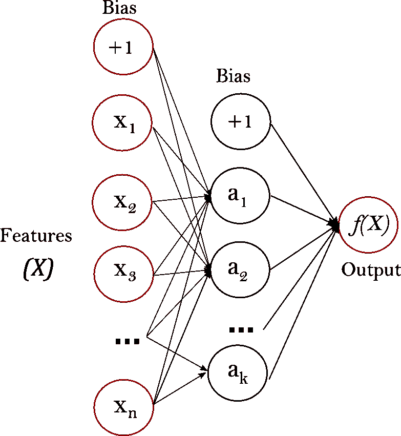
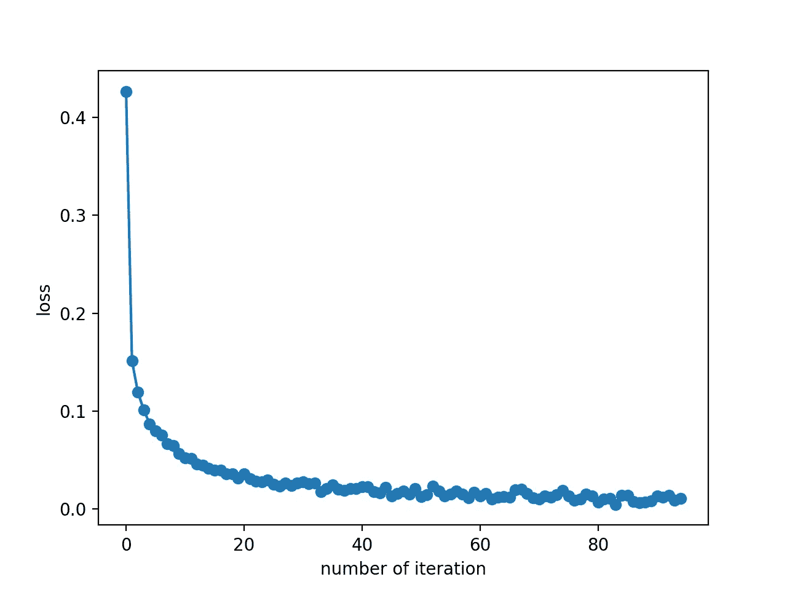
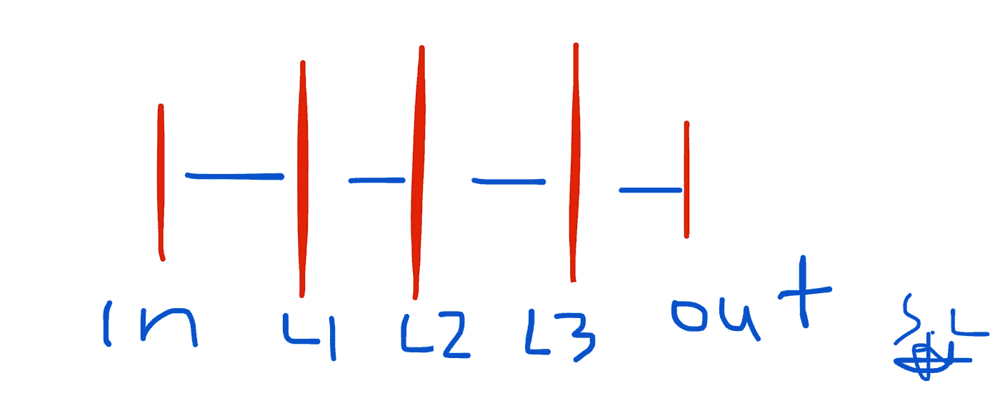
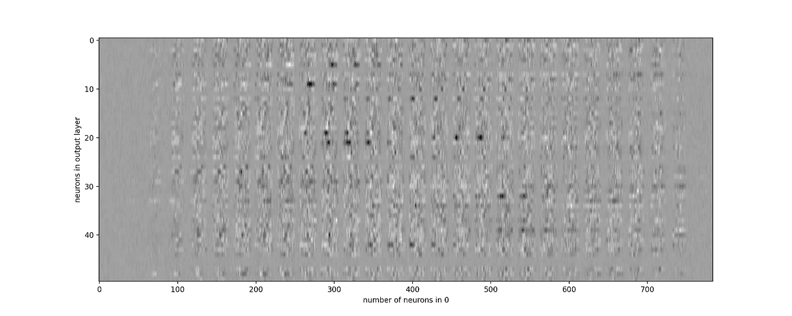

# 如何使用多层感知器分类器对手写数字进行分类

> 原文：<https://pub.towardsai.net/how-to-classify-handwritten-digits-using-a-multilayer-perceptron-classifier-928986f1f4f0?source=collection_archive---------3----------------------->

## [深度学习](https://towardsai.net/p/category/machine-learning/deep-learning)

## 什么是多层感知器？MLP 的利与弊是什么？我们能用 MLP 分类器准确地分类手写数字吗？学过的重量是什么样子的？



图 1:多层感知器网络([来源](https://alexlenail.me/NN-SVG/index.html))。

# 1.简短介绍

## 1.1 什么是多层感知器(MLP)？

一个 **MLP** 是一个**监督**机器学习(ML)算法，属于前馈人工神经网络类[1]。该算法本质上是对数据进行训练，以便学习一个函数。给定一组特征和目标变量(例如标签)，它学习用于分类或回归的非线性函数。在本文中，我们将只关注分类的情况。

## 1.2 MLP 和逻辑回归之间有什么相似之处吗？

有！逻辑回归只有两层，即**输入**和**输出**，然而，在 MLP 模型的情况下，唯一的区别是我们可以有额外的中间**非线性**层。这些被称为**隐藏层**。除了输入节点(属于输入层的节点)，每个节点都是一个使用**非线性** **激活** **函数**的神经元【1】。由于这种非线性性质，MLP 可以学习复杂的非线性函数，从而区分不可线性分离的数据！请参见下面的图 2 了解带有一个隐藏层的 MLP 分类器的可视化表示。

## 1.3 如何训练 MLP？

MLP 使用**反向传播**进行训练【1】。你可以看看这个网站[这里](https://en.wikipedia.org/wiki/Backpropagation)的正式数学公式。

## 1.4 Main 的主要优势和劣势

***优点***

*   可以学习**非线性**函数**从而**分离不可线性分离的数据【2】。

***缺点***

*   隐藏层的损失函数导致一个**非** - **凸**优化问题，因此存在局部最小值。
*   由于上述问题，不同的权重**初始化**可能会导致不同的输出/权重/结果。
*   MLP 有一些**超参数**，例如隐藏神经元的数量，需要调整的层数(时间&功耗)[2]。
*   MLP 可以是**敏感**的特征**缩放**【2】。



图 2:带有一个隐藏层和一个标量输出的 MLP。图片改编自 scikit-learn python [文档](https://scikit-learn.org/stable/modules/neural_networks_supervised.html#neural-networks-supervised)。

如果你想在交互式路线图和活跃的学习社区的支持下自学数据科学，看看这个资源:[https://aigents.co/learn](https://aigents.co/learn)

# 2.使用 scikit-learn 的 Python 实践示例

## 2.1 数据集

对于这个动手操作的例子，我们将使用 MNIST 数据集。MNIST 数据库是一个著名的手写数字数据库，用于训练几个 ML 模型[5]。有 10 个不同数字的手写图像，因此**类别数**为`10`(参见**图 3** )。

**注**:由于我们处理的是**图像**，这些用**2D**数组表示，数据的初始维数是每幅图像的`**28** by **28**`(`28x28 pixels`)。然后，2D 图像被 [**展平**](https://numpy.org/doc/stable/reference/generated/numpy.ndarray.flatten.html) ，并因此在最后由矢量表示。**每个** **2D** **图像**被转换成一个尺寸为`[1, 28x28] = **[1, 784]**`的 1D **向量**。最后，我们的数据集有`***784***` ***特征/变量/列。***


图 3:来自数据集的一些样本([来源](https://en.wikipedia.org/wiki/MNIST_database))。

## 2.2 数据导入和准备

```
import matplotlib.pyplot as plt
from sklearn.datasets import fetch_openml
from sklearn.neural_network import MLPClassifier# Load data
X, y = fetch_openml("mnist_784", version=1, return_X_y=True)# Normalize intensity of images to make it in the range [0,1] since 255 is the max (white).
X = X / 255.0
```

记住**每个** **2D** **图像**现在被转换成一个 **1D** **向量**和维度`[1, 28x28] = **[1, 784]**` **。现在我们来验证一下。**

```
print(X.shape)
```

这返回:`**(70000, 784)**` **。**我们有 **70k 的展平图像**(样本)，每个包含 784 个像素(28*28=784)(变量/特征)。因此，**输入** **层** **权重** **矩阵**将具有形状`784 x #neurons_in_1st_hidden_layer.`**输出层权重矩阵将具有形状** `#neurons_in_3rd_hidden_layer x #number_of_classes.`

## 2.3 模型培训

现在让我们建立模型，训练它并执行分类。我们将使用`3`隐藏层，每个层分别有`50,20 and 10`个神经元。此外，我们将设置最大迭代次数`100`和学习速率`0.1`。这些就是我在介绍中提到的**超参数**。我们不会在这里对它们进行微调。

```
# Split the data into train/test sets
X_train, X_test = X[:60000], X[60000:]
y_train, y_test = y[:60000], y[60000:]classifier = [MLPClassifier](https://scikit-learn.org/stable/modules/generated/sklearn.neural_network.MLPClassifier.html#sklearn.neural_network.MLPClassifier)(
    hidden_layer_sizes=(50,20,10),
    max_iter=100,
    alpha=1e-4,
    solver="sgd",
    verbose=10,
    random_state=1,
    learning_rate_init=0.1,
)# fit the model on the training data
classifier.fit(X_train, y_train)
```

## 2.4 模型评估

现在，让我们来评估这个模型。我们将估计训练和测试数据和标签的平均准确性。

```
print("Training set score: %f" % classifier.score(X_train, y_train))
print("Test set score: %f" % classifier.score(X_test, y_test))
```

> 训练集得分:`*0.998633*`
> 测试集得分:`*0.970300*`

伟大的成果！

## 2.5 可视化成本函数演变

训练中损失减少的速度有多快？我们来编一个好看的剧情吧！

```
fig, axes = plt.subplots(1, 1)axes.plot(classifier.loss_curve_, 'o-')
axes.set_xlabel("number of iteration")
axes.set_ylabel("loss")
plt.show()
```



图 4:训练迭代中损失的演变。图由作者制作。

在这里，我们看到在训练期间损耗下降得非常快，并且在`40th`迭代之后饱和(记得我们将最大 100 次迭代定义为**超参数**)。

## 2.6 可视化学习到的重量

这里，我们首先需要了解权重(每层的学习模型参数)是如何存储的。

根据[文档](https://scikit-learn.org/stable/modules/generated/sklearn.neural_network.MLPClassifier.html)，属性`classifier.coefs_`是权重数组的形状`(n_layers-1, )`的列表，其中索引 I 处的权重矩阵表示层`i`和层`i+1`之间的权重。在这个例子中，我们定义了 **3 个隐藏层**，我们还有**输入层**和**输出层。**因此，我们期望层间权重有 4 个权重数组(**图 5** 中的`in-L1, L1-L2, L2-L3` 和 `L2-out`)。

类似地，`classifier.intercepts_`是**偏置**向量的列表，其中索引`i`处的向量表示添加到层`i+1`的偏置值。



图 5:作者在 Notes (iOS)上的手工图。

让我们验证一下:

```
len(classifier.intercepts_) == len(classifier.coefs_) == 4
```

正确返回`True`。

提醒:**输入** **层** **权重** **矩阵**将具有形状`784 x #neurons_in_1st_hidden_layer.`**输出层权重矩阵将具有形状** `#neurons_in_3rd_hidden_layer x #number_of_classes.`

## 可视化输入图层的学习权重

```
target_layer = 0 #0 is input, 1 is 1st hidden etcfig, axes = plt.subplots(1, 1, figsize=(15,6))
axes.imshow(np.transpose(classifier.coefs_[target_layer]), cmap=plt.get_cmap("gray"), aspect="auto")axes.set_xlabel(f"number of neurons in {target_layer}")
axes.set_ylabel("neurons in output layer")
plt.show()
```



图 6:输入和第一个隐藏层之间的神经元的学习权重的可视化。图由作者制作。

或者把它们重新塑造成 2D 的形象。

```
# choose layer to plot
target_layer = 0 #0 is input, 1 is 1st hidden etcfig, axes = [plt.subplots](https://matplotlib.org/api/_as_gen/matplotlib.pyplot.subplots.html#matplotlib.pyplot.subplots)(4, 4)
vmin, vmax = classifier.coefs_[0].min(), classifier.coefs_[target_layer].max()for coef, ax in zip(classifier.coefs_[0].T, axes.ravel()):
    ax.matshow(coef.reshape(28, 28), cmap=plt.cm.gray, vmin=0.5 * vmin, vmax=0.5 * vmax)
    ax.set_xticks(())
    ax.set_yticks(())
[plt.show](https://matplotlib.org/api/_as_gen/matplotlib.pyplot.show.html#matplotlib.pyplot.show)()
```

# 3.摘要

MLP 分类器是一个非常强大的神经网络模型，能够学习复杂数据的非线性函数。该方法使用前向传播来构建权重，然后计算损失。接下来，使用反向传播来更新权重，从而减少损失。这是以迭代的方式完成的，并且 **迭代**的**号** **是一个输入**超参数**，如我在介绍中所解释的。其他重要的**超参数**是每个隐层的** **神经元**的**数量** **和总共的**隐层数量**。这些都需要微调。**

那都是乡亲们！希望你喜欢这篇文章！

## 只需 5 秒钟就能订阅我的邮件列表:[https://seralouk.medium.com/subscribe](https://seralouk.medium.com/subscribe)

# 敬请关注并支持这一努力

如果你喜欢并发现这篇文章有用，**关注**我！

有问题吗？把它们作为评论贴出来，我会尽快回复。

# 最新帖子

[](https://medium.com/mlearning-ai/how-to-use-python-sql-to-manipulate-data-in-1-min-bbf9ec17dc5d) [## 如何使用 Python & SQL 在 1 分钟内操作数据

### 请继续阅读！

medium.com](https://medium.com/mlearning-ai/how-to-use-python-sql-to-manipulate-data-in-1-min-bbf9ec17dc5d) [](https://towardsdatascience.com/time-series-forecasting-predicting-stock-prices-using-facebooks-prophet-model-9ee1657132b5) [## 时间序列预测:用脸书的先知模型预测股票价格

### 使用可从《先知脸书》公开获得的预测模型预测股票价格

towardsdatascience.com](https://towardsdatascience.com/time-series-forecasting-predicting-stock-prices-using-facebooks-prophet-model-9ee1657132b5) [](https://towardsdatascience.com/roc-curve-explained-using-a-covid-19-hypothetical-example-binary-multi-class-classification-bab188ea869c) [## 用新冠肺炎假设的例子解释 ROC 曲线:二分类和多分类…

### 在这篇文章中，我清楚地解释了什么是 ROC 曲线以及如何阅读它。我用一个新冠肺炎的例子来说明我的观点，我…

towardsdatascience.com](https://towardsdatascience.com/roc-curve-explained-using-a-covid-19-hypothetical-example-binary-multi-class-classification-bab188ea869c) [](https://towardsdatascience.com/support-vector-machines-svm-clearly-explained-a-python-tutorial-for-classification-problems-29c539f3ad8) [## 支持向量机(SVM)解释清楚:分类问题的 python 教程…

### 在这篇文章中，我解释了支持向量机的核心，为什么以及如何使用它们。此外，我还展示了如何绘制支持…

towardsdatascience.com](https://towardsdatascience.com/support-vector-machines-svm-clearly-explained-a-python-tutorial-for-classification-problems-29c539f3ad8) [](https://towardsdatascience.com/everything-you-need-to-know-about-min-max-normalization-in-python-b79592732b79) [## 关于 Python 中的最小-最大规范化，您需要知道的一切

### 在这篇文章中，我将解释什么是最小-最大缩放，什么时候使用它，以及如何使用 scikit 在 Python 中实现它

towardsdatascience.com](https://towardsdatascience.com/everything-you-need-to-know-about-min-max-normalization-in-python-b79592732b79) [](https://towardsdatascience.com/how-and-why-to-standardize-your-data-996926c2c832) [## Scikit-Learn 的标准定标器如何工作

### 在这篇文章中，我将解释为什么以及如何使用 scikit-learn 应用标准化

towardsdatascience.com](https://towardsdatascience.com/how-and-why-to-standardize-your-data-996926c2c832) 

# 参考

[1]https://en.wikipedia.org/wiki/Multilayer_perceptron

[2][https://sci kit-learn . org/stable/modules/neural _ networks _ supervised . html # MLP-tips](https://scikit-learn.org/stable/modules/neural_networks_supervised.html#mlp-tips)

[3][https://sci kit-learn . org/stable/modules/neural _ networks _ supervised . html # mathematical-formulation](https://scikit-learn.org/stable/modules/neural_networks_supervised.html#mathematical-formulation)

[https://en.wikipedia.org/wiki/Backpropagation](https://en.wikipedia.org/wiki/Backpropagation)

[https://en.wikipedia.org/wiki/MNIST_database](https://en.wikipedia.org/wiki/MNIST_database)

# 和我联系

*   **邮件列表:**[https://seralouk.medium.com/subscribe](https://seralouk.medium.com/subscribe)
*   **领英**:[https://www.linkedin.com/in/serafeim-loukas/](https://www.linkedin.com/in/serafeim-loukas/)
*   **研究门**:【https://www.researchgate.net/profile/Serafeim_Loukas 