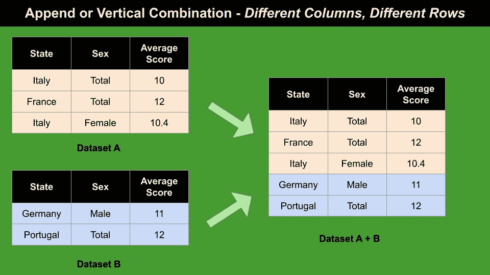
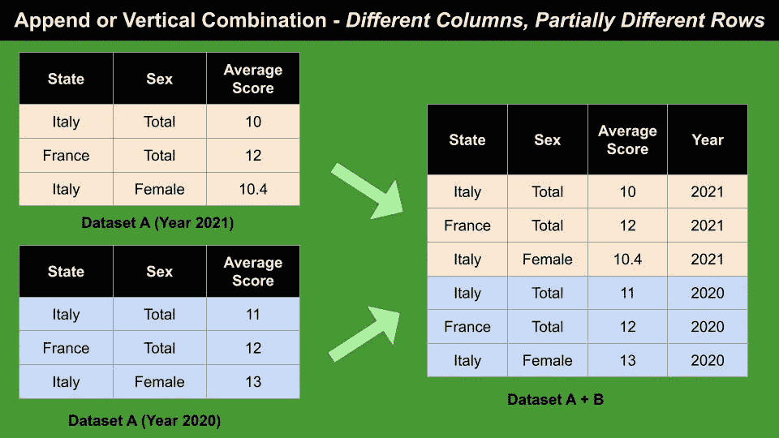
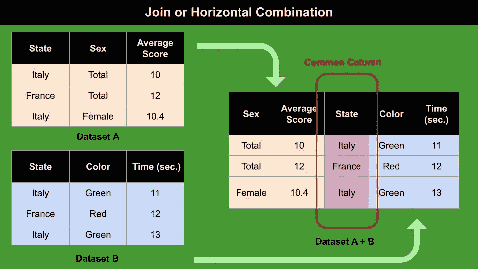

# 如何组合多个数据集

> 原文：<https://pub.towardsai.net/how-to-combine-multiple-datasets-e78c7e1433b3?source=collection_archive---------1----------------------->

## [软件工程](https://towardsai.net/p/category/software-engineering)

## 对追加和连接策略的描述，以及 SQL 中的实际例子。


由[泰克顿](https://unsplash.com/@tekton_tools?utm_source=medium&utm_medium=referral)在 [Unsplash](https://unsplash.com?utm_source=medium&utm_medium=referral) 上拍摄

我们有多少次面对两个数据集进行组合或集成？也许我们的数据集包含相同的信息，但涉及不同的年份。或者我们必须合并有一些共同点，但包含不同信息的数据集。

> 那么，如何组合两个或多个数据集呢？

存在许多策略。在本文中，我将重点介绍数据集组合的两种策略:

*   **追加**
*   **加入**

我还提供了两个如何在 SQL 中执行这两种组合的实际例子。

# 1 附加或垂直组合

让我们假设我们有两个具有相同列的数据集**。可能会发生两种不同的情况:**

*   **列相同，行不同**:两个数据集中的所有行都不同
*   **相同的列，部分不同的行**:两个数据集中至少有一列有相同的行值。

## 1.1 相同列不同行

追加操作包括构建一个新表，可通过以下步骤获得:

*   复制新表中的第一个数据集
*   在新表中复制第一个数据集之后的第二个数据集。



作者图片

就 SQL 而言，新表可以按如下方式创建:

```
**CREATE TABLE** append_dataset **AS**(**SELECT** State, Sex, AverageScore 
 **FROM** dataset_A)**UNION**

(**SELECT** State, Sex, AverageScore
 **FROM** dataset_B)
```

使用`UNION`语句可以删除所有的重复项。如果想保留副本，必须使用`UNION ALL`。

## 1.2 相同的列，部分不同的行

让我们假设有两个数据集，包含相同定义的州的平均分数，并涉及不同的年份。这两个数据集包含相同的列名。此外，它们包含相同的列状态单元值，但包含不同的列平均得分值。

在这种情况下，追加通过以下步骤完成:

*   复制新表中的第一个数据集，并添加一个名为 Year 的列
*   为第一个数据集的所有行添加相同的年份值(例如 2021)
*   在新表中，将第二个数据集追加到第一个数据集的末尾
*   为第二个数据集的所有行添加相同的年份值(例如 2020)。

我写的东西是不是太难理解了？别担心...试着看一下下图:一切都会更简单！



作者图片

就 SQL 而言，新表可以按如下方式创建:

```
**CREATE TABLE** append_dataset **AS**(**SELECT** '2021' **AS** Year, State, Sex, AverageScore 
 **FROM** dataset_A_2021)**UNION**

(**SELECT** '2020' **AS** Year, State, Sex, AverageScore
 **FROM** dataset_A_2020)
```

# 2 连接或水平组合

当两个数据集共享至少一列时，连接或水平组合完成**。通常，两个数据集具有相同的行数，但是当行数不同时也可以进行连接。**

下图说明了如何连接两个数据集:



作者图片

就 SQL 而言，新表可以按如下方式创建:

```
**CREATE TABLE** join_dataset AS
**SELECT** * from dataset_a 
**JOIN** dataset_b 
**ON** dataset_a.State = dataset_b.State
```

存在多种类型的联接(例如内部联接或外部联接)。

# 摘要

恭喜你！您刚刚学习了如何合并两个或多个数据集！

总而言之，当两个数据集具有相同的列时，可以使用追加或垂直组合，而当两个数据集至少有一列相同时，可以使用连接或垂直组合。

在本文中，我描述了如何在 SQL 中执行追加和连接。关于如何用 Python Pandas 执行相同操作的更多细节，你可以参考[这篇文章](https://jakevdp.github.io/PythonDataScienceHandbook/03.06-concat-and-append.html)。

如果你已经走了这么远来阅读，对我来说今天已经很多了。谢谢！你可以在[这篇文章](https://alod83.medium.com/which-topics-would-you-like-to-read-c68314dc6813)中读到更多关于我的信息。

# 相关文章

[](https://alod83.medium.com/how-to-represent-and-query-hierarchical-data-in-sql-69b6b77577e8) [## 如何在 SQL 中表示和查询层次数据

### 关于如何使用关系数据库构建和查询分层表的教程。

alod83.medium.com](https://alod83.medium.com/how-to-represent-and-query-hierarchical-data-in-sql-69b6b77577e8) [](https://towardsdatascience.com/my-journey-to-connect-mariadb-to-mysql-workbench-2d7e599a8a26) [## 我将 MariaDB 连接到 MySQL Workbench 的旅程

### 我的老板向我要一个保存在 MariaDB 中的模式的 ER 图。

towardsdatascience.com](https://towardsdatascience.com/my-journey-to-connect-mariadb-to-mysql-workbench-2d7e599a8a26) [](https://medium.datadriveninvestor.com/a-brief-introduction-to-the-concept-of-data-7b593587e0cf) [## 数据概念简介

### 每个有抱负的数据科学家都必须知道数据的概念以及他们可以运行的分析类型。这篇文章…

medium.datadriveninvestor.com](https://medium.datadriveninvestor.com/a-brief-introduction-to-the-concept-of-data-7b593587e0cf) 

# 参考

*   [https://www . baoytra . com/knowledge/articles/32670/combining-multiple-streams-of-data . html？智能空间=扇出](https://www.baooytra.com/knowledge/articles/32670/combining-multiple-streams-of-data.html?smartspace=fanouts)

# 额外奖金

事实上，第三种策略可以用来组合两个数据集，通过创建**相关数据集**。在这个策略中，没有表被创建为输出。相反，两个原始数据集中至少有一个维护对另一个数据集的引用。该*引用*允许相关记录。

下图显示了相关数据集的示例:


作者图片