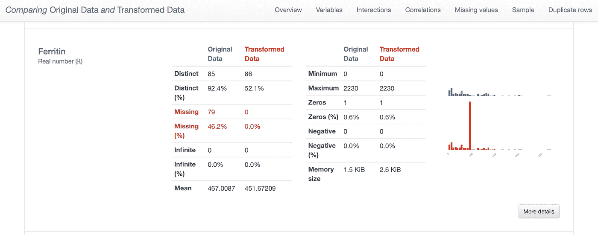
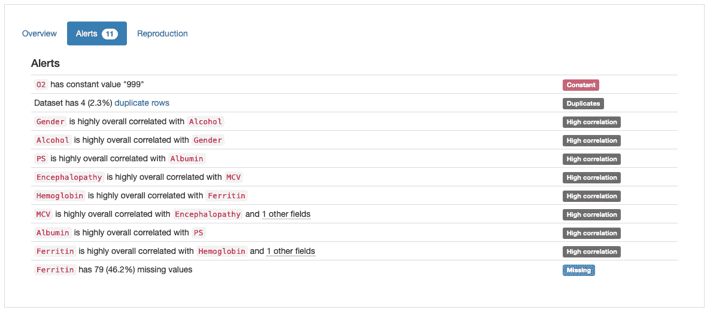
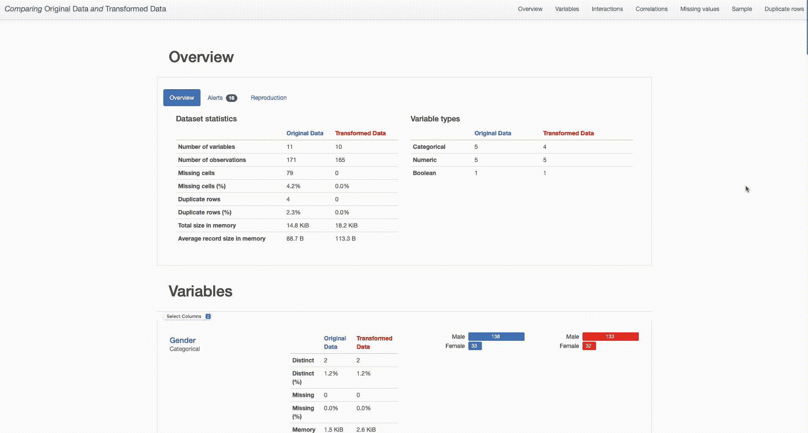
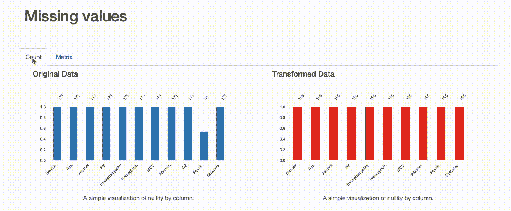
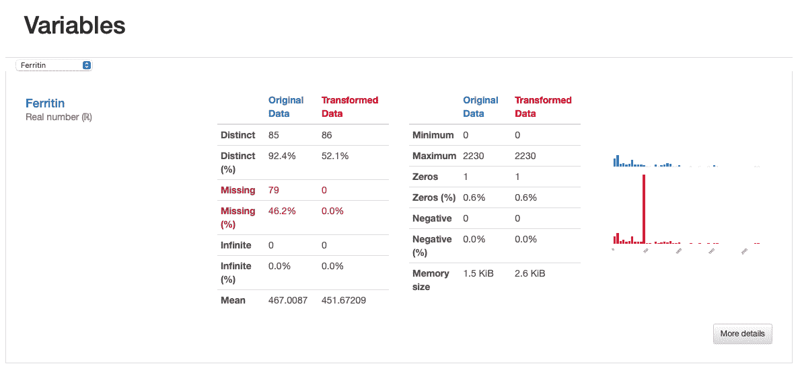
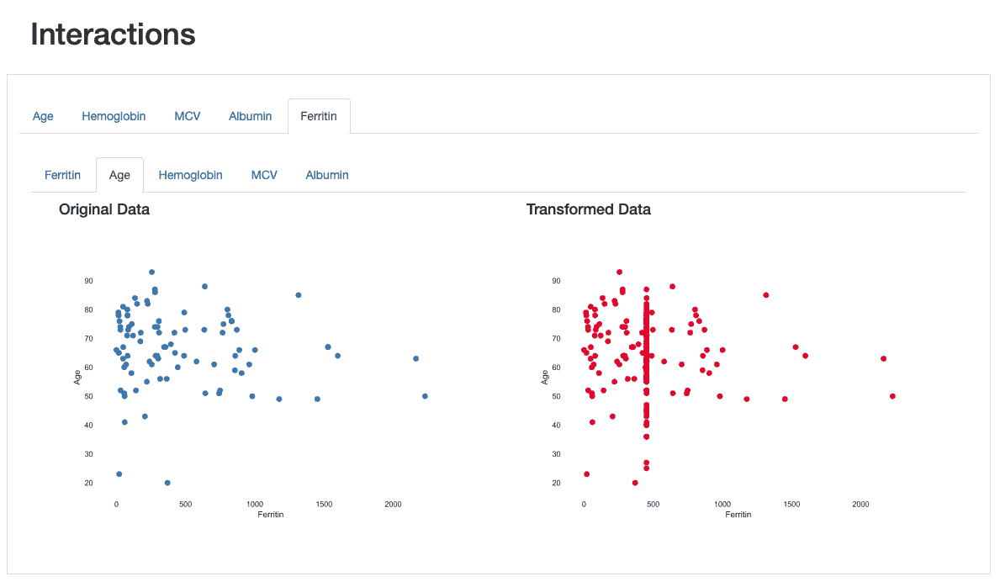
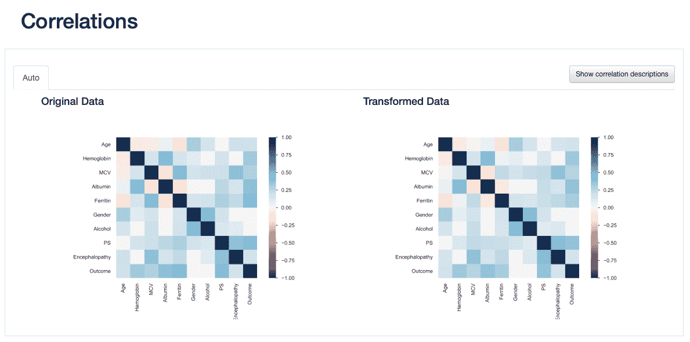

# 如何用 Pandas-profiling 比较两个数据集

> 原文：<https://pub.towardsai.net/how-to-compare-2-dataset-with-pandas-profiling-2ae3a9d7695e?source=collection_archive---------1----------------------->

## 使用高级 EDA 的数据质量用例



熊猫-轮廓对比报告(作者截图)

可视化是 EDA 的基石。当面对一个新的、未知的数据集时，视觉检查允许我们对可用信息有一个感觉，绘制一些关于数据的模式，并诊断我们可能需要解决的几个问题。在这方面， [Pandas Profiling](https://github.com/ydataai/pandas-profiling) 已经成为每个数据科学家工具箱中不可或缺的瑞士刀。在我过去的文章中，我已经提到了在执行[时间序列 EDA](https://medium.com/p/cbb92b3b1913) 时，大熊猫特征分析是如何有帮助的，但是如果我们可以比较两个数据集呢？

*我们中有多少人已经开始了数据科学项目的开发，并努力了解我们从数据转换和工程中获得了多少？*

这也正是我今天博客文章要讨论的内容——如何利用最著名的单行代码 EDA 来推动数据科学发展和数据质量提高。我将向您介绍如何利用 Pandas-Profiling 比较报告功能来促进您的 EDA 过程，并说明它在对我们的数据进行更快、更智能的转换方面的潜力。

本文使用的数据集可以在 Kaggle 中找到，由 ***Miriam Santos*** 制作的 [HCC 数据集](https://www.kaggle.com/datasets/mrsantos/hcc-dataset)(License:[CC0:Public Domain](https://creativecommons.org/publicdomain/zero/1.0/))。对于这个特定的用例，我人为地引入了一些额外的数据质量问题，以向您展示可视化如何帮助我们检测它们，并指导我们有效地缓解它们。GitHub 上提供了所有代码和示例，如果你需要复习一下，一定要去看看这个博客，重温一下你的熊猫剖析技能。那么，继续我们的使用案例吧！

## 熊猫简介:EDA 在你的指尖

我们将从分析 HCC 数据集和调查报告中建议的数据质量问题开始:

```
pip install pandas-profiling==3.5.0
```



*熊猫概况报告中显示的警报(作者提供的 scheen shot)*

根据“警报”概述，有四种主要类型的潜在问题需要解决:

*   **重复**:数据中有 4 行重复；
*   **常量**:‘O2’中的常量值“999”；
*   **高度相关**:几个特征标记为高度相关；
*   **缺失**:铁蛋白中缺失值。

每个潜在问题的有效性(以及找到缓解策略的需要)取决于特定的用例以及领域知识。在我们的案例中，除了需要进一步调查的“高相关性”警报之外，其余警报似乎反映了真实的数据质量问题，可以使用一些实用的解决方案来解决:

**删除重复的行**:根据域的性质，可能存在具有相同值的记录，但这并不是错误。然而，考虑到该数据集中的一些特征是非常具体的，并且涉及个人的生物学测量(例如，“血红蛋白”、“MCV”、“白蛋白”)，几个患者报告所有特征的相同精确值是不太可能的。让我们从删除这些重复的数据开始:

**移除不相关的特征**:O2 中的常量值也反映了数据中的真实不一致性，并且似乎不包含对模型开发有价值的信息。在真实的用例场景中，与领域或业务专家一起迭代将是一个很好的标准，但是为了这个用例示例的目的，我们将继续从分析中删除他们:

**缺失数据插补** : HCC 数据集似乎也极易受到缺失数据的影响。解决这个问题的一个简单方法(避免删除不完整的记录或全部特征)是诉诸数据插补。我们将使用均值插补来填补缺失的观察值，因为这是最常见、最简单的统计插补技术，通常用作基线方法:

## **并排比较:对您的数据进行更快、更智能的迭代**

现在是有趣的部分！在对数据集实现了第一批转换之后，我们就可以评估它们对数据整体质量的影响了。这就是 pandas-profiling 比较报告功能派上用场的地方。下面的代码描述了如何开始:

下面是两个报告在比较中的显示方式:



比较原始数据*和*转换数据(作者截屏)

从数据集概述中，我们可以立即了解什么？转换后的数据集包含一个较少的分类特征(“O2”被移除)，165 个观测值(与包含重复项的原始 171 个观测值相比)，并且没有缺失值(与原始数据集中的 79 个缺失观测值相比)。

> 但是这种转变对我们的数据质量有什么影响呢？这些决定有多好？

让我们深入研究一下。在重复记录方面，删除后变量分布和数据集模式没有特别的影响。已完成的缺失值插补是一个不同的故事。

正如预期的那样，在进行数据插补后，没有遗漏观测值。请注意零计数和矩阵如何显示两个版本的数据之间的差异:在转换后的数据中，“铁蛋白”现在有 165 个完整值，在零矩阵中找不到空白。



比较报告:缺失值(作者截屏)

但是，我们可以从对比报告中推断出一些别的东西。如果我们要检查“铁蛋白”直方图，我们会看到用平均值输入值如何扭曲了原始数据分布，这是不可取的。



*对比报告:铁蛋白—估算值似乎扭曲了原始特征分布(作者截图)*

这也通过相互作用和相关性的可视化观察到，其中在“铁蛋白”和其余特征之间的关系中出现愚蠢的相互作用模式和更高的相关值。



*比较报告:铁蛋白与年龄的相互作用:估算值显示在与平均值相对应的垂直线中(作者截图)*



*对比报告:相关性——铁蛋白相关值在数据插补后似乎有所增加(作者截图)*

这表明，比较报告不仅有助于突出数据转换后引入的差异，还提供了一些视觉线索，引导我们对这些转换有重要的认识:在这种情况下，应考虑更专业的数据插补策略。

# 最后的想法

在这个小用例中，我们讨论了在同一个分析报告中比较两组数据的有用性，以突出 EDA 过程中执行的数据转换，并评估它们对数据质量的影响。

然而，这种功能的应用是无止境的，因为对于以数据为中心的[解决方案来说，重复进行特性评估和视觉检查的需求是至关重要的。通过比较*训练*、*验证、*和*测试*将分布或数据质量控制设置为更高级的用例，例如用于](https://medium.com/ydata-ai/why-adopting-the-data-centric-paradigm-of-ai-development-11129f74bdf4)[合成数据生成](https://github.com/ydataai/ydata-synthetic)的过程。

[*法比亚娜*](https://www.linkedin.com/in/fabiana-clemente/)*CDO*[*YData*](https://ydata.ai/?utm_source=medium&utm_medium=signature&utm_campaign=blog)

**用改进的数据加速 AI。**