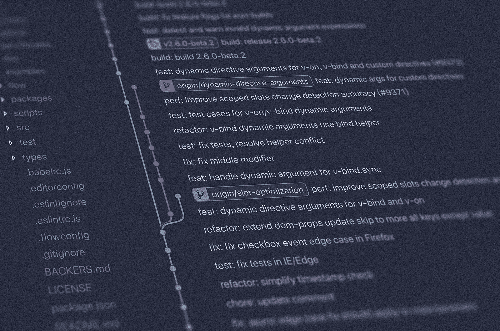
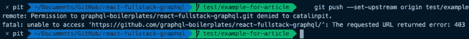
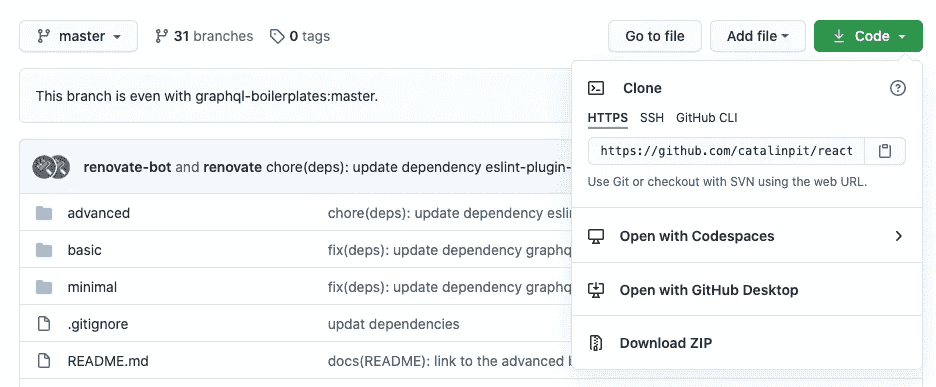
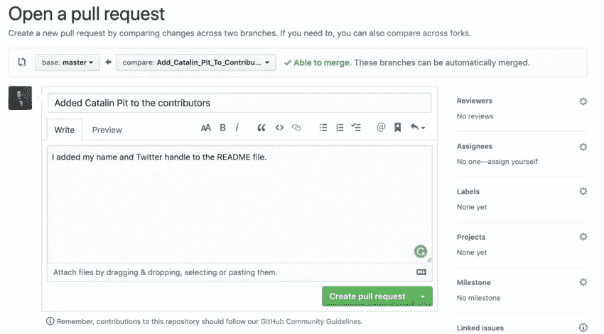

# 作为初学者如何为开源项目做贡献

> 原文：<https://pub.towardsai.net/how-to-contribute-to-open-source-projects-as-a-beginner-6c819075405d?source=collection_archive---------2----------------------->

## [编程](https://towardsai.net/p/category/programming)，[软件工程](https://towardsai.net/p/category/software-engineering)



当我学习编码时，我想做开源贡献，但我不知道在哪里和如何做。很快，我为 DEV 做出了我的第一个开源贡献，我想分享做出开源贡献所需的 Git 工作流。

我想提一下，这是我正在使用的工作流程。它不是唯一的，也不是最好的。此外，本文假设了基本的 Git 知识。此外，我还想澄清一个常见的误解。为开源做贡献不仅仅是写代码。您可以通过改进文档、组织材料、公开问题或标记拉动请求来做出贡献。

一般来说，在开始捐献之前，您必须阅读行为准则和捐献指南。行为准则是为项目参与者建立行为预期的文档。采纳并执行行为准则有助于为你的社区创造积极的社会氛围。(来源:[你的开源指南](http://opensource.guide/code-of-conduct/))投稿指南是一个解释你必须遵守的工作流程的文档。这包括分支命名约定，您应该在拉请求中包含什么，等等。

因此，让我们看看为开源项目做贡献的过程是什么。

# 找到一个项目

最耗时的任务是找到一个你觉得有足够信心做出改变的项目。如果你还没有找到一个项目，我建议你查看一下[第一稿](https://firstcontributions.github.io/)网页。在网页上，您可以找到各种存储库，您可以根据技术对其进行筛选。例如，您只能搜索用 JavaScript 编写的应用程序。

但是，如果你仍然很难找到一个存储库，你可以查看我的 [OSS 贡献的](https://github.com/catalinpit/OSS-Contribution)存储库。我不久前创建了它，以帮助人们了解他们在对更大的代码库进行更改时所使用的工作流。

选择您想要的任何存储库，让我们进入下一步——分叉！

# 放弃这个项目

选择项目后，需要分叉项目。但是“分叉”是什么意思呢？当您派生一个项目时，您会制作原始项目的副本。这意味着您可以对分叉的存储库进行任何更改，而不会影响原来的存储库。

如何叉一个项目？要派生一个项目，您需要转到存储库的主页并点击右边的 fork 按钮。图 1 展示了您应该看到的内容。


图 1

点击按钮后，GitHub 会将你重定向到原始回购的副本。

但是为什么不直接将存储库克隆到您的机器上呢？原因是您没有权限推送更改。只有有权访问项目的人才能直接对其进行更改。这些人可能是创建项目的人，或者是维护者。



图 2

图 2 展示了如果您克隆原始存储库并尝试直接对其进行更改会发生什么。您遇到了一个错误，因为您没有权限。

因此，您需要派生项目，这会在您的 GitHub 帐户上创建原始存储库的副本。分叉版本是您将要使用的存储库。

# 克隆项目

在您派生项目之后，您必须在您的机器上克隆项目来处理它。转到你的 GitHub 档案库，点击绿色按钮“代码”。



图 3

图 3 说明了这一点。然后，您需要复制链接，并在您的计算机上运行以下命令:

```
git clone https://github.com/<profile_name>/<repo_name>.git
```

该命令将存储库复制到您的计算机上，以便您可以进行更改。在您最喜欢的编辑器中打开项目，让我们进入下一步！

# 创建分支

在进行任何更改之前，您必须创建一个分支。您创建的分支保存了您的所有更改。因此，参与项目的每个人都可以独立工作，而不会相互冲突。

在命名您的分支时，所有开源项目都有一个命名约定。例如，“您的姓名/问题解决方案”。例如，假设我想修复一个损坏的文章图像。我的分支可能类似于“catalinpit/fix _ broken _ article _ image”。或者，您可以使用类似“问题-[问题编号]”的分支名称。但是，请务必阅读每个项目的规则和指南。每个项目都有不同的做法。

您可以通过运行以下 Git 命令来创建分支:

```
git checkout -b "branch_name"
```

以上命令使用您指定的名称创建一个新分支，并切换到新创建的分支。此时，您可以进行任何想要的更改。快进一下，让我们假设你做了所有必要的改变。下一步是什么？

# 进行您的更改

创建分支后，您就可以对项目进行更改了。

此时，您可以进行代码更改、更新文档、组织文件或其他任何事情。永远记住所有的贡献都是重要的。无论是添加新功能还是修复文档中的错误，这两者都是重要且有价值的。

既然您已经做出了更改，我们可以进入下一步了——提交和推动更改！

# 提交并推动您的更改

恭喜你！您已经完成了更改，现在是时候创建一个拉取请求了。但是，在打开一个拉取请求之前，您仍然需要做一些事情。

首先，运行 git status 看看你修改了哪些文件。一旦看到文件发生了更改，并且决定了要提交的内容，请运行以下命令:

```
git add . // it adds all filesORgit add file1 file2 file3 fileN // specifies what files are commited
```

我想提一下，你可能修改了一堆文件，或者只有一个。根据您想要推送的内容，您可以使用“git add”或者“git add <your_files>”。如果您要将所有内容添加到提交中，请使用“git add”。</your_files>

下一步是提交您的更改。也就是用几句话解释一下你做了什么。例如，假设您修复了一个损坏的 URL。因此，提交命令可能看起来像这样:

```
git commit -m "Fixed the broken Home URL"
```

尽量使用有意义的提交消息，但同时也不要太过火。现在，最后一步是推动你的改变。要推送您的更改，请运行以下命令:

```
git push -u origin <your-branch-name>
```

在推送您的更改之后，您需要创建一个 pull 请求，以便其他人(或团队成员)可以看到您做了什么，以及为什么做。

# 创建拉取请求

通常，在推送您的更改后，您会得到一个链接，单击它可以自动打开一个拉请求。

如果没有发生这种情况，您可以转到回购并点击*比较&拉动请求*。您可以在图 4 中看到一个例子。


图 4

通过点击*比较&拉动请求*，将打开一个新窗口，您可以在其中输入拉动请求的标题和描述。图 5 展示了一个简单的拉请求的例子。



图 5

在提交拉取请求之前，请确保您遵守了每个项目的准则和规则。此外，如果你得到了评论，客观地看待它们，不要把它们当成是针对你个人的。

添加完所有必要的信息后，单击“创建拉式请求”按钮。恭喜你！您进行了更改并打开了一个拉取请求。

# 结论

本文解释了为开源项目做出贡献的最直接的工作流。我已经使用这个工作流程成功地对 DEV To 进行了更改，这是开源的。

概括一下:

*   将存储库分支到您的 GitHub 帐户。
*   在您的机器上克隆项目。
*   在进行更改之前创建一个分支。
*   做出你的改变。
*   提交并推动您的更改。
*   打开一个拉取请求。

*如果你对 JavaScript 教程感兴趣，我推荐* [*前端高手*](https://catalins.tech/frontend-masters-membership-is-it-worth-it) *！*

*如果你想用技术写作赚钱，就去查查* [*那些付钱让你写*](https://catalins.tech/websites-that-pay-you-to-write-technical-articles) *技术文章的网站吧！*

*如果你想学习 JavaScript，我推荐这些* [*5 资源作为初学者学习 JavaScript*](https://catalins.tech/5-best-resources-to-learn-javascript-as-a-beginner)*！*

*谈判薪资至关重要——学习* [*作为开发人员如何谈判薪资*](https://catalins.tech/how-to-negotiate-your-salary-as-a-developer) *！*

*用* [*加速你的开发 Git 别名*](https://catalins.tech/git-aliases-what-are-they-and-how-to-use-them) *。*

*如果你想以开发者的身份* [*开博*](https://catalins.tech/how-to-start-your-blog-as-a-developer) *，我推荐你阅读《* [*如何以开发者的身份开博*](https://catalins.tech/how-to-start-your-blog-as-a-developer) *》一文！*

你是否很难跟上科技领域的最新消息？参见 [*作为开发者保持最新状态的一种方法*](https://catalins.tech/one-way-to-stay-up-to-date-as-developer) *！*

*学习* [*如何在 JavaScript*](https://catalins.tech/how-to-use-asyncawait-in-javascript) *中使用 Async/Await！*

GitHub 简介目前风靡一时。了解 [*如何创建 GitHub 个人资料页面*](https://catalins.tech/how-to-create-a-kickass-github-profile-page) *！*

*查看这 7 个* [*资源，帮你通过求职面试*](https://catalins.tech/7-github-repositories-to-help-you-crush-your-job-interviews) *！*

*查看*[*JavaScript ECMAScript 2021 es 2021*](https://catalins.tech/javascript-es2021-you-need-to-see-these-ecmascript-2021-features)*即将推出的新功能！*

*你是初学程序员吗？查看这些* [*编程项目思路适合初学者*](https://catalins.tech/10-programming-project-ideas-for-beginners) *！*

你是在学习编程还是打算去做？查看 [*免费学习编程的最佳去处*](https://catalins.tech/20-best-places-to-learn-programming-for-free) *！*

[*借助这 9 款浏览器扩展，提高您的开发人员工作效率*](https://catalins.tech/my-9-must-have-browser-extensions-for-increased-developer-productivity) *！*

*如果你是 Node.js 的开发者，我建议你查看 Node.js* *中的这些* [*4 个创造性的设计模式！*](https://catalins.tech/the-4-creational-design-patterns-in-nodejs-you-should-know)

*查看这些惊人的*[*JavaScript ECMAScript 2020 特性*](https://catalins.tech/javascript-es2020-the-features-you-should-know) *！*