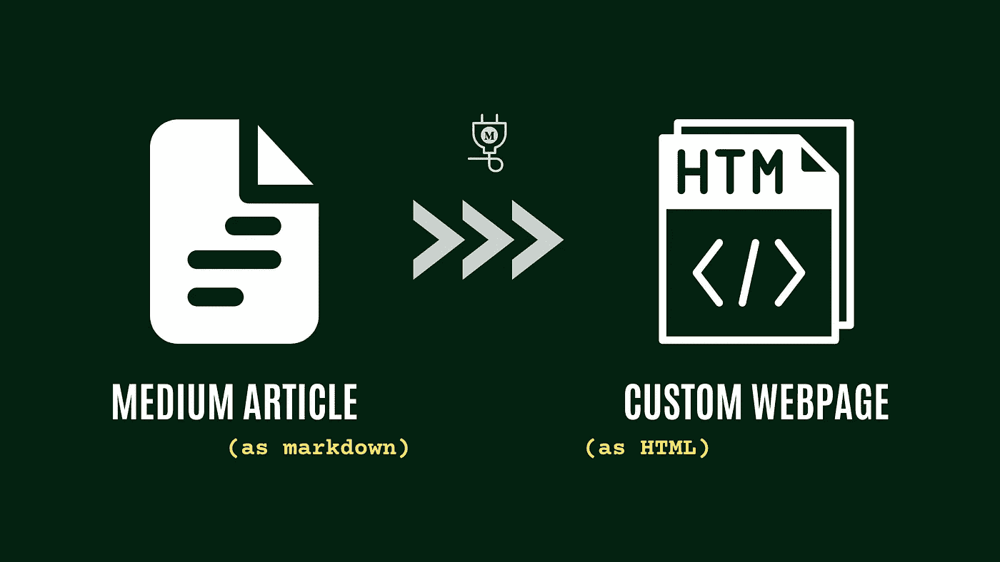

# 如何将中型商品转换为减价格式

> 原文：<https://pub.towardsai.net/how-to-convert-medium-articles-in-markdown-format-26a2a6658df5?source=collection_archive---------2----------------------->

## 中型商品→降价→ HTML



作者图片

这里有几个原因可以解释为什么你想把一篇中型文章从原始格式转换成 Markdown 格式，然后再转换成 HTML 格式。在本文中，我将向您解释如何使用 Python 编程语言通过几个简单的步骤来实现这一点。

## 你为什么想这么做？

使用降价的一些好处包括:

*   Markdown 是一种简单、轻量级的标记语言，易于读写。这使得它成为存储和编辑文章的便利格式，尤其是与 HTML 或 XML 等更复杂的格式相比。
*   Markdown 支持多种格式选项，如标题、列表、链接等，可以使用简单直观的语法来应用。这允许你在文章中添加结构和格式，而不必使用复杂的标签或样式。
*   Markdown 受到多种工具和平台的支持，包括文本编辑器、发布系统等等。这使得使用 Markdown 内容变得容易，并允许您将文章与其他应用程序或服务集成。
*   Markdown 是一种广泛使用且记录良好的格式，拥有大量活跃的用户社区。这意味着您可以轻松找到使用 Markdown 的资源和支持，并且可以与使用该格式的其他人共享您的文章。

总的来说，将一篇中型文章转换为 Markdown 可以提供许多好处，例如使文章的编辑和格式更容易，并使您能够将其与其他工具和平台集成。

这是否是你的正确方法将取决于你的具体需求和目标。

现在让我们跳到代码！

# 将中型文章转换为 Markdown 和 HTML 的 Python 代码

作者代码

# 代码解释—

您提供的代码是一个 Python 脚本，它使用`[**medium_api**](https://github.com/weeping-angel/medium-api)`库来访问 Medium API 并将一篇文章从 Markdown 转换为 HTML。

您可以使用以下命令安装`medium-api`:

```
pip install medium-api
```

下面是代码功能的简要说明:

*   前两行导入了`os`和`markdown`库，分别用于访问环境变量和将 Markdown 转换为 HTML。
*   第三行从`medium_api`库中导入了`Medium`类，用于访问媒体 API。

*   第四行创建一个新的`Medium`对象，传递一个存储在名为`RAPIDAPI_KEY`的环境变量中的 API 键。该对象将用于访问 API。

*   接下来的三行从文章的 URL 中提取文章的 ID，并使用`Medium`对象从 API 中检索文章数据。这些数据存储在一个`article`对象中。

*   第八行使用`markdown`库将文章的降价内容转换成 HTML，并将结果存储在一个名为`html_output`的变量中。

*   最后三行将 HTML 写入名为`index.html`的文件，用单引号替换所有出现的 **( ' )** 字符。

总的来说，这段代码演示了如何使用`medium_api`库来访问 Medium API 并将一篇文章从 Markdown 转换成 HTML。它不是一个完整的应用程序，而是一个如何在 Python 脚本中使用 API 的示例。

# 资源🚀

*   可以在这里订阅 Medium API:[**Medium API—RapidAPI**](http://hub.mediumapi.com/)
*   阅读其 Swagger 文档: [**中型 API —文档**](https://docs.mediumapi.com/)
*   书签 Python SDK 的 GitHub 库: [**中型 API — GitHub**](https://github.com/weeping-angel/medium-api)
*   更多用法请看这里: [**中型 API — ReadTheDocs**](https://medium-api.readthedocs.io/en/latest/usage.html)

感谢您的阅读，祝您愉快！

**PS:** 我们发布与 Medium 和 Medium API 相关的教程、视频、代码片段和见解。所以一定要跟着我们

*   推特:[twitter.com/medium_api](https://twitter.com/medium_api)
*   领英:[www.linkedin.com/company/medium-api](https://www.linkedin.com/company/medium-api)

如果你喜欢阅读这些故事，那么我相信你会很乐意成为一名中等付费会员。每月只需 5 美元，你就可以无限制地接触成千上万的故事和作家。

*你可以通过* [***支持我，使用此链接***](https://nishu-jain.medium.com/membership) ，*注册，我将赚取一点佣金，这将帮助我成长并出版更多这样的故事。*

**相关文章—**

[](https://medium.com/geekculture/medium-api-documentation-90a01549d8db) [## 中等 API —文档

### 中型 API 入门

medium.com](https://medium.com/geekculture/medium-api-documentation-90a01549d8db) [](/medium-api-get-posts-using-python-126d6d859ca8) [## 中型 API:使用 Python 获取帖子

### 用户撰写的文章、发布文章和顶级订阅源

pub.towardsai.net](/medium-api-get-posts-using-python-126d6d859ca8) [](https://nishu-jain.medium.com/list-niche-top-writers-of-medium-using-python-78e426bb7b39) [## 如何列出媒体的数百个小众顶级作家

### 使用 Python 识别你领域中每一个有影响力的作家

nishu-jain.medium.com](https://nishu-jain.medium.com/list-niche-top-writers-of-medium-using-python-78e426bb7b39)