# 如何根据图像创建新的自定义数据集

> 原文：<https://pub.towardsai.net/how-to-create-a-new-custom-dataset-from-images-9b95977964ab?source=collection_archive---------0----------------------->

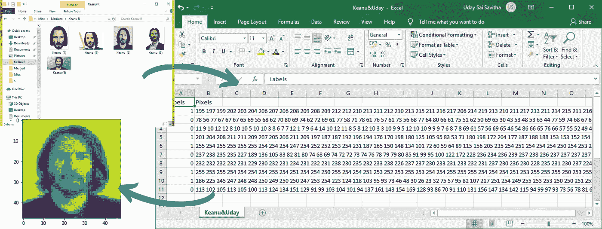

图片由[作者](https://medium.com/@udayyhit47)

## [数据科学](https://towardsai.net/p/category/data-science)，[机器学习](https://towardsai.net/p/category/machine-learning)

*如果你和我一样，试图从原始图像中构建你的自定义图像数据集，那么* ***这篇文章就是为你准备的！***

我们都已经学会了如何在经典的 MNIST/时尚 MNIST 数据集上建立机器学习模型。但是，如果你想训练一个模型来识别你朋友的脸呢？互联网上没有这方面的数据集。

在公共数据集上工作了几个月后，我想创建一个自定义的面部图像数据集，并使用它们进行面部识别。

真正的专业知识是通过使用机器学习来解决自己的问题来展示的。构建自己的图像数据集本身就不是一件简单的事情。令人惊讶的是，在大多数在线课程中，它的覆盖面远没有这么全面。

我寻找做这件事的方法，最后终于弄明白了。

在本文中，您将学习如何准备自己的原始图像数据集，然后可以用于自己的图像分类/计算机视觉项目。

## 步伐

1.  为数据集收集影像
2.  根据图片的类别给它们重新命名
3.  将它们合并到一个文件夹中
4.  调整图片大小
5.  将所有图像转换成相同的文件格式
6.  将图像转换为 CSV 文件
7.  对 CSV 文件的一些调整
8.  加载 CSV(奖金)

## 为数据集收集影像

举个例子，假设我想建立一个模型来区分山谬·里维和我的 XD。

如果你需要创建一个你自己的脸的数据集或者从谷歌上批量下载图片，[这篇来自 *pyimagesearch* 的文章](https://www.pyimagesearch.com/2018/06/11/how-to-build-a-custom-face-recognition-dataset/)将带你完成它。

得到图片后，根据图片的类别将图片分类到不同的文件夹中。为了简单起见，我打算每个类只使用五张图片(你可以使用任意多的图片。越多越好)。

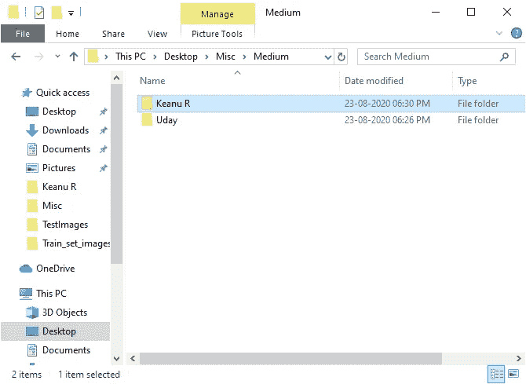

图片由[作者](https://medium.com/@udayyhit47)

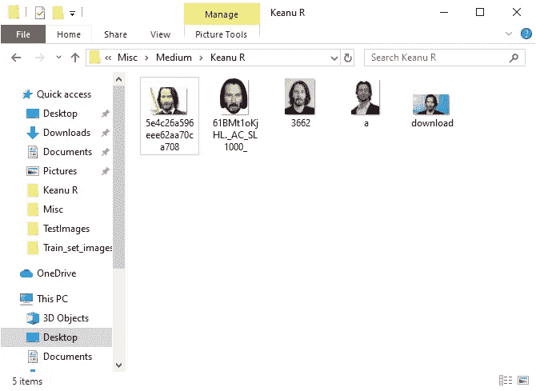

文件夹里放着山谬·里维的图片|图片作者[作者](https://medium.com/@udayyhit47)

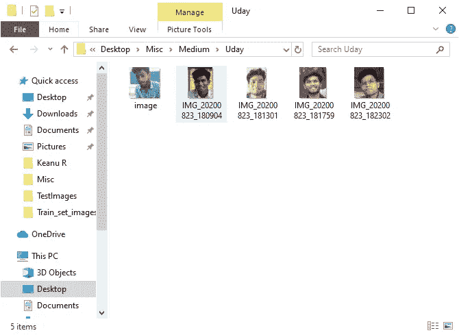

文件夹包含我的图片|图片作者[作者](https://medium.com/@udayyhit47)

> 机器学习模型的好坏取决于我们输入的数据。

清理数据。删除重复项。围绕您感兴趣的点裁剪图像(在本例中，是基努和我的脸),以充分利用您的数据。

## 根据图片的类别给它们重新命名

1.  打开文件夹并选择所有图像。
2.  右键单击它们。
3.  根据它们的类别重新命名它们。

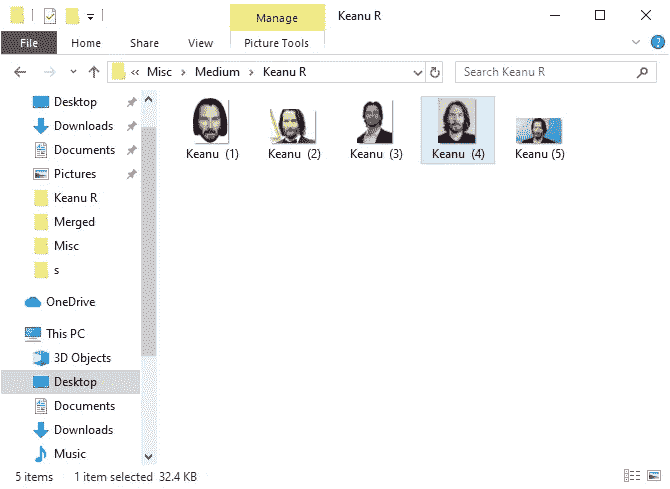

重命名后的文件|图片由[作者](https://medium.com/@udayyhit47)

4.对剩余的所有类重复此操作。用至少一个不同的字母表来命名这些类(这在后面的过程中是需要的)。

## 将所有图像合并到一个文件夹中。

## 调整图片大小

我们为此使用的工具是[*Windows*](https://www.bricelam.net/ImageResizer/)的图像缩放器。它是免费的，小巧的，完全没有恶意软件。

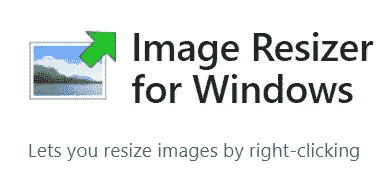

图片由[作者](https://medium.com/@udayyhit47)

下载完成后，点击**安装**。

一旦程序安装到你的电脑上，你就可以开始了。现在，转到包含您想要调整大小的照片的文件夹。

选择您的照片。然后右击它们，从选项中选择**调整图片**的大小。

然后会弹出一个窗口。在这里，您可以修改将要处理的图片的基本设置。

您可以选择图片的大小。在这种情况下，我将图像的大小调整为 48 x 48 像素。

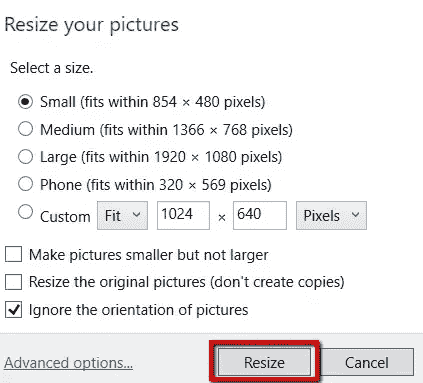

别忘了从“合身”变成“舒展”。|图片由[作者](https://medium.com/@udayyhit47)

注意:有时，较小的图片会被 resizer 忽略。调整大小后，选择所有图像并验证所有图像的大小是否相同。

## 将所有图像转换成相同的文件格式

这里有一个简单而有效的技巧。你可以选择。png 或者。jpg 格式。

**第 1 步** —在任务栏搜索栏键入 **cmd** 并同时按下 **Ctrl + Shift + Enter** 键。如果遇到 **UAC** 的提示，点击**是**。

**第二步** —在命令提示符下，首先输入保存文件的新文件夹的路径(Spotlight 的图像)。为此，请键入–

```
cd path of the folder
```

**注意**——请将**路径文件夹**替换为实际路径。

```
cd C:\Users\Uday\Desktop\Misc\Medium\Merged
```

**第三步** —将图像转换为 **JPG** 格式，输入给定的批处理命令，按**键进入**。

```
Ren *.* *.jpg
```

**步骤 4** —要将图像转换为 **PNG** 格式，使用以下批处理命令—

```
Ren *.* *.png
```

## 将图像转换成 CSV 格式

运行以下代码，将所有图像转换为 CSV 格式，并相应地标记它们。

```
from PIL import Image
import numpy as np
import sys
import os
import csv# default format can be changed as needed
def createFileList(myDir, format='.jpg'):
    fileList = []
    print(myDir)
    labels = []
    names = []
    keywords = {"K" : "1","U": "0",} # keys and values to be changed as neededfor root, dirs, files in os.walk(myDir, topdown=True):
        for name in files:
            if name.endswith(format):
                fullName = os.path.join(root, name)
                fileList.append(fullName)
            for keyword in keywords:
                if keyword in name:
                    labels.append(keywords[keyword])
                else:
                    continue
            names.append(name)
    return fileList, labels, names# load the original image
myFileList, labels, names  = createFileList('/content/')
i = 0
for file in myFileList:
    print(file)
    img_file = Image.open(file)
    # img_file.show()# get original image parameters...
    width, height = img_file.size
    format = img_file.format
    mode = img_file.mode# Make image Greyscale
    img_grey = img_file.convert('L')
    #img_grey.save('result.png')
    #img_grey.show()# Save Greyscale values
    value = np.asarray(img_grey.getdata(), dtype=np.int).reshape((width, height))
    value = value.flatten()

    value = np.append(value,labels[i])
    i +=1

    print(value)
    with open("name_you_want.csv", 'a') as f:
        writer = csv.writer(f)
        writer.writerow(value)
```

1.  我使用了 K 和 U 字母作为键来识别文件名中的类(Keanu 中有 K，Uday 中有 U)。根据你的需要改变它。
2.  要保持彩色图像而不是灰度图像，请将“L”替换为“RGB”此外，在保存图像之前添加深度值。深度= 3 表示颜色通道的数量(红色、绿色、蓝色)。

```
img_grey = img_file.convert('L')# replace L with RGB
value = np.asarray(img_grey.getdata(), dtype=np.int).reshape((width, height, **3**))
```

3. *name_you_want* 将是创建的 CSV 文件的名称。随便改吧。

您已经准备好了数据集。嗯，差不多准备好了。

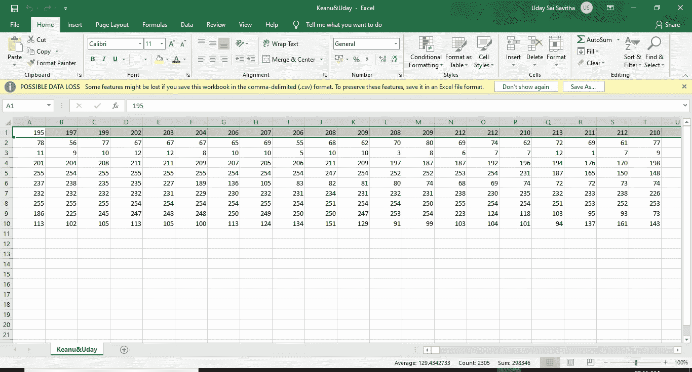

表格的最后一列是标签|图片，作者是[作者](https://medium.com/@udayyhit47)

**对 CSV 文件做了一些调整**

1.  滚动到末尾，单击一个空单元格，并使用以下 Excel 公式连接像素值。

```
=TEXTJOIN(" ", TRUE, (A1:B1))
#replace B1 with last but one column name
```

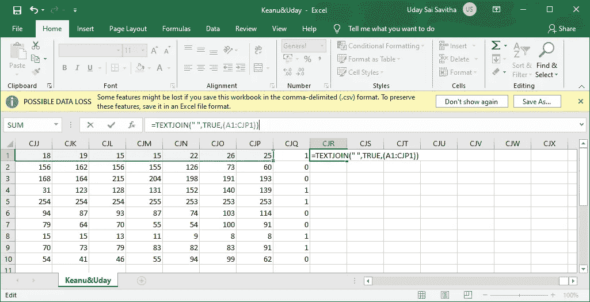

图片由[作者](https://medium.com/@udayyhit47)

2.将公式拖到剩余的行中。

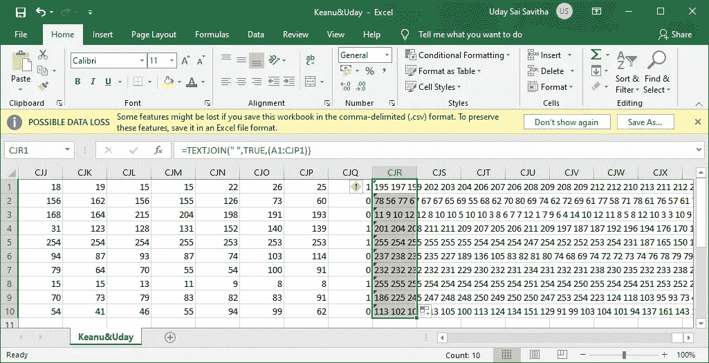

图片由[作者](https://medium.com/@udayyhit47)

3.将列值复制到记事本。重新复制并粘贴回来。这样，您将保留像素值，而不是公式。

4.现在选择除标签和连接值之外的所有单元格，并删除它们。

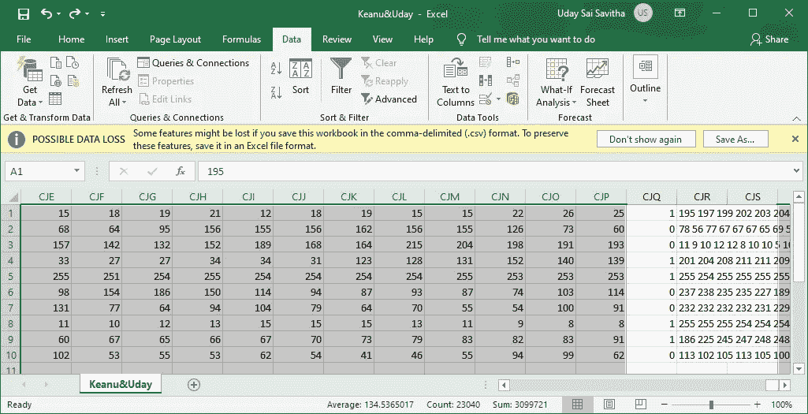

图片由[作者](https://medium.com/@udayyhit47)

5.剪切剩余的列，并将其粘贴到工作表的开头。

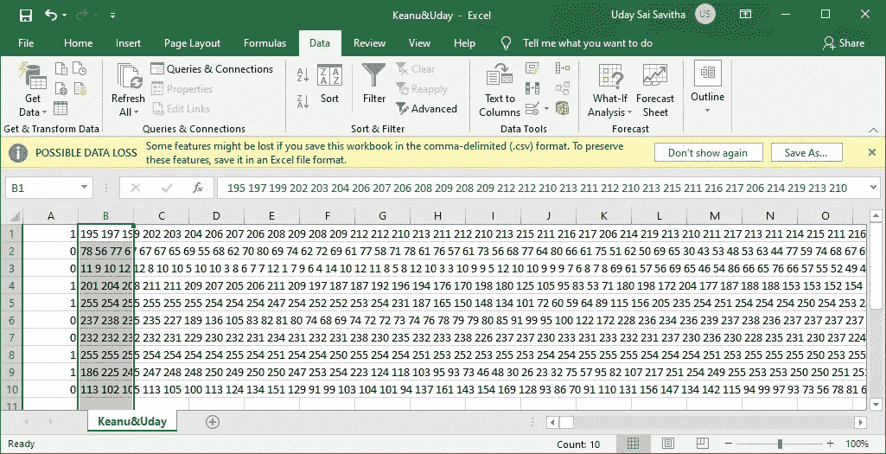

图片由[作者](https://medium.com/@udayyhit47)

6.相应地命名列。

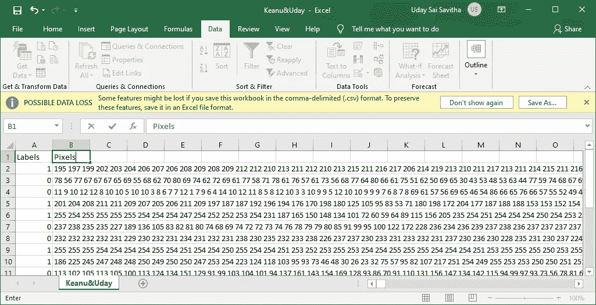

图片由[作者](https://medium.com/@udayyhit47)

Aaaaannddddd，我们完了！

> 恭喜你！您已经从头开始创建了一个全新的自定义图像数据集。

# 奖金

## 装载 CSV

加载 CSV 并运行以下代码片段，您就万事大吉了。

```
import pandas as pd
import cv2
import matplotlib.pyplot as plt
import numpy as np
from sklearn.model_selection import train_test_split

dataset_path = '/content/Keanu&Uday.csv'
image_size=(48,48) #add 3 if RGB image

def load():
    data = pd.read_csv(dataset_path)
    pixels = data['Pixels'].tolist()
    width, height= 48, 48 ,# add depth 3 if RGB image
    faces = []
    for pixel_sequence in pixels:
        face = [int(pixel) for pixel in pixel_sequence.split(' ')]
        face = np.asarray(face).reshape(width, height,) #add depth if RGB image
        a = face
        face = np.resize(face.astype('uint8'),image_size)
        faces.append(face.astype('float32')) faces = np.asarray(faces)
    A = faces
    faces = np.expand_dims(faces, -1)
    return faces, A

faces,A = load()
plt.imshow(A[0].astype("uint8"))
```

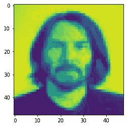

以上代码片段|图片由[作者](https://medium.com/@udayyhit47)输出

感谢阅读！我希望这篇文章对你有用。这是 Colab 笔记本的链接。

资源: [GitHub 知识库](https://github.com/Uday47/How-to-create-a-new-custom-dataset-from-images-Medium-Article)和 [Google Colab](https://colab.research.google.com/github/Uday47/How-to-create-a-new-custom-dataset-from-images-Medium-Article/blob/master/Code_Medium.ipynb)

谢谢你相信我，[西塔](https://medium.com/@sainishitha2000)。