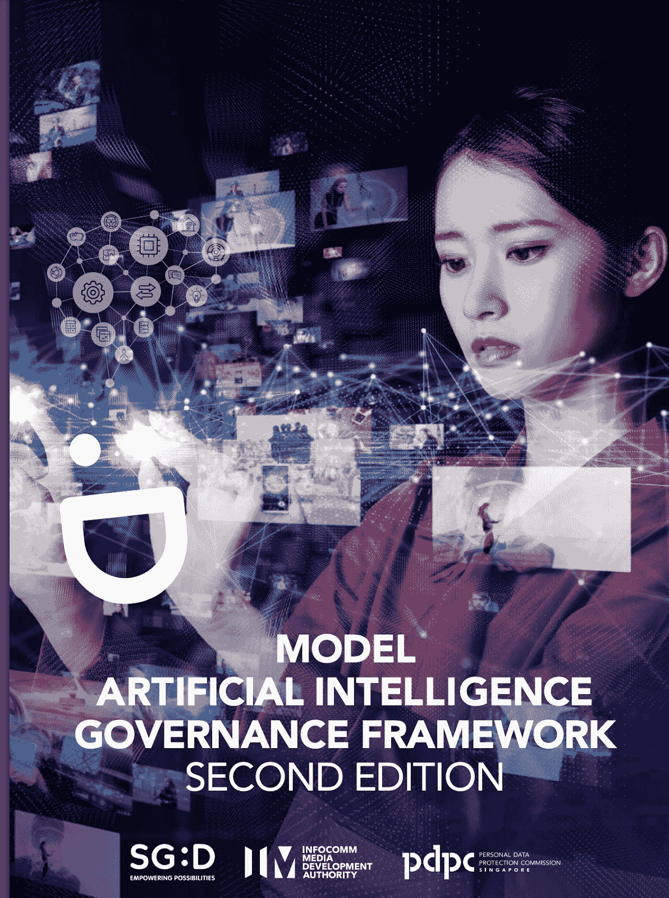

# 如何为你的公司创建一个实用的人工智能风险管理框架

> 原文：<https://pub.towardsai.net/how-to-create-a-practical-a-i-risk-management-framework-for-your-company-e6d77e5e6c29?source=collection_archive---------2----------------------->

## 以结构化方式降低人工智能风险的简单步骤

在 [Unsplash](https://unsplash.com?utm_source=medium&utm_medium=referral) 上由 [Hitesh Choudhary](https://unsplash.com/@hiteshchoudhary?utm_source=medium&utm_medium=referral) 拍摄的照片

基于人工智能的风险是一个我在之前[已经写了很多次的话题，甚至还写了一本](https://medium.com/towards-artificial-intelligence/inference-attacks-the-sql-injection-of-the-future-ba6daa563682)[的书](https://www.amazon.com/Artificial-Intelligence-Governance-Cyber-Security-beginners/dp/B09YHK8L2T/)，我最常被问到的一个问题是

> 你如何着手降低人工智能风险？

这是一个非常有趣的问题，因为缺乏关于这个话题的知识，事实是这些风险并不存在于真空中。这不是一个你修复一次就忘记到下一年的“错误”

为了识别和降低人工智能风险，你需要一个合适的治理框架

> 如果你的公司计划长期使用人工智能系统作为战略和/或竞争优势，那么拥有这个框架将是至关重要的。

各国政府正急于制定法规来控制人工智能，但这需要一段甜蜜的时间来实施。这意味着公司需要率先采取行动，建立框架来减轻人工智能系统带来的独特治理和安全风险。

一个额外的好处是，当法规出台时，那些主动实施人工智能系统治理框架的公司将处于明显的优势，并会发现遵守新规则要容易得多。

# 什么构成了一个好的人工智能治理框架？

人工智能变得越来越可行，也越来越容易被公司采用，用户友好的人工智能软件变得非常受欢迎，这种软件不需要了解底层模型。

除了内部项目之外，供应商驱动的软件也可能有人工智能组件，如果不及时缓解，这些组件可能会引入风险。

> **一家公司可能会从供应商那里购买信用评分软件，而不知道有一个底层的人工智能模型没有正确创建，可能会歧视某些人！**

为了解决风险管理专业人士面临的这些挑战，公司需要创建一个人工智能治理框架，以便建立一个结构化的系统来**识别、缓解和跟踪**这些风险，直至关闭。

治理框架是一种结构化的方式，确保事情正常运行，并符合行业法规和指导方针。有效的人工智能治理框架将确保公司以结构化和可重复的方式减轻人工智能系统的风险。

这意味着人工智能系统将不会成为公司的盲点，而是被批准，形式化和评估，以确保它们不会引入任何不可预见的风险。

一个有效的框架将是:

*   **技术不可知** : It 部门不关心任何软件技术或提供商，而是将应用相同的原则，而不管技术如何
*   **算法不可知**:它不关心人工智能算法的底层技术细节，但关心它是如何被设计的，它的数据是如何被捕获的，以及它是否遵循“人工智能信任”原则(稍后将详细介绍)

# 人工智能治理框架的关键组成部分

虽然治理框架可以根据业务的性质及其监管框架而变化，但某些方面在各个行业中是通用的。

人工智能治理框架的高级组件如下:

来源:作者

让我们一个一个来看

## **1。AI 和机器学习政策:**

任何有实施治理框架经验的人都会知道，最困难的部分总是改变公司根深蒂固的文化。公司做事的方式会随着时间的推移而发展，引入新的控制措施总是会遇到最初的阻力。

推动管理层变革的最佳方式之一是正式制定一项政策，明确阐述公司关于如何在公司内道德地使用人工智能以及如何减轻人工智能相关风险的愿景。

> 一项**高级政策**将为如何在整个公司控制人工智能的使用定下基调，并正式确定人工智能使用的责任和人工智能系统必须遵守的一般原则。

简而言之，人工智能政策通知每个人谁可以做什么，如果发现人工智能系统是以不兼容的方式制造的，责任在哪里。它还将构成随后其他组成部分的基础。

## **2。AI 治理委员会:**

另一个关键方面是一个跨职能的治理团队，该团队监督人工智能系统，并对新的人工智能计划做出可行/不可行的决定。

管理层必须确定整个公司的关键人物，并通过让他们成为该委员会的一部分来授权他们进行人工智能控制。

如果一个新的人工智能系统正在一个市场上开发，可能会使你的公司面临不遵守当地法规的风险，那么这个委员会就是做出不继续进行的决定的地方。

使该委员会由多个部门的代表组成；它确保采纳不同的观点，并记录所有涉众的意见。

委员会至少应该有来自以下方面的代表

*   法律——确保任何新的人工智能项目都不涉及法律问题
*   **网络安全**——通常最适合标记人工智能系统中的任何安全风险
*   **技术** —推动采用新的人工智能技术并负责监控/管理底层基础设施的团队。
*   **数据科学**——从事为人工智能系统提供动力的数据工作的人。
*   **业务** —大多数人工智能计划的驱动力。
*   **审计和风险** —独立成员是该委员会确保有效治理的必要组成部分
*   由执行委员会的一名成员担任主席

## **3。人工智能风险管理框架**

人工智能策略的输出；将建立一个**框架**来识别关键业务人工智能系统中的风险，并由指定单位拥有。就像常规公司中的风险管理部门一样，这个部门将围绕偏见、数据收集、网络安全、弹性等制定缓解策略，以识别和修复人工智能风险。

## **4。AI 信任原则**

要让人工智能系统被客户接受，它们需要产生“**信任**”，也就是说，客户需要相信所做的决定是公平的，人工智能不会以任何方式歧视他们。

框架的一部分将是建立每个人工智能系统都必须遵守的信任原则，这些原则必须根植于公司的文化中。数据科学家和参与数据收集的其他团队将接受培训，以确保遵循这些原则，从而将偏差降至最低。

至少，人工智能系统必须遵循以下原则:

1.  **完整性**——确保机器学习算法是健全的，不能被篡改。用于训练该算法的任何数据将仅用于收集该数据的目的，而不会用于任何其他目的
2.  **可解释性** —人工智能将不会是一个“**黑盒**”，算法做出决策的过程将是透明的，并被记录在案。
3.  公平——决策将是公平的、合乎道德的、没有偏见的，并且不会歧视任何年龄、性别、团体或种族
4.  **弹性** —人工智能系统应该足够安全和健壮，以抵御恶意方对其基础设施或数据的攻击。

# 为什么要从头开始构建？

如果你真的想为你的公司建立一个人工智能治理框架，那么好消息是有许多现成的框架可供你用作模板。

我个人最喜欢的是新加坡监管部门发布的 [**模型 AI 治理框架**](https://www.pdpc.gov.sg/-/media/files/pdpc/pdf-files/resource-for-organisation/ai/sgmodelaigovframework2.ashx) 。它于 2019 年在世界经济论坛(WEF)上推出，为公司在创建人工智能系统时如何减轻道德和治理风险提供了详细的指导。

来源:[https://www . pdpc . gov . SG/-/media/files/pdpc/pdf-files/resource-for-organization/ai/sgmodelaigvframework 2 . ashx](https://www.pdpc.gov.sg/-/media/files/pdpc/pdf-files/resource-for-organisation/ai/sgmodelaigovframework2.ashx)

该框架为模型框架提供了一个很好的蓝图，并且基于两个指导原则:

*   人工智能做出的决定应该是“可解释的、透明的和公平的”。
*   *人工智能系统应该以人为中心(即人工智能的设计和部署应该保护人们的利益，包括他们的安全和福祉)*

您可以在您的组织中使用和实现部分模型框架，并根据您的需要对其进行裁剪。这种模式最棒的一点是，它可以被任何公司采用，无论其规模或行业如何，从大型银行到小型科技初创公司。

# 人工智能风险管理是未来

人工智能正在改变风险管理专业人士的游戏规则，拥有适当的治理框架是降低其风险的关键。管理层必须意识到，消除人工智能的风险不仅仅是减缓采用速度的繁文缛节，而是可以赢得客户信任的实际竞争优势。

> 我希望你喜欢读这篇文章。如果你觉得这个话题很有趣，可以看看我关于[人工智能治理和网络安全](https://cloudsecguy.gumroad.com/l/aigovernance)的课程，该课程讲述了新型人工智能风险以及如何减轻它们。

 [## 通过我的推荐链接加入 Medium—tai mur Ijlal

### 阅读 Taimur Ijlal(以及媒体上成千上万的其他作家)的每一个故事。您的会员费直接支持…

taimurcloud123.medium.com](https://taimurcloud123.medium.com/membership)