# 如何为城市创建一个邻近定位系统

> 原文：<https://pub.towardsai.net/how-to-create-a-proximity-positioning-system-for-a-city-451ad19784d3?source=collection_archive---------4----------------------->

## [数据分析](https://towardsai.net/p/category/data-analytics)

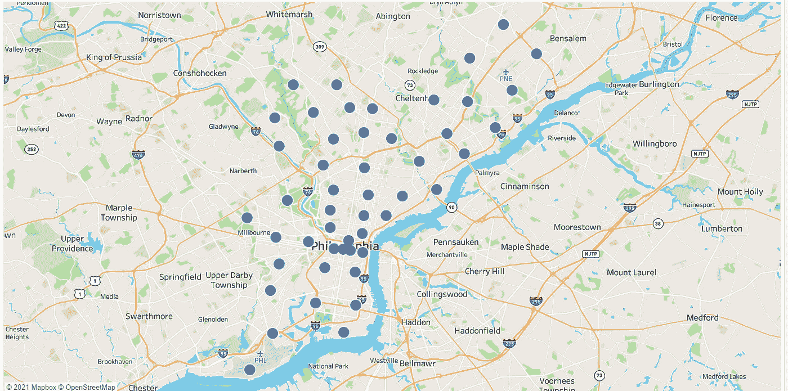

费城的邮政编码

这里使用的距离算法来自以下链接中的代码:

[https://www . geeks forgeeks . org/program-distance-two-points-earth/](https://www.geeksforgeeks.org/program-distance-two-points-earth/)

这个特殊的算法演示了如何将其外推至整个城市，例如宾夕法尼亚州的费城。

# 目录:

一、下载并输入数据

二。如何将距离公式扩展到所有拉链的城市级别

三。快速视觉

## 一、下载并输入数据

[](https://sourceforge.net/projects/zips/files/#files) [## 邮政编码数据库项目

### 邮政编码数据库项目的存在是为了向我们提供完整的邮政编码；经纬度坐标…

sourceforge.net](https://sourceforge.net/projects/zips/files/#files) 

请点击上面的链接下载 zip 数据集。

下载完数据集后，解压缩文件并打开。excel 中的 csv。

筛选州“宾夕法尼亚州”和城市“费城”的数据。复制并粘贴到一个单独的标签中，并删除其他所有内容，这样您只剩下宾夕法尼亚州费城的数据。

仅保留下面显示的列:

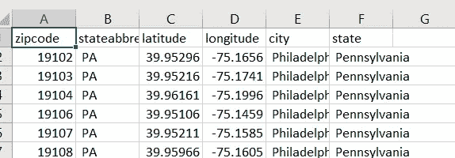

## 二。如何将距离公式扩展到所有拉链的城市级别

这是距离公式的样子:

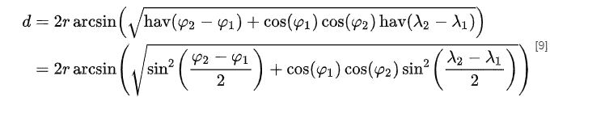

【https://en.wikipedia.org/wiki/Haversine_formula 

这就是所谓的“大圆距离”的解释:

[](https://en.wikipedia.org/wiki/Great-circle_distance) [## 大圆距离-维基百科

### 大圆距离、顺向距离或球面距离是沿着大圆的距离。它是…

en.wikipedia.org](https://en.wikipedia.org/wiki/Great-circle_distance) 

现在让我们来看看这是如何编码的两个坐标给定的方式:

(纬度 x，经度 x)和(纬度 y，经度 y)

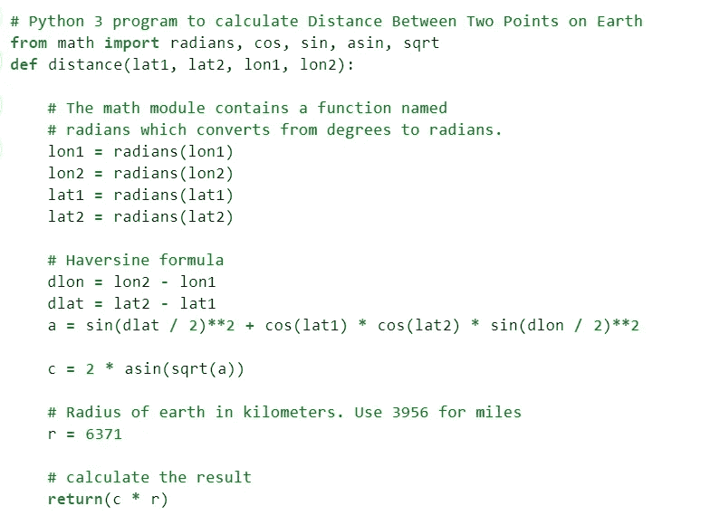

[https://www . geeks forgeeks . org/program-distance-two-points-earth/](https://www.geeksforgeeks.org/program-distance-two-points-earth/)

如您所见，本质上，您将所提供的纬度转换为弧度，然后将所示的哈弗森公式应用于纬度，并乘以地球的英里半径，这在上面的代码中给出为 3956，以获得英里数。

> **好了，现在是时候将公式扩展到城市或任何你想要的区域了。**

启动您的 python 编辑器。

我们首先需要熊猫和小熊猫:

```
import pandas as pd 
import numpy as np
```

接下来，从桌面输入费城的 zip 文件:

```
df = pd.read_csv(r'C:\**the path**\Zip_Codes.csv')
```

将度数转换为弧度:

```
df['latitude'] = np.deg2rad(df['latitude'])
df['longitude'] = np.deg2rad(df['longitude'])
```

## 现在我们需要的是一个交叉连接。

## **去这里学习怎么做:**

[GeeksForGeeksCrossJoin](https://www.geeksforgeeks.org/python-program-to-perform-cross-join-in-pandas/#:~:text=In%20Pandas%2C%20there%20are%20parameters%20to%20perform%20left%2C,join%20on%20two%20DataFrames%20for%20user%20and%20product.)

所以让我们开始吧。为之前的数据帧制作一份副本:

```
df1=df
```

为两个数据框提供一个重复的关键字，以便它们在连接时相互交叉:

```
df['key'] = 1
df1['key'] = 1
```

对键列执行联接，然后删除键

```
result = pd.merge(df, df1, on ='key').drop("key", 1)
```

运行这个程序来复查结果。在我的变量浏览器中，我可以看到:

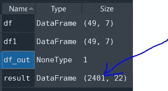

这很有用，因为它显示我从 49 行或邮政编码开始。

49 X 49 = 2401，这正是交叉联接显示的数字。

让我们计算 2401 个组合的每个邮政编码的纬度和经度之间的差异:

```
result[‘dlon’] = result[‘longitude_x’] -result[‘longitude_y’]
result[‘dlat’] = result[‘latitude_x’] -result[‘latitude_y’]
```

现在，我要分解哈弗辛公式，并把它放在一起:

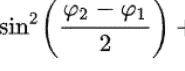

https://en.wikipedia.org/wiki/Haversine_formula

```
result['e'] = np.sin(result['dlat']/2)**2
```

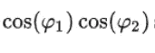

【https://en.wikipedia.org/wiki/Haversine_formula 

```
result['f'] = np.cos(result['latitude_x']) * np.cos(result['latitude_y'])
```

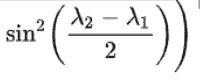

[https://en.wikipedia.org/wiki/Haversine_formula](https://en.wikipedia.org/wiki/Haversine_formula)

```
result['g'] = np.sin(result['dlon']/2)**2
```

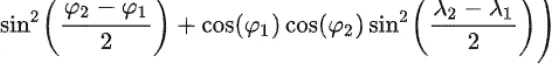

[https://en.wikipedia.org/wiki/Haversine_formula](https://en.wikipedia.org/wiki/Haversine_formula)

```
result['a'] = result['e'] + (result['f'] * result['g'])
```

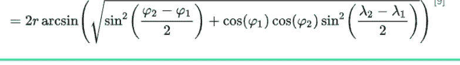

[https://en.wikipedia.org/wiki/Haversine_formula](https://en.wikipedia.org/wiki/Haversine_formula)

```
result['pre_c'] = np.sqrt(result['a'])
result['c'] = 2 * np.arcsin(result['pre_c'])
result['r'] = 3956
result['distance'] = result['c']*result['r']
```

## 三。快速视觉

首先，让我们导出上面的输出:

```
df_out = result.to_csv(r’C:\Users\ashum\Documents\Distance_output.csv’)
```

如果你有 Tableau，你可以使用它或者你可以下载他们的免费版本，Tableau Public:

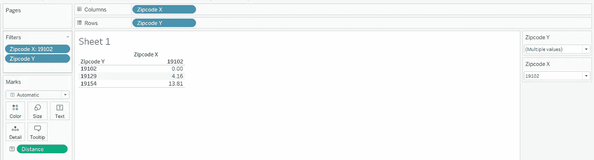

作者

如您所见，在我将输出加载到 Tableau 后，我创建了一个快速的视觉效果。在最右边，你可以看到过滤器。我的邮政编码 X 是 19102，然后是 Y，我用了 3 个邮政编码:19102、19129 和 19154。

然后我把距离公式拖进去:

它显示我们从 19102 开始计算的距离是 0 英里，从 19129 开始是 4.16 英里，从 19154 开始是 13.81 英里。

> **然而，我们所做的真正强大之处在于，我们知道每个邮政编码之间的距离。**

这就是开始看起来的样子:

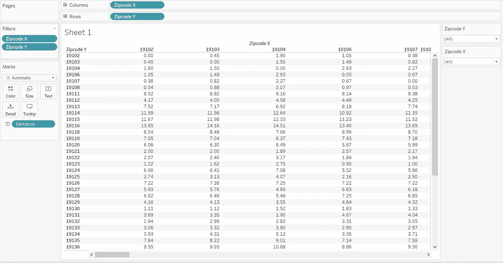

上表是费城邮政编码经纬度列表中每个点之间的距离。


费城的邮政编码

感谢阅读，

灰

参考资料:

1.  [https://en.wikipedia.org/wiki/Haversine_formula](https://en.wikipedia.org/wiki/Haversine_formula)
2.  [https://en.wikipedia.org/wiki/Great-circle_distance](https://en.wikipedia.org/wiki/Great-circle_distance)
3.  [https://www . geeks forgeeks . org/program-distance-two-points-earth/](https://www.geeksforgeeks.org/program-distance-two-points-earth/)
4.  [https://www . geeks forgeeks . org/python-program-to-perform-cross-join-pandas/#:~:text = In % 20 pandas，% 20 where % 20 are % 20 parameters % 20 to % 20 perform % 20 left，，join % 20 on % 20 two % 20 data frames % 20 for % 20 user % 20 and % 20 product](https://www.geeksforgeeks.org/python-program-to-perform-cross-join-in-pandas/#:~:text=In%20Pandas,%20there%20are%20parameters%20to%20perform%20left,,join%20on%20two%20DataFrames%20for%20user%20and%20product)。
5.  【https://sourceforge.net/projects/zips/files/#files 