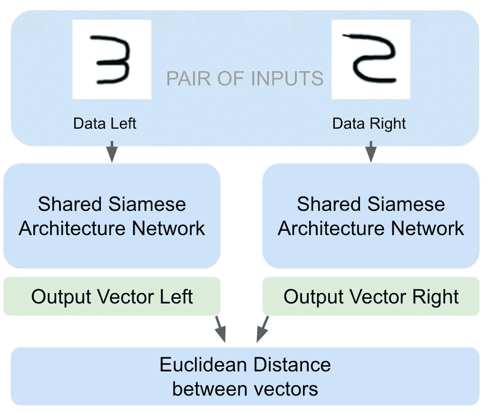
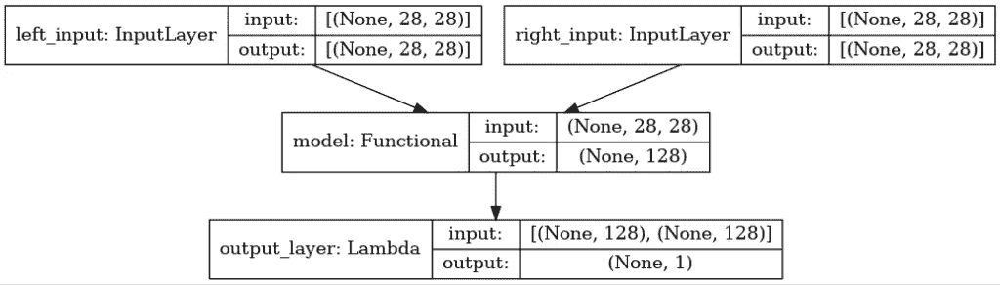
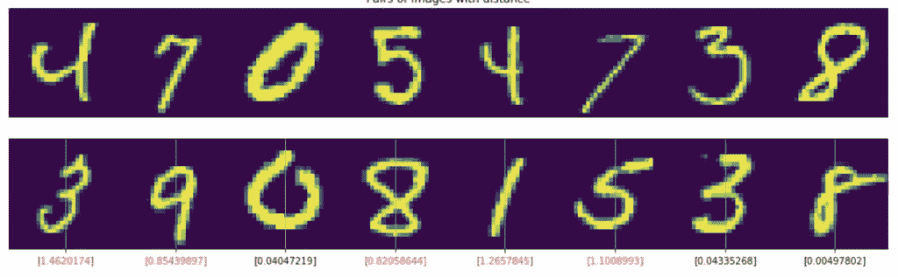
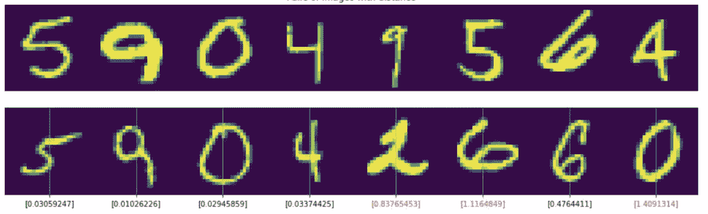
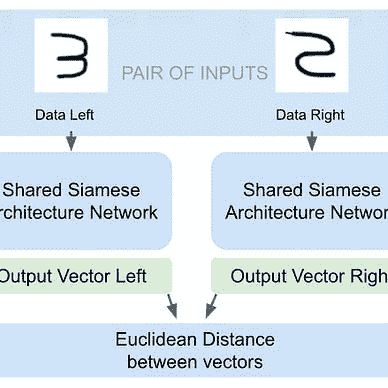

# 如何使用 Keras 创建一个连体网络来比较图像

> 原文：<https://pub.towardsai.net/how-to-create-a-siamese-network-with-keras-to-compare-images-5713b3ee7a28?source=collection_archive---------0----------------------->

## 我们将用 TensorFlow 构建一个完美的网络。我可以向你保证，这很容易，也很有用，尽管它可能有点超出了基础。

Kaggle 中提供了完整的代码:

 [## 如何创建一个暹罗网络来比较图像

### 使用 Kaggle 笔记本探索和运行机器学习代码|使用来自数字识别器的数据

www.kaggle.com](https://www.kaggle.com/code/peremartramanonellas/how-to-create-a-siamese-network-to-compare-images/edit/run/107754014) 

在这里你可以执行代码，分叉，如果你喜欢的话还可以修改它。

我使用了著名的数据集 MNIST，用 42000 个 28×28 的手写数字灰度图像来训练该系统。该模型将尝试识别两个数字是否相同。

# 暹罗网络工作原理的简要描述。

它接收两个输入并产生两个输出向量来计算向量之间的欧几里德距离。

作者图片

模型的输出是一个表示输入之间差异的数字。我们必须确定界限，以便图像可以被认为是同一类型的。模型返回的数字越小，差异就越小。如果模型收到两个相同的图像，返回值必须为零。

# 暹罗网络在哪些情况下有用？

虽然它们广泛应用于面部识别等领域，但暹罗网络并不局限于图像领域。

它们在 NLP 中也很受欢迎，在 NLP 中，它们可以用于识别重复文本、处理相同主题的文本，甚至识别两个文本是否具有相同的风格或作者。

它们还可以用于识别音频文件，例如，比较声音并知道它们是否属于同一个人。

无论什么类型，只要我们想比较两个项目，暹罗网络就会起作用。当训练数据集有限时，特别推荐使用这些网络。因为我们可以不同地匹配可用项目，从而增加我们可以从数据中获得的信息。

在笔记本上，我已经将每一项与清单上的另一项进行了匹配。但是我可以多次将每个项目与数据集中的不同项目进行匹配，从而创建尽可能多的输入对。这会给我们一组令人印象深刻的数据。这种组合的可能性允许我们拥有足够的训练数据，无论数据集有多小。

# 数据处理。

要查看完整的代码，最好的选择是打开 [Kaggle 笔记本](https://www.kaggle.com/code/peremartramanonellas/how-to-create-a-siamese-network-to-compare-images)并跟随阅读。

这里我将只解释创建数据对的部分。暹罗网络数据处理的最具体部分。

该函数遍历数据集中的每个元素，并将它们与另一个元素进行匹配，从而得到几对与数据集中的元素数量相等的元素。

为了确保具有相同类型对的元素的最小数量，已经并入了参数 ***min_equals*** 。第一对，直到达到 ***min_equals*** ，将用相同类型的元素创建。其余的随机匹配。

最后几行显示了如何在 ***pairs*** 变量中创建和存储配对。它们的标签存储在 ***标签*** 变量中。

数据在 ***返回*** 时被转换，以便可以从模型中处理。

注意函数开头的这行:***index =[NP . where(y = = I)[0]for I in range(10)]***。它创建了一个名为 ***的数组，包含 9 行索引*** 。每行包含标签( ***y*** )数组中属于变量 ***i*** 指示的类别的数字的位置。

也就是说，对于 ***index[0]*** 我们将拥有数组 ***y*** 中所有位置的数值为 0。在 ***索引[1]，*** 值 1 的位置…

# 创建暹罗模型。

在创建模型之前有必要做三个功能。一个是计算两个输出向量之间的欧几里德距离。另一个是修改输出数据的形状。第三个是用于计算损失的损失函数。别担心，这是一个功能，我想说，是所有连体模特的标准。

损失函数***contrastive _ loss***嵌套在另一个函数***contrastive _ loss _ with _ margin***中，因此它允许我们向它传递一个参数。但是它可以被忽略，并且总是在页边空白中使用相同的值。

在构建模型时，将 ***loss*** 函数传递给 ***compile*** 方法，该方法负责传递 ***y_true*** 和 ***y_pred*** 参数，以便可以计算每一步的损失。我们不能传递更多的参数，所以我们嵌套了函数。 ***编译*** 方法接收的是期望输入数据 y_true 和 y_pred 的损失函数。

适用于我们的变量的损失函数的数学公式是:

***Ytrue * Ypred******+(1-Ytrue)* max(margin-Ypred，0)***

跟随代码，我们看到在变量 ***square_pred*** 中我们存储了 ***Ypred*** 的值。在 ***margin_square*** 中我们存储了 ***max(margin-Ypred，0)*** 的值。从这里开始，代入等式中的变量，我们得到了包含在 ***return*** 行中的表达式。

> 由于我不打算进入有关数学的细节，如果你想了解更多信息，请参考这篇文章:

 [## 对比损失解释

### 对比损失最近已经在一些论文中使用，这些论文显示了无监督…

towardsdatascience.com](https://towardsdatascience.com/contrastive-loss-explaned-159f2d4a87ec)  [## 损失解释:对比损失

### 这是一系列解释用于人脸识别/人脸验证任务的不同损失函数的帖子。

medium.com](https://medium.com/@maksym.bekuzarov/losses-explained-contrastive-loss-f8f57fe32246) 

# 模型的公共部分。

这部分将为两个输入执行，它是模型的公共部分，接收 28x28 图像作为输入。

我已经创建了一个包含这部分模型代码的函数。这是一个基本模型，但我们可以建立一个更复杂的模型，只要我们认为对我们的数据是必要的。你可以看到，我们有一个 ***展平*** 图层，后面是一个混合了**图层的图层。**

**请注意，该函数返回一个模型及其输入和输出，而不仅仅是一组层。**

**对于这个模型，我们必须添加暹罗网络的输入层和输出层。**

# ****输入和**输出**层的连体模型。****

**我们有两个输入层: ***input_l*** 和 ***input_r，*** 都接收基础模型并产生一个矢量作为输出( ***vector_output_l，vector_output_r*** )。**

**每个分支机构将收到我们准备的数据集的一部分。**

****

**输出层是使用 Lambda 类型的层创建的，该层调用前面创建的两个函数。 ***欧几里得距离*** 计算欧几里得距离，这将是预期的回报。并且***eucl _ dist _ output _ shape***是修改输出的形状并接收两个向量的那个。**

**正如你在 ***模型*** 创建中看到的，我们将两个输入层作为输入，将输出层作为输出。在暹罗网络中，我们有两个输入层和一个输出。**

**该训练模型了。**

**你可以看到在*调用中我们是如何传递由 ***create_pairs*** 函数准备的数据的，左边是 ***元素【0】，*** ，右边是**元素【1】。**验证数据也是如此。***

# ****让我们看看结果。****

********

**在图像中，你可以看到从数据集中随机选择的 16 对数字，没有一个错误。**

**如果你在 [Kaggle 笔记本](https://www.kaggle.com/code/peremartramanonellas/how-to-create-a-siamese-network-to-compare-images)中尝试，想跑多少跑多少。找到一个 bug 几乎是不可能的。确实有一个数字非常接近被错误分类:第二行的一对 6 给我们的分数是 0.47…再多一点，就会被归类为不同的数字。**

**如果你更喜欢数字: ***训练精度= 0.987075 Val 精度= 0.968*****

**但是请记住，我们已经用单个数据交叉进行了训练！我们可以用两个相等的和两个不同的数字来交叉每个数字，从而获得更多的数据用于训练。在这些类型的模型中，输入是成对的数据，因此每对都是不同的输入数据。**

# **结论。**

**用暹罗网络获得的结果对我来说似乎难以置信。我没有过多地处理数据，也没有担心模型，训练持续了两分钟多一点。我还没有用回调函数去接触学习率，我甚至没有费心去记录最好的模型…尽管如此，结果还是很好。**

**暹罗网络是执行数据配对检查的强大工具。或者检查一段数据是否属于一个组。它们可以用有限的数据集进行训练，并提供惊人的结果。**

**我定期写张量流和机器学习。**考虑** [**在媒体上关注我**](https://medium.com/subscribe/@peremartra) **获取关于新文章的更新。**当然，也欢迎你在 [LinkedIn](https://www.linkedin.com/in/pere-martra-0310631/) 上与我连线。**

**本文是关于 TensorFlow 和 Keras 高级主题系列的一部分。**

**

[佩雷·玛特拉](https://medium.com/@peremartra?source=post_page-----5713b3ee7a28--------------------------------)** 

## **张量流超越基础**

**[View list](https://medium.com/@peremartra/list/tensorflow-beyond-the-basics-24c4c6a844d8?source=post_page-----5713b3ee7a28--------------------------------)****3 stories**************