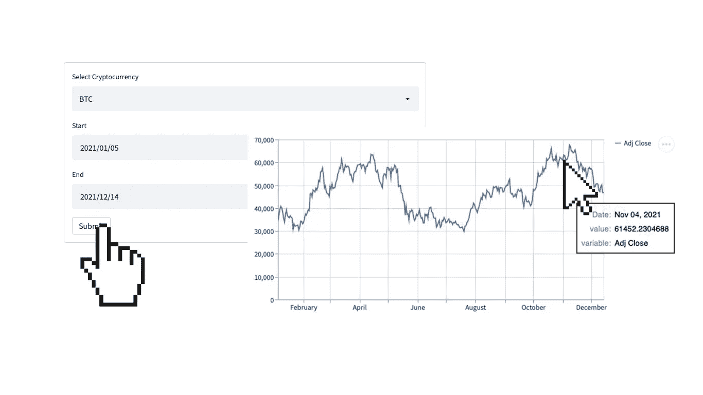
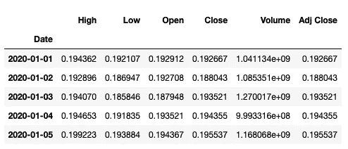
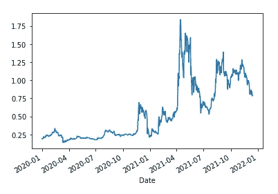
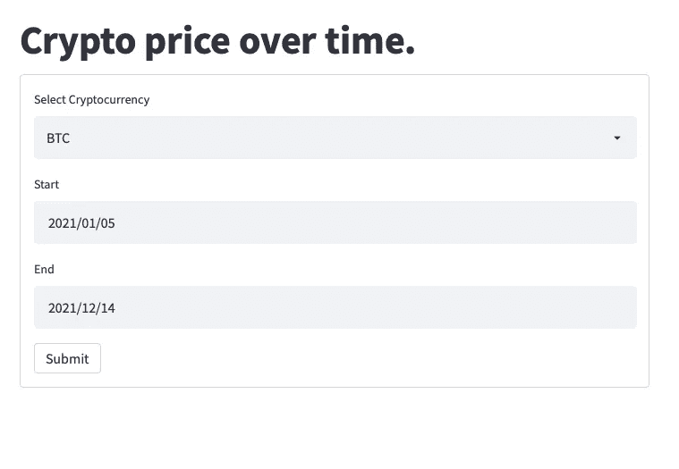

# 如何创建一个简单的 Streamlit 应用+如何在 Heroku 上部署它

> 原文：<https://pub.towardsai.net/how-to-create-a-simple-streamlit-app-how-to-deploy-it-on-heroku-6a9095c6aabd?source=collection_archive---------2----------------------->

## [DevOps](https://towardsai.net/p/category/devops)

## 用几行代码开发一个迷你加密货币仪表板



作者图片

Streamlit 是我们最喜欢的创建 python web 应用程序的方法，因为它很简单。无需任何前端体验，您就可以构建漂亮而复杂的应用程序。在本帖中，我们将创建一个迷你加密货币仪表板，显示一段时间内的收盘价。

要安装 Streamlit:

```
pip install streamlit
```

# python 代码

使用 Streamlit 创建 web 应用程序的最佳途径是首先在 Jupyter Notebook 之类的东西中开发代码，然后将其传输到 Streamlit python 文件中。说到这里，让我们开发代码，获取数据并绘制加密货币的收盘价。

有很多方法可以得到一种货币的价格，但是在这篇文章中，我们将使用 pandas_datareader。要安装它，请运行以下命令:

```
pip install pandas-datareader
```

现在，让我们开始编码。我们想要两件事，设置日期范围和加密货币名称，然后绘制其收盘价。

```
import pandas as pd
import numpy as np
import pandas_datareader as web
import datetime as dtstart = dt.datetime(2020,1,1)
end = dt.datetime.now()df = web.DataReader('XRP-USD', 'yahoo', start, end)
df
```



作者图片

Pandas Datareader 将货币名称(XRP)、范围和来源(yahoo)作为输入。

```
df['Adj Close'].plot()
```



作者图片

# 将代码转换成 Streamlit 应用程序

现在是有趣的部分。在我们开始之前，你应该打开这个 [streamlit 备忘单](https://share.streamlit.io/daniellewisdl/streamlit-cheat-sheet/master/app.py)，这是我在开发应用程序时经常使用的。

第一步是想一个标题，以及我们需要什么输入。在我们的例子中，我们只需要 3 样东西。货币名称以及开始和结束日期。然后，如果用户按下提交按钮，它应该显示一个图。所以，里面有一个**。py** (姑且称 t **app.py** )文件添加如下。

```
import pandas as pd
import pandas_datareader as web
import datetime as dt
import numpy as np
import streamlit as stst.title('Crypto price over time.')with st.form(key='my_form'):
    crypto=st.selectbox('Select Cryptocurrency', ['BTC','ETH','XRP','BCH'])
    start=st.date_input('Start')
    end=st.date_input('End')
    submit_button = st.form_submit_button(label='Submit')if submit_button:
    df = web.DataReader(f'{crypto}-USD', 'yahoo', start, end)st.line_chart(df['Adj Close'])
```

我们的应用程序已经准备好了！让我们解释一下我们做了什么。

在导入库之后(不要忘记导入 **streamlit** )，我们通过使用 **st.title** 函数添加了一个标题。然后我们创建了一个表单。正如您在[备忘单](https://share.streamlit.io/daniellewisdl/streamlit-cheat-sheet/master/app.py)中所看到的，您可以使用多种类型的输入，但是在我们的示例中，我们添加了一个**选择框**用于选择货币，2 个**日期输入**用于日期范围的开始和结束，当然，还有一个**提交按钮**。

接下来，我们检查是否单击了提交按钮，我们添加了其余的代码，并做了一点小小的更改，我们使用 streamlit 的 line_chart 代替 pandas plot。

为了启动我们的应用程序，我们在终端中运行以下程序:

```
streamlit run app.py
```

输出应该如下所示:


这意味着我们的应用程序运行在 [http://localhost:8501](http://localhost:8501) 中。让我们看一看。



作者图片


作者图片

# 额外收获:如何在 Heroku 上部署 Streamlit 应用程序

Heroku 是一个开始使用 web 应用程序或 API 的很好的服务，因为你可以免费部署它们。如果你对 Heroku 或部署一无所知，我鼓励你阅读[实用指南:构建和部署机器学习网络应用](https://predictivehacks.com/practical-guide-build-and-deploy-a-machine-learning-web-app/)。

首先，你需要用下面的代码创建一个 **setup.sh** 文件:

```
mkdir -p ~/.streamlit/
echo "\
[server]\n\
headless = true\n\
port = $PORT\n\
enableCORS = false\n\
\n\
[theme]\n\
base = 'light'\n\
\n\
" > ~/.streamlit/config.toml
```

在这个文件中，你也可以改变应用程序的主题。您可以在 [Streamlit 的文档](https://docs.streamlit.io/)中找到更多信息。对于这个应用程序，我使用的是**光**主题。

接下来，我们只需要创建一个包含以下内容的 **Procfile**

```
web: sh setup.sh && streamlit run app.py
```

最后，您需要一个 **requirements.txt** 文件，其中包含我们在项目中使用的库。

```
numpy == 1.19.5

pandas == 1.3.3

pandas_datareader == 0.10.0

streamlit == 1.1.0
```

现在，您已经准备好将您的 Streamlit 应用程序部署到 Heroku。你应该在 Heroku 的网站上创建一个 app，然后按照 [**实用指南**](https://predictivehacks.com/practical-guide-build-and-deploy-a-machine-learning-web-app/) 中提到的在 Heroku 中初始化并推送代码。

# 总结一下

Streamlit 是我最喜欢的创建 Python web 应用程序的方式。它又快又简单，而且看起来很专业。在这篇文章中，我们只用了几行代码就创建了一个迷你加密货币仪表板。

像 Heroku 这样的服务让我们免费部署我们的应用程序，作为数据科学家分享想法和知识变得更加容易。结合我们的知识、Streamlit 和 Heroku，你甚至可以通过自由职业赚钱，或者你可以创建一个漂亮的应用程序组合，展示给你的下一次工作面试。

如果你想看一个更复杂的 Streamlit 的例子，你可以阅读[如何使用 Python 和 Streamlit](https://predictivehacks.com/how-to-create-an-instagram-profile-analyzer-app-using-python-and-streamlit/) 创建 Instagram Profile Analyzer 应用。

*原载于*[*https://predictivehacks.com*](https://predictivehacks.com/how-to-create-a-simple-streamlit-app-how-to-deploy-it-on-heroku/)*。*