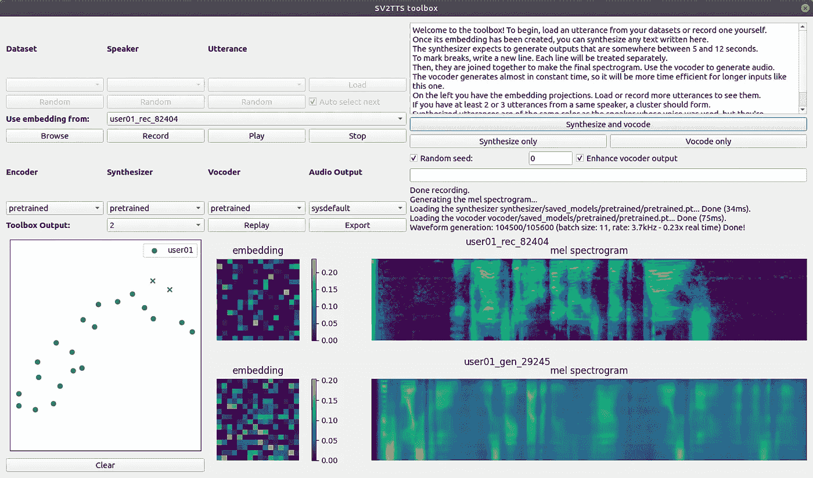

# 如何使用 Linux 上的实时声音克隆工具箱创建声音克隆

> 原文：<https://pub.towardsai.net/how-to-create-a-voice-clone-with-the-real-time-voice-cloning-toolbox-on-linux-dbba8ab459db?source=collection_archive---------1----------------------->

## [编程](https://towardsai.net/p/category/programming)

## 附有说明和截图的简明指南


图片由[卢卡斯·本杰明](https://unsplash.com/photos/wQLAGv4_OYs)

> 这个库创建者最近已经更新了它的代码，所以你不需要去解决任何错误。点击可以找到[的链接。谢谢米奇·科恩。](https://github.com/CorentinJ/Real-Time-Voice-Cloning/pull/961)

> 本文也适用于 [Windows](https://medium.com/p/7b8609438001) 和 [Mac](https://medium.com/p/39717a618844) 。

实时声音克隆工具箱是一个使用迁移学习来创建声音克隆的存储库。它可以用五秒钟的音频克隆某人的声音。它还可以从现有的数据集中加载音频文件，在计算机上加载音频文件，或者用计算机上的麦克风录制新文件。

该应用程序在左上方显示用于加载、录制和保存音频文件的控件，在右上方显示用于配置和创建语音克隆的控件。它在左下方显示单词 embeddings，这是加载的嵌入的二维空间投影，在中下方显示嵌入热图，这是语音的数字表示，在右下方显示 mel 频谱图，这是声学时间-频率。



## 开放终端:

1.  点击左上角的“活动”
2.  在搜索栏中输入“终端”
3.  点击“终端”

## 导航到桌面目录:

1.  从下面这些指令中复制命令
2.  将命令粘贴到终端
3.  按“回车”

```
cd ~/Desktop
```

## 安装自制软件:

1.  从下面这些指令中复制命令
2.  将命令粘贴到终端
3.  按“回车”
4.  按“回车”

```
/bin/bash -c "$(curl -fsSL https://raw.githubusercontent.com/Homebrew/install/HEAD/install.sh)"
```

## 将自制软件添加到路径:

1.  从下面这些指令中复制命令
2.  将命令粘贴到终端
3.  按“回车”

```
echo ‘eval “$(/home/linuxbrew/.linuxbrew/bin/brew shellenv)”’ >> /home/user/.bashrc
eval “$(/home/linuxbrew/.linuxbrew/bin/brew shellenv)”
```

## 安装 FFmpeg:

1.  从下面这些指令中复制命令
2.  将命令粘贴到终端
3.  按“回车”

```
brew install ffmpeg
```

## 下载存储库:

1.  从下面这些指令中复制命令
2.  将命令粘贴到终端
3.  按“回车”

```
git clone [https://github.com/corentinj/real-time-voice-cloning](https://github.com/CorentinJ/Real-Time-Voice-Cloning)
```

## 导航到存储库目录:

1.  从下面这些指令中复制命令
2.  将命令粘贴到终端
3.  按“回车”

```
cd real-time-voice-cloning
```

## 安装 Virtualenv:

1.  从下面这些指令中复制命令
2.  将命令粘贴到终端
3.  按“回车”

```
python -m pip install virtualenv
```

## 创建虚拟环境:

1.  从下面这些指令中复制命令
2.  将命令粘贴到终端
3.  按“回车”

```
python -m virtualenv venv
```

## 激活虚拟环境:

1.  从下面这些指令中复制命令
2.  将命令粘贴到终端
3.  按“回车”

```
source venv/bin/activate
```

## 安装 PyTorch:

1.  从下面这些指令中复制命令
2.  将命令粘贴到终端
3.  按“回车”

```
python -m pip install torch==1.2.0
```

## 安装要求:

1.  从下面这些指令中复制命令
2.  将命令粘贴到终端
3.  按“回车”

```
python -m pip install -r requirements.txt
```

## 下载预训练模型:

1.  打开[谷歌驱动](https://drive.google.com/file/d/1MFqoJ0thIK7r2IThjlghsg_MXmiu62ma/view?usp=sharing)
2.  点击“下载”
3.  单击“仍然下载”

## 移动预训练模型:

1.  从下面这些指令中复制命令
2.  将命令粘贴到 PowerShell 中
3.  按“回车”

```
mv ~/downloads/pretrained* ~/desktop/real-time-voice-cloning
```

## 解压缩预训练的模型:

1.  从下面这些指令中复制命令
2.  将命令粘贴到终端
3.  按“回车”

```
unzip pretrained.zip
```

## 安装高级 Linux 声音架构:

1.  从下面这些指令中复制命令
2.  将命令粘贴到终端
3.  按“回车”

```
sudo apt install libasound2-dev
```

## 下载 PortAudio 存储库:

1.  从下面这些指令中复制命令
2.  将命令粘贴到终端
3.  按“回车”

```
git clone -b alsapatch https://github.com/gglockner/portaudio
```

## 导航至 PortAudio 目录:

1.  从下面这些指令中复制命令
2.  将命令粘贴到终端
3.  按“回车”

```
cd portaudio
```

## 创建 MakeFile:

1.  从下面这些指令中复制命令
2.  将命令粘贴到终端
3.  按“回车”

```
sudo ./configure
```

## 构建包:

1.  从下面这些指令中复制命令
2.  将命令粘贴到终端
3.  按“回车”

```
sudo make
```

## 安装检查安装:

1.  从下面这些指令中复制命令
2.  将命令粘贴到终端
3.  按“回车”

```
sudo apt install checkinstall
```

## 运行检查安装:

1.  从下面这些指令中复制命令
2.  将命令粘贴到终端
3.  按“回车”
4.  输入“Y”创建包文档
5.  按“回车”继续，不写软件包说明
6.  输入“3”设置版本号
7.  按“回车”
8.  输入“1”
9.  按“回车”

```
sudo checkinstall
```

## 更新符号链接:

1.  从下面这些指令中复制命令
2.  将命令粘贴到终端
3.  按“回车”

```
sudo ldconfig
```

## 导航到父目录:

1.  从下面这些指令中复制命令
2.  将命令粘贴到终端
3.  按“回车”

```
cd ..
```

## 重新安装 X 协议 C 语言绑定:

1.  从下面这些指令中复制命令
2.  将命令粘贴到终端
3.  按“回车”

```
sudo apt install --reinstall libxcb-xinerama0
```

## 运行工具箱:

1.  从下面这些指令中复制命令
2.  将命令粘贴到终端
3.  按“回车”

```
python demo_toolbox.py
```

## 记录自定义数据集:

1.  点击“记录”按钮
2.  读第一行
3.  重复接下来的三行

```
01\. Float the soap on top of the bathwater.02\. He was now in the last stage of a deadly fever.03\. A king ruled the state in the early days.04\. The square wooden crate was packed to be shipped.
```

## 克隆声音:

1.  阅读工具箱中文本框中的文本
2.  复制这些说明下面的文字
3.  将文本粘贴到文本框中的文本上
4.  选择“随机种子”
5.  选中“增强声码器输出”
6.  点击“合成和语音编码”

```
This voice clone was made by the real-time-voice-cloning repository
```

## 听听克隆人的声音:

1.  单击“工具箱输出”下拉菜单
2.  选择下拉菜单中的第一项
3.  点击“重放”按钮

## 保存声音克隆:

1.  点击“导出”按钮
2.  从这些说明下面复制文件名
3.  点按“另存为”文本栏
4.  右键单击“另存为”文本字段
5.  单击“粘贴”菜单项
6.  点击“保存”按钮

```
my-voice-clone-4-recordings.flac
```

## 记录自定义数据集:

1.  点击“记录”按钮
2.  读第五行
3.  重复接下来的 15 行

```
05\. Wipe the grease off his dirty face.06\. She was in charge of the birds and the baby animals.07\. The purple tie was ten years old.08\. The juice of lemons makes fine punch.09\. The term ended in late june that year.10\. A gold vase is both rare and costly.11\. The bill was paid every third week.12\. A pound of sugar costs more than eggs.13\. Grape juice and water mix well.14\. What joy there is in living.15\. The hogs were fed chopped corn and garbage.16\. The horn of the car woke the sleeping cop.17\. The tree top waved in a graceful way.18\. Mark the spot with a sign painted red.19\. The word caused the Mountain to murmur.20\. He glanced at her under his bent brows.
```

## 克隆声音:

1.  点击“合成和语音编码”

## 听听克隆人的声音:

1.  单击“工具箱输出”下拉菜单
2.  选择下拉菜单中的第二项
3.  点击“重放”按钮

## 保存声音克隆:

1.  点击“导出”按钮
2.  从这些说明下面复制文件名
3.  点按“另存为”文本栏
4.  右键单击“另存为”文本字段
5.  单击“粘贴”菜单项
6.  点击“保存”按钮

```
my-voice-clone-20-recordings.flac
```

## 清除数据集:

单击“清除”按钮

## 下载音频文件:

1.  找一个 YouTube 视频，上面有一个人清晰地说话
2.  复制 YouTube 视频 URL
3.  找到一个[网络应用程序](https://ytmp3.cc/youtube-to-mp3/)将视频转换成 mp3 格式
4.  将 URL 粘贴到 URL 文本框中
5.  点击“转换”
6.  点击“下载”

## 打开软件商店:

1.  点击左上角的“活动”
2.  在搜索栏中输入“Ubuntu 软件”
3.  点击“Ubuntu 软件”

## 安装 Audacity:

1.  单击“🔍“按钮
2.  输入“无畏”
3.  点击“大胆”
4.  点击“安装”

## 授予权限:

1.  点击“权限”
2.  将“播放和录制声音”切换到“开”
3.  点击“关闭”

## 开放大胆:

1.  点击“启动”
2.  单击“确定”

## 打开音频文件:

1.  单击“文件”菜单
2.  单击“打开”菜单项
3.  单击“下载”文件夹
4.  单击 mp3 文件
5.  点击“打开”按钮

## 查看音频文件:

1.  放大音频文件
2.  点击“▶️”按钮
3.  识别这个人说话清楚的部分
4.  单击“⏹”按钮停止播放音频文件

## 选择音频文件的一部分:

1.  点按并向左或向右拖移声波
2.  选择 5 到 12 秒的演讲时间

## 保存音频文件的一部分:

1.  单击“文件”菜单
2.  选择“导出”菜单项
3.  点按“导出所选音频”菜单项
4.  在“另存为”文本字段中输入文件名
5.  选择保存音频文件的位置
6.  单击“文件类型”下拉菜单
7.  选择“Mp3 文件”菜单项
8.  点击“保存”按钮
9.  单击“确定”

## 创建自定义数据集:

1.  选择音频文件的新部分
2.  保存音频文件的新部分
3.  对音频文件的下三个部分重复上述步骤
4.  对音频文件的另外 16 个部分重复以上步骤

## 加载自定义数据集:

1.  单击“浏览”按钮
2.  查找第一个 mp3 文件
3.  选择 mp3 文件
4.  点击“打开”按钮
5.  对接下来的三个 mp3 文件重复上述步骤
6.  对另外 16 个 mp3 文件重复以上步骤

## 克隆声音:

1.  点击“合成和语音编码”

## 听听克隆人的声音:

1.  单击“工具箱输出”下拉菜单
2.  选择下拉菜单中的第三项
3.  点击“重放”按钮

## 保存声音克隆:

1.  点击“导出”按钮
2.  从这些说明下面复制文件名
3.  点按“另存为”文本栏
4.  右键单击“另存为”文本字段
5.  单击“粘贴”菜单项
6.  点击“保存”按钮

```
custom-voice-clone-4-20-files.flac
```

> “希望这篇文章能帮助您获得👯‍♀️🏆👯‍♀️，记得订阅获取更多内容🏅"

## 后续步骤:

本文是帮助您从头到尾设置完成 Fast.ai 课程所需的一切的系列文章的一部分。它包含在教科书每章末尾提供问卷答案的指南。它还包含使用术语和命令的定义、说明和屏幕截图一步一步地浏览代码的指南。

```
**Linux:**
01\. [Install the Fastai Requirements](https://medium.com/p/116415a9df22)
02\. [Fastai Course Chapter 1 Q&A](https://medium.com/p/735f932def0a)
03\. [Fastai Course Chapter 1](https://medium.com/p/d69df3db69a7)
04\. [Fastai Course Chapter 2 Q&A](https://medium.com/p/af9dab3ce8c6)
05\. [Fastai Course Chapter 2](https://medium.com/p/42d7a406349)
06\. [Fastai Course Chapter 3 Q&A](https://medium.com/p/2df7f3a9711)
07\. Fastai Chouse Chapter 3**WSL2:**
01\. [Install the Fastai Requirements](https://medium.com/p/15a77fc7e301)
02\. [Fastai Course Chapter 1 Q&A](https://medium.com/p/22e0478e9f70)
03\. [Fastai Course Chapter 1](https://medium.com/p/3dbee2e4f23c) 04\. [Fastai Course Chapter 2 Q&A](https://medium.com/p/32290be44822)
05\. [Fastai Course Chapter 2](https://medium.com/p/23eedadd304f)
06\. [Fastai Course Chapter 3 Q&A](https://medium.com/p/9e5f0f2a6c1a)
07\. Fastai Chouse Chapter 3**Windows 10:** 01\. [Install the Fastai Requirements](https://medium.com/p/90236724f881)
02\. [Fastai Course Chapter 1 Q&A](https://medium.com/p/d54e30e4ecdb)
03\. [Fastai Course Chapter 1](https://medium.com/p/71cee967f8c8)
04\. [Fastai Course Chapter 2 Q&A](https://medium.com/p/59b240c033f1)
05\. [Fastai Course Chapter 2](https://medium.com/p/6ee427c1d2d7)
06\. [Fastai Course Chapter 3 Q&A](https://medium.com/p/3cf2e9ff71ac)
07\. Fastai Chouse Chapter 3**Mac:** 01\. [Install the Fastai Requirements](https://medium.com/p/90fdd524bc82)
02\. [Fastai Course Chapter 1 Q&A](https://medium.com/p/ffe665e7f5b5)
03\. [Fastai Course Chapter 1](https://medium.com/p/faf0c9ee738b)
04\. [Fastai Course Chapter 2 Q&A](https://medium.com/p/c7bed4469dff)
05\. [Fastai Course Chapter 2](https://medium.com/p/f10f9da60073)
06\. [Fastai Course Chapter 3 Q&A](https://medium.com/p/8aaab80f11a6)
07\. Fastai Chouse Chapter 3
```

## 其他资源:

本文是帮助您设置开始使用人工智能、机器学习和深度学习所需的一切的系列文章的一部分。它包含扩展的指南，提供术语和命令的定义，帮助您了解正在发生的事情。它还包含简明指南，提供说明和屏幕截图，帮助您更快获得结果。

```
**Linux:**
01\. [Install and Manage Multiple Python Versions](https://medium.com/p/916990dabe4b)
02\. [Install the NVIDIA CUDA Driver, Toolkit, cuDNN, and TensorRT](https://medium.com/p/cd5b3a4f824)
03\. [Install the Jupyter Notebook Server](https://medium.com/p/b2c14c47b446)
04\. [Install Virtual Environments in Jupyter Notebook](https://medium.com/p/1556c8655506)
05\. [Install the Python Environment for AI and Machine Learning](https://medium.com/p/765678fcb4fb)**WSL2:**
01\. [Install Windows Subsystem for Linux 2](https://medium.com/p/cbdd835612fb)
02\. [Install and Manage Multiple Python Versions](https://medium.com/p/1131c4e50a58)
03\. [Install the NVIDIA CUDA Driver, Toolkit, cuDNN, and TensorRT](https://medium.com/p/9800abd74409) 
04\. [Install the Jupyter Notebook Server](https://medium.com/p/7c96b3705df1)
05\. [Install Virtual Environments in Jupyter Notebook](https://medium.com/p/3e6bf456041b)
06\. [Install the Python Environment for AI and Machine Learning](https://medium.com/p/612240cb8c0c)
07\. [Install Ubuntu Desktop With a Graphical User Interface](https://medium.com/p/95911ee2997f) (Bonus)**Windows 10:**
01\. [Install and Manage Multiple Python Versions](https://medium.com/p/c90098d7ba5a)
02\. [Install the NVIDIA CUDA Driver, Toolkit, cuDNN, and TensorRT](https://medium.com/p/55febc19b58)
03\. [Install the Jupyter Notebook Server](https://medium.com/p/e8f3e9436044)
04\. [Install Virtual Environments in Jupyter Notebook](https://medium.com/p/5c189856479)
05\. [Install the Python Environment for AI and Machine Learning](https://medium.com/p/23c34b2baf12)**Mac:** 01\. [Install and Manage Multiple Python Versions](https://medium.com/p/ca01a5e398d4)
02\. [Install the Jupyter Notebook Server](https://medium.com/p/2a276f679e0)
03\. [Install Virtual Environments in Jupyter Notebook](https://medium.com/p/e3de97491b3a)
04\. [Install the Python Environment for AI and Machine Learning](https://medium.com/p/2b2353d7bcc3)
```