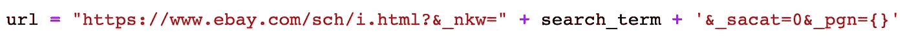
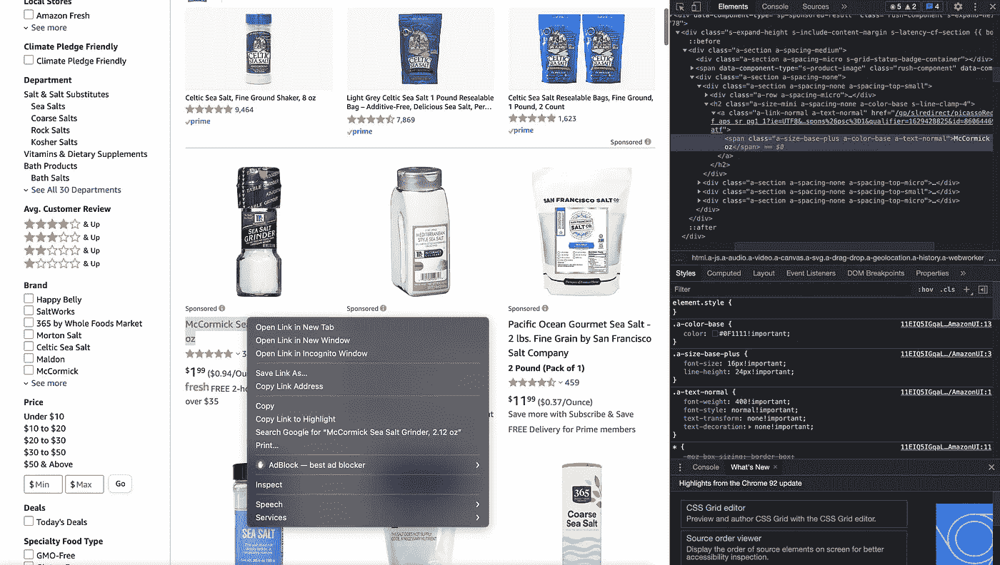
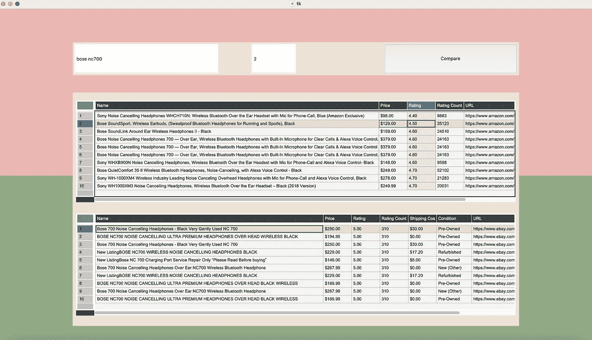

# 如何使用 Selenium 和 TkInter 创建电子商务比价应用程序

> 原文：<https://pub.towardsai.net/how-to-create-an-e-commerce-price-comparison-app-using-selenium-and-tkinter-f4a4a16ab2a1?source=collection_archive---------0----------------------->

## [网页抓取](https://towardsai.net/p/category/web-scraping)

约翰·施诺布里奇在 [Unsplash](https://unsplash.com/) 上的照片

# 动机

从我多年热衷于电子商务的经历来看，我注意到在购买感兴趣的产品时会有一些不便。其中一个耗时的问题是找到所述产品的最佳价值。只需在这些电子商务网站上查询一次，我们就会发现自己在过多的商品中滚动，以最低的价格找到评分最高、评论最积极的商品。网上购物有如此多的选择，以至于我们经常对打开的标签和“比较价格”按钮(有时甚至不存在)的数量感到慌乱。

例如，考虑买一副耳机。你花了大量的时间研究这个项目的品牌、规格、利弊，直到你选择一个满足你的需求。在最终挑选了一个之后，你面临着一个同样艰巨的任务:找出从哪家商店购买该商品。一些商店以 50 美元的折扣出售它，而其他商店则没有。其他卖家提供更大的折扣，尽管他们的卖家评级和你想要的一样高。差异继续增加，当你做一个简单的购买时，你会变得更加困惑。如果我们能自动完成这一过程，找到一个最优的购买方案，会怎么样呢？

随着我们对电子商务的依赖与日俱增，拥有一种工具来自动化基于评级、评级数量和价格的价格比较的费力过程将是一笔巨大的财富。在本文中，我将向您展示如何用 Python 来构建一个能够做到这一点的 web scraper！

# 我们的待办事项列表

在我们开始之前，让我们概述一下我们到底要做什么。我将这个项目的范围限制在亚马逊和易贝，可以说是当今最受欢迎的两家电子商务公司。到本文结束时，将:

*   使用 Python 中的 **BeautifulSoup** 和 **Selenium** 库从亚马逊和易贝抓取数据
*   根据评级数量和价格对数据集进行排序，获得最佳的前 10 项潜在购买
*   使用用户友好的 TkInter 库创建一个 GUI，将所有这些放在一起

使用 Python，我们可以筛选出大量多余的交易，否则你会花时间去寻找。这不仅节省了你的时间，也节省了金钱！

> “小心小开支；一个小漏洞会使一艘大船沉没”——本杰明·富兰克林

# 刮刀

对于这个分析，我们首先构建两个解析器，分别用于每个网站。首先，我们希望用户输入一个搜索词以及一个页面范围来抓取。例如，如果我们寻找“海盐”,并输入页面范围 5，我们会希望我们的脚本访问亚马逊/易贝网页，并反复抓取海盐信息，直到到达第 5 页的结尾。

既然我们心中有了目标，让我们开始编写代码吧。我们必须首先转换搜索词的语法，以匹配 URL 的构造方式。我们可以得到一个通用的基本 URL，使用网站域名，后跟格式化的搜索词，再后跟我们想要抓取的页码。使用这个特定的 URL，我们可以使用 Selenium API 将我们的 scraper 指向它，并获得我们想要的任何信息。

基本 URL 后跟搜索词和花括号，按页码格式化。作者图片

网页的每个项目都是由 HTML 属性构成的。在找到与该页面上的项目对应的特定标签后，我们可以获取属于这些标签的所有项目。使用 BeautifulSoup API，我们可以直接访问网页的 HTML 源代码。知道要定位哪些标签是一个反复试验的过程。首先打印出基于标记的查询返回的 HTML 代码，并修改它们，直到得到您正在寻找的项目。

转到任何网页，右键单击任何内容并选择“检查”来查看底层的 HTML 代码。作者图片

在我的实现中，我使用 Chrome 作为默认浏览器。无论您选择什么浏览器，请确保更改您在 Selenium 中使用的 web 驱动程序类型。既然您的解析器知道了要访问哪个链接，我们就面临下一个问题:遍历不同的页面。解决这个问题的方法很简单。在上面的图片中，我们在最后放置了花括号来按照页码进行格式化。现在，我们所要做的就是建立一个包含解析器代码的 for 循环，在每次迭代中按页码格式化，并抓取该页面上的所有产品信息。我们使用 [BeautifulSoup](https://www.crummy.com/software/BeautifulSoup/bs4/doc/) API 中的*‘find’*函数来抓取包含这些信息的 HTML 标签。

有了这个，我的解析器就能够提取页面上每个产品的名称、价格、条件、URL、运费、平均评分和许多评分。有些情况下，我们会对这些信息位进行空白查询。因此，有必要使用 *try* 语句来规避错误。我创建了列表来存储解析后的信息，确保在缺少信息时也有占位符。这样做是为了使每个列表保持信息的一致性。稍后，我们可以很容易地通过索引删除观察值。

希望上面的解释本身有意义，但如果没有意义，这里是易贝解析器的代码！通读我与代码一起写的注释将更好地说明我之前提出的观点。

当创建 Amazon 解析器时，同样的逻辑也适用。如果你想查看它的代码，你可以在我的 GitHub repo [这里](https://github.com/vnnair/Amazon-Ebay-Webscraper)。现在我们有了两个解析器，我们需要一个外部函数来获取结果数据集并对它们进行预处理。我已经在 GitHub 资源库中的一个名为*‘main’*的函数中做到了这一点。在该函数中，我将字符串变量转换为数字变量，以便根据每个产品的评级数量进行排序。这是我在查询中筛选前 10 项时选择的指标。这一指标可以根据您的喜好轻松调整。

# 创建 GUI

现在我们已经构建了解析器，让我们试着把它变成一个其他人可以使用的工具！我用 Python 中的 [TkInter](https://docs.python.org/3/library/tk.html) 库创建了一个 GUI。这个 API 为我们提供了一个方便有效的方法来为 scraper 创建一个友好的用户界面。

这个库中有几个模块可以用来在界面中获取小部件。对于这个项目，我们利用四个:

*   **tk。Canvas:** 使用它来设置应用程序窗口的尺寸
*   **tk。Frame:** 创建一个矩形区域，您可以在其中放置自己选择的小部件
*   **tk。条目:**创建一个文本框，用户可以在其中输入文本数据
*   **tk。按钮:**创建一个按钮，点击它可以触发一个功能(在我们的例子中，这将是 scraper 功能)

注意调整小部件布局的三种方式也很重要。TkInter 库有三个可以利用的库:place、pack 和 grid。对于我们的项目，我们专门使用了*【place】*方法。在我看来，这是排列小部件最直接的方式，因为该方法允许绝对的 *x* 和- *y* 值作为输入。如果你对另外两种方法感兴趣，你可以在这里阅读它们。

在我的应用程序中，我创建了六个框架。一个是搜索栏，用户可以在那里输入感兴趣的产品。其中两个用作画布的背景。一个框架包含另外两个子框架，显示从抓取脚本获得的两个数据集。然后，我创建了两个条目工具栏:一个用于产品名称，另一个用于获取产品数据的最大页码。最后，我添加了一个“比较”按钮。当点击时，它触发前面讨论过的*“main”*函数，为我们提供两个排序的数据帧。

让我们看看应用程序的运行。我搜索过 Bose nc700 耳机作为例子。我提示应用程序抓取易贝和亚马逊的前两页，并根据我的功能进行排序，返回这两个网站的前 10 个查询。这是我们的最终产品:

应用程序界面和输出示例。图片作者。

根据排序后的数据框，我们看到易贝和亚马逊上该产品的前 10 名选择在价格上没有太大差异。因此，从任何一个网站购买就足够了，除非你想节省 50 美元左右购买翻新产品。

现在您已经知道了这是如何工作的，您可以构建自己的解析器，并合并更多您想要比较的网站。然而，您查询的 HTML 标签和网站 URL 将需要稍微不同的查询。这样做的时候，仔细检查网站的属性，尝试不同的 HTML 查询，直到获得您想要的信息。

正如你所看到的，这个工具在比较不同网站上的产品交易时非常有用，可以节省很多时间。我们不再需要浏览各种标签和滚动浏览无穷无尽的产品，我们的指尖就有最好的购买选择！

一如既往，如果您有任何问题或建议，请随时联系我们。感谢您的阅读！