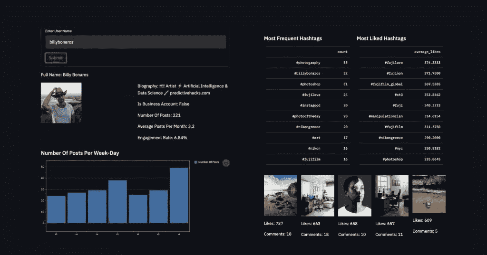
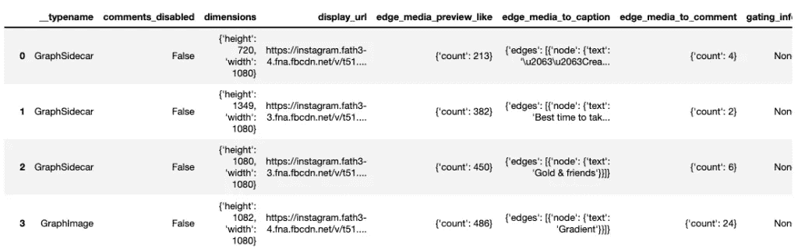
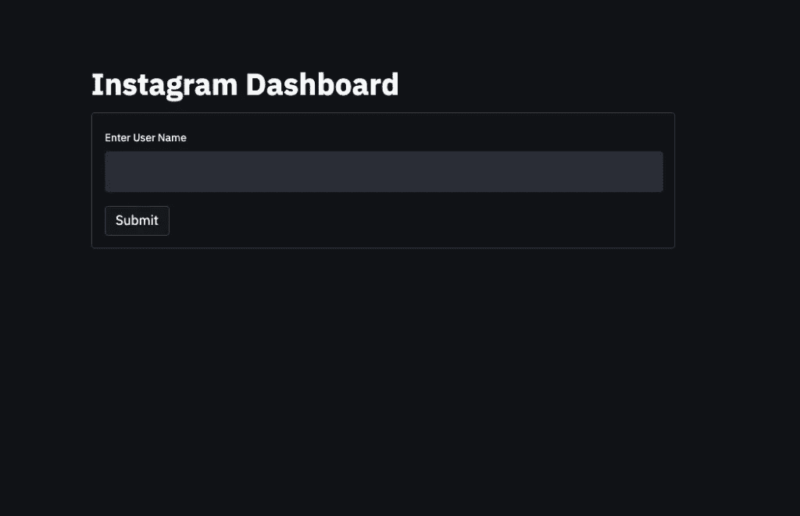
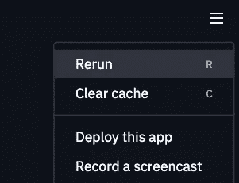
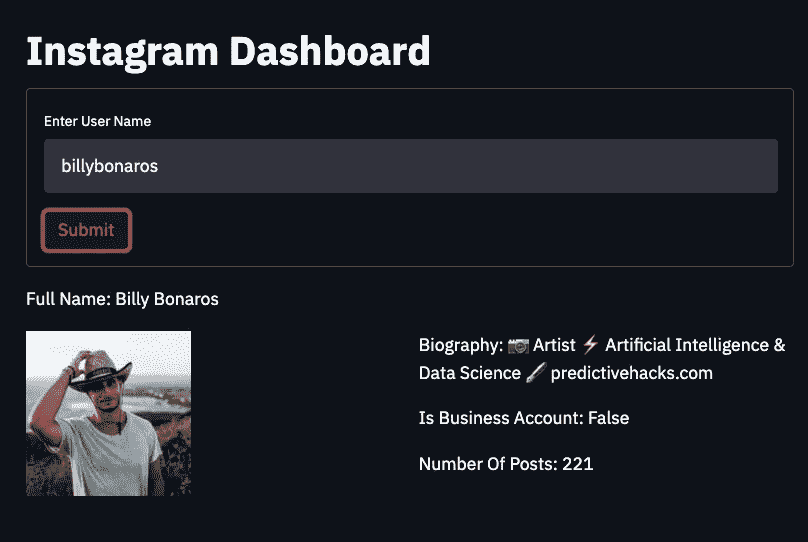
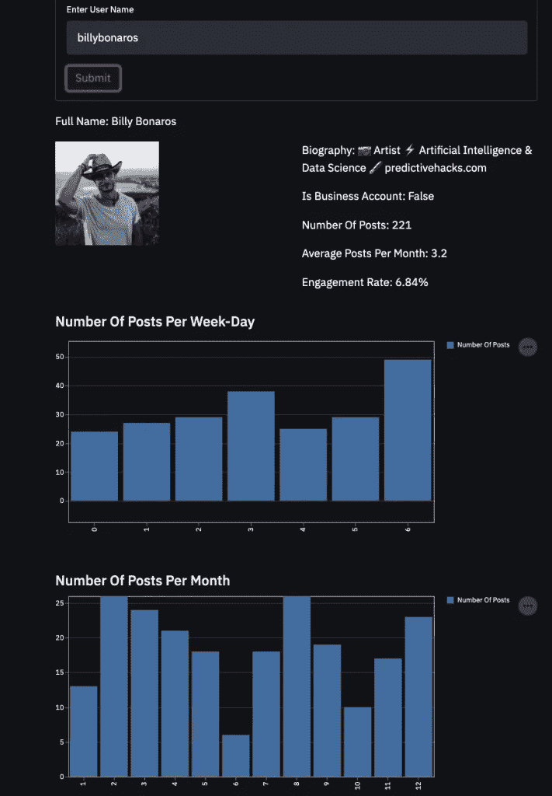
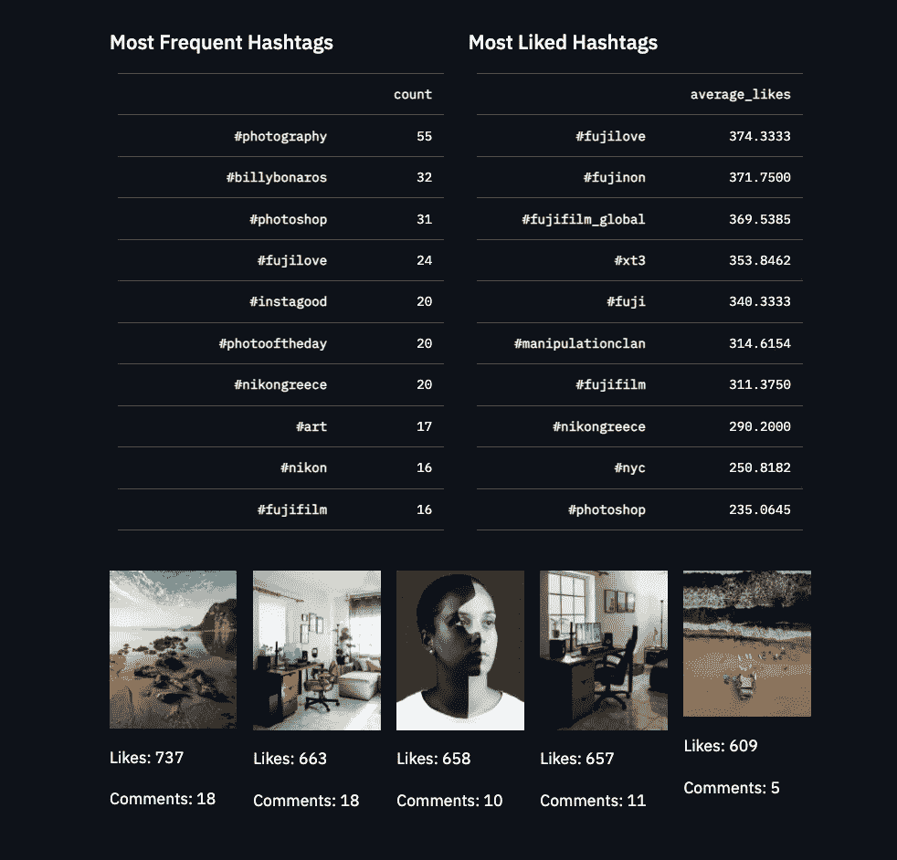
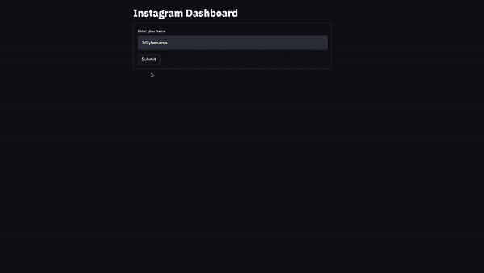

# 如何使用 Python 和 Streamlit 创建 Instagram Profile Analyzer 应用程序

> 原文：<https://pub.towardsai.net/how-to-create-an-instagram-profile-analyzer-app-using-python-and-streamlit-11107046e85b?source=collection_archive---------1----------------------->

## [编程](https://towardsai.net/p/category/programming)

## 创建 Python 应用程序的最简单方法



作者图片

Streamlit 是一个很棒的库，可以帮助我们用最少的努力创建 python 应用程序。它不仅简单，而且它的用户界面非常漂亮，看起来非常专业。我们对这篇文章的想法是创建一个 Instagram 仪表板，上面有一些关于用户资料的描述性统计数据，如最常出现的标签、最喜欢的文章、参与度等。话虽如此，我们需要一个应用程序，它将用户名作为输入，并从 Instagram 中抓取其信息，以返回最终的仪表板。

# 从 Instagram 获取数据

这是最难的部分，因为 Instagram 不喜欢被人刮。幸运的是，有一个名为 [instagram-scraper](https://github.com/arc298/instagram-scraper) 的库，这是一个用 Python 编写的命令行应用程序，可以毫无问题地抓取 instagram 个人资料(只是不要太频繁地使用)。

安装:

```
pip install instagram-scraper
```

用法:

```
instagram-scraper "{username}" --profile-metadata  --media-metadata  --media-types none
```

使用上面的命令，将创建一个名为 username 的文件夹，其中有一个包含我们的数据的 JSON 文件。请记住，我们需要在命令行中运行代码。

让我们用[我的 instagram 账户:](https://www.instagram.com/billybonaros)来运行一个例子

```
instagram-scraper "billybonaros" --profile-metadata  --media-metadata  --media-types none
```

我们可以使用 python 打开 JSON 文件，看看我们得到了什么。

`js **=**` `json.load(open('billybonaros/billybonaros.json', encoding**=**'utf-8'))`

`js.keys()`

```
dict_keys(['GraphImages', 'GraphProfileInfo'])
```

**图形图像**包含帖子的数据，如赞、评论等。并且 **GraphProfileInfo** 保存用户的信息。

`js['GraphProfileInfo']`

```
{'created_time': 1286323200,
 'info': {'biography': 'Artist \nArtificial Intelligence & Data Science\npredictivehacks.com',
  'followers_count': 3486,
  'following_count': 2681,
  'full_name': 'Billy Bonaros',
  'id': '43176775',
  'is_business_account': False,
  'is_joined_recently': False,
  'is_private': False,
  'posts_count': 221,
  'profile_pic_url': 'https://instagram.fath3-3.fna.fbcdn.net/v/t51.2885-19/s150x150/181615592_215309037065818_7520216790200441065_n.jpg?tp=1&_nc_ht=instagram.fath3-3.fna.fbcdn.net&_nc_ohc=ICw1tUaN_LkAX-GFvSB&edm=ABfd0MgBAAAA&ccb=7-4&oh=062eef9cafacf4056c1d485e86f4b481&oe=60C57270&_nc_sid=7bff83'},
 'username': 'billybonaros'}
```

我们将把**图形图像**数据转换成熊猫数据帧，这样我们可以更容易地使用它。

```
df**=**pd.DataFrame(js['GraphImages'])df
```



作者图片

如你所见，我们得到了许多有用的数据。现在，让我们开始构建我们的应用程序。

# 构建我们的 Streamlit 应用

# 发件人

在我们继续之前，确保您已经使用以下命令安装了 [Streamlit](https://streamlit.io/) 。

```
pip install streamlit
```

首先创建一个. py 文件并导入这个项目所需的库。让我们把我们的文件叫做 **main.py** 。

```
import streamlit as st

import requests
import numpy as np
import pandas as pd
import os
import json
import pandas as pd
import numpy as np
import re
from datetime import datetime
import string
```

现在，我们必须给我们的应用程序一个标题并创建表单。

```
st.title('Instagram Dashboard')

with st.form(key='my_form'):

#st.text_input creates a form that gets a text input
    username = st.text_input(label='Enter User Name')

#st.form_submit_button creates a submit button
    submit_button = st.form_submit_button(label='Submit')
```

信不信由你，我们的登陆页面已经准备好了！我们可以添加许多其他类型的表单，但我们只需要一个文本输入和提交按钮。您可以在此备忘单中找到更多信息。

要运行我们的应用程序，您只需在项目目录中键入以下内容:

```
streamlit run main.py
```

如果您得到以下输出，这意味着您的应用程序正在运行。

```
You can now view your Streamlit app in your browser. Local URL: http://localhost:8501
  Network URL: [http://192.168.1.7:8501](http://192.168.1.7:8501)
```

要访问该应用程序，请前往**[**http://localhost:8501**](http://localhost:8501/)**

****

**作者图片**

**很酷，对吧？**

# **输出**

**要继续，我们只需确定提交按钮是否被按下。这可以通过使用 if 语句来完成，然后我们将在其中添加输出代码。**

**Streamlit 允许您添加许多[不同类型的输出](https://share.streamlit.io/daniellewisdl/streamlit-cheat-sheet/app.py)，但我们将仅使用以下内容:**

*   **文本:st.write('文本')**
*   **标题:st.title('文本')**
*   **Header: st.header('Text ')**
*   **副标题:st.subheader(“文本”)**
*   **数据框架:st.table(数据框架)**
*   **Image: st.image('image_path ')**
*   **条形图:条形图表(数据)**

**首先，让我们从 **js['GraphProfileInfo']** 中获取数据，并显示用户的**全名**、**个人简介**、**帖子数量**以及是否为**商业帐户**。然后我们可以从 **profile_pic_url** 下载图片并显示用户的个人资料图片。**

```
if submit_button:

#before we run the scraping script,
#we are checking if the directory exists so we will not scrape the data
#from a user that we already have the data
#this will help us test the app better because
#the data will load fast and we will not get banned from Instagram
#by scraping too frequently

    if not os.path.exists(f'{username}'):
        os.system(f'instagram-scraper "{username}" --profile-metadata  --media-metadata  --media-types none')

    js = json.load(open(f'{username}/{username}.json', encoding='utf-8'))
    df=pd.DataFrame(js['GraphImages'])

#get the profile_pic_url from json
    prof_pic=js['GraphProfileInfo']['info']['profile_pic_url']

#download the image in a folder called static I created
    response = requests.get(prof_pic)
    filename="static/image.jpg"
    with open(filename, "wb") as f:
        f.write(response.content)

#show the full name 
    st.write(f"Full Name: {js['GraphProfileInfo']['info']['full_name']}")

#we can format the output into as many columns as we want using columns
#and instead of using st. we are using column_name. to show the outputs in the
#selected column. Here we are splitting the outputs into 2 columns
#in col1 one will be the image and in col2 the info.

    col1, col2 = st.columns(2)
    col1.image(filename)
    col2.write(f"Biography: {js['GraphProfileInfo']['info']['biography']}")
    col2.write(f"Is Business Account: {js['GraphProfileInfo']['info']['is_business_account']}")
    col2.write(f"Number Of Posts: {js['GraphProfileInfo']['info']['posts_count']}")
```

**Streamlit 的好处在于，每次更改后，您不必重新运行 **streamlit run main.py** ，而是只需在右边的角落按下重新运行即可。**

****

**作者图片**

**让我们重新运行应用程序，再次提交用户名。**

****

**作者图片**

**接下来，我们可以应用一些数据操作技术，从包含帖子信息的数据帧中获取赞、日期、评论和标签。还有，我们可以在 col2 中加入参与度(**((total _ likes+total _ comments)/posts)/followers**)和每月平均发帖数。**

```
#number of likes
df['likes']=df['edge_media_preview_like'].apply(lambda x: x['count'])
#number of comments
df['comments']=df['edge_media_to_comment'].apply(lambda x: x['count'])

#transform the timestamp to datetime object
df['date']=df['taken_at_timestamp'].apply(datetime.fromtimestamp)

#extract dayofweek, month, week, year, ym 
df['dayofweek']=df['date'].dt.dayofweek
df['month']=df['date'].dt.month
df['week']=df['date'].dt.week
df['year']=df['date'].dt.year
df['ym']=df['year'].astype(str)+df['month'].astype(str)

engagement_rate=(((df['likes'].sum()+df['comments'].sum())/len(df))/js['GraphProfileInfo']['info']['followers_count'])*100

col2.write(f"Average Posts Per Month: {round(df.groupby('ym').size().mean(),2)}")
col2.write(f"Engagement Rate: {round(engagement_rate,2)}%")
```

**我们可以在仪表板上添加一些图表，比如每周的文章数量和每月的文章数量。**

```
x=df.groupby('dayofweek').size()
st.subheader('Number Of Posts Per Week-Day')
st.bar_chart(pd.DataFrame(x).rename(columns={0: 'Number Of Posts'}))

x=df.groupby('month').size()
st.subheader('Number Of Posts Per Month')
st.bar_chart(pd.DataFrame(x).rename(columns={0: 'Number Of Posts'}))
```

****

**作者图片**

# **我的最终应用**

**使用我们上面讨论的相同技术，我创建了下面的应用程序。我添加了最频繁和最喜欢的标签和最喜欢的帖子。此外，由于 Instagram 的限制，当抓取脚本无法工作时，我会添加一条错误消息。**

```
import streamlit as st

import requests
import numpy as np
import pandas as pd
import os
import json
import pandas as pd
import numpy as np
import re
from datetime import datetime
import string

st.title('Instagram Dashboard')

with st.form(key='my_form'):
    username = st.text_input(label='Enter User Name')
    submit_button = st.form_submit_button(label='Submit')

import os

if submit_button:
    if not os.path.exists(f'{username}'):
        os.system(f'instagram-scraper "{username}" --profile-metadata  --media-metadata  --media-types none')
    try:
        js = json.load(open(f'{username}/{username}.json', encoding='utf-8'))

        df=pd.DataFrame(js['GraphImages'])

        prof_pic=js['GraphProfileInfo']['info']['profile_pic_url']

        response = requests.get(prof_pic)
        filename="static/image.jpg"
        with open(filename, "wb") as f:
            f.write(response.content)

    #data
        df['likes']=df['edge_media_preview_like'].apply(lambda x: x['count'])

        df['comments']=df['edge_media_to_comment'].apply(lambda x: x['count'])

        engagement_rate=(((df['likes'].sum()+df['comments'].sum())/len(df))/js['GraphProfileInfo']['info']['followers_count'])*100

        df['date']=df['taken_at_timestamp'].apply(datetime.fromtimestamp)

        df['dayofweek']=df['date'].dt.dayofweek
        df['month']=df['date'].dt.month
        df['week']=df['date'].dt.week
        df['year']=df['date'].dt.year
        df['ym']=df['year'].astype(str)+df['month'].astype(str)

        df['dayofweek']=df['dayofweek'].replace([0,1,2,3,4,5,6],['Mon.', 'Tue.', 'Wed.','Thu.','Fri.','Sat.','Sun.'])

        col1, col2 = st.columns(2)
        col1.image(filename)
        col2.write(f"Full Name: {js['GraphProfileInfo']['info']['full_name']}")
        col2.write(f"Biography: {js['GraphProfileInfo']['info']['biography']}")
        col2.write(f"Is Business Account: {js['GraphProfileInfo']['info']['is_business_account']}")
        col2.write(f"Number Of Posts: {js['GraphProfileInfo']['info']['posts_count']}")
        col2.write(f"Average Posts Per Month: {round(df.groupby('ym').size().mean(),2)}")
        col2.write(f"Engagement Rate: {round(engagement_rate,2)}%")

        x=df.groupby('dayofweek').size()
        st.subheader('Number Of Posts Per Week-Day')
        st.bar_chart(pd.DataFrame(x).rename(columns={0: 'Number Of Posts'}))

        x=df.groupby('month').size()
        st.subheader('Number Of Posts Per Month')
        st.bar_chart(pd.DataFrame(x).rename(columns={0: 'Number Of Posts'}))

        def get_caption(x):
            try:
                return(x['edges'][0]['node']['text'])
            except:
                return('')

        df['caption']=df['edge_media_to_caption'].apply(get_caption)

        df['hashtags']=df['caption'].apply(lambda x: re.findall("(#\w+)",x))

        hashtags=df[['hashtags','likes']].explode('hashtags').groupby('hashtags').agg({'likes':['count','mean']})
        hashtags.columns=['count','average_likes']
        most_liked_hashtags=hashtags.query('count>10').sort_values('average_likes',ascending=False)

        col3, col4 = st.columns(2)
        col3.subheader('Most Frequent Hashtags')
        col3.table(hashtags.sort_values('count',ascending=False)[['count']].head(10))

        col4.subheader("Most Liked Hashtags")
        col4.table(most_liked_hashtags.sort_values('average_likes',ascending=False)[['average_likes']].head(10))

        topurls=list(df.sort_values('likes',ascending=False)['display_url'].head())

        toplikes=list(df.sort_values('likes',ascending=False)['likes'].head())
        topcomments=list(df.sort_values('likes',ascending=False)['comments'].head())

        n=1
        for i in topurls:
            response = requests.get(i)
            filename=f"static/{n}.jpeg"
            with open(filename, "wb") as f:
                f.write(response.content)
            n+=1

        col5,col6,col7,col8,col9=st.columns(5)
        col5.image("static/1.jpeg")
        col5.write(f"Likes: {toplikes[0]}")
        col5.write(f"Comments: {topcomments[0]}")

        col6.image("static/2.jpeg")
        col6.write(f"Likes: {toplikes[1]}")
        col6.write(f"Comments: {topcomments[1]}")

        col7.image("static/3.jpeg")
        col7.write(f"Likes: {toplikes[2]}")
        col7.write(f"Comments: {topcomments[2]}")

        col8.image("static/4.jpeg")
        col8.write(f"Likes: {toplikes[3]}")
        col8.write(f"Comments: {topcomments[3]}")

        col9.image("static/5.jpeg")
        col9.write(f"Likes: {toplikes[4]}")
        col9.write(f"Comments: {topcomments[4]}")   

    except:
        st.error('Instagram limit is reached.')
```

****

**作者图片**

****

**作者图片**

# **总结一下**

**Streamlit 是创建 web 应用程序的简单而专业的方法。这篇文章的目的是让你发挥你的想象力来创建你自己的强大的应用程序。用它做实验，[用机器学习](https://predictivehacks.com/feature-importance-in-python/)，[得到帖子图片的主色](https://predictivehacks.com/most-dominant-color-of-an-image/)，[找到最佳用词](https://predictivehacks.com/how-to-get-a-sentiment-score-for-words-with-naive-bayes/)等等。**

***最初发表于*[*https://predictivehacks.com。*](https://predictivehacks.com/how-to-create-an-instagram-profile-analyzer-app-using-python-and-streamlit/)**