# 如何在 Azure Cloud 上创建和删除 SQL 数据库

> 原文：<https://pub.towardsai.net/how-to-create-and-delete-sql-database-on-azure-cloud-c258106eba6?source=collection_archive---------1----------------------->

## 数据科学家的概念

图像[来源](https://pdvtechnocrats.com/azure-cloud/cloud-microsoft-azure/)

## 介绍

要实现数据分析、数据库处理和机器学习，数据科学在云上是超级容易和灵活的。在本文中，我们将尝试用下面的简单步骤来创建和删除 SQL 数据库。

1.  首先，我们需要开一个 Azure 账户。
2.  Azure 仪表盘将如下所示。

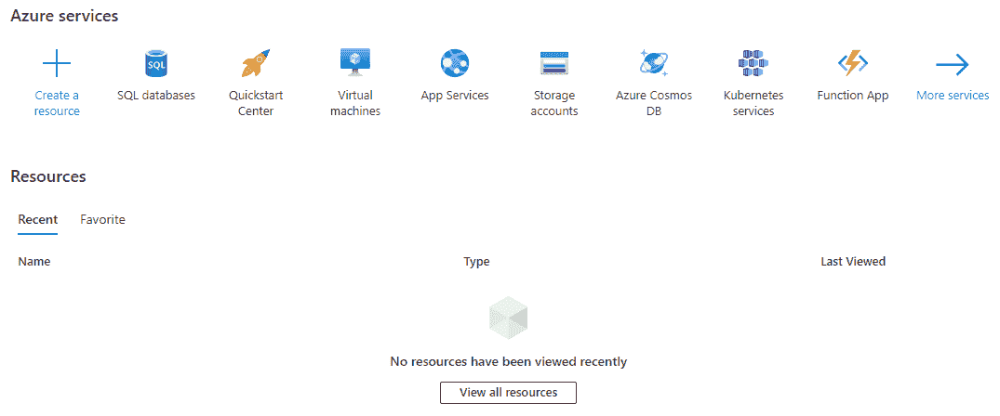

作者的一幅图像

## 找到 SQL 数据库的许多选项，首先，阅读下面几点。

3.我们可以在图像中看到 SQL 数据库徽标，然后单击该徽标。

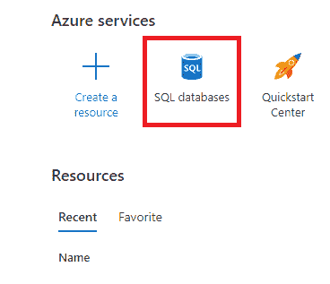

作者的一幅图像

4.如果 SQL 徽标没有显示在仪表板中，那么我们可以搜索选项。

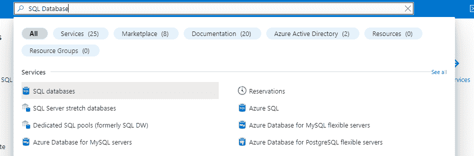

作者的一幅图像

5.现在，我们将使用一个普通的 SQL 数据库。

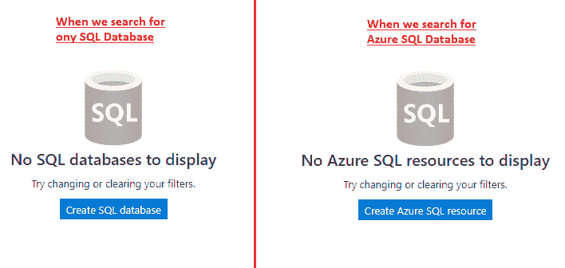

作者的一幅图像

6.我们还可以使用 Create a Resource 找到 SQL 数据库。

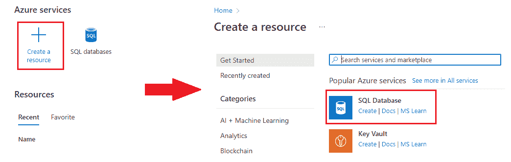

作者的一幅图像

7.即使徽标没有出现，也可以查看更多所有服务，然后转到数据库选项并单击 SQL 数据库。

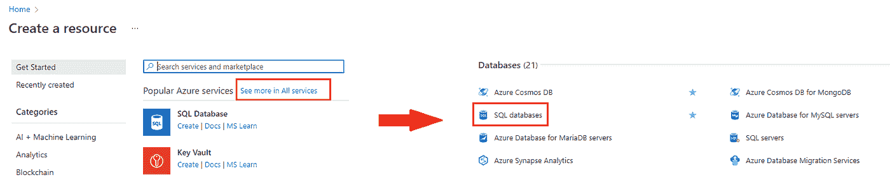

作者的一幅图像

8.现在，点击 create 按钮开始在 Azure 中创建 SQL 数据库。

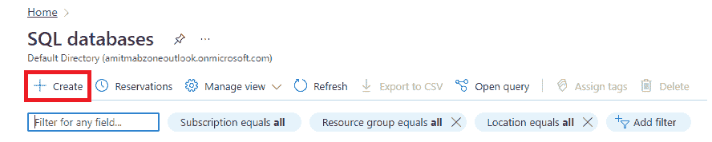

作者的一幅图像

 [## 如何用借记卡开立 Azure 云账户

### 适用于所有数据科学家的简单易行的流程

amitprius.medium.com](https://amitprius.medium.com/how-to-open-an-azure-cloud-account-with-debit-card-87e0d0dd66c) 

9.现在，我们需要填充信息来创建一个 SQL 数据库。

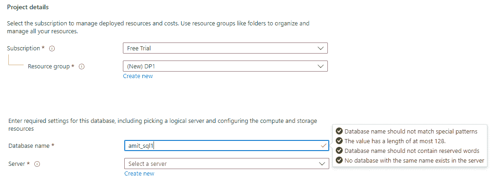

作者的一幅图像

10.要托管数据库，我们需要一个服务器，单击创建服务器后，我们需要填写 SQL server 的信息，然后单击确定按钮。服务器名称在全球范围内应该是唯一的。

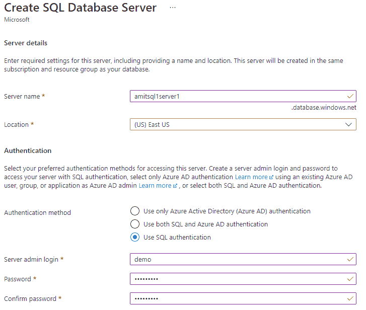

作者的一幅图像

11.页面返回到数据库信息。我们需要在数据库级别使用计算和存储能力，而不是在服务器级别。点击配置数据库，选择最低收费的基本。

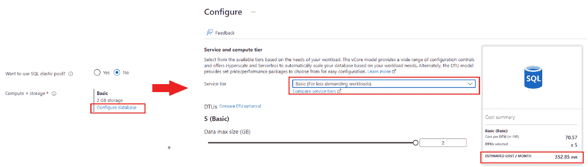

作者的一幅图像

我们可能会在配置中看到 DTU 这个词，DTU 是一个数据传输单元，用来测量速度、读、写和操作。

12.现在，单击“查看+创建”按钮，验证信息，然后单击“创建”按钮。

13.单击 create 按钮后，需要几分钟时间来部署或完成 SQL 数据库。

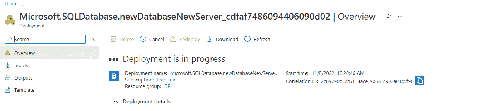

作者的一幅图像

上图显示部署正在进行中。但是在 2-3 分钟后，部署就完成了，如下图所示。

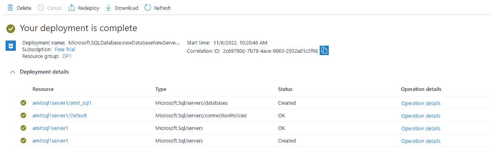

作者的一幅图像

## 使用后删除资源

资源我们创建了 SQL 数据库和 SQL 服务器。它们将位于资源组文件夹中，如下图所示。

1.  转到主页或 azure 仪表板，搜索资源组，我们可以看到我们在开始时创建的资源名称。

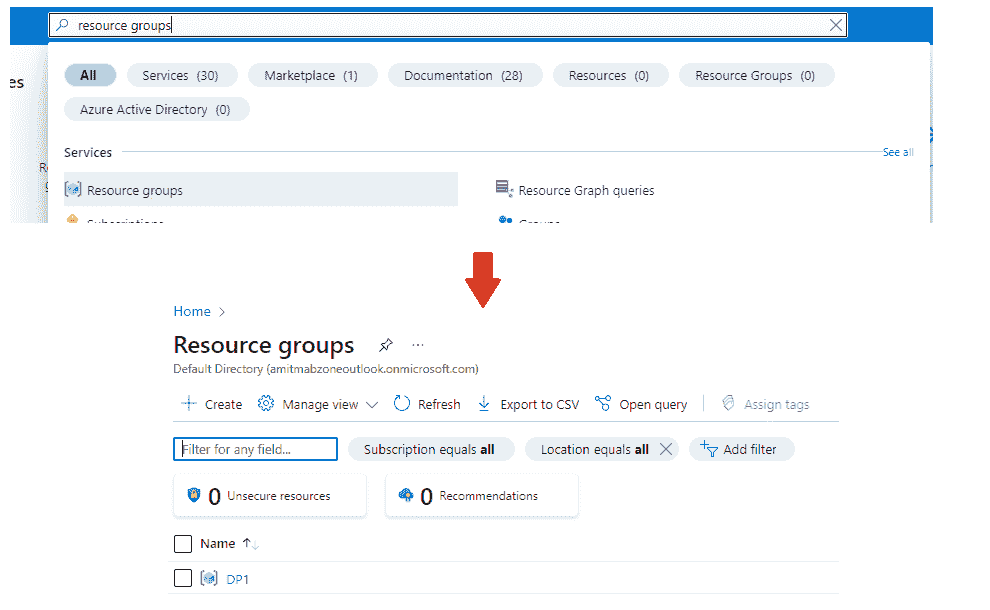

作者的一幅图像

2.我们可以在资源文件夹中看到我们的资源。

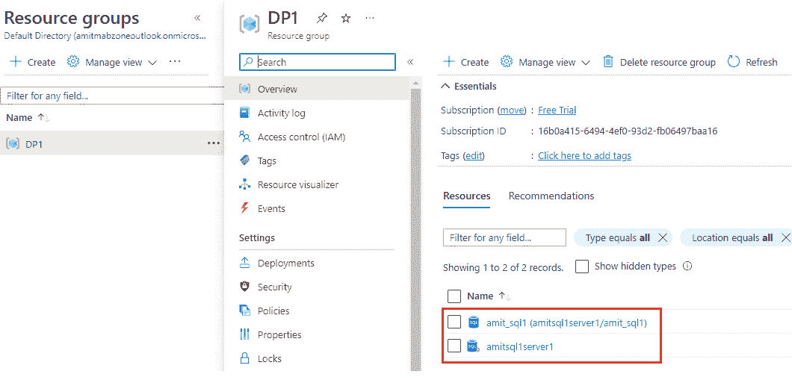

作者的一幅图像

3.要删除所有资源，我们需要单击删除资源组按钮，我们的资源将被删除。

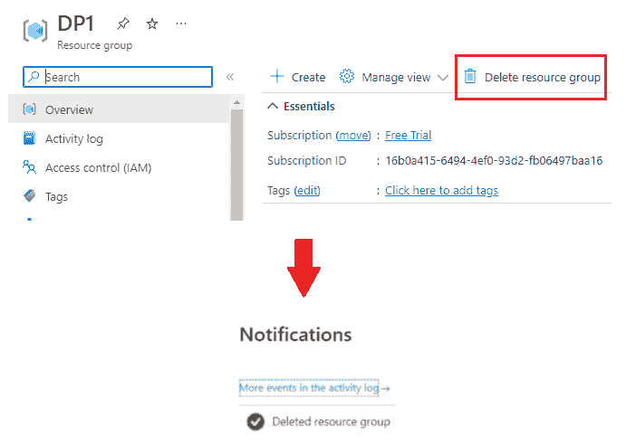

作者的一幅图像

我希望你喜欢这篇文章。通过我的 [LinkedIn](https://www.linkedin.com/in/data-scientist-95040a1ab/) 和 [twitter](https://twitter.com/amitprius) 联系我。

# 推荐文章

[1。Python](/15-most-usable-numpy-methods-with-python-4d20eb93e149?sk=911d2bebf042b148be8f366b907af158)
2 中最有用的 NumPy 方法。 [NumPy:图像上的线性代数](/numpy-linear-algebra-on-images-ed3180978cdb?source=friends_link&sk=d9afa4a1206971f9b1f64862f6291ac0)
3。[Python 中的异常处理概念](/exception-handling-concepts-in-python-4d5116decac3?source=friends_link&sk=a0ed49d9fdeaa67925eac34ecb55ea30)
4。[熊猫:处理分类数据](/pandas-dealing-with-categorical-data-7547305582ff?source=friends_link&sk=11c6809f6623dd4f6dd74d43727297cf)
5。[超参数:机器学习中的 RandomSeachCV 和 GridSearchCV](/hyper-parameters-randomseachcv-and-gridsearchcv-in-machine-learning-b7d091cf56f4?source=friends_link&sk=cab337083fb09601114a6e466ec59689)
6。[用 Python 充分解释了线性回归](https://medium.com/towards-artificial-intelligence/fully-explained-linear-regression-with-python-fe2b313f32f3?source=friends_link&sk=53c91a2a51347ec2d93f8222c0e06402)
7。[用 Python](https://medium.com/towards-artificial-intelligence/fully-explained-logistic-regression-with-python-f4a16413ddcd?source=friends_link&sk=528181f15a44e48ea38fdd9579241a78)
充分解释了 Logistic 回归 8。[使用 Numpy 与 Python](/data-distribution-using-numpy-with-python-3b64aae6f9d6?source=friends_link&sk=809e75802cbd25ddceb5f0f6496c9803)
9 进行数据分发。[Python 中 40 个最疯狂可用的方法](https://medium.com/pythoneers/40-most-insanely-usable-methods-in-python-a983c78f5bfd?sk=07df9058ea3e8c2fce4318a73cd8fce9)
10。[Python 中最常用的 20 种熊猫快捷方式](https://medium.com/pythoneers/20-most-usable-pandas-shortcut-methods-in-python-c9bc065ce11e?sk=1faf673d0cdfb46234975cbdeed12beb)