# 如何创建和使用多索引数据框架来扩展您的数据分析

> 原文：<https://pub.towardsai.net/how-to-create-and-use-multi-index-dataframe-to-scale-up-your-data-analysis-fa80ed025d42?source=collection_archive---------1----------------------->


由 [Unsplash](https://unsplash.com?utm_source=medium&utm_medium=referral) 上的 [Pacto Visual](https://unsplash.com/@pactovisual?utm_source=medium&utm_medium=referral) 拍摄的照片

## 多索引数据帧的详细信息:创建、切片、索引和分析

在大多数数据帧中，我们看到一个作为行标识符的索引。但是如果一个数据帧中有不止一个索引呢？多索引数据框架对于数据分析来说是好事还是令人困惑？事实上，如果你知道如何使用它们，它可以是一个非常好的数据分析。它让您可以更方便、更高效地分析数据。

要真正提高和扩大您数据分析技能，很重要的一点是要很好地了解多索引数据框架。在本文中我们将看到:

*如何创建多索引数据框架*

*如何使用多索引数据框架进行高效的数据分析。*

*在多索引数据帧上使用“groupby”和聚合函数。*

> 我还包括了上述三个主题的视频版本。如果你更喜欢视频教程，请随时观看视频版本。

让我们从创建多索引数据帧开始。作为数据分析师或数据科学家，我们不仅需要了解分析，还需要学习如何以有组织的方式存储数据。

## 如何创建多索引数据框架？

为了创建多索引数据框架，我将首先创建索引。我将生成一个双层索引。因此，索引看起来像这样:

```
import pandas as pd
import numpy as npindex = [('Bob', 2019), ('Bob', 2020),
        ('Lilly', 2019), ('Lilly', 2010),
        ('Shelly', '2019'), ('Shelly', 2020)]
```

该索引在第一层显示姓名，在第二层显示年份。

在上面的索引中，我们提到了六个人。这六个人的数学成绩列表如下:

```
Math = [98, 93, 78, 88, 92, 81]
```

我们已经准备好了索引和数据。我们将首先用这些数据制作一个系列:

```
pop = pd.Series(Math, index=index)
pop
```

输出:

```
(Bob, 2019)       98
(Bob, 2020)       93
(Lilly, 2019)     78
(Lilly, 2010)     88
(Shelly, 2019)    92
(Shelly, 2020)    81
dtype: int64
```

注意我们有每个人两次的分数。第一个是 2019 年，第二个是 2020 年。

在这里，我将添加一个分数信息，并制作一个包含数学分数和阅读分数的数据框架:

```
pop_df = pd.DataFrame({'math': pop,
                      'reading': [88, 81, 73, 81, 91, 94]})
pop_df
```

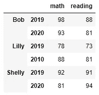

**我们走了很长一段路。下面是最直接的方法:**

```
df = pd.DataFrame(data,
                 index=[['Bob', 'Bob', 'Lilly', 'Lilly',
                        'Shelly', 'Shelly'], 
                        [2019, 2020, 2019, 2020, 2019, 2020]],
                  columns = ["Math", "Reading"]
                 )
```

它将产生和以前完全一样的结果。

下一个例子将展示如何拥有两级索引和两级列。首先，我这里有分数列表。**注意这个列表是二维的。**

```
scores = [[90, 67, 89, 76, 93, 90], 
          [90, 67, 89, 76, 93, 90], 
          [90, 67, 89, 76, 93, 90], 
          [90, 67, 89, 76, 93, 90], 
          [90, 67, 89, 76, 93, 90],
          [90, 67, 89, 76, 93, 90]]
```

在这里，我使用上面的分数列表制作数据框架。我们将设置两级索引和两级列:

```
pd.DataFrame(scores, 
             index = [['school1', 'school1', 'school2', 'school2', 'school3', 'school3'], [2019, 2020, 2019, 2020, 2019, 2020]],
             columns = [['7th grade', '7th grade', '7th grade', '8th grade', '8th grade', '8th grade'], ['math', 'reading', 'writing','math', 'reading', 'writing']]
            )
```

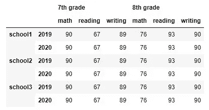

在这里，我们以一种非常有组织的方式存储了三所学校两年来 7 年级和 8 年级的数学、阅读和写作成绩。

以下是创建多索引数据帧的视频版本:

## 多索引数据帧的切片

在本次演示中，我们将使用一个**虚拟数据集，该数据集只能用于数据科学培训目的**。请随意从以下链接下载数据集:

 [## 考试分数

### 这是一个虚构的数据集，应仅用于数据科学培训目的。该数据集包括分数…

roycekimmons.com](http://roycekimmons.com/tools/generated_data/exams) 

首先导入数据集:

```
df **=** pd**.**read_csv('StudentsPerformance.csv')
df**.**head()
```

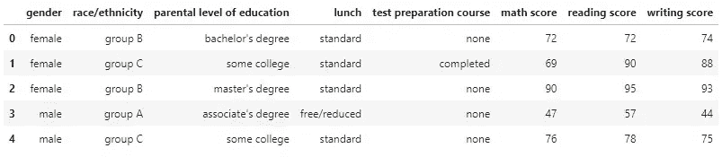

这个数据集现在只有一个数字序列号作为索引。让我们使用一些有意义的列作为索引。由于我们将处理多索引数据帧，我将在此使用五层索引:

```
mdf **=** df**.**set_index(['race/ethnicity', 'parental level of education', 'lunch','test preparation course','gender'])
```


我们有种族/民族、父母教育水平、午餐、备考课程和性别作为指标。

这些层可用于在不同条件下将数据集分割成粒度部分。接下来是一些例子。

首先，我们希望看到种族/民族仅为“B 组”的数据。

```
mdf**.**xs('group B')
```

以下是部分输出:

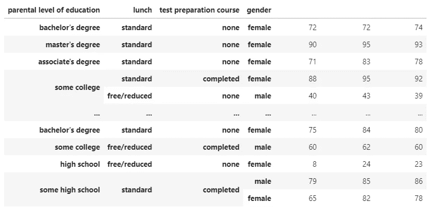

这是数据集的一部分，仅显示 B 组数据。**当我们应用种族/民族条件分割数据时，种族/民族不再显示为一个索引。**

在这里使用更多的条件进一步分割数据。这次我们将看到种族/民族为 B 组、父母教育水平为“某大学”、午餐为“标准”的学生的分数:

```
mdf**.**xs(('group B', 'some college', 'standard'))
```

这次我们可以分享全部产出。

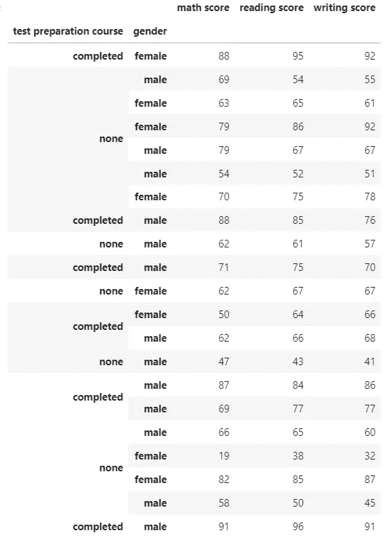

最后，让我们把更好的条件。在这里，我们将看到比率/种族为“B 组”、父母教育水平为“某大学”、“午餐为“标准”、备考课程已完成且性别为男性的学生的分数:

```
mdf**.**xs(('group B', 'some college', 'standard', 'completed', 'male'))
```

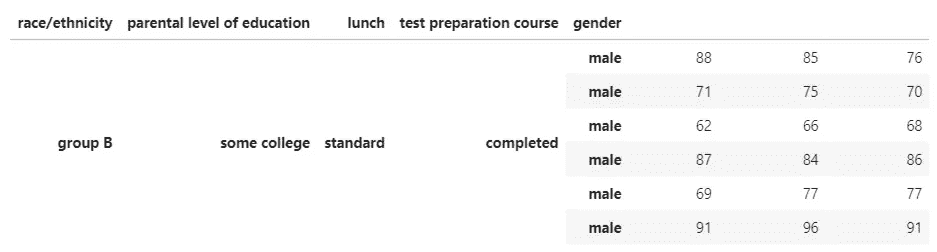

当索引值的使用顺序与数据集完全相同时，就不需要提及索引值是哪一级的了。您可以简单地使用您正在寻找的索引值。

但是，假设您只想找到备考课程已经完成的数据。你不关心种族/民族或父母的教育水平或午餐。在这种情况下，有必要直接提到级别号或级别。

这里我们想看的是备考课程完成的数据。备考课程是指数的第四级。所以，我们必须使用 level =3。**将种族/民族视为 0 级指标。**

```
mdf**.**xs('completed', level **=** 3)
```

部分输出:

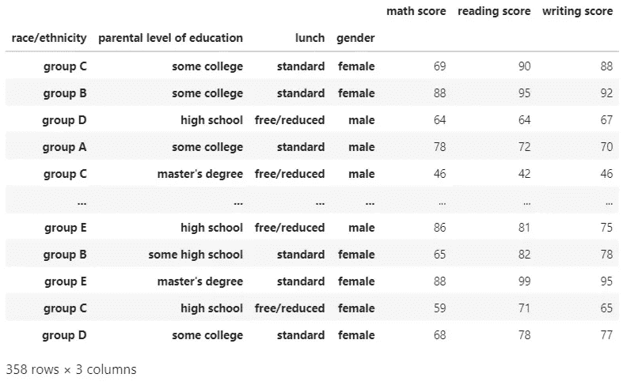

或者，您也可以明确地使用级别的名称，如下所示:

```
mdf**.**xs('completed', level **=** 'test preparation course')
```

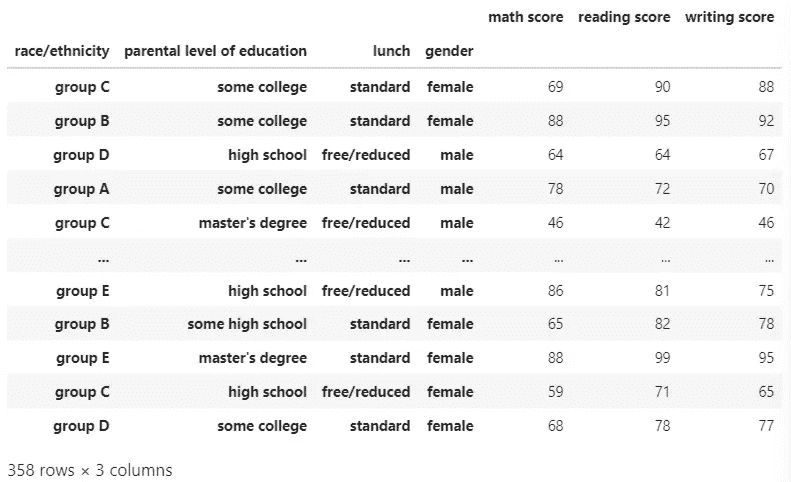

这里我使用了两个级别的指数:

```
mdf**.**xs(('group A', 'completed'), level **=** ['race/ethnicity', 'test preparation course'])
```

部分输出:

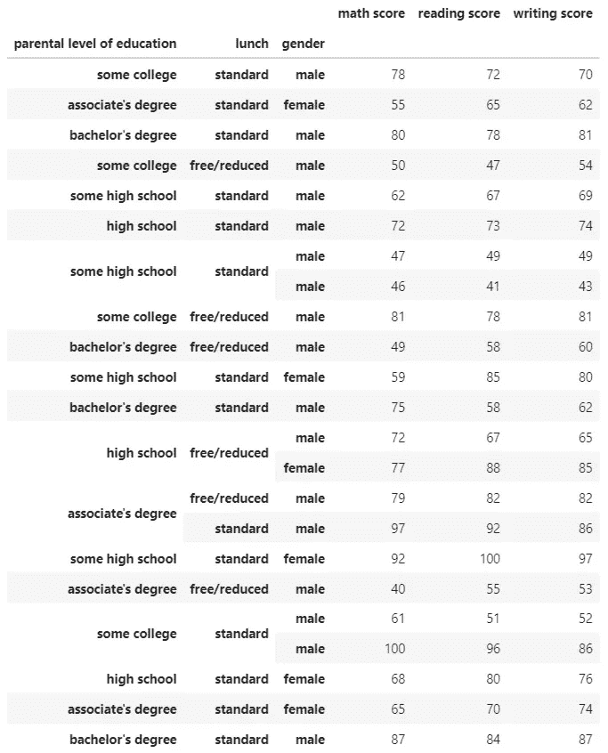

以下是切片多索引数据帧的视频版本:

在这里，你会发现另一个视频切片和索引使用。loc()、iloc()和 IndexSlice，我没有在本文中展示它们。请随意查看:

## 在多索引数据帧上使用“groupby”函数

我假设您还记得 groupby 函数对于数据分析是多么有用。在多索引数据帧上，它甚至更高效。

这里我得到了每个种族/民族的平均数学、阅读和写作分数:

```
**mdf.**groupby(level **=** 0)**.**mean()
```

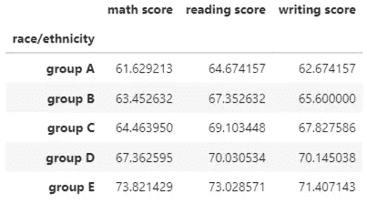

在这里，我们将向前推进一点，找到每个种族/民族的个体性别的平均分数。请记住，种族/民族是 0 级指标，性别是 4 级指标。

```
mdf**.**groupby(level **=** [0, 4])**.**mean()
```

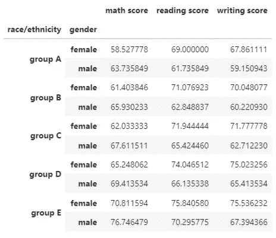

您也可以像这样使用索引级别的名称来获得相同的结果:

```
mdf**.**groupby(level **=** ['race/ethnicity', 'gender'])**.**mean()
```

在我们拿到所有三个分数之前。我们还可以提到我们希望在结果数据中看到的具体分数。我想得到每个种族/民族的每个性别的平均数学和写作分数:

```
mdf**.**groupby(level **=** ['race/ethnicity', 'gender'])['math score', 'writing score']**.**mean()
```

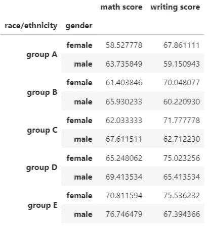

在上面的输出数据集中，我们只看到平均阅读和写作分数。接下来，我还会将中位数添加到输出数据集中:

```
mdf**.**groupby(level **=** ['race/ethnicity', 'gender'])['math score', 'writing score']**.**agg(['mean', 'median'])
```

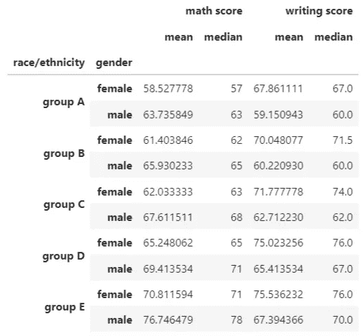

如果您需要不同分数的不同类型的聚合怎么办？例如，我在这里使用数学分数的平均值和中值，写作分数的最小值、最大值和标准值。

这里我们还使用了三个级别的指数:

```
mdf**.**groupby(level **=** ['race/ethnicity', 'parental level of education', 'gender'])['math score', 'writing score']**.**agg(
    {
        'math score': ['mean', 'median'],
        'writing score': ['min', 'max', 'std']
    }
)
```

部分输出:

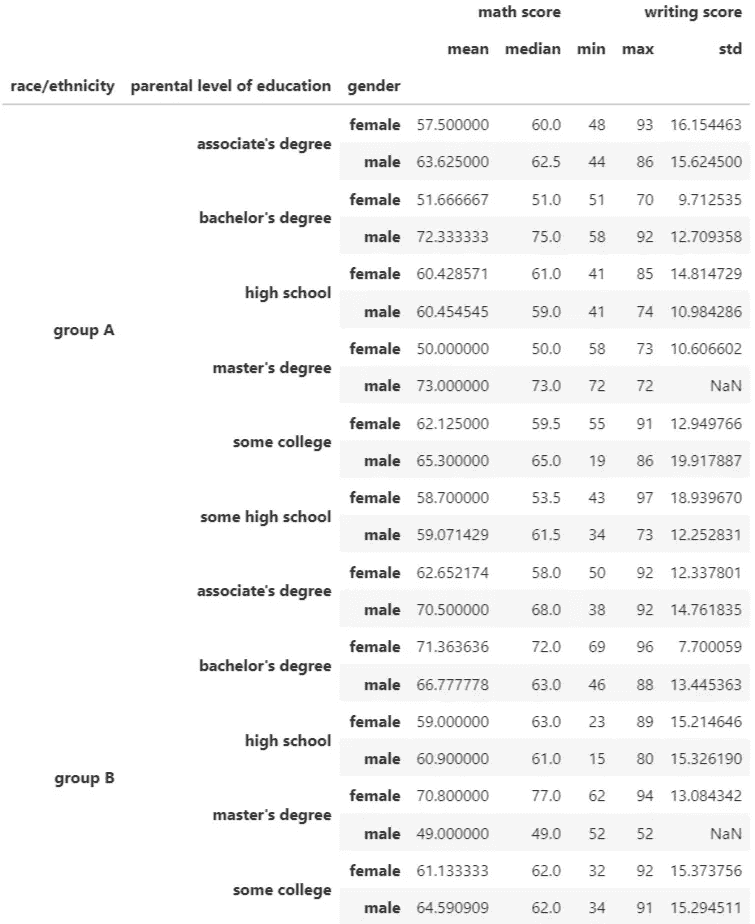

以下是在多索引数据帧上使用 groupby 函数的视频版本:

## 结论

本页上的例子和视频应该让你完全准备好高效地使用多索引数据框架，并提高你的数据分析水平。用更简单、更少的代码获得对数据的粒度级访问要简单得多。

我希望它有帮助。

请随时在[推特](https://twitter.com/rashida048)和[脸书页面](https://www.facebook.com/Regenerative-149425692134498)上关注我

## 更多阅读

[](https://towardsdatascience.com/animated-and-racing-bar-plots-tutorial-7967a45c4753) [## 动画和赛车酒吧情节教程

### 完整的工作代码

towardsdatascience.com](https://towardsdatascience.com/animated-and-racing-bar-plots-tutorial-7967a45c4753) [](https://towardsdatascience.com/30-very-useful-pandas-functions-for-everyday-data-analysis-tasks-f1eae16409af) [## 30 个非常有用的熊猫函数，用于日常数据分析任务

### 熊猫小型张

towardsdatascience.com](https://towardsdatascience.com/30-very-useful-pandas-functions-for-everyday-data-analysis-tasks-f1eae16409af) [](https://towardsdatascience.com/exploratory-data-analysis-with-some-cool-visualizations-in-pythons-matplotlib-and-seaborn-library-99dde20d98bf) [## 利用 Python 的 Matplotlib 和 Seaborn 中的高级可视化进行探索性数据分析…

### 探索国际足联数据集

towardsdatascience.com](https://towardsdatascience.com/exploratory-data-analysis-with-some-cool-visualizations-in-pythons-matplotlib-and-seaborn-library-99dde20d98bf) [](https://towardsdatascience.com/all-the-datasets-you-need-to-practice-data-science-skills-and-make-a-great-portfolio-74f2eb53b38a) [## 练习数据科学技能和制作优秀投资组合所需的所有数据集

### 大量不同种类的数据集

towardsdatascience.com](https://towardsdatascience.com/all-the-datasets-you-need-to-practice-data-science-skills-and-make-a-great-portfolio-74f2eb53b38a) [](/data-analysis-91a38207c92b) [## 数据分析

### Python 中数据科学家/分析师日常工作中的常见数据清理任务

pub.towardsai.net](/data-analysis-91a38207c92b)