# 如何在 Azure 中创建、训练和发布对话机器人

> 原文：<https://pub.towardsai.net/how-to-create-train-and-publish-a-conversational-bot-in-azure-737041088630?source=collection_archive---------3----------------------->

照片由[金德媒体](https://www.pexels.com/photo/white-and-blue-robot-toy-on-blue-string-lights-8566467/)拍摄

# **TLDR**

*   创建知识库
*   培训知识库
*   发布知识库
*   这里有一个视频来展示如何创建这个机器人

社交网络和即时通讯工具不再仅仅是一个交流的地方。现在，WhatsApp、Viber、Facebook Messenger、Instagram 和 Telegram 都是商业平台，提供各种工具来销售和推广商品和服务。对话机器人让网上交易变得更加容易。

对话机器人是一种人工智能，可以用自然语言与用户交谈。这意味着它可以理解你在说什么，并以自然友好的方式做出回应。在对话机器人的帮助下，你可以听到熟悉的对话，而不是复杂的菜单或复杂的命令，也可以得到迅速的响应，而不是排队等候。但是如何创建、训练和发布一个对话机器人呢？在这篇文章中，我将尝试回答这个问题。所以，我们来详细讨论一下这个:

**如何创建、培训和发布知识库——分步指南**

要创建、培训和发布知识库，您需要进入 QnA maker 环境:

# 1)创建知识库

*   打开一个新选项卡，键入 Qnamaker.ai
*   单击选项“创建知识库”

作者照片

第一步

*   这里的第一步是“在微软 Azure 中创建 QnA 服务”。
*   单击包含文本“创建 QnA 服务”的蓝色按钮。

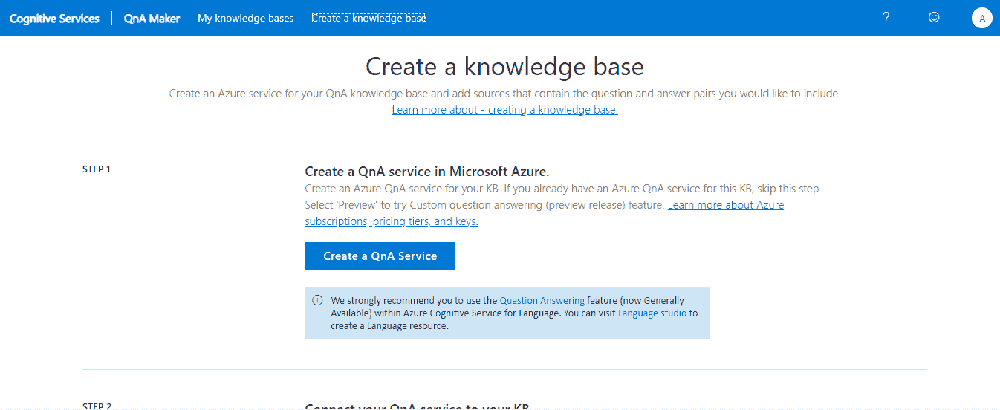

作者照片

*   这将为 Azure 门户打开一个新选项卡。创建一个资源组，将其命名为 QnA Maker RG。
*   然后给出 QnA 服务名。

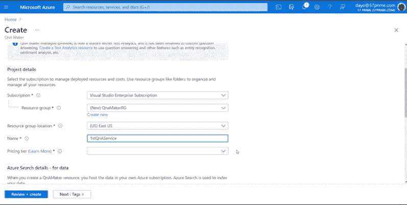

作者照片

*   如果你再往下看，有几个项目。您可以选择一个免费等级进行练习。
*   完成后，继续点击查看和创建；这将带您到一个摘要页面。
*   现在选择“创建”，这将需要几分钟来创建

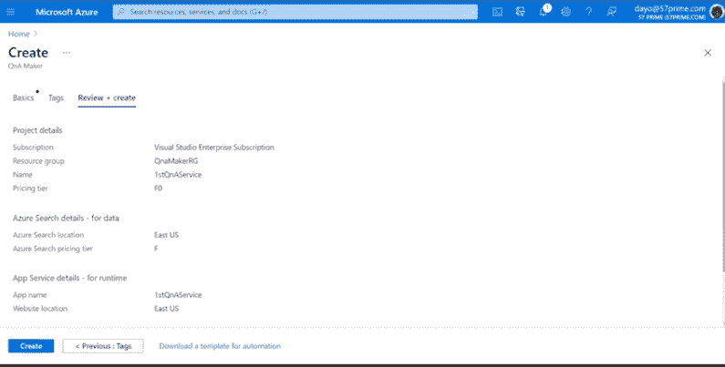

作者照片

进入 QnA Maker RG 资源组，在这里，您可以看到部署了什么。我们将部署五种资源来创建此 QnA 服务。

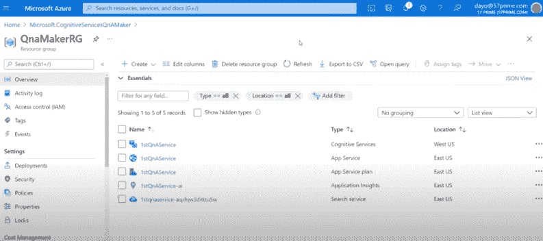

作者照片

*   现在回到 [QnA Maker 网站](https://www.qnamaker.ai/Create)继续知识库创建过程。

**第二步**

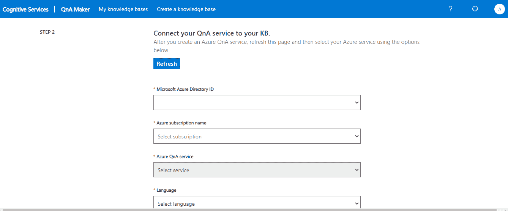

作者照片

*   在步骤 2 中单击“刷新”。
*   然后选择订阅名称、我们在步骤 1 中创建的 QnA 服务和语言。

**第三步**

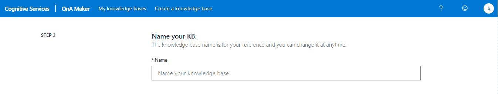

作者照片

*   继续第三步，为知识库命名。

**第四步**

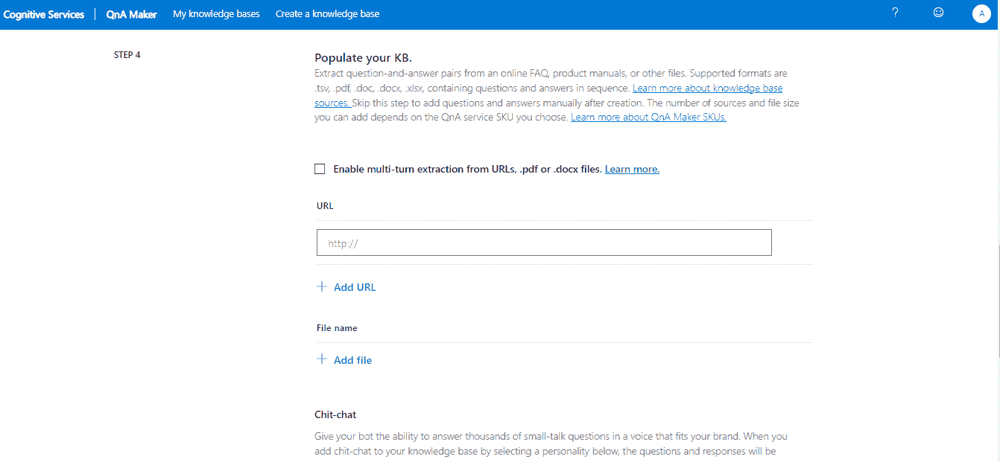

作者照片

*   然后第四步，添加你想在这里显示的内容。支持的格式有。tsv，。pdf，。doc，。docx，。xlsx，按顺序包含问题和答案。
*   或者，您可以跳过此步骤，在创建后手动添加问题和答案。你必须知道你可以添加多个文件以及一个网址。
*   还有一个聊天部分(专业、友好、机智、关心和热情)，给你一个机器人人格，以特定的方式回答闲聊问题。

**第五步**

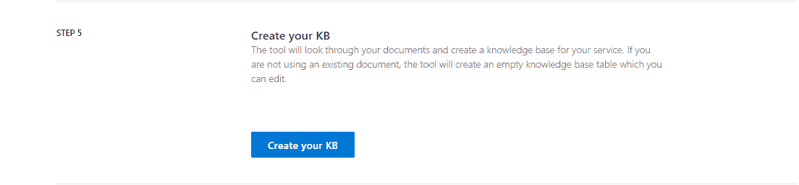

作者照片

*   在步骤 5 中，我们现在可以创建知识库。这将需要几分钟时间来显示知识库中的问题列表。您也可以在这里添加我自己的问题，方法是单击“添加 QnA”对。

# 2)训练知识库

您的知识库已创建。现在是时候训练它了。

*   例如，添加一个问候语(hello，hi，和 hey)，作为对此的响应，添加“欢迎使用 KB bot”。
*   单击“保存并训练”按钮保存它。

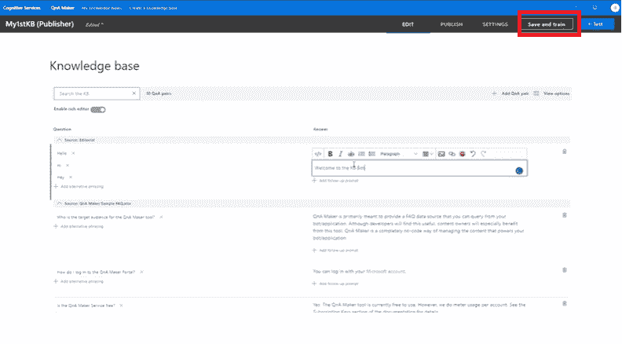

作者照片

*   在 Test 部分，键入 hey，您将得到响应“欢迎使用 KB bot”。
*   通过用不同的方式问同一个问题，试着看看社区制造者对这个问题有多准确。
*   但是这个答案的 QnA 制作者有多大把握呢？您可以通过点击我们刚刚提出的问题的“检查选项”来找到答案。

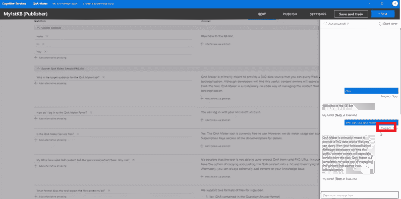

作者照片

*   这将打开另一个部分，让你看到糖果制造商的封面后面。你可以在这里添加这个问题的其他提问方式。或者你也可以改变这个问题的回答方式。这里你可以看到在当前答案下，有一个置信度得分。此选项向您展示了如何在 QnA Maker 中训练您的 QnA 问题。
*   修改后，确保我们再次按下“保存和训练”按钮。

# 3)发布知识库

现在您已经完成了知识库的培训，是时候发布了。

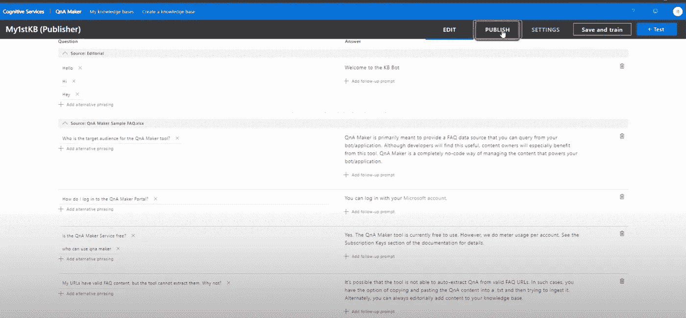

作者照片

*   点击“发布”，这将带你到成功页面。您已经在 Azure 中成功创建了一个机器人。
*   在 Azure 中点击“Create bot”，这将打开 Azure 门户的一个新选项卡，这个 Bot 将自动使用我们之前创建的 QnA Maker 的相同资源组来创建 Bot 资源。
*   给你的机器人一个名字，系统会在这里为其他资源预填充。点击底部的“创建”按钮。创建此过程需要几分钟时间。

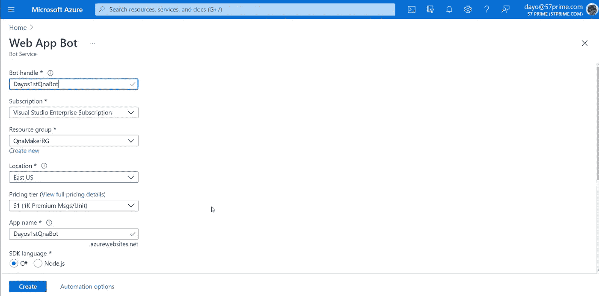

作者照片

*   现在，进入您的资源组，在部署完成后点击“刷新”按钮。你总共应该有大约八个资源。

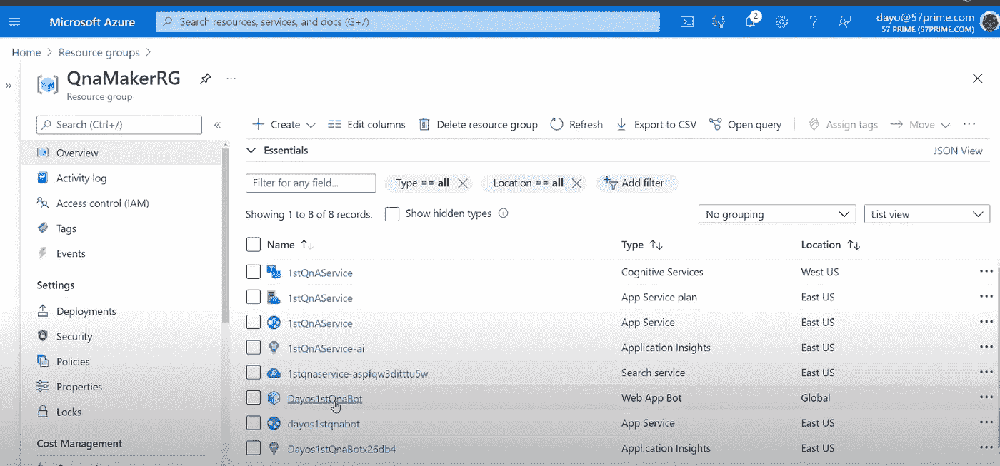

作者照片

*   这里最重要的资源是“Web App Bot”。进入 Web App Bot，点击左侧的“在 Web 聊天中测试”。
*   此选项确认您的 bot 正在访问 QnA Maker 知识库。
*   第二个有用的特性是“通道”。选择频道。在这里你可以看到所有不同的选项(Alexa，脸书集团，Me 团队，Slack，Skype，等等)你可以使用这个知识库。
*   要了解其工作原理，请选择一个网络聊天选项。

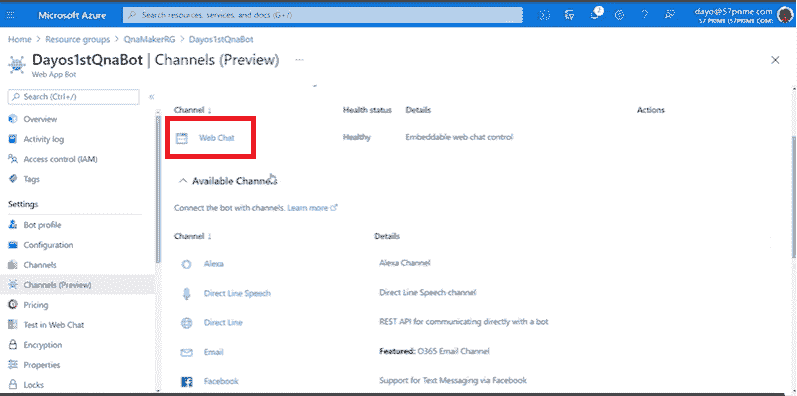

*   在这里，您可以看到您将在您的网站上用来访问该机器人的代码。
*   现在复制“密钥”并粘贴到代码中。

# 让我们总结一下

这就是你如何在 Azure 中创建、训练和发布知识库。希望这篇帖子对你有帮助。但这只是我的 Pluralsight 课程中关于如何用微软 Azure 构建对话式人工智能解决方案的一个短片。如果你想掌握这项技能，点击[这里](https://www.pluralsight.com/courses/build-conversational-ai-solution-microsoft-azure?utm_source=youtube&utm_medium=video&utm_campaign=authordemo)进入完整课程。

如果你有任何问题或意见，请在下面的评论区留下。我们希望收到您的来信。

感谢阅读！！