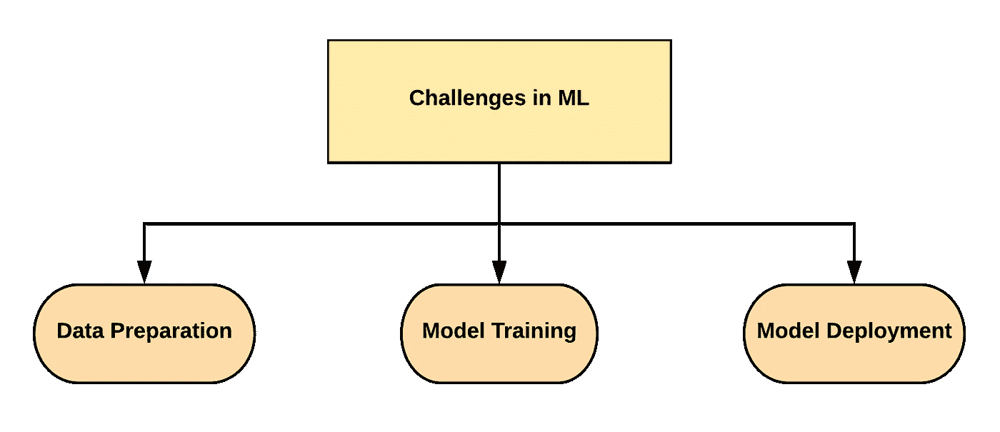

# 如何应对机器学习中的重大挑战

> 原文：<https://pub.towardsai.net/how-to-deal-with-major-challenges-in-machine-learning-1fc7e719bd0b?source=collection_archive---------2----------------------->

## 机器学习问题每一步中所有常见挑战的最佳实践

[巴迪 qb](https://unsplash.com/@bady?utm_source=medium&utm_medium=referral) 在 [Unsplash](https://unsplash.com?utm_source=medium&utm_medium=referral) 上拍摄的照片

在处理机器学习问题时，我们经常会在不同的步骤受阻。为了解决几乎所有这些步骤，我列出了我们面临的所有主要挑战以及我们可以采取的克服这些挑战的步骤。为了更容易理解，我还将这些挑战分为不同的子领域，即数据准备、模型训练和模型部署。

作者照片

# 数据准备

照片由[马库斯·斯皮斯克](https://unsplash.com/@markusspiske?utm_source=medium&utm_medium=referral)在 [Unsplash](https://unsplash.com?utm_source=medium&utm_medium=referral) 拍摄

## 数据收集:

*   当我们开始收集数据时，获取不完整的数据通常是一件令人头疼的事情。即使我们得到数据，结果也是有偏见的数据。偏差是指在数据收集或数据分析中任何偏离真实情况的行为，它会导致错误的结论。
*   然后是维数灾难，指的是在分析高维数据时发生的现象，而在低维空间中不会发生。
*   最后，我们有数据稀疏的问题。假设您有一个包含大量空值或不可能值的表。这些值代表了数据的稀疏性。

需要克服的步骤:

*   投入适当的时间来了解问题以及解决问题所需的适当数据集
*   丰富数据
*   降维技术

## 异常值:

*   数据中的数值超出范围或未知类别值
*   它显示了对平方损失函数的强烈影响

需要克服的步骤:

*   像宁滨这样的离散化技术有助于减少平方损失函数
*   像 Huber 损失函数这样的稳健方法

## 缺失数据:

*   这会影响信息损失，从而影响模型的准确性
*   当关键信息测量、收集或解释不准确时出现的信息偏差

需要克服的步骤:

*   基于树的建模技术可以帮助处理这样的问题
*   离散化也有助于减少损失函数
*   归罪

## 稀疏目标变量:

*   当初级事件发生率低时，就会发生这种情况
*   目标中零值或缺失值的压倒性优势

需要克服的步骤:

*   比例过采样
*   混合模型

# 模特培训

乔纳森·博尔巴在 [Unsplash](https://unsplash.com?utm_source=medium&utm_medium=referral) 上的照片

## 过度拟合:

*   过度拟合背后的主要原因是高方差和低偏差，无法正确概括

需要克服的步骤:

*   正则化-这是一种通过在误差函数中添加附加惩罚项来调整函数的技术
*   噪声注入—这种方法是指在训练过程中人为地将“噪声”添加到输入数据中
*   交叉验证—这是一种用于评估统计分析结果如何归纳为独立数据集的技术

## 计算资源开发:

*   大多数时候，我们执行单线程算法实现
*   解释语言的高度可靠性

需要克服的步骤:

*   并行训练多个单线程模型
*   硬件加速，例如 GPU 和 SSD
*   低级本地库
*   云—谷歌 colab 笔记本

## 集合模型:

*   单一模型有时不能提供足够的精确度
*   单一模型还会导致过度拟合——高方差和低偏差，无法正确概括

需要克服的步骤:

*   像装袋、助推和堆叠这样的集合模型可以帮助克服这个问题
*   自定义或手动预测组合有时有助于获得更好的准确性

## 超参数调谐:

*   在传统算法中，组合爆炸是由于输入如何影响问题的组合学而导致问题复杂性的快速增长。

需要克服的步骤:

*   也包括遗传算法的局部搜索优化
*   网格搜索或 rand 搜索技术有助于从我们提供的超参数中找到最佳的超参数对。

## 模型解释:

*   大量的参数和规则使得解释模型变得困难

需要克服的步骤:

*   使用正则化技术进行变量选择
*   代理模型
*   像石灰这样的解释方法
*   部分依赖图、特征重要性图可以帮助解释模型

## 模型部署

照片由 [Eryk](https://unsplash.com/@eryk10?utm_source=medium&utm_medium=referral) 在 [Unsplash](https://unsplash.com?utm_source=medium&utm_medium=referral) 上拍摄

## 模型部署:

*   从开发环境到操作计算系统，必须使用经过训练的模型逻辑来帮助组织做出决策

需要克服的步骤:

*   网络服务评分可以帮助人们获得结果
*   模型输出的仪表板对任何组织来说都更容易理解

## 模型衰减:

*   自模型创建以来，业务问题和市场条件可能会发生变化
*   新的观察结果超出了训练数据的范围

需要克服的步骤:

*   定期监控模型，尤其是当精度下降时
*   每当影响模型的数据或系统发生变化时，定期更新模型

照片由 [Unsplash](https://unsplash.com?utm_source=medium&utm_medium=referral) 上的 [Crawford Jolly](https://unsplash.com/@crawford?utm_source=medium&utm_medium=referral) 拍摄

谢谢你一直读到最后，希望你喜欢！